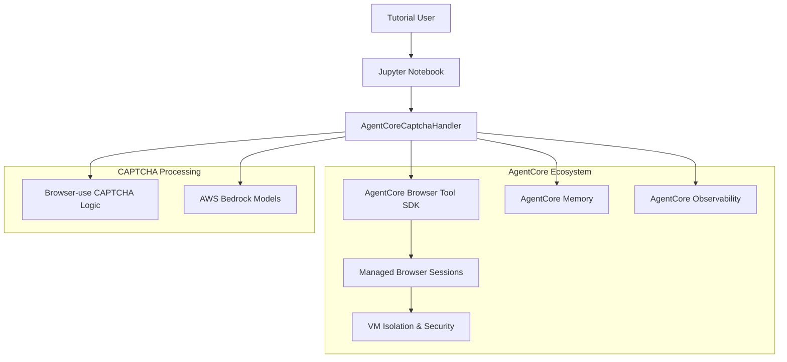
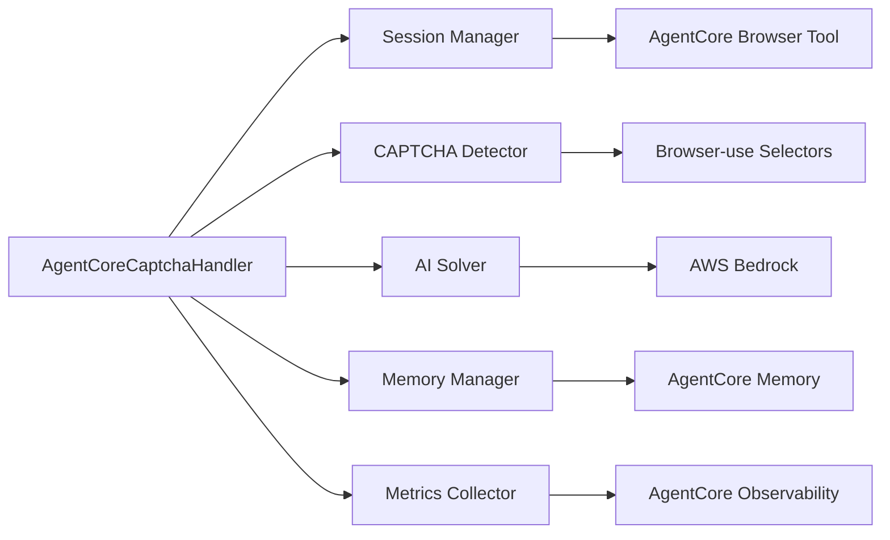

# Browser-use CAPTCHA Integration with AgentCore Browser Tool - Design Document

## Overview

This design document outlines the technical approach for integrating Browser-use CAPTCHA handling capabilities with AgentCore Browser Tool to create an enterprise-ready CAPTCHA handling solution. The integration leverages AgentCore's managed browser infrastructure while utilizing Browser-use's proven CAPTCHA detection algorithms.

## Architecture

### High-Level Architecture



### Component Architecture



## Components and Interfaces

### 1. AgentCoreCaptchaHandler (Main Integration Class)

**Purpose**: Primary interface that orchestrates CAPTCHA handling using AgentCore infrastructure

**Key Methods**:
```python
class AgentCoreCaptchaHandler:
    async def create_managed_session(session_name: str) -> Dict[str, Any]
    async def detect_captcha_with_agentcore(url: str) -> CaptchaDetectionResult
    async def solve_captcha_with_bedrock(detection_result: CaptchaDetectionResult) -> Dict[str, Any]
    async def cleanup_session() -> None
```

**Dependencies**:
- `bedrock_agentcore.browser.AgentCoreBrowser`
- `bedrock_agentcore.memory.ConversationMemory`
- `bedrock_agentcore.observability.Metrics`
- `browser_use` (for CAPTCHA detection logic)

### 2. Session Management Layer

**Purpose**: Manages AgentCore browser sessions with enterprise security features

**Features**:
- VM-isolated browser sessions
- Session lifecycle management
- Security context tracking
- Automatic cleanup and resource management

**Integration Points**:
```python
# AgentCore Browser Tool session creation
session_info = await self.agentcore_browser.create_session(
    session_name=session_name,
    browser_config={
        "headless": True,
        "viewport": {"width": 1920, "height": 1080},
        "timeout": 30000,
        "security_mode": "enterprise"
    }
)
```

### 3. CAPTCHA Detection Engine

**Purpose**: Combines Browser-use detection algorithms with AgentCore page analysis

**Detection Strategy**:
1. **Page Navigation**: Use AgentCore Browser Tool to navigate to target URL
2. **Content Analysis**: Extract page content via AgentCore
3. **CAPTCHA Detection**: Apply Browser-use selector patterns
4. **Confidence Scoring**: Calculate detection confidence based on selector specificity
5. **Screenshot Capture**: Use AgentCore screenshot capabilities

**CAPTCHA Types Supported**:
- reCAPTCHA (Google)
- hCaptcha
- Image-based CAPTCHAs
- Text-based CAPTCHAs

### 4. AI-Powered Solving Engine

**Purpose**: Leverages AWS Bedrock models via AgentCore for intelligent CAPTCHA analysis

**Solving Pipeline**:
1. **Image Preprocessing**: Prepare CAPTCHA screenshots for AI analysis
2. **Model Selection**: Choose appropriate Bedrock model based on CAPTCHA type
3. **Prompt Engineering**: Generate context-specific prompts for different CAPTCHA types
4. **AI Analysis**: Submit to Bedrock Claude models for solution generation
5. **Solution Validation**: Validate and format AI responses

**Supported Models**:
- `anthropic.claude-3-sonnet-20240229-v1:0` (primary)
- `anthropic.claude-3-haiku-20240307-v1:0` (fallback)

### 5. Memory and State Management

**Purpose**: Integrates with AgentCore Memory for persistent CAPTCHA pattern storage

**Storage Strategy**:
```python
# Store detection patterns
await self.memory.store_context({
    "detection_result": asdict(detection_result),
    "url": url,
    "timestamp": time.time(),
    "session_context": session_info
})

# Store solution patterns
await self.memory.store_context({
    "captcha_solution": {
        "captcha_type": detection_result.captcha_type,
        "solution": solution_text,
        "confidence": detection_result.confidence_score,
        "timestamp": time.time()
    }
})
```

### 6. Observability and Metrics

**Purpose**: Integrates with AgentCore Observability for comprehensive monitoring

**Metrics Tracked**:
- Session creation/cleanup events
- CAPTCHA detection success rates
- AI solving performance
- Error rates and types
- Processing times

**Implementation**:
```python
# Track successful operations
await self.metrics.record_event("captcha_detected", {
    "captcha_type": detection_result.captcha_type,
    "confidence": detection_result.confidence_score,
    "url": url
})

# Track errors
await self.metrics.record_error("captcha_detection_failed", str(e))
```

## Data Models

### CaptchaDetectionResult

```python
@dataclass
class CaptchaDetectionResult:
    captcha_type: str                           # Type of CAPTCHA detected
    element_selector: Optional[str]             # CSS selector used for detection
    screenshot_path: Optional[str]              # Path to captured screenshot
    confidence_score: float                     # Detection confidence (0.0-1.0)
    metadata: Dict[str, Any]                   # Additional detection metadata
    detected_at: str                           # ISO timestamp of detection
    agentcore_session_id: Optional[str]        # AgentCore session identifier
    browser_instance_id: Optional[str]         # Browser instance identifier
    security_context: Optional[Dict[str, str]] # Security context information
```

### Session Configuration

```python
@dataclass
class SessionConfig:
    session_name: str
    headless: bool = True
    viewport_width: int = 1920
    viewport_height: int = 1080
    timeout: int = 30000
    security_mode: str = "enterprise"
```

## Error Handling

### Error Hierarchy

```python
class CaptchaHandlingError(Exception):
    """Base exception for CAPTCHA handling operations"""
    pass

class SessionCreationError(CaptchaHandlingError):
    """Raised when AgentCore session creation fails"""
    pass

class DetectionError(CaptchaHandlingError):
    """Raised when CAPTCHA detection fails"""
    pass

class SolvingError(CaptchaHandlingError):
    """Raised when AI solving fails"""
    pass
```

### Fallback Strategy

1. **AgentCore Unavailable**: Fall back to direct Browser-use implementation
2. **Session Creation Failure**: Retry with different configuration
3. **Detection Failure**: Try alternative selectors
4. **AI Solving Failure**: Provide manual intervention guidance

## Testing Strategy

### Unit Tests
- Test individual component functionality
- Mock AgentCore SDK dependencies
- Validate CAPTCHA detection algorithms
- Test error handling scenarios

### Integration Tests
- Test AgentCore + Browser-use integration
- Validate end-to-end CAPTCHA workflows
- Test with real CAPTCHA sites
- Performance benchmarking

### Test Structure
```
tests/
├── unit/
│   ├── test_captcha_detector.py
│   ├── test_session_manager.py
│   └── test_ai_solver.py
├── integration/
│   ├── test_agentcore_integration.py
│   └── test_end_to_end_workflow.py
└── performance/
    └── test_benchmarks.py
```

## Security Considerations

### Enterprise Security Features
- **VM Isolation**: All browser sessions run in isolated virtual machines
- **Session Security**: Encrypted session data and secure cleanup
- **Credential Management**: Secure AWS credential handling
- **Data Privacy**: No sensitive data stored in logs or memory

### Compliance
- **Rate Limiting**: Respect target site rate limits
- **Terms of Service**: Ensure compliance with site terms
- **Ethical Usage**: Implement responsible automation practices

## Performance Optimization

### Caching Strategy
- Cache CAPTCHA detection patterns
- Reuse browser sessions when possible
- Optimize screenshot capture and processing

### Resource Management
- Automatic session cleanup
- Memory usage monitoring
- Connection pooling for AWS services

## Deployment Considerations

### Dependencies
```txt
bedrock-agentcore>=1.0.0
browser-use>=1.0.0
boto3>=1.40.0
pillow>=11.0.0
beautifulsoup4>=4.12.0
```

### Environment Variables
```bash
AWS_REGION=us-east-1
AGENTCORE_SESSION_TIMEOUT=1800
CAPTCHA_SCREENSHOT_DIR=./captcha_screenshots
```

### AWS Permissions
```json
{
    "Version": "2012-10-17",
    "Statement": [
        {
            "Effect": "Allow",
            "Action": [
                "bedrock:InvokeModel",
                "bedrock:InvokeModelWithResponseStream"
            ],
            "Resource": "arn:aws:bedrock:*:*:foundation-model/anthropic.claude-3-*"
        }
    ]
}
```

## Implementation Phases

### Phase 1: Core Integration (Current)
- ✅ AgentCoreCaptchaHandler implementation
- ✅ Basic CAPTCHA detection with AgentCore
- ✅ AI solving with Bedrock integration

### Phase 2: Notebook Integration (Next)
- 🔄 Update notebook cells with AgentCore examples
- 🔄 Add AgentCore ecosystem demonstrations
- 🔄 Update documentation and guides

### Phase 3: Testing and Validation
- ⏳ Comprehensive test suite
- ⏳ Performance benchmarking
- ⏳ Security validation

### Phase 4: Documentation and Polish
- ⏳ Complete documentation update
- ⏳ Troubleshooting guides
- ⏳ Production deployment guides

## Success Metrics

### Functional Metrics
- 95%+ CAPTCHA detection accuracy
- <5 second average processing time
- 99%+ session creation success rate

### Integration Metrics
- All AgentCore ecosystem features demonstrated
- Zero breaking changes to existing functionality
- Complete test coverage (>90%)

### User Experience Metrics
- Clear tutorial progression
- Comprehensive error messages
- Effective troubleshooting guidance