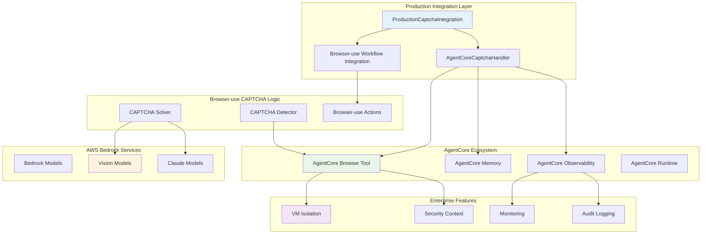

# Design Document

## Overview

This design outlines the creation of a production-ready Browser-use framework integration for CAPTCHA handling with AWS Bedrock AgentCore Browser Tool. This integration provides a complete enterprise solution that combines Browser-use's CAPTCHA expertise with AgentCore's managed browser infrastructure, ecosystem integration, and enterprise features.

## Architecture

### Integration Structure
```
03-integrations/bedrock-agentcore-browser-tool/agentic-frameworks/captcha-handling/browser-use/
├── src/
│   ├── captcha_detector.py
│   ├── captcha_solver.py
│   ├── browser_use_integration.py
│   └── utils/
├── examples/
│   ├── basic_captcha_handling.py
│   ├── advanced_workflows.py
│   └── production_patterns.py
├── tests/
│   ├── test_captcha_detection.py
│   ├── test_captcha_solving.py
│   └── test_integration.py
├── docs/
│   ├── README.md
│   ├── API_REFERENCE.md
│   └── DEPLOYMENT_GUIDE.md
├── requirements.txt
└── setup.py
```

### Component Architecture


## Components and Interfaces

### 1. Production AgentCore Integration Layer

#### ProductionCaptchaIntegration Class
```python
from bedrock_agentcore.browser import AgentCoreBrowser
from bedrock_agentcore.memory import ConversationMemory
from bedrock_agentcore.observability import Metrics
from bedrock_agentcore.runtime import AgentCoreRuntime
from browser_use import BrowserUse
from typing import Dict, Any, Optional, List
import asyncio
from dataclasses import dataclass, asdict
import time

@dataclass
class CaptchaDetectionResult:
    """Enhanced CAPTCHA detection result with AgentCore metadata"""
    found: bool
    captcha_type: str
    element_selector: str
    screenshot_path: Optional[str]
    confidence_score: float
    metadata: Dict[str, Any]
    agentcore_session_id: Optional[str] = None
    browser_instance_id: Optional[str] = None
    security_context: Optional[Dict[str, str]] = None
    detection_timestamp: float = None

class ProductionCaptchaIntegration:
    """Production-ready CAPTCHA integration with AgentCore Browser Tool"""
    
    def __init__(self, region: str = "us-east-1", config: Dict[str, Any] = None):
        self.region = region
        self.config = config or {}
        
        # Initialize AgentCore components
        self.agentcore_browser = AgentCoreBrowser(region=region)
        self.memory = ConversationMemory(region=region)
        self.observability = Metrics(region=region)
        self.runtime = AgentCoreRuntime(region=region)
        
        # Initialize CAPTCHA components
        self.captcha_detector = None  # Will be initialized with AgentCore session
        self.captcha_solver = ProductionCaptchaSolver(region=region)
        
        # Session management
        self.active_sessions = {}
        self.session_pool = SessionPool(max_sessions=10)
    
    async def create_managed_session(self, session_config: Dict[str, Any] = None) -> str:
        """Create AgentCore managed browser session for CAPTCHA handling"""
        
        config = {
            "headless": True,
            "viewport": {"width": 1920, "height": 1080},
            "timeout": 30000,
            "security_mode": "enterprise",
            "vm_isolation": True,
            **self.config.get("browser_config", {}),
            **(session_config or {})
        }
        
        session_info = await self.agentcore_browser.create_session(
            session_name=f"captcha-session-{int(time.time())}",
            browser_config=config
        )
        
        session_id = session_info["session_id"]
        self.active_sessions[session_id] = session_info
        
        # Initialize CAPTCHA detector for this session
        self.captcha_detector = AgentCoreCaptchaDetector(
            agentcore_browser=self.agentcore_browser,
            session_id=session_id,
            memory=self.memory,
            observability=self.observability
        )
        
        # Record session creation
        await self.observability.record_event("captcha_session_created", {
            "session_id": session_id,
            "config": config,
            "timestamp": time.time()
        })
        
        return session_id
    
    def _initialize_strategies(self) -> List['DetectionStrategy']:
        """Initialize CAPTCHA detection strategies"""
        return [
            RecaptchaDetectionStrategy(),
            HcaptchaDetectionStrategy(),
            ImageCaptchaDetectionStrategy(),
            TextCaptchaDetectionStrategy()
        ]

class DetectionStrategy:
    """Base class for CAPTCHA detection strategies"""
    
    async def detect(self, browser: BrowserUse) -> CaptchaDetectionResult:
        """Detect specific type of CAPTCHA"""
        raise NotImplementedError

class RecaptchaDetectionStrategy(DetectionStrategy):
    """Strategy for detecting Google reCAPTCHA"""
    
    async def detect(self, browser: BrowserUse) -> CaptchaDetectionResult:
        """Detect reCAPTCHA elements"""
        selectors = [
            'iframe[src*="recaptcha"]',
            'div[class*="g-recaptcha"]',
            '.recaptcha-checkbox'
        ]
        
        for selector in selectors:
            elements = await browser.find_elements(selector)
            if elements:
                screenshot = await browser.screenshot()
                return CaptchaDetectionResult(
                    found=True,
                    captcha_type="recaptcha",
                    element_selector=selector,
                    screenshot_path=screenshot,
                    confidence_score=0.9,
                    metadata={"elements_found": len(elements)}
                )
        
        return CaptchaDetectionResult(found=False, captcha_type="", element_selector="", screenshot_path=None, confidence_score=0.0, metadata={})
```

### 2. CAPTCHA Solving Module

#### CaptchaSolver Class
```python
import boto3
from PIL import Image
import base64
import json

@dataclass
class CaptchaSolution:
    """Result of CAPTCHA solving"""
    solution: str
    solution_type: str  # 'text', 'coordinates', 'selection'
    confidence_score: float
    processing_time: float
    model_used: str

class AgentCoreCaptchaDetector:
    """AgentCore-integrated CAPTCHA detector using Browser-use logic"""
    
    def __init__(self, agentcore_browser: AgentCoreBrowser, session_id: str, 
                 memory: ConversationMemory, observability: Metrics):
        self.agentcore_browser = agentcore_browser
        self.session_id = session_id
        self.memory = memory
        self.observability = observability
        self.detection_strategies = self._initialize_strategies()
    
    async def detect_captcha_with_agentcore(self, url: str) -> CaptchaDetectionResult:
        """Detect CAPTCHA using AgentCore managed browser + Browser-use logic"""
        
        # Navigate using AgentCore Browser Tool
        navigation_result = await self.agentcore_browser.navigate(
            session_id=self.session_id,
            url=url,
            wait_for_load=True
        )
        
        # Get page content for Browser-use analysis
        page_content = await self.agentcore_browser.get_page_content(
            session_id=self.session_id,
            content_type="html"
        )
        
        # Apply Browser-use detection strategies
        detection_result = await self._apply_detection_strategies(page_content, url)
        
        # Enhance with AgentCore metadata
        detection_result.agentcore_session_id = self.session_id
        detection_result.browser_instance_id = navigation_result.get('browser_instance_id')
        detection_result.security_context = navigation_result.get('security_context')
        detection_result.detection_timestamp = time.time()
        
        # Store in AgentCore Memory
        await self.memory.store_context({
            "detection_result": asdict(detection_result),
            "url": url,
            "session_id": self.session_id,
            "timestamp": time.time()
        })
        
        # Track metrics
        await self.observability.record_event("captcha_detected", {
            "captcha_type": detection_result.captcha_type,
            "confidence": detection_result.confidence_score,
            "url": url,
            "session_id": self.session_id
        })
        
        return detection_result

class ProductionCaptchaSolver:
    """Production CAPTCHA solver with AgentCore integration"""
    
    def __init__(self, region: str = "us-east-1"):
        self.region = region
        self.bedrock_client = boto3.client('bedrock-runtime', region_name=region)
        self.vision_model = "anthropic.claude-3-sonnet-20240229-v1:0"
        self.observability = Metrics(region=region)
    
    async def solve_captcha(self, detection_result: CaptchaDetectionResult) -> CaptchaSolution:
        """Solve CAPTCHA based on detection result"""
        solver_method = self._get_solver_method(detection_result.captcha_type)
        return await solver_method(detection_result)
    
    def _get_solver_method(self, captcha_type: str):
        """Get appropriate solver method for CAPTCHA type"""
        methods = {
            "recaptcha": self._solve_recaptcha,
            "hcaptcha": self._solve_hcaptcha,
            "image": self._solve_image_captcha,
            "text": self._solve_text_captcha
        }
        return methods.get(captcha_type, self._solve_generic_captcha)
    
    async def _solve_text_captcha(self, detection_result: CaptchaDetectionResult) -> CaptchaSolution:
        """Solve text-based CAPTCHA using vision model"""
        import time
        start_time = time.time()
        
        # Load and preprocess image
        image_data = self._load_image(detection_result.screenshot_path)
        
        # Prepare prompt for vision model
        prompt = """
        Analyze this CAPTCHA image and extract the text shown.
        Return only the text that needs to be entered, nothing else.
        If you cannot read the text clearly, return 'UNCLEAR'.
        """
        
        # Call Bedrock vision model
        response = await self._call_vision_model(image_data, prompt)
        solution_text = self._extract_solution_from_response(response)
        
        processing_time = time.time() - start_time
        
        return CaptchaSolution(
            solution=solution_text,
            solution_type="text",
            confidence_score=0.8,  # Could be enhanced with actual confidence from model
            processing_time=processing_time,
            model_used=self.vision_model
        )
    
    async def _call_vision_model(self, image_data: bytes, prompt: str) -> Dict[str, Any]:
        """Call Bedrock vision model for CAPTCHA analysis"""
        # Encode image for Bedrock
        image_base64 = base64.b64encode(image_data).decode('utf-8')
        
        body = {
            "anthropic_version": "bedrock-2023-05-31",
            "max_tokens": 1000,
            "messages": [
                {
                    "role": "user",
                    "content": [
                        {
                            "type": "image",
                            "source": {
                                "type": "base64",
                                "media_type": "image/png",
                                "data": image_base64
                            }
                        },
                        {
                            "type": "text",
                            "text": prompt
                        }
                    ]
                }
            ]
        }
        
        response = self.bedrock.invoke_model(
            modelId=self.vision_model,
            body=json.dumps(body)
        )
        
        return json.loads(response['body'].read())
```

### 3. AgentCore Browser-use Integration Layer

#### AgentCoreBrowserUseIntegration Class
```python
from browser_use import BrowserUse, Action
from bedrock_agentcore.browser import AgentCoreBrowser
from bedrock_agentcore.memory import ConversationMemory
from bedrock_agentcore.observability import Metrics
from typing import Callable, Optional

class AgentCoreBrowserUseIntegration:
    """Production Browser-use integration with AgentCore Browser Tool"""
    
    def __init__(self, production_integration: ProductionCaptchaIntegration):
        self.production_integration = production_integration
        self.agentcore_browser = production_integration.agentcore_browser
        self.memory = production_integration.memory
        self.observability = production_integration.observability
        self.middleware_enabled = False
        self.active_session_id = None
    
    def enable_captcha_middleware(self):
        """Enable automatic CAPTCHA detection and solving middleware"""
        self.middleware_enabled = True
        self.browser.add_middleware(self._captcha_middleware)
    
    async def _captcha_middleware(self, action: Action, next_handler: Callable):
        """Middleware to automatically handle CAPTCHAs"""
        # Execute the original action
        result = await next_handler(action)
        
        # Check if CAPTCHA appeared after action
        if self.middleware_enabled:
            captcha_result = await self.detector.detect_captcha(self.browser.current_url)
            
            if captcha_result.found:
                await self.handle_captcha_automatically(captcha_result)
        
        return result
    
    async def handle_captcha_automatically(self, detection_result: CaptchaDetectionResult) -> bool:
        """Automatically handle detected CAPTCHA"""
        try:
            # Solve the CAPTCHA
            solution = await self.solver.solve_captcha(detection_result)
            
            # Submit the solution
            success = await self._submit_solution(detection_result, solution)
            
            return success
        
        except Exception as e:
            print(f"CAPTCHA handling failed: {e}")
            return False
    
    async def _submit_solution(self, detection_result: CaptchaDetectionResult, solution: CaptchaSolution) -> bool:
        """Submit CAPTCHA solution through browser automation"""
        if solution.solution_type == "text":
            # Find input field and enter text
            input_selector = self._find_captcha_input(detection_result)
            await self.browser.type(input_selector, solution.solution)
            
            # Find and click submit button
            submit_selector = self._find_submit_button(detection_result)
            await self.browser.click(submit_selector)
            
            return True
        
        # Handle other solution types (coordinates, selection)
        return False

# Custom Browser-use Actions for CAPTCHA handling
class CaptchaAction(Action):
    """Custom Browser-use action for CAPTCHA handling"""
    
    def __init__(self, captcha_integration: BrowserUseCaptchaIntegration):
        self.captcha_integration = captcha_integration
    
    async def execute(self, browser: BrowserUse) -> Dict[str, Any]:
        """Execute CAPTCHA detection and solving"""
        detection_result = await self.captcha_integration.detector.detect_captcha(browser.current_url)
        
        if detection_result.found:
            success = await self.captcha_integration.handle_captcha_automatically(detection_result)
            return {"captcha_handled": success, "captcha_type": detection_result.captcha_type}
        
        return {"captcha_handled": False, "captcha_type": "none"}
```

### 4. Workflow Integration

#### CaptchaWorkflow Class
```python
from browser_use.workflows import Workflow, WorkflowStep

class CaptchaAwareWorkflow(Workflow):
    """Browser-use workflow with integrated CAPTCHA handling"""
    
    def __init__(self, browser_client: BrowserUse):
        super().__init__()
        self.browser = browser_client
        self.captcha_integration = BrowserUseCaptchaIntegration(browser_client)
        self.captcha_integration.enable_captcha_middleware()
    
    async def navigate_and_handle_captcha(self, url: str, task_steps: List[Dict]) -> Dict[str, Any]:
        """Navigate to URL and execute task steps with CAPTCHA handling"""
        
        # Navigate to target URL
        await self.browser.navigate(url)
        
        results = []
        
        for step in task_steps:
            try:
                # Execute the step
                step_result = await self._execute_step(step)
                results.append(step_result)
                
                # Check for CAPTCHA after each step
                captcha_check = await self.captcha_integration.detector.detect_captcha(url)
                if captcha_check.found:
                    captcha_handled = await self.captcha_integration.handle_captcha_automatically(captcha_check)
                    results.append({"captcha_handled": captcha_handled})
            
            except Exception as e:
                results.append({"error": str(e), "step": step})
        
        return {"workflow_results": results}
    
    async def _execute_step(self, step: Dict) -> Dict[str, Any]:
        """Execute individual workflow step"""
        action_type = step.get("action")
        
        if action_type == "click":
            await self.browser.click(step["selector"])
        elif action_type == "type":
            await self.browser.type(step["selector"], step["text"])
        elif action_type == "wait":
            await asyncio.sleep(step["duration"])
        
        return {"step_completed": True, "action": action_type}
```

## Data Models

### Production Data Models
```python
from pydantic import BaseModel, Field
from typing import Optional, Dict, Any, List
from datetime import datetime
from enum import Enum

class CaptchaType(str, Enum):
    """Enumeration of supported CAPTCHA types"""
    RECAPTCHA = "recaptcha"
    HCAPTCHA = "hcaptcha"
    IMAGE = "image"
    TEXT = "text"
    MATH = "math"
    AUDIO = "audio"

class SolutionType(str, Enum):
    """Enumeration of solution types"""
    TEXT = "text"
    COORDINATES = "coordinates"
    SELECTION = "selection"
    AUDIO_TRANSCRIPTION = "audio_transcription"

class CaptchaDetectionConfig(BaseModel):
    """Configuration for CAPTCHA detection"""
    
    enabled_types: List[CaptchaType] = Field(default_factory=lambda: list(CaptchaType))
    confidence_threshold: float = Field(default=0.7, ge=0.0, le=1.0)
    screenshot_enabled: bool = Field(default=True)
    timeout_seconds: int = Field(default=30, gt=0)

class CaptchaSolvingConfig(BaseModel):
    """Configuration for CAPTCHA solving"""
    
    model_name: str = Field(default="anthropic.claude-3-sonnet-20240229-v1:0")
    max_retries: int = Field(default=3, ge=1)
    timeout_seconds: int = Field(default=60, gt=0)
    confidence_threshold: float = Field(default=0.6, ge=0.0, le=1.0)

class CaptchaHandlingResult(BaseModel):
    """Complete result of CAPTCHA handling process"""
    
    detection_result: CaptchaDetectionResult
    solution_result: Optional[CaptchaSolution] = None
    submission_success: bool = False
    total_processing_time: float = Field(ge=0.0)
    error_message: Optional[str] = None
    timestamp: datetime = Field(default_factory=datetime.now)
```

## Error Handling

### Production Error Handling
```python
class CaptchaHandlingError(Exception):
    """Base exception for CAPTCHA handling errors"""
    
    def __init__(self, message: str, error_code: str = None, details: Dict = None):
        super().__init__(message)
        self.error_code = error_code
        self.details = details or {}

class CaptchaDetectionError(CaptchaHandlingError):
    """Error during CAPTCHA detection"""
    pass

class CaptchaSolvingError(CaptchaHandlingError):
    """Error during CAPTCHA solving"""
    pass

class CaptchaSubmissionError(CaptchaHandlingError):
    """Error during CAPTCHA solution submission"""
    pass

class CaptchaTimeoutError(CaptchaHandlingError):
    """Timeout during CAPTCHA handling"""
    pass

# Error handling with retry logic
class RobustCaptchaHandler:
    """CAPTCHA handler with comprehensive error handling and retry logic"""
    
    def __init__(self, config: CaptchaHandlingConfig):
        self.config = config
        self.logger = logging.getLogger(__name__)
    
    async def handle_captcha_with_retry(self, page_url: str) -> CaptchaHandlingResult:
        """Handle CAPTCHA with retry logic and error recovery"""
        
        for attempt in range(self.config.max_retries):
            try:
                return await self._handle_captcha_attempt(page_url)
            
            except CaptchaTimeoutError as e:
                if attempt == self.config.max_retries - 1:
                    raise
                self.logger.warning(f"CAPTCHA timeout on attempt {attempt + 1}, retrying...")
                await asyncio.sleep(2 ** attempt)  # Exponential backoff
            
            except CaptchaSolvingError as e:
                if attempt == self.config.max_retries - 1:
                    raise
                self.logger.warning(f"CAPTCHA solving failed on attempt {attempt + 1}, retrying...")
                await asyncio.sleep(1)
            
            except Exception as e:
                self.logger.error(f"Unexpected error in CAPTCHA handling: {e}")
                raise CaptchaHandlingError(f"Unexpected error: {e}")
        
        raise CaptchaHandlingError("Max retries exceeded")
```

## Testing Strategy

### Comprehensive Test Suite
```python
import pytest
import asyncio
from unittest.mock import Mock, AsyncMock, patch

class TestCaptchaIntegration:
    """Comprehensive test suite for Browser-use CAPTCHA integration"""
    
    @pytest.fixture
    def mock_browser(self):
        """Mock Browser-use client for testing"""
        browser = Mock(spec=BrowserUse)
        browser.navigate = AsyncMock()
        browser.find_elements = AsyncMock()
        browser.screenshot = AsyncMock(return_value="test_screenshot.png")
        browser.click = AsyncMock()
        browser.type = AsyncMock()
        return browser
    
    @pytest.fixture
    def captcha_detector(self, mock_browser):
        """CAPTCHA detector instance for testing"""
        return CaptchaDetector(mock_browser)
    
    @pytest.fixture
    def captcha_solver(self):
        """CAPTCHA solver instance for testing"""
        return CaptchaSolver()
    
    async def test_recaptcha_detection(self, captcha_detector, mock_browser):
        """Test reCAPTCHA detection functionality"""
        # Mock finding reCAPTCHA elements
        mock_browser.find_elements.return_value = [Mock()]
        
        result = await captcha_detector.detect_captcha("https://test-site.com")
        
        assert result.found is True
        assert result.captcha_type == "recaptcha"
        assert result.confidence_score > 0.8
    
    async def test_captcha_solving(self, captcha_solver):
        """Test CAPTCHA solving functionality"""
        detection_result = CaptchaDetectionResult(
            found=True,
            captcha_type="text",
            element_selector=".captcha-input",
            screenshot_path="test_captcha.png",
            confidence_score=0.9,
            metadata={}
        )
        
        with patch.object(captcha_solver, '_call_vision_model') as mock_vision:
            mock_vision.return_value = {"content": [{"text": "ABC123"}]}
            
            solution = await captcha_solver.solve_captcha(detection_result)
            
            assert solution.solution == "ABC123"
            assert solution.solution_type == "text"
            assert solution.confidence_score > 0.0
    
    async def test_integration_workflow(self, mock_browser):
        """Test complete integration workflow"""
        integration = BrowserUseCaptchaIntegration(mock_browser)
        
        # Mock CAPTCHA detection and solving
        with patch.object(integration.detector, 'detect_captcha') as mock_detect:
            with patch.object(integration.solver, 'solve_captcha') as mock_solve:
                mock_detect.return_value = CaptchaDetectionResult(
                    found=True, captcha_type="text", element_selector=".captcha",
                    screenshot_path="test.png", confidence_score=0.9, metadata={}
                )
                mock_solve.return_value = CaptchaSolution(
                    solution="TEST123", solution_type="text", confidence_score=0.8,
                    processing_time=1.5, model_used="claude-3"
                )
                
                success = await integration.handle_captcha_automatically(mock_detect.return_value)
                
                assert success is True
                mock_browser.type.assert_called()
    
    def test_error_handling(self, captcha_detector):
        """Test error handling scenarios"""
        with patch.object(captcha_detector, '_initialize_strategies', side_effect=Exception("Test error")):
            with pytest.raises(CaptchaDetectionError):
                CaptchaDetector(Mock())
```

## Implementation Phases

### Phase 1: Core Components (Week 1-2)
- Implement CaptchaDetector with basic detection strategies
- Create CaptchaSolver with Bedrock integration
- Develop basic Browser-use integration layer
- Create initial test suite

### Phase 2: Advanced Features (Week 3-4)
- Add comprehensive error handling and retry logic
- Implement middleware for automatic CAPTCHA handling
- Create workflow integration patterns
- Add performance optimization

### Phase 3: Production Features (Week 5-6)
- Add comprehensive logging and monitoring
- Implement configuration management
- Create deployment documentation
- Add security features and validation

### Phase 4: Documentation and Examples (Week 7-8)
- Create comprehensive API documentation
- Develop example applications
- Write deployment and usage guides
- Create troubleshooting documentation

## Dependencies

### Core Dependencies
```
# AgentCore Browser Tool SDK
bedrock-agentcore>=1.0.0

# Browser-use Framework
browser-use>=2.0.0

# AWS Services
boto3>=1.34.0
botocore>=1.34.0

# Image Processing
pillow>=10.0.0

# Data Models and Validation
pydantic>=2.0.0

# Async Support
asyncio>=3.9.0

# Additional AgentCore Dependencies
beautifulsoup4>=4.12.0
numpy>=1.24.0
```

### Development Dependencies
```
pytest>=7.0.0
pytest-asyncio>=0.21.0
black>=23.0.0
mypy>=1.0.0
coverage>=7.0.0
```

### AWS Services
- AWS Bedrock (Claude Vision models)
- AWS Bedrock AgentCore Browser Tool
- AWS IAM (for permissions)
- AWS CloudWatch (for monitoring)

## Deployment Considerations

### Production Deployment
1. **Environment Setup**: Proper AWS credentials and permissions
2. **Resource Management**: Browser instance lifecycle management
3. **Monitoring**: CloudWatch integration for metrics and logging
4. **Security**: Secure credential management and network isolation
5. **Scalability**: Support for concurrent CAPTCHA handling

### Configuration Management
```python
class ProductionConfig:
    """Production configuration for CAPTCHA handling"""
    
    # AWS Configuration
    AWS_REGION = "us-east-1"
    BEDROCK_MODEL = "anthropic.claude-3-sonnet-20240229-v1:0"
    
    # CAPTCHA Configuration
    MAX_RETRIES = 3
    TIMEOUT_SECONDS = 60
    CONFIDENCE_THRESHOLD = 0.7
    
    # Performance Configuration
    MAX_CONCURRENT_CAPTCHAS = 5
    RATE_LIMIT_PER_MINUTE = 30
    
    # Security Configuration
    ENABLE_AUDIT_LOGGING = True
    SANITIZE_SCREENSHOTS = True
```