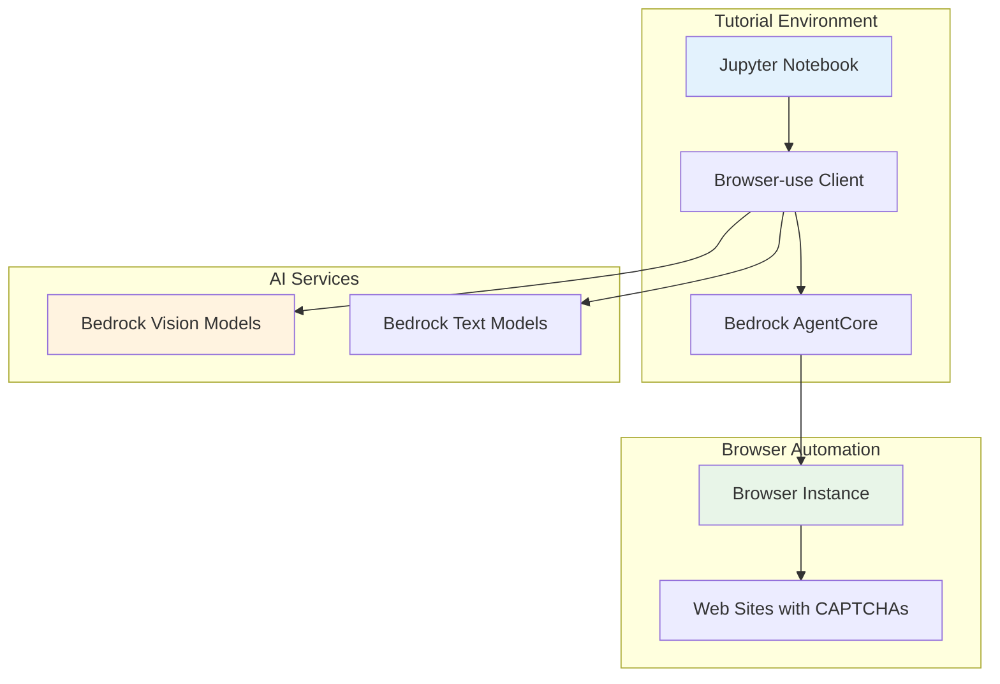

# Design Document

## Overview

This design outlines the creation of a comprehensive Browser-use CAPTCHA handling tutorial that demonstrates how to detect, analyze, and solve various types of CAPTCHAs using Browser-use with AWS Bedrock AgentCore Browser Tool. The tutorial will be an educational Jupyter notebook that teaches core concepts and provides practical examples.

## Architecture

### Tutorial Structure
```
browser-use-captcha.ipynb
├── Introduction & Setup
├── CAPTCHA Detection Methods
├── AI-Powered CAPTCHA Analysis
├── Browser-use Integration Patterns
├── Error Handling & Fallbacks
└── Best Practices & Ethics
```

### Component Architecture


## Components and Interfaces

### 1. Tutorial Notebook Structure

#### Section 1: Introduction & Setup
- **Purpose**: Environment setup and prerequisites
- **Components**:
  - AWS credentials configuration
  - Browser-use installation and setup
  - AgentCore browser tool initialization
- **Learning Outcomes**: Students understand the setup requirements

#### Section 2: CAPTCHA Detection Methods
- **Purpose**: Teach different CAPTCHA detection techniques
- **Components**:
  - DOM element detection (canvas, iframe, specific classes)
  - Visual detection using screenshots
  - Text-based CAPTCHA identification
- **Code Examples**:
```python
def detect_captcha_elements(page):
    """Detect various CAPTCHA types on a page"""
    captcha_selectors = [
        'iframe[src*="recaptcha"]',
        'div[class*="captcha"]',
        'canvas[id*="captcha"]'
    ]
    # Implementation details
```

#### Section 3: AI-Powered CAPTCHA Analysis
- **Purpose**: Demonstrate AI model integration for CAPTCHA solving
- **Components**:
  - Screenshot capture and preprocessing
  - Bedrock Vision model integration
  - Text extraction and analysis
- **Code Examples**:
```python
async def analyze_captcha_with_ai(screenshot_data):
    """Use Bedrock Vision models to analyze CAPTCHA"""
    # Vision model integration
    # Text extraction
    # Pattern recognition
```

#### Section 4: Browser-use Integration Patterns
- **Purpose**: Show how to integrate CAPTCHA handling into Browser-use workflows
- **Components**:
  - Custom Browser-use actions
  - Workflow orchestration
  - State management
- **Integration Patterns**:
  - Middleware approach
  - Event-driven handling
  - Retry mechanisms

#### Section 5: Error Handling & Fallbacks
- **Purpose**: Teach robust error handling strategies
- **Components**:
  - Timeout handling
  - Unsolvable CAPTCHA scenarios
  - Graceful degradation
- **Fallback Strategies**:
  - Human intervention prompts
  - Alternative workflow paths
  - Rate limiting compliance

#### Section 6: Best Practices & Ethics
- **Purpose**: Cover responsible automation practices
- **Components**:
  - Ethical considerations
  - Terms of service compliance
  - Rate limiting best practices

### 2. Code Examples and Utilities

#### CAPTCHA Detection Utilities
```python
class CaptchaDetector:
    def __init__(self, browser_client):
        self.browser = browser_client
    
    async def detect_recaptcha(self):
        """Detect Google reCAPTCHA"""
        pass
    
    async def detect_hcaptcha(self):
        """Detect hCaptcha"""
        pass
    
    async def detect_image_captcha(self):
        """Detect image-based CAPTCHAs"""
        pass
```

#### AI Integration Layer
```python
class CaptchaSolver:
    def __init__(self, bedrock_client):
        self.bedrock = bedrock_client
    
    async def solve_text_captcha(self, image_data):
        """Solve text-based CAPTCHA using vision models"""
        pass
    
    async def solve_image_selection(self, image_data, prompt):
        """Solve image selection CAPTCHAs"""
        pass
```

## Data Models

### CAPTCHA Detection Result
```python
@dataclass
class CaptchaDetectionResult:
    captcha_type: str  # 'recaptcha', 'hcaptcha', 'image', 'text'
    element_selector: str
    screenshot_path: Optional[str]
    confidence_score: float
    metadata: Dict[str, Any]
```

### CAPTCHA Solution
```python
@dataclass
class CaptchaSolution:
    solution_type: str  # 'text', 'coordinates', 'selection'
    solution_data: Union[str, List[Tuple[int, int]], List[int]]
    confidence_score: float
    processing_time: float
    model_used: str
```

## Error Handling

### Error Categories
1. **Detection Errors**: CAPTCHA not found or misidentified
2. **Solving Errors**: AI model fails to solve CAPTCHA
3. **Integration Errors**: Browser-use workflow failures
4. **Rate Limiting**: Too many requests to CAPTCHA services

### Error Handling Strategy
```python
class CaptchaError(Exception):
    """Base exception for CAPTCHA handling"""
    pass

class CaptchaNotFoundError(CaptchaError):
    """CAPTCHA not detected on page"""
    pass

class CaptchaSolvingError(CaptchaError):
    """Failed to solve CAPTCHA"""
    pass

async def handle_captcha_with_retry(page, max_retries=3):
    """Handle CAPTCHA with retry logic"""
    for attempt in range(max_retries):
        try:
            result = await detect_and_solve_captcha(page)
            return result
        except CaptchaError as e:
            if attempt == max_retries - 1:
                raise
            await asyncio.sleep(2 ** attempt)  # Exponential backoff
```

## Testing Strategy

### Tutorial Validation
1. **Code Execution**: All code cells must execute without errors
2. **Example Verification**: Examples work with real CAPTCHA sites (test sites)
3. **Learning Validation**: Clear explanations and progressive complexity

### Test Sites for Examples
- **Test CAPTCHA Sites**: Use dedicated test sites that provide CAPTCHAs for testing
- **Mock Examples**: Create mock CAPTCHA scenarios for safe testing
- **Ethical Testing**: Only use sites that explicitly allow automation testing

### Validation Checklist
- [ ] All imports work correctly
- [ ] AWS credentials setup is clear
- [ ] Code examples are executable
- [ ] Error handling examples work
- [ ] Ethical guidelines are comprehensive

## Implementation Phases

### Phase 1: Core Tutorial Structure
- Create notebook skeleton
- Implement basic CAPTCHA detection
- Add simple Browser-use integration

### Phase 2: AI Integration
- Add Bedrock Vision model integration
- Implement CAPTCHA solving algorithms
- Create comprehensive examples

### Phase 3: Advanced Features
- Add error handling and retry logic
- Implement fallback strategies
- Add performance optimization tips

### Phase 4: Documentation and Polish
- Add comprehensive explanations
- Create visual diagrams
- Add troubleshooting section

## Dependencies

### Required Packages
```
browser-use>=1.0.0
boto3>=1.34.0
pillow>=10.0.0
jupyter>=1.0.0
matplotlib>=3.7.0
```

### AWS Services
- AWS Bedrock (Claude Vision models)
- AWS Bedrock AgentCore Browser Tool
- AWS IAM (for permissions)

### Development Environment
- Python 3.9+
- Jupyter Notebook/Lab
- AWS CLI configured
- Browser-use setup

## Security Considerations

### Credential Management
- Use AWS IAM roles when possible
- Never hardcode credentials in notebook
- Provide secure credential setup instructions

### CAPTCHA Ethics
- Respect robots.txt and terms of service
- Implement rate limiting
- Use only for legitimate automation purposes
- Provide clear ethical guidelines

### Data Privacy
- Don't store CAPTCHA images permanently
- Sanitize any logged data
- Respect user privacy in examples