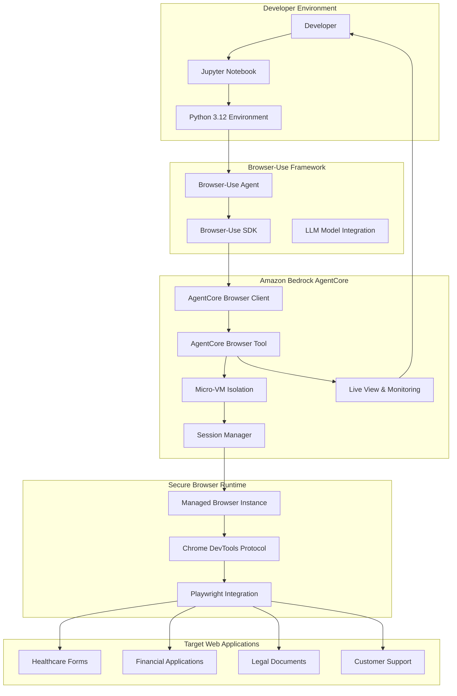

# Design Document

## Overview

This design document outlines the implementation of a comprehensive tutorial demonstrating how browser-use integrates with Amazon Bedrock AgentCore Browser Tool to securely handle sensitive information during web automation tasks. The tutorial will showcase the unique enterprise-grade security capabilities of AgentCore Browser Tool's managed browser runtime while demonstrating how browser-use leverages these features for sensitive data scenarios.

The tutorial follows the established pattern of existing AgentCore browser tool tutorials but focuses specifically on the browser-use framework's integration with AgentCore's serverless, isolated browser infrastructure for handling sensitive information in enterprise environments.

## Architecture

### High-Level Architecture



### Security Architecture


### Data Flow Architecture


## Components and Interfaces

### Core Components

#### 1. Tutorial Notebooks
- **Primary Notebooks**: 4 progressive Jupyter notebooks demonstrating browser-use + AgentCore integration
- **Supporting Examples**: Real-world scenario implementations
- **Testing Suite**: Comprehensive validation and testing scripts

#### 2. Browser-Use Integration Layer
```python
class BrowserUseAgentCoreIntegration:
    """Main integration class for browser-use with AgentCore Browser Tool."""
    
    def __init__(self, region: str = 'us-east-1'):
        self.region = region
        self.agentcore_client = None
        self.browser_session = None
    
    async def create_secure_session(self) -> BrowserSession:
        """Create a secure browser session using AgentCore."""
        pass
    
    async def execute_sensitive_task(self, instruction: str) -> dict:
        """Execute browser automation with sensitive data handling."""
        pass
    
    def get_live_view_url(self) -> str:
        """Get AgentCore live view URL for monitoring."""
        pass
```

#### 3. Security Utilities
```python
class SensitiveDataHandler:
    """Utilities for handling sensitive information in browser-use operations."""
    
    @staticmethod
    def mask_pii(data: str) -> str:
        """Mask personally identifiable information."""
        pass
    
    @staticmethod
    def secure_credential_input(credential_type: str) -> str:
        """Securely handle credential input."""
        pass
    
    @staticmethod
    def validate_compliance(operation: str) -> bool:
        """Validate operation against compliance requirements."""
        pass
```

#### 4. AgentCore Session Manager
```python
class AgentCoreSessionManager:
    """Manage AgentCore browser sessions with proper lifecycle."""
    
    def __init__(self, region: str):
        self.region = region
        self.active_sessions = {}
    
    async def create_session(self, session_id: str) -> dict:
        """Create new AgentCore browser session."""
        pass
    
    async def cleanup_session(self, session_id: str) -> None:
        """Clean up AgentCore session resources."""
        pass
    
    def monitor_session_health(self, session_id: str) -> dict:
        """Monitor session health and performance."""
        pass
```

### Interface Specifications

#### 1. AgentCore Browser Client Interface
```python
from bedrock_agentcore.tools.browser_client import BrowserClient

# Standard AgentCore integration pattern
async def get_agentcore_session():
    client = BrowserClient(region='us-east-1')
    session = await client.create_session()
    ws_url, headers = client.get_connection_details(session.session_id)
    return ws_url, headers, session
```

#### 2. Browser-Use Agent Interface
```python
from browser_use import Agent
from browser_use.browser.session import BrowserSession

# Browser-use integration with AgentCore
async def create_browseruse_agent(ws_url: str, headers: dict):
    browser_session = BrowserSession(
        cdp_url=ws_url,
        cdp_headers=headers
    )
    agent = Agent(
        task="Handle sensitive information securely",
        llm=llm_model,
        browser_session=browser_session
    )
    return agent
```

#### 3. Sensitive Data Processing Interface
```python
class SensitiveDataProcessor:
    """Interface for processing sensitive data in browser-use operations."""
    
    async def process_healthcare_form(self, form_data: dict) -> dict:
        """Process healthcare forms with HIPAA compliance."""
        pass
    
    async def process_financial_form(self, form_data: dict) -> dict:
        """Process financial forms with PCI-DSS compliance."""
        pass
    
    async def process_legal_document(self, document_data: dict) -> dict:
        """Process legal documents with privilege protection."""
        pass
```

## Data Models

### Session Configuration Model
```python
@dataclass
class AgentCoreSessionConfig:
    """Configuration for AgentCore browser sessions."""
    region: str
    session_timeout: int = 300
    enable_live_view: bool = True
    enable_session_replay: bool = True
    isolation_level: str = "micro-vm"
    compliance_mode: str = "enterprise"
```

### Sensitive Data Model
```python
@dataclass
class SensitiveDataContext:
    """Context for handling sensitive data operations."""
    data_type: str  # "pii", "financial", "healthcare", "legal"
    compliance_requirements: List[str]
    masking_rules: Dict[str, str]
    retention_policy: str
    audit_level: str
```

### Browser-Use Task Model
```python
@dataclass
class BrowserUseTask:
    """Model for browser-use tasks with sensitive data."""
    task_id: str
    instruction: str
    sensitive_data_context: SensitiveDataContext
    agentcore_session_config: AgentCoreSessionConfig
    expected_outcomes: List[str]
    security_validations: List[str]
```

### Monitoring Data Model
```python
@dataclass
class SessionMonitoringData:
    """Data model for session monitoring and observability."""
    session_id: str
    start_time: datetime
    end_time: Optional[datetime]
    operations_performed: List[str]
    sensitive_data_accessed: bool
    compliance_violations: List[str]
    performance_metrics: Dict[str, float]
    live_view_url: Optional[str]
```

## Error Handling

### Error Hierarchy
```python
class BrowserUseAgentCoreError(Exception):
    """Base exception for browser-use + AgentCore integration."""
    pass

class SessionCreationError(BrowserUseAgentCoreError):
    """Error creating AgentCore browser session."""
    pass

class SensitiveDataError(BrowserUseAgentCoreError):
    """Error handling sensitive data."""
    pass

class ComplianceViolationError(BrowserUseAgentCoreError):
    """Error indicating compliance violation."""
    pass

class SessionIsolationError(BrowserUseAgentCoreError):
    """Error with session isolation."""
    pass
```

### Error Handling Patterns
```python
async def safe_sensitive_operation(operation_func, *args, **kwargs):
    """Safe execution pattern for sensitive operations."""
    try:
        result = await operation_func(*args, **kwargs)
        return result
    except SensitiveDataError as e:
        # Log without exposing sensitive data
        logger.error(f"Sensitive data operation failed: {type(e).__name__}")
        raise
    except ComplianceViolationError as e:
        # Immediate session termination
        await emergency_session_cleanup()
        raise
    except Exception as e:
        # Generic error handling
        logger.error(f"Unexpected error: {e}")
        raise BrowserUseAgentCoreError(f"Operation failed: {type(e).__name__}")
```

## Testing Strategy

### Unit Testing
- **Component Tests**: Individual component functionality
- **Integration Tests**: Browser-use + AgentCore integration points
- **Security Tests**: Sensitive data handling validation
- **Compliance Tests**: Regulatory requirement validation

### Integration Testing
- **End-to-End Workflows**: Complete sensitive data processing workflows
- **Session Lifecycle Tests**: AgentCore session management
- **Error Handling Tests**: Failure scenarios and recovery
- **Performance Tests**: Scalability and performance validation

### Security Testing
- **Penetration Testing**: Security boundary validation
- **Data Leakage Tests**: Sensitive data exposure prevention
- **Session Isolation Tests**: Micro-VM isolation validation
- **Compliance Audit Tests**: Regulatory compliance verification

### Test Structure
```python
class TestBrowserUseAgentCoreIntegration:
    """Test suite for browser-use + AgentCore integration."""
    
    async def test_session_creation(self):
        """Test AgentCore session creation."""
        pass
    
    async def test_sensitive_data_masking(self):
        """Test PII masking functionality."""
        pass
    
    async def test_compliance_validation(self):
        """Test compliance requirement validation."""
        pass
    
    async def test_session_isolation(self):
        """Test micro-VM session isolation."""
        pass
    
    async def test_emergency_cleanup(self):
        """Test emergency session cleanup."""
        pass
```

## Implementation Approach

### Phase 1: Core Integration
1. **AgentCore Browser Client Setup**: Basic integration with browser-use
2. **Session Management**: Implement secure session lifecycle
3. **Basic Automation**: Simple browser-use tasks with AgentCore

### Phase 2: Sensitive Data Handling
1. **PII Detection and Masking**: Implement sensitive data identification
2. **Credential Security**: Secure credential handling patterns
3. **Compliance Framework**: Basic compliance validation

### Phase 3: Advanced Features
1. **Live View Integration**: AgentCore observability features
2. **Session Replay**: Audit trail and debugging capabilities
3. **Performance Optimization**: Scaling and optimization patterns

### Phase 4: Production Readiness
1. **Error Handling**: Comprehensive error management
2. **Monitoring Integration**: Full observability implementation
3. **Documentation**: Complete tutorial and reference documentation

### Tutorial Structure
1. **Notebook 1**: Basic browser-use + AgentCore integration
2. **Notebook 2**: Sensitive data handling with PII masking
3. **Notebook 3**: Advanced security features and compliance
4. **Notebook 4**: Production deployment and monitoring

### Supporting Materials
- **Examples Directory**: Real-world scenario implementations
- **Tools Directory**: Utility functions and helpers
- **Tests Directory**: Comprehensive test suite
- **Assets Directory**: Documentation and architecture diagrams