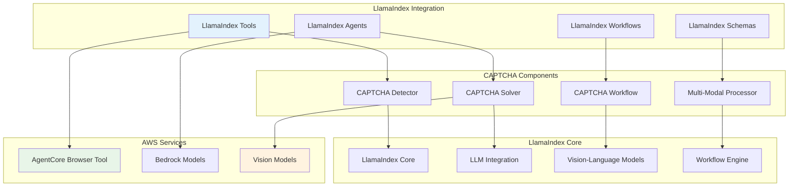

# Design Document

## Overview

This design outlines the creation of a production-ready LlamaIndex framework integration for CAPTCHA handling with AWS Bedrock AgentCore Browser Tool. This integration will provide native LlamaIndex tools, agents, and workflows for comprehensive CAPTCHA detection and solving capabilities.

## Architecture

### Integration Structure
```
03-integrations/bedrock-agentcore-browser-tool/agentic-frameworks/captcha-handling/llamaindex/
├── src/
│   ├── llamaindex_captcha/
│   │   ├── __init__.py
│   │   ├── tools/
│   │   │   ├── captcha_detection_tool.py
│   │   │   ├── captcha_solving_tool.py
│   │   │   └── captcha_workflow_tool.py
│   │   ├── agents/
│   │   │   ├── captcha_agent.py
│   │   │   └── multi_modal_agent.py
│   │   ├── workflows/
│   │   │   ├── captcha_workflow.py
│   │   │   └── workflow_events.py
│   │   ├── schemas/
│   │   │   ├── captcha_schemas.py
│   │   │   └── response_schemas.py
│   │   └── utils/
│   │       ├── image_processing.py
│   │       └── bedrock_client.py
├── examples/
│   ├── basic_captcha_agent.py
│   ├── workflow_integration.py
│   └── production_deployment.py
├── tests/
│   ├── test_tools.py
│   ├── test_agents.py
│   └── test_workflows.py
├── docs/
│   ├── README.md
│   ├── API_REFERENCE.md
│   └── INTEGRATION_GUIDE.md
├── requirements.txt
└── setup.py
```

### Component Architecture


## Components and Interfaces

### 1. LlamaIndex CAPTCHA Tools

#### Base CAPTCHA Tool
```python
from llama_index.core.tools import BaseTool
from llama_index.core.tools.tool_spec.base import BaseToolSpec
from llama_index.core.bridge.pydantic import BaseModel, Field
from typing import Dict, Any, Optional, List
import asyncio
import boto3

class CaptchaToolMetadata(BaseModel):
    """Metadata for CAPTCHA tools"""
    
    name: str = Field(description="Tool name")
    description: str = Field(description="Tool description")
    version: str = Field(default="1.0.0")
    supported_captcha_types: List[str] = Field(description="Supported CAPTCHA types")

class CaptchaDetectionTool(BaseTool):
    """LlamaIndex tool for CAPTCHA detection"""
    
    metadata = ToolMetadata(
        name="captcha_detector",
        description="Detects various types of CAPTCHAs on web pages including reCAPTCHA, hCaptcha, and image-based CAPTCHAs"
    )
    
    def __init__(self, browser_client=None, **kwargs):
        super().__init__(**kwargs)
        self.browser_client = browser_client
        self.detection_strategies = self._initialize_detection_strategies()
    
    def call(self, page_url: str, **kwargs) -> Dict[str, Any]:
        """Detect CAPTCHAs on the specified page"""
        return asyncio.run(self._async_call(page_url, **kwargs))
    
    async def acall(self, page_url: str, **kwargs) -> Dict[str, Any]:
        """Async version of CAPTCHA detection"""
        return await self._async_call(page_url, **kwargs)
    
    async def _async_call(self, page_url: str, **kwargs) -> Dict[str, Any]:
        """Internal async implementation"""
        try:
            detection_result = await self._detect_captcha_on_page(page_url)
            
            return {
                "success": True,
                "captcha_found": detection_result.found,
                "captcha_type": detection_result.captcha_type,
                "element_selector": detection_result.element_selector,
                "confidence_score": detection_result.confidence_score,
                "metadata": detection_result.metadata
            }
        
        except Exception as e:
            return {
                "success": False,
                "error": str(e),
                "captcha_found": False
            }
    
    def _initialize_detection_strategies(self):
        """Initialize CAPTCHA detection strategies"""
        from .detection_strategies import (
            RecaptchaStrategy,
            HcaptchaStrategy,
            ImageCaptchaStrategy
        )
        
        return [
            RecaptchaStrategy(),
            HcaptchaStrategy(),
            ImageCaptchaStrategy()
        ]

class CaptchaSolvingTool(BaseTool):
    """LlamaIndex tool for solving CAPTCHAs using Bedrock models"""
    
    metadata = ToolMetadata(
        name="captcha_solver",
        description="Solves detected CAPTCHAs using AWS Bedrock vision and language models"
    )
    
    def __init__(self, bedrock_client=None, model_name: str = None, **kwargs):
        super().__init__(**kwargs)
        self.bedrock_client = bedrock_client or boto3.client('bedrock-runtime')
        self.model_name = model_name or "anthropic.claude-3-sonnet-20240229-v1:0"
    
    def call(self, captcha_data: Dict[str, Any], **kwargs) -> Dict[str, Any]:
        """Solve CAPTCHA based on detection data"""
        return asyncio.run(self._async_call(captcha_data, **kwargs))
    
    async def acall(self, captcha_data: Dict[str, Any], **kwargs) -> Dict[str, Any]:
        """Async version of CAPTCHA solving"""
        return await self._async_call(captcha_data, **kwargs)
    
    async def _async_call(self, captcha_data: Dict[str, Any], **kwargs) -> Dict[str, Any]:
        """Internal async implementation"""
        try:
            solution = await self._solve_captcha_with_ai(captcha_data)
            
            return {
                "success": True,
                "solution": solution.solution,
                "solution_type": solution.solution_type,
                "confidence_score": solution.confidence_score,
                "processing_time": solution.processing_time,
                "model_used": solution.model_used
            }
        
        except Exception as e:
            return {
                "success": False,
                "error": str(e),
                "solution": None
            }
```

#### CAPTCHA Tool Specification
```python
class CaptchaToolSpec(BaseToolSpec):
    """Tool specification for comprehensive CAPTCHA handling"""
    
    spec_functions = [
        "detect_captcha",
        "solve_captcha",
        "submit_solution",
        "verify_completion"
    ]
    
    def __init__(self, browser_client=None, bedrock_client=None):
        self.browser_client = browser_client
        self.bedrock_client = bedrock_client or boto3.client('bedrock-runtime')
    
    def detect_captcha(self, page_url: str) -> Dict[str, Any]:
        """Detect CAPTCHA on the specified page"""
        detector = CaptchaDetectionTool(self.browser_client)
        return detector.call(page_url)
    
    def solve_captcha(self, captcha_data: Dict[str, Any]) -> Dict[str, Any]:
        """Solve detected CAPTCHA using AI models"""
        solver = CaptchaSolvingTool(self.bedrock_client)
        return solver.call(captcha_data)
    
    def submit_solution(self, solution_data: Dict[str, Any], element_selector: str) -> Dict[str, Any]:
        """Submit CAPTCHA solution through browser automation"""
        try:
            # Implementation for submitting solution
            success = self._submit_captcha_solution(solution_data, element_selector)
            return {"success": success, "submitted": True}
        except Exception as e:
            return {"success": False, "error": str(e)}
    
    def verify_completion(self, page_url: str) -> Dict[str, Any]:
        """Verify CAPTCHA was successfully completed"""
        try:
            # Check if page has progressed past CAPTCHA
            completed = self._verify_captcha_completion(page_url)
            return {"success": True, "captcha_completed": completed}
        except Exception as e:
            return {"success": False, "error": str(e)}
```

### 2. LlamaIndex Agent Integration

#### CAPTCHA-Aware Agent
```python
from llama_index.core.agent import ReActAgent
from llama_index.llms.bedrock import Bedrock
from llama_index.multi_modal_llms.bedrock import BedrockMultiModal
from llama_index.core.tools import ToolMetadata

class CaptchaHandlingAgent:
    """LlamaIndex agent specialized in CAPTCHA handling"""
    
    def __init__(self, 
                 llm_model: str = "anthropic.claude-3-sonnet-20240229-v1:0",
                 vision_model: str = "anthropic.claude-3-sonnet-20240229-v1:0"):
        
        # Initialize LLM and Vision models
        self.llm = Bedrock(model=llm_model)
        self.vision_llm = BedrockMultiModal(model=vision_model)
        
        # Initialize CAPTCHA tools
        self.captcha_tools = self._create_captcha_tools()
        
        # Create ReAct agent with CAPTCHA tools
        self.agent = ReActAgent.from_tools(
            tools=self.captcha_tools,
            llm=self.llm,
            verbose=True,
            system_prompt=self._create_system_prompt()
        )
    
    def _create_captcha_tools(self) -> List[BaseTool]:
        """Create CAPTCHA handling tools for the agent"""
        return [
            CaptchaDetectionTool(),
            CaptchaSolvingTool(),
            CaptchaSubmissionTool(),
            CaptchaVerificationTool()
        ]
    
    def _create_system_prompt(self) -> str:
        """Create system prompt for CAPTCHA-aware agent"""
        return """
        You are an AI agent specialized in web automation with CAPTCHA handling capabilities.
        
        When navigating websites and encountering CAPTCHAs:
        1. Use the captcha_detector tool to identify the type and location of CAPTCHAs
        2. Use the captcha_solver tool to solve the CAPTCHA using vision analysis
        3. Use the captcha_submission tool to submit the solution
        4. Use the captcha_verification tool to confirm successful completion
        
        Always handle CAPTCHAs ethically and in compliance with website terms of service.
        Provide clear feedback about each step of the CAPTCHA handling process.
        If a CAPTCHA cannot be solved, explain why and suggest alternatives.
        """
    
    async def navigate_and_handle_captcha(self, url: str, task: str) -> Dict[str, Any]:
        """Navigate to URL and complete task with CAPTCHA handling"""
        
        prompt = f"""
        Navigate to {url} and complete the following task: {task}
        
        If you encounter any CAPTCHAs during this process:
        - Detect them using your available tools
        - Solve them using AI vision analysis
        - Submit the solutions appropriately
        - Verify successful completion
        
        Provide detailed feedback about the entire process including any CAPTCHAs encountered.
        """
        
        response = await self.agent.achat(prompt)
        return {
            "task_completed": True,
            "response": response.response,
            "tool_calls": [call.tool_name for call in response.source_nodes if hasattr(call, 'tool_name')]
        }

class MultiModalCaptchaAgent:
    """Advanced agent with multi-modal CAPTCHA analysis capabilities"""
    
    def __init__(self):
        self.vision_llm = BedrockMultiModal(
            model="anthropic.claude-3-sonnet-20240229-v1:0"
        )
        self.text_llm = Bedrock(
            model="anthropic.claude-3-sonnet-20240229-v1:0"
        )
    
    async def analyze_complex_captcha(self, image_data: bytes, context: str) -> Dict[str, Any]:
        """Analyze complex CAPTCHAs using multi-modal approach"""
        from llama_index.core.schema import ImageDocument
        
        # Create image document
        image_doc = ImageDocument(image=image_data)
        
        # Multi-step analysis
        analysis_steps = [
            self._analyze_captcha_type(image_doc),
            self._extract_captcha_elements(image_doc),
            self._generate_solution(image_doc, context)
        ]
        
        results = []
        for step in analysis_steps:
            result = await step
            results.append(result)
        
        return {
            "analysis_complete": True,
            "captcha_type": results[0].get("type"),
            "elements": results[1].get("elements"),
            "solution": results[2].get("solution"),
            "confidence": min([r.get("confidence", 0) for r in results])
        }
```

### 3. LlamaIndex Workflow Integration

#### CAPTCHA Workflow
```python
from llama_index.core.workflow import (
    Workflow,
    StartEvent,
    StopEvent,
    step,
    Context
)
from llama_index.core.workflow.events import Event

# Custom workflow events
class CaptchaDetectedEvent(Event):
    """Event triggered when CAPTCHA is detected"""
    captcha_data: Dict[str, Any]
    page_url: str

class CaptchaSolvedEvent(Event):
    """Event triggered when CAPTCHA is solved"""
    solution: Dict[str, Any]
    captcha_data: Dict[str, Any]

class CaptchaSubmittedEvent(Event):
    """Event triggered when CAPTCHA solution is submitted"""
    submission_result: Dict[str, Any]
    solution: Dict[str, Any]

class CaptchaHandlingWorkflow(Workflow):
    """LlamaIndex workflow for comprehensive CAPTCHA handling"""
    
    def __init__(self, **kwargs):
        super().__init__(**kwargs)
        self.captcha_detector = CaptchaDetectionTool()
        self.captcha_solver = CaptchaSolvingTool()
    
    @step
    async def detect_captcha(self, ctx: Context, ev: StartEvent) -> CaptchaDetectedEvent:
        """Step 1: Detect CAPTCHA on the target page"""
        page_url = ev.page_url
        
        # Store page URL in context
        await ctx.set("page_url", page_url)
        
        # Detect CAPTCHA
        detection_result = await self.captcha_detector.acall(page_url)
        
        if detection_result["success"] and detection_result["captcha_found"]:
            return CaptchaDetectedEvent(
                captcha_data=detection_result,
                page_url=page_url
            )
        else:
            # No CAPTCHA found, end workflow
            return StopEvent(result={"captcha_found": False, "message": "No CAPTCHA detected"})
    
    @step
    async def solve_captcha(self, ctx: Context, ev: CaptchaDetectedEvent) -> CaptchaSolvedEvent:
        """Step 2: Solve the detected CAPTCHA"""
        
        # Store CAPTCHA data in context
        await ctx.set("captcha_data", ev.captcha_data)
        
        # Solve CAPTCHA
        solution_result = await self.captcha_solver.acall(ev.captcha_data)
        
        if solution_result["success"]:
            return CaptchaSolvedEvent(
                solution=solution_result,
                captcha_data=ev.captcha_data
            )
        else:
            # Failed to solve, end workflow with error
            return StopEvent(result={
                "success": False,
                "error": "Failed to solve CAPTCHA",
                "details": solution_result
            })
    
    @step
    async def submit_solution(self, ctx: Context, ev: CaptchaSolvedEvent) -> CaptchaSubmittedEvent:
        """Step 3: Submit the CAPTCHA solution"""
        
        # Get submission tool
        submission_tool = CaptchaSubmissionTool()
        
        # Submit solution
        submission_result = await submission_tool.acall(
            solution_data=ev.solution,
            captcha_data=ev.captcha_data
        )
        
        return CaptchaSubmittedEvent(
            submission_result=submission_result,
            solution=ev.solution
        )
    
    @step
    async def verify_completion(self, ctx: Context, ev: CaptchaSubmittedEvent) -> StopEvent:
        """Step 4: Verify CAPTCHA completion"""
        
        page_url = await ctx.get("page_url")
        
        # Verify completion
        verification_tool = CaptchaVerificationTool()
        verification_result = await verification_tool.acall(page_url)
        
        return StopEvent(result={
            "success": verification_result["success"],
            "captcha_completed": verification_result.get("captcha_completed", False),
            "submission_result": ev.submission_result,
            "solution": ev.solution
        })

# Workflow orchestrator
class CaptchaWorkflowOrchestrator:
    """Orchestrator for managing multiple CAPTCHA workflows"""
    
    def __init__(self):
        self.workflows = {
            "simple": SimpleCaptchaWorkflow(),
            "complex": ComplexCaptchaWorkflow(),
            "multi_step": MultiStepCaptchaWorkflow()
        }
    
    async def handle_captcha(self, page_url: str, captcha_complexity: str = "simple") -> Dict[str, Any]:
        """Handle CAPTCHA using appropriate workflow"""
        
        workflow = self.workflows.get(captcha_complexity, self.workflows["simple"])
        
        # Run workflow
        result = await workflow.run(page_url=page_url)
        
        return result
```

### 4. Schema Integration

#### LlamaIndex Schema Integration
```python
from llama_index.core.schema import BaseNode, NodeRelationship, MetadataMode
from llama_index.core.bridge.pydantic import BaseModel, Field
from typing import Optional, Dict, Any, List
from datetime import datetime

class CaptchaNode(BaseNode):
    """LlamaIndex node for storing CAPTCHA-related data"""
    
    captcha_type: str = Field(description="Type of CAPTCHA")
    detection_confidence: float = Field(description="Detection confidence score")
    solution_confidence: float = Field(description="Solution confidence score")
    processing_time: float = Field(description="Total processing time")
    model_used: str = Field(description="AI model used for solving")
    
    @classmethod
    def class_name(cls) -> str:
        return "CaptchaNode"
    
    def get_content(self, metadata_mode: MetadataMode = MetadataMode.NONE) -> str:
        """Get content representation of CAPTCHA node"""
        return f"CAPTCHA Type: {self.captcha_type}, Confidence: {self.detection_confidence}"
    
    def get_metadata_str(self, mode: MetadataMode = MetadataMode.ALL) -> str:
        """Get metadata string representation"""
        metadata_parts = [
            f"Processing Time: {self.processing_time}s",
            f"Model Used: {self.model_used}",
            f"Solution Confidence: {self.solution_confidence}"
        ]
        return " | ".join(metadata_parts)

class CaptchaDocument(BaseModel):
    """Document schema for CAPTCHA handling results"""
    
    page_url: str = Field(description="URL where CAPTCHA was encountered")
    captcha_data: Dict[str, Any] = Field(description="CAPTCHA detection data")
    solution_data: Optional[Dict[str, Any]] = Field(description="CAPTCHA solution data")
    success: bool = Field(description="Whether CAPTCHA was successfully handled")
    timestamp: datetime = Field(default_factory=datetime.now)
    
    def to_llamaindex_node(self) -> CaptchaNode:
        """Convert to LlamaIndex node"""
        return CaptchaNode(
            text=f"CAPTCHA handling for {self.page_url}",
            captcha_type=self.captcha_data.get("captcha_type", "unknown"),
            detection_confidence=self.captcha_data.get("confidence_score", 0.0),
            solution_confidence=self.solution_data.get("confidence_score", 0.0) if self.solution_data else 0.0,
            processing_time=self.solution_data.get("processing_time", 0.0) if self.solution_data else 0.0,
            model_used=self.solution_data.get("model_used", "unknown") if self.solution_data else "unknown"
        )

# Response schemas for LlamaIndex integration
class CaptchaResponse(BaseModel):
    """Response schema for CAPTCHA operations"""
    
    success: bool = Field(description="Operation success status")
    captcha_found: bool = Field(description="Whether CAPTCHA was found")
    captcha_type: Optional[str] = Field(description="Type of CAPTCHA detected")
    solution: Optional[str] = Field(description="CAPTCHA solution")
    confidence_score: float = Field(description="Confidence in the result")
    processing_time: float = Field(description="Time taken for operation")
    error_message: Optional[str] = Field(description="Error message if operation failed")
    
    def to_llamaindex_response(self) -> str:
        """Convert to LlamaIndex response format"""
        if self.success:
            if self.captcha_found:
                return f"CAPTCHA detected and solved: {self.solution} (confidence: {self.confidence_score})"
            else:
                return "No CAPTCHA found on the page"
        else:
            return f"CAPTCHA handling failed: {self.error_message}"
```

## Error Handling

### LlamaIndex Error Integration
```python
from llama_index.core.base.response.schema import Response
from llama_index.core.schema import NodeWithScore

class CaptchaHandlingError(Exception):
    """Base exception for CAPTCHA handling in LlamaIndex"""
    
    def __init__(self, message: str, error_code: str = None, details: Dict = None):
        super().__init__(message)
        self.error_code = error_code
        self.details = details or {}

class CaptchaToolError(CaptchaHandlingError):
    """Error in CAPTCHA tool execution"""
    pass

class CaptchaAgentError(CaptchaHandlingError):
    """Error in CAPTCHA agent processing"""
    pass

class CaptchaWorkflowError(CaptchaHandlingError):
    """Error in CAPTCHA workflow execution"""
    pass

def create_error_response(error: Exception, source_nodes: List[NodeWithScore] = None) -> Response:
    """Create LlamaIndex response for CAPTCHA errors"""
    return Response(
        response=f"CAPTCHA handling failed: {str(error)}",
        source_nodes=source_nodes or [],
        metadata={
            "error_type": type(error).__name__,
            "error_code": getattr(error, 'error_code', None),
            "error_details": getattr(error, 'details', {})
        }
    )

# Robust error handling in tools
class RobustCaptchaTool(BaseTool):
    """Base class for robust CAPTCHA tools with LlamaIndex error handling"""
    
    def call(self, *args, **kwargs) -> Dict[str, Any]:
        """Execute tool with comprehensive error handling"""
        try:
            return self._execute_core_logic(*args, **kwargs)
        
        except CaptchaToolError as e:
            self._log_error(f"CAPTCHA tool error: {e}")
            return {
                "success": False,
                "error": str(e),
                "error_type": "tool_error",
                "retry_suggested": True
            }
        
        except Exception as e:
            self._log_error(f"Unexpected error in CAPTCHA tool: {e}")
            return {
                "success": False,
                "error": str(e),
                "error_type": "unexpected_error",
                "retry_suggested": False
            }
    
    def _log_error(self, message: str):
        """Log error with LlamaIndex logging"""
        import logging
        logger = logging.getLogger(f"llamaindex.captcha.{self.__class__.__name__}")
        logger.error(message)
```

## Testing Strategy

### LlamaIndex Testing Patterns
```python
import pytest
import asyncio
from unittest.mock import Mock, AsyncMock, patch
from llama_index.core.tools.tool_spec.base import BaseToolSpec

class TestLlamaIndexCaptchaIntegration:
    """Test suite for LlamaIndex CAPTCHA integration"""
    
    @pytest.fixture
    def captcha_tool_spec(self):
        """CAPTCHA tool specification for testing"""
        return CaptchaToolSpec()
    
    @pytest.fixture
    def captcha_agent(self):
        """CAPTCHA agent for testing"""
        return CaptchaHandlingAgent()
    
    @pytest.fixture
    def captcha_workflow(self):
        """CAPTCHA workflow for testing"""
        return CaptchaHandlingWorkflow()
    
    def test_tool_spec_functions(self, captcha_tool_spec):
        """Test tool specification functions"""
        assert "detect_captcha" in captcha_tool_spec.spec_functions
        assert "solve_captcha" in captcha_tool_spec.spec_functions
        assert "submit_solution" in captcha_tool_spec.spec_functions
        assert "verify_completion" in captcha_tool_spec.spec_functions
    
    async def test_captcha_detection_tool(self):
        """Test CAPTCHA detection tool"""
        tool = CaptchaDetectionTool()
        
        with patch.object(tool, '_detect_captcha_on_page') as mock_detect:
            mock_detect.return_value = Mock(
                found=True,
                captcha_type="recaptcha",
                element_selector=".g-recaptcha",
                confidence_score=0.9,
                metadata={}
            )
            
            result = await tool.acall("https://test-site.com")
            
            assert result["success"] is True
            assert result["captcha_found"] is True
            assert result["captcha_type"] == "recaptcha"
    
    async def test_captcha_solving_tool(self):
        """Test CAPTCHA solving tool"""
        tool = CaptchaSolvingTool()
        
        captcha_data = {
            "captcha_type": "text",
            "element_selector": ".captcha-input",
            "screenshot_path": "test.png"
        }
        
        with patch.object(tool, '_solve_captcha_with_ai') as mock_solve:
            mock_solve.return_value = Mock(
                solution="ABC123",
                solution_type="text",
                confidence_score=0.8,
                processing_time=1.5,
                model_used="claude-3"
            )
            
            result = await tool.acall(captcha_data)
            
            assert result["success"] is True
            assert result["solution"] == "ABC123"
    
    async def test_agent_integration(self, captcha_agent):
        """Test agent integration with CAPTCHA tools"""
        with patch.object(captcha_agent.agent, 'achat') as mock_chat:
            mock_chat.return_value = Mock(
                response="CAPTCHA detected and solved successfully",
                source_nodes=[]
            )
            
            result = await captcha_agent.navigate_and_handle_captcha(
                "https://test-site.com",
                "Fill out contact form"
            )
            
            assert result["task_completed"] is True
            assert "CAPTCHA" in result["response"]
    
    async def test_workflow_execution(self, captcha_workflow):
        """Test workflow execution"""
        with patch.object(captcha_workflow, 'run') as mock_run:
            mock_run.return_value = {
                "success": True,
                "captcha_completed": True,
                "captcha_type": "recaptcha"
            }
            
            result = await captcha_workflow.run(page_url="https://test-site.com")
            
            assert result["success"] is True
            assert result["captcha_completed"] is True
    
    def test_schema_integration(self):
        """Test schema integration with LlamaIndex"""
        captcha_doc = CaptchaDocument(
            page_url="https://test-site.com",
            captcha_data={"captcha_type": "recaptcha", "confidence_score": 0.9},
            solution_data={"solution": "solved", "confidence_score": 0.8},
            success=True
        )
        
        node = captcha_doc.to_llamaindex_node()
        
        assert isinstance(node, CaptchaNode)
        assert node.captcha_type == "recaptcha"
        assert node.detection_confidence == 0.9
```

## Implementation Phases

### Phase 1: Core Tool Development (Week 1-2)
- Implement CaptchaDetectionTool with LlamaIndex integration
- Create CaptchaSolvingTool with Bedrock integration
- Develop CaptchaToolSpec for comprehensive functionality
- Create basic test suite

### Phase 2: Agent Integration (Week 3-4)
- Develop CaptchaHandlingAgent with ReAct integration
- Implement MultiModalCaptchaAgent for complex scenarios
- Add agent-specific error handling and logging
- Create agent integration tests

### Phase 3: Workflow Integration (Week 5-6)
- Implement CaptchaHandlingWorkflow with LlamaIndex workflow engine
- Create workflow events and orchestration
- Add workflow error handling and recovery
- Develop workflow integration tests

### Phase 4: Production Features (Week 7-8)
- Add comprehensive schema integration
- Implement production-ready error handling
- Create deployment documentation and examples
- Add performance optimization and monitoring

## Dependencies

### LlamaIndex Dependencies
```
llama-index>=0.10.0
llama-index-llms-bedrock>=0.1.0
llama-index-multi-modal-llms-bedrock>=0.1.0
llama-index-core>=0.10.0
```

### AWS Dependencies
```
boto3>=1.34.0
bedrock-agentcore>=1.0.0
```

### Additional Dependencies
```
pillow>=10.0.0
pydantic>=2.0.0
asyncio>=3.9.0
pytest>=7.0.0
pytest-asyncio>=0.21.0
```

## Integration Patterns

### Tool Composition
```python
from llama_index.core.agent import AgentRunner
from llama_index.core.tools import ToolMetadata

class CaptchaToolRegistry:
    """Registry for CAPTCHA tools in LlamaIndex"""
    
    def __init__(self):
        self.tools = {}
        self._register_default_tools()
    
    def _register_default_tools(self):
        """Register default CAPTCHA tools"""
        self.tools.update({
            "captcha_detector": CaptchaDetectionTool(),
            "captcha_solver": CaptchaSolvingTool(),
            "captcha_submitter": CaptchaSubmissionTool(),
            "captcha_verifier": CaptchaVerificationTool()
        })
    
    def get_tools_for_agent(self) -> List[BaseTool]:
        """Get all tools for agent registration"""
        return list(self.tools.values())
    
    def create_agent_with_captcha_tools(self, llm) -> AgentRunner:
        """Create LlamaIndex agent with CAPTCHA tools"""
        return AgentRunner.from_llm(
            tools=self.get_tools_for_agent(),
            llm=llm,
            verbose=True
        )
```

### Workflow Orchestration
```python
class CaptchaWorkflowManager:
    """Manager for CAPTCHA workflows in LlamaIndex"""
    
    def __init__(self):
        self.workflows = {
            "basic": BasicCaptchaWorkflow(),
            "advanced": AdvancedCaptchaWorkflow(),
            "multi_modal": MultiModalCaptchaWorkflow()
        }
    
    async def execute_captcha_workflow(self, 
                                     workflow_type: str, 
                                     page_url: str, 
                                     **kwargs) -> Dict[str, Any]:
        """Execute appropriate CAPTCHA workflow"""
        
        workflow = self.workflows.get(workflow_type)
        if not workflow:
            raise ValueError(f"Unknown workflow type: {workflow_type}")
        
        return await workflow.run(page_url=page_url, **kwargs)
```