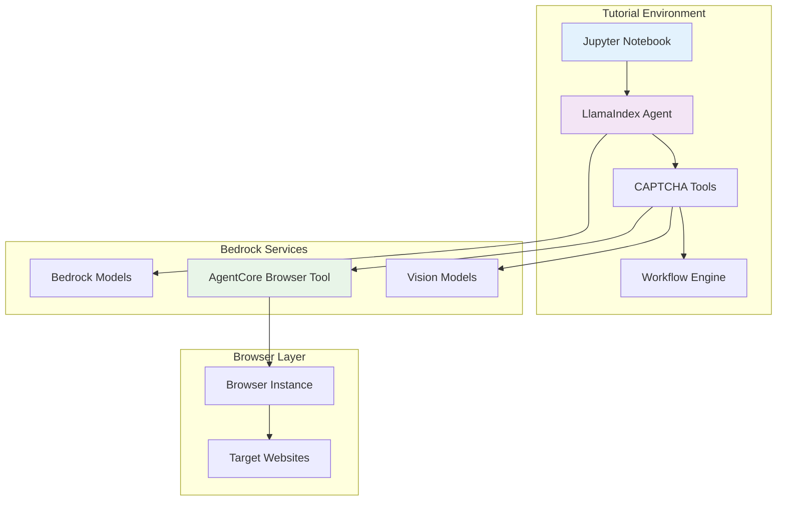

# Design Document

## Overview

This design outlines the creation of a comprehensive LlamaIndex CAPTCHA handling tutorial that demonstrates how to integrate CAPTCHA detection and solving capabilities into LlamaIndex agents using AWS Bedrock AgentCore Browser Tool. The tutorial will be an educational Jupyter notebook that showcases LlamaIndex-native patterns and tools for CAPTCHA handling.

## Architecture

### Tutorial Structure
```
llamaindex/
├── llamaindex-captcha.ipynb
├── README.md
├── requirements.txt
├── llamaindex_captcha_handler.py
├── llamaindex_captcha_tools.py
└── examples/
    ├── basic_captcha_detection.py
    ├── agent_workflow_example.py
    └── production_example.py
```

### Component Architecture


## Components and Interfaces

### 1. LlamaIndex CAPTCHA Tools

#### Base CAPTCHA Tool
```python
from llama_index.core.tools import BaseTool
from llama_index.core.bridge.pydantic import BaseModel, Field

class CaptchaDetectionTool(BaseTool):
    """LlamaIndex tool for CAPTCHA detection"""
    
    metadata = ToolMetadata(
        name="captcha_detector",
        description="Detects various types of CAPTCHAs on web pages"
    )
    
    def __init__(self, browser_client):
        self.browser = browser_client
        super().__init__()
    
    def call(self, page_url: str) -> Dict[str, Any]:
        """Detect CAPTCHAs on the given page"""
        # Implementation
        pass
```

#### CAPTCHA Solving Tool
```python
class CaptchaSolvingTool(BaseTool):
    """LlamaIndex tool for solving CAPTCHAs"""
    
    metadata = ToolMetadata(
        name="captcha_solver",
        description="Solves detected CAPTCHAs using AI models"
    )
    
    def __init__(self, bedrock_client):
        self.bedrock = bedrock_client
        super().__init__()
    
    def call(self, captcha_data: Dict[str, Any]) -> str:
        """Solve the provided CAPTCHA"""
        # Implementation
        pass
```

### 2. LlamaIndex Agent Integration

#### CAPTCHA-Aware Agent
```python
from llama_index.core.agent import ReActAgent
from llama_index.llms.bedrock import Bedrock

class CaptchaHandlingAgent:
    """LlamaIndex agent with CAPTCHA handling capabilities"""
    
    def __init__(self):
        self.llm = Bedrock(model="anthropic.claude-3-sonnet-20240229-v1:0")
        self.tools = [
            CaptchaDetectionTool(),
            CaptchaSolvingTool(),
            # Other web automation tools
        ]
        self.agent = ReActAgent.from_tools(
            tools=self.tools,
            llm=self.llm,
            verbose=True
        )
    
    async def navigate_with_captcha_handling(self, url: str, task: str):
        """Navigate to URL and handle any CAPTCHAs encountered"""
        prompt = f"""
        Navigate to {url} and complete the following task: {task}
        
        If you encounter any CAPTCHAs:
        1. Use the captcha_detector tool to identify the CAPTCHA type
        2. Use the captcha_solver tool to solve it
        3. Continue with the original task
        
        Handle any errors gracefully and provide detailed feedback.
        """
        
        return await self.agent.achat(prompt)
```

### 3. Multi-Modal CAPTCHA Analysis

#### Vision-Language Integration
```python
from llama_index.multi_modal_llms.bedrock import BedrockMultiModal

class MultiModalCaptchaAnalyzer:
    """Multi-modal CAPTCHA analysis using LlamaIndex"""
    
    def __init__(self):
        self.mm_llm = BedrockMultiModal(
            model="anthropic.claude-3-sonnet-20240229-v1:0"
        )
    
    async def analyze_image_captcha(self, image_data: bytes, prompt: str):
        """Analyze image CAPTCHA using vision-language model"""
        from llama_index.core.schema import ImageDocument
        
        image_doc = ImageDocument(image=image_data)
        
        analysis_prompt = f"""
        Analyze this CAPTCHA image and {prompt}
        
        Provide your response in the following format:
        - CAPTCHA Type: [type]
        - Solution: [solution]
        - Confidence: [0-1]
        - Reasoning: [explanation]
        """
        
        response = await self.mm_llm.acomplete(
            prompt=analysis_prompt,
            image_documents=[image_doc]
        )
        
        return self._parse_captcha_response(response.text)
```

### 4. Workflow Integration

#### LlamaIndex Workflow for CAPTCHA Handling
```python
from llama_index.core.workflow import (
    Workflow,
    StartEvent,
    StopEvent,
    step
)

class CaptchaHandlingWorkflow(Workflow):
    """LlamaIndex workflow for automated CAPTCHA handling"""
    
    @step
    async def detect_captcha(self, ev: StartEvent) -> CaptchaDetectedEvent:
        """Step 1: Detect CAPTCHA on page"""
        page_url = ev.page_url
        
        # Use CAPTCHA detection tool
        detection_result = await self.captcha_detector.call(page_url)
        
        return CaptchaDetectedEvent(
            captcha_data=detection_result,
            page_url=page_url
        )
    
    @step
    async def solve_captcha(self, ev: CaptchaDetectedEvent) -> CaptchaSolvedEvent:
        """Step 2: Solve detected CAPTCHA"""
        solution = await self.captcha_solver.call(ev.captcha_data)
        
        return CaptchaSolvedEvent(
            solution=solution,
            captcha_data=ev.captcha_data
        )
    
    @step
    async def submit_solution(self, ev: CaptchaSolvedEvent) -> StopEvent:
        """Step 3: Submit CAPTCHA solution"""
        # Submit solution through browser automation
        success = await self._submit_captcha_solution(
            ev.solution,
            ev.captcha_data
        )
        
        return StopEvent(result={"success": success})
```

## Data Models

### LlamaIndex Schema Integration
```python
from llama_index.core.schema import BaseNode, NodeRelationship
from pydantic import BaseModel, Field

class CaptchaNode(BaseNode):
    """LlamaIndex node for CAPTCHA data"""
    
    captcha_type: str = Field(description="Type of CAPTCHA")
    element_selector: str = Field(description="CSS selector for CAPTCHA element")
    screenshot_data: Optional[bytes] = Field(description="Screenshot of CAPTCHA")
    solution: Optional[str] = Field(description="CAPTCHA solution")
    confidence_score: float = Field(description="Solution confidence")
    
    @classmethod
    def class_name(cls) -> str:
        return "CaptchaNode"

class CaptchaMetadata(BaseModel):
    """Metadata for CAPTCHA handling"""
    
    page_url: str
    detection_timestamp: datetime
    solving_duration: float
    model_used: str
    success_rate: float
```

### Response Schemas
```python
class CaptchaDetectionResponse(BaseModel):
    """Response schema for CAPTCHA detection"""
    
    found: bool
    captcha_type: Optional[str]
    element_info: Dict[str, Any]
    screenshot_path: Optional[str]
    confidence: float

class CaptchaSolutionResponse(BaseModel):
    """Response schema for CAPTCHA solution"""
    
    solution: str
    solution_type: str  # 'text', 'coordinates', 'selection'
    confidence: float
    processing_time: float
    model_used: str
```

## Error Handling

### LlamaIndex Error Integration
```python
from llama_index.core.base.response.schema import Response

class CaptchaHandlingError(Exception):
    """Base exception for CAPTCHA handling in LlamaIndex"""
    pass

class CaptchaToolError(CaptchaHandlingError):
    """Error in CAPTCHA tool execution"""
    pass

def create_error_response(error: Exception) -> Response:
    """Create LlamaIndex response for CAPTCHA errors"""
    return Response(
        response=f"CAPTCHA handling failed: {str(error)}",
        source_nodes=[],
        metadata={"error_type": type(error).__name__}
    )

# Error handling in tools
class RobustCaptchaTool(BaseTool):
    def call(self, *args, **kwargs):
        try:
            return self._execute_captcha_logic(*args, **kwargs)
        except Exception as e:
            logger.error(f"CAPTCHA tool error: {e}")
            return create_error_response(e)
```

## Testing Strategy

### LlamaIndex Testing Patterns
```python
import pytest
from llama_index.core.tools.tool_spec.base import BaseToolSpec

class TestCaptchaTools:
    """Test suite for LlamaIndex CAPTCHA tools"""
    
    @pytest.fixture
    def captcha_tools(self):
        return [
            CaptchaDetectionTool(),
            CaptchaSolvingTool()
        ]
    
    def test_tool_metadata(self, captcha_tools):
        """Test tool metadata is properly configured"""
        for tool in captcha_tools:
            assert tool.metadata.name
            assert tool.metadata.description
    
    async def test_captcha_detection(self):
        """Test CAPTCHA detection functionality"""
        # Mock test implementation
        pass
    
    async def test_agent_integration(self):
        """Test agent integration with CAPTCHA tools"""
        # Integration test implementation
        pass
```

### Tutorial Validation
1. **Tool Registration**: Verify tools are properly registered with LlamaIndex
2. **Agent Integration**: Test agent can use CAPTCHA tools effectively
3. **Workflow Execution**: Validate workflow steps execute correctly
4. **Error Handling**: Test error scenarios and recovery

## Implementation Phases

### Phase 1: Core Tool Development
- Implement base CAPTCHA detection tool
- Create CAPTCHA solving tool
- Test tool integration with LlamaIndex

### Phase 2: Agent Integration
- Develop CAPTCHA-aware agent
- Implement multi-modal analysis
- Create workflow patterns

### Phase 3: Advanced Features
- Add workflow orchestration
- Implement error handling and retries
- Create performance optimization patterns

### Phase 4: Tutorial Creation
- Create comprehensive Jupyter notebook
- Add detailed explanations and examples
- Include troubleshooting and best practices

## Dependencies

### LlamaIndex Packages
```
llama-index>=0.10.0
llama-index-llms-bedrock>=0.1.0
llama-index-multi-modal-llms-bedrock>=0.1.0
llama-index-tools-browser>=0.1.0
```

### Additional Dependencies
```
boto3>=1.34.0
pillow>=10.0.0
jupyter>=1.0.0
pydantic>=2.0.0
```

## Integration Patterns

### Tool Composition
```python
from llama_index.core.tools import ToolSpec

class CaptchaToolSpec(BaseToolSpec):
    """Tool specification for CAPTCHA handling"""
    
    spec_functions = [
        "detect_captcha",
        "solve_captcha", 
        "submit_solution"
    ]
    
    def detect_captcha(self, page_url: str) -> Dict[str, Any]:
        """Detect CAPTCHA on page"""
        pass
    
    def solve_captcha(self, captcha_data: Dict) -> str:
        """Solve CAPTCHA using AI"""
        pass
    
    def submit_solution(self, solution: str, element_selector: str) -> bool:
        """Submit CAPTCHA solution"""
        pass
```

### Agent Orchestration
```python
class CaptchaOrchestrator:
    """Orchestrate CAPTCHA handling across multiple agents"""
    
    def __init__(self):
        self.detection_agent = self._create_detection_agent()
        self.solving_agent = self._create_solving_agent()
        self.submission_agent = self._create_submission_agent()
    
    async def handle_captcha_pipeline(self, page_url: str):
        """Execute full CAPTCHA handling pipeline"""
        # Detection phase
        detection_result = await self.detection_agent.achat(
            f"Detect CAPTCHA on {page_url}"
        )
        
        # Solving phase
        solution = await self.solving_agent.achat(
            f"Solve this CAPTCHA: {detection_result}"
        )
        
        # Submission phase
        success = await self.submission_agent.achat(
            f"Submit solution: {solution}"
        )
        
        return success
```