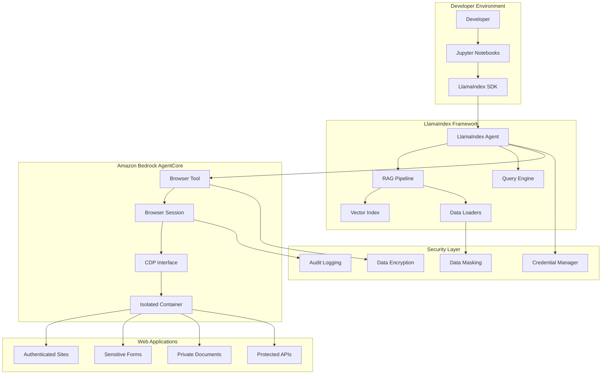
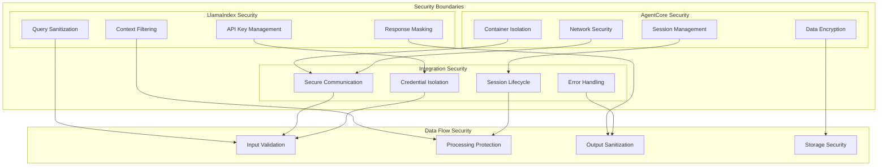

# Design Document

## Overview

This design document outlines the architecture and implementation approach for a comprehensive tutorial demonstrating how LlamaIndex agents handle sensitive information when integrated with Amazon Bedrock AgentCore Browser Tool. The tutorial will showcase production-ready patterns for secure data handling, RAG applications with sensitive web data, and enterprise-grade security practices.

## Architecture

### High-Level Integration Architecture



### Security Architecture



## Components and Interfaces

### 1. LlamaIndex Agent Integration Component

**Purpose**: Manages the integration between LlamaIndex agents and AgentCore Browser Tool

**Key Interfaces**:
- `LlamaIndexAgentCoreClient`: Main integration client
- `SecureBrowserLoader`: Data loader for web content via AgentCore
- `SensitiveDataHandler`: Handles PII and sensitive information
- `SessionManager`: Manages browser session lifecycle

**Core Methods**:
```python
class LlamaIndexAgentCoreClient:
    def __init__(self, region: str, llm_config: dict)
    def create_secure_session(self) -> BrowserSession
    def load_web_data(self, url: str, credentials: dict) -> Document
    def process_sensitive_form(self, form_data: dict) -> FormResult
    def extract_authenticated_content(self, site_config: dict) -> List[Document]
```

### 2. Secure Data Loading Component

**Purpose**: Safely loads and processes web data through AgentCore's secure browser environment

**Key Interfaces**:
- `SecureWebLoader`: Loads web content with security controls
- `AuthenticatedLoader`: Handles login and authenticated content
- `FormDataExtractor`: Extracts data from sensitive forms
- `DocumentSanitizer`: Sanitizes extracted content

**Core Methods**:
```python
class SecureWebLoader:
    def load_with_credentials(self, url: str, auth_config: dict) -> List[Document]
    def extract_form_data(self, form_selector: str) -> dict
    def sanitize_content(self, content: str) -> str
    def mask_sensitive_data(self, data: dict) -> dict
```

### 3. RAG Pipeline Security Component

**Purpose**: Ensures RAG operations maintain security when processing sensitive web data

**Key Interfaces**:
- `SecureRAGPipeline`: RAG pipeline with security controls
- `SensitiveContextManager`: Manages sensitive context in queries
- `SecureVectorStore`: Vector storage with encryption
- `QuerySanitizer`: Sanitizes queries and responses

**Core Methods**:
```python
class SecureRAGPipeline:
    def ingest_secure_documents(self, documents: List[Document]) -> None
    def query_with_context_filtering(self, query: str) -> Response
    def sanitize_response(self, response: str) -> str
    def audit_query_operation(self, query: str, response: str) -> None
```

### 4. Session Management Component

**Purpose**: Manages AgentCore browser sessions for LlamaIndex operations

**Key Interfaces**:
- `SessionPool`: Manages multiple browser sessions
- `SessionHealthMonitor`: Monitors session health
- `SessionCleanup`: Handles session cleanup and resource management
- `SessionAudit`: Audits session activities

**Core Methods**:
```python
class SessionPool:
    def get_session(self, session_id: str = None) -> BrowserSession
    def release_session(self, session_id: str) -> None
    def cleanup_expired_sessions(self) -> None
    def monitor_session_health(self) -> dict
```

## Data Models

### 1. Secure Document Model

```python
@dataclass
class SecureDocument:
    """Document with security metadata and controls."""
    content: str
    metadata: dict
    sensitivity_level: SensitivityLevel
    source_url: str
    extraction_timestamp: datetime
    session_id: str
    sanitization_applied: bool
    audit_trail: List[AuditEvent]
    
    def mask_sensitive_content(self) -> 'SecureDocument'
    def apply_data_protection(self) -> 'SecureDocument'
    def generate_audit_event(self, action: str) -> AuditEvent
```

### 2. Browser Session Configuration

```python
@dataclass
class BrowserSessionConfig:
    """Configuration for AgentCore browser sessions."""
    region: str
    session_timeout: int
    enable_observability: bool
    security_level: SecurityLevel
    credential_config: CredentialConfig
    network_isolation: bool
    screenshot_redaction: bool
    audit_logging: bool
    
    def validate_security_settings(self) -> bool
    def generate_session_params(self) -> dict
```

### 3. Sensitive Data Classification

```python
class SensitivityLevel(Enum):
    """Classification levels for sensitive data."""
    PUBLIC = "public"
    INTERNAL = "internal"
    CONFIDENTIAL = "confidential"
    RESTRICTED = "restricted"
    
class DataType(Enum):
    """Types of sensitive data."""
    PII = "personally_identifiable_information"
    FINANCIAL = "financial_information"
    HEALTH = "health_information"
    CREDENTIALS = "authentication_credentials"
    BUSINESS = "business_confidential"
```

### 4. Authentication Configuration

```python
@dataclass
class AuthenticationConfig:
    """Configuration for authenticated web access."""
    auth_type: AuthType
    credentials: dict
    session_persistence: bool
    multi_factor_auth: bool
    credential_rotation: bool
    
    def encrypt_credentials(self) -> dict
    def validate_auth_config(self) -> bool
    def generate_auth_headers(self) -> dict
```

## Error Handling

### 1. Security-First Error Handling

**Principle**: All errors must be handled without exposing sensitive information

**Error Categories**:
- Authentication failures
- Session timeouts
- Data extraction errors
- Network connectivity issues
- Permission denied errors

**Error Handling Pattern**:
```python
class SecureErrorHandler:
    """Error handler that protects sensitive information."""
    
    def handle_authentication_error(self, error: Exception) -> SecureError:
        """Handle auth errors without exposing credentials."""
        return SecureError(
            error_type="authentication_failed",
            message="Authentication failed - check credentials",
            details=None,  # Never expose credential details
            timestamp=datetime.utcnow(),
            session_id=self.session_id
        )
    
    def handle_data_extraction_error(self, error: Exception, url: str) -> SecureError:
        """Handle extraction errors without exposing sensitive data."""
        sanitized_url = self.sanitize_url(url)
        return SecureError(
            error_type="data_extraction_failed",
            message=f"Failed to extract data from {sanitized_url}",
            details={"error_code": "EXTRACTION_FAILED"},
            timestamp=datetime.utcnow(),
            session_id=self.session_id
        )
```

### 2. Retry and Recovery Patterns

**Retry Strategy**:
- Exponential backoff for transient failures
- Circuit breaker for persistent failures
- Session recreation for session-related failures
- Credential refresh for authentication failures

**Recovery Patterns**:
```python
class SecureRetryHandler:
    """Retry handler with security considerations."""
    
    async def retry_with_session_recreation(self, operation: Callable) -> Any:
        """Retry operation with fresh session if needed."""
        for attempt in range(self.max_retries):
            try:
                return await operation()
            except SessionExpiredError:
                await self.recreate_session()
            except AuthenticationError:
                await self.refresh_credentials()
            except Exception as e:
                if attempt == self.max_retries - 1:
                    raise SecureError.from_exception(e)
                await self.exponential_backoff(attempt)
```

## Testing Strategy

### 1. Security Testing Approach

**Test Categories**:
- Credential security tests
- Data masking validation
- Session isolation verification
- Error handling security
- Audit trail completeness

**Security Test Framework**:
```python
class SecurityTestSuite:
    """Comprehensive security testing for LlamaIndex-AgentCore integration."""
    
    def test_credential_isolation(self):
        """Verify credentials are never exposed in logs or errors."""
        pass
    
    def test_data_masking(self):
        """Verify sensitive data is properly masked."""
        pass
    
    def test_session_isolation(self):
        """Verify sessions are properly isolated."""
        pass
    
    def test_audit_completeness(self):
        """Verify all sensitive operations are audited."""
        pass
```

### 2. Integration Testing

**Test Scenarios**:
- End-to-end RAG pipeline with sensitive data
- Multi-session concurrent operations
- Error recovery and session recreation
- Performance under load
- Compliance validation

**Mock Services**:
- Mock sensitive web applications
- Simulated authentication flows
- Test data with known PII patterns
- Controlled error scenarios

### 3. Performance Testing

**Performance Metrics**:
- Session creation time
- Data extraction throughput
- Query response time
- Memory usage patterns
- Concurrent session limits

**Load Testing Scenarios**:
- Multiple concurrent LlamaIndex agents
- High-volume data extraction
- Long-running sessions
- Session pool exhaustion
- Resource cleanup efficiency

## Tutorial Structure Design

### 1. Progressive Learning Path

**Notebook 1: LlamaIndex-AgentCore Secure Integration**
- Basic integration setup
- Secure session creation
- Simple web data loading
- Security verification

**Notebook 2: Sensitive Data Handling with RAG**
- PII detection and masking
- Secure document ingestion
- Context-aware querying
- Response sanitization

**Notebook 3: Authenticated Web Data Access**
- Secure login automation
- Session management
- Multi-page workflows
- Credential protection

**Notebook 4: Production RAG Patterns**
- Scalable architecture patterns
- Monitoring and observability
- Error handling and recovery
- Compliance and auditing

### 2. Supporting Examples

**Real-World Scenarios**:
- Healthcare document processing
- Financial data extraction
- Legal document analysis
- Customer support automation
- HR information processing

**Security Demonstrations**:
- PII masking examples
- Credential rotation patterns
- Session isolation verification
- Audit trail generation
- Compliance reporting

### 3. Architecture Documentation

**Visual Diagrams**:
- Integration architecture
- Security flow diagrams
- Data protection mechanisms
- Session lifecycle management
- Error handling patterns

**Technical Specifications**:
- API reference documentation
- Configuration examples
- Security best practices
- Troubleshooting guides
- Performance optimization

## Implementation Considerations

### 1. Security Requirements

**Data Protection**:
- All sensitive data must be encrypted in transit and at rest
- PII must be detected and masked automatically
- Credentials must never be logged or exposed
- Session data must be isolated and cleaned up

**Access Control**:
- Role-based access to sensitive operations
- Audit logging for all sensitive activities
- Session-based access controls
- Credential rotation support

### 2. Performance Requirements

**Scalability**:
- Support for concurrent sessions
- Efficient session pooling
- Resource cleanup automation
- Load balancing across regions

**Reliability**:
- Automatic error recovery
- Session health monitoring
- Graceful degradation
- Circuit breaker patterns

### 3. Compliance Requirements

**Audit Trail**:
- Complete operation logging
- Sensitive data access tracking
- Error and exception logging
- Performance metrics collection

**Data Governance**:
- Data retention policies
- Secure data disposal
- Access control enforcement
- Compliance reporting

## Deployment Architecture

### 1. Development Environment

**Local Setup**:
- Jupyter notebook environment
- Local credential management
- Development-specific configurations
- Debug logging and monitoring

**Dependencies**:
- LlamaIndex framework
- AgentCore Browser Client SDK
- AWS SDK and credentials
- Security and encryption libraries

### 2. Production Environment

**AWS Integration**:
- AWS Secrets Manager for credentials
- CloudWatch for monitoring and logging
- IAM roles for access control
- VPC configuration for network security

**Scalability Features**:
- Auto-scaling session pools
- Load balancing across regions
- Resource monitoring and alerting
- Cost optimization patterns

### 3. Security Infrastructure

**Encryption**:
- TLS for all communications
- Encryption at rest for sensitive data
- Key management through AWS KMS
- Certificate management

**Monitoring**:
- Security event monitoring
- Anomaly detection
- Compliance reporting
- Incident response automation