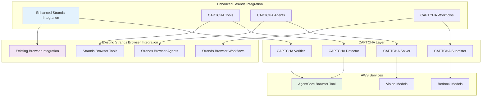

# Design Document

## Overview

This design outlines the extension of the existing Strands browser tool integration to include production-ready CAPTCHA handling capabilities. This integration will seamlessly add CAPTCHA detection, solving, and submission features to the current Strands AgentCore Browser Tool integration while maintaining compatibility with existing functionality.

## Architecture

### Integration Structure
```
03-integrations/bedrock-agentcore-browser-tool/agentic-frameworks/captcha-handling/strands-agents/
├── src/
│   ├── strands_captcha/
│   │   ├── __init__.py
│   │   ├── tools/
│   │   │   ├── captcha_detection_tool.py
│   │   │   ├── captcha_solving_tool.py
│   │   │   └── captcha_workflow_tool.py
│   │   ├── agents/
│   │   │   ├── captcha_enhanced_agent.py
│   │   │   └── browser_captcha_agent.py
│   │   ├── workflows/
│   │   │   ├── captcha_workflow.py
│   │   │   └── browser_automation_workflow.py
│   │   ├── integrations/
│   │   │   ├── existing_browser_tool.py
│   │   │   └── strands_extensions.py
│   │   └── utils/
│   │       ├── captcha_utils.py
│   │       └── browser_utils.py
├── examples/
│   ├── enhanced_browser_agent.py
│   ├── captcha_workflow_example.py
│   └── production_deployment.py
├── tests/
│   ├── test_captcha_tools.py
│   ├── test_agent_integration.py
│   └── test_workflow_integration.py
├── docs/
│   ├── README.md
│   ├── INTEGRATION_GUIDE.md
│   └── MIGRATION_GUIDE.md
├── requirements.txt
└── setup.py
```

### Component Architecture


## Components and Interfaces

### 1. Enhanced Strands CAPTCHA Tools

#### CAPTCHA Detection Tool Extension
```python
from strands import Tool, ToolResult
from strands.browser import BrowserTool
from typing import Dict, Any, Optional, List
import asyncio

class StrandsCaptchaDetectionTool(Tool):
    """Enhanced Strands tool for CAPTCHA detection that extends existing browser functionality"""
    
    name = "enhanced_captcha_detector"
    description = "Detects CAPTCHAs on web pages and integrates with existing Strands browser tools"
    
    def __init__(self, existing_browser_tool: BrowserTool = None, **kwargs):
        super().__init__(**kwargs)
        self.browser_tool = existing_browser_tool
        self.detection_strategies = self._initialize_detection_strategies()
    
    async def execute(self, page_url: str = None, use_current_page: bool = True, **kwargs) -> ToolResult:
        """Execute CAPTCHA detection with Strands integration"""
        try:
            # Use existing browser session if available
            if use_current_page and self.browser_tool:
                current_url = await self.browser_tool.get_current_url()
                target_url = current_url if current_url else page_url
            else:
                target_url = page_url
            
            if not target_url:
                return ToolResult(
                    success=False,
                    error="No URL provided and no current page available",
                    message="CAPTCHA detection requires a target URL"
                )
            
            # Perform CAPTCHA detection
            detection_result = await self._detect_captcha_with_strands(target_url)
            
            return ToolResult(
                success=True,
                data=detection_result,
                message=f"CAPTCHA detection completed for {target_url}"
            )
        
        except Exception as e:
            return ToolResult(
                success=False,
                error=str(e),
                message=f"CAPTCHA detection failed: {e}"
            )
    
    async def _detect_captcha_with_strands(self, url: str) -> Dict[str, Any]:
        """Internal method using Strands browser integration"""
        
        # Get page content using existing Strands browser tool
        if self.browser_tool:
            page_content = await self.browser_tool.get_page_content()
            screenshot = await self.browser_tool.take_screenshot()
        else:
            # Fallback to direct browser access
            page_content, screenshot = await self._direct_browser_access(url)
        
        # Apply detection strategies
        for strategy in self.detection_strategies:
            result = await strategy.detect(page_content, screenshot)
            if result.found:
                return {
                    "captcha_found": True,
                    "captcha_type": result.captcha_type,
                    "element_selector": result.element_selector,
                    "confidence_score": result.confidence_score,
                    "screenshot_path": screenshot,
                    "detection_method": strategy.name,
                    "metadata": result.metadata
                }
        
        return {
            "captcha_found": False,
            "captcha_type": None,
            "message": "No CAPTCHA detected on page"
        }

class StrandsCaptchaSolvingTool(Tool):
    """Enhanced Strands tool for CAPTCHA solving using Bedrock integration"""
    
    name = "enhanced_captcha_solver"
    description = "Solves CAPTCHAs using AWS Bedrock models with Strands integration"
    
    def __init__(self, bedrock_client=None, **kwargs):
        super().__init__(**kwargs)
        self.bedrock_client = bedrock_client
        self.vision_model = "anthropic.claude-3-sonnet-20240229-v1:0"
    
    async def execute(self, captcha_data: Dict[str, Any], **kwargs) -> ToolResult:
        """Execute CAPTCHA solving with Strands integration"""
        try:
            if not captcha_data.get("captcha_found"):
                return ToolResult(
                    success=False,
                    error="No CAPTCHA data provided",
                    message="CAPTCHA solving requires detection data"
                )
            
            # Solve CAPTCHA using appropriate method
            solution = await self._solve_captcha_with_strands(captcha_data)
            
            return ToolResult(
                success=True,
                data=solution,
                message="CAPTCHA solved successfully"
            )
        
        except Exception as e:
            return ToolResult(
                success=False,
                error=str(e),
                message=f"CAPTCHA solving failed: {e}"
            )
    
    async def _solve_captcha_with_strands(self, captcha_data: Dict[str, Any]) -> Dict[str, Any]:
        """Internal method for solving CAPTCHA with Strands patterns"""
        
        captcha_type = captcha_data.get("captcha_type")
        screenshot_path = captcha_data.get("screenshot_path")
        
        # Use appropriate solving strategy based on CAPTCHA type
        if captcha_type == "text":
            solution = await self._solve_text_captcha(screenshot_path)
        elif captcha_type == "recaptcha":
            solution = await self._solve_recaptcha(captcha_data)
        elif captcha_type == "hcaptcha":
            solution = await self._solve_hcaptcha(captcha_data)
        else:
            solution = await self._solve_generic_captcha(captcha_data)
        
        return {
            "solution": solution.text,
            "solution_type": solution.type,
            "confidence_score": solution.confidence,
            "processing_time": solution.processing_time,
            "model_used": self.vision_model,
            "strands_compatible": True
        }
```

### 2. Enhanced Strands Agent Integration

#### CAPTCHA-Enhanced Browser Agent
```python
from strands import Agent, AgentConfig
from strands.browser import BrowserAgent
from strands.tools import ToolRegistry

class CaptchaEnhancedBrowserAgent(BrowserAgent):
    """Enhanced Strands browser agent with integrated CAPTCHA handling"""
    
    def __init__(self, config: AgentConfig, existing_tools: List[Tool] = None):
        super().__init__(config)
        
        # Preserve existing browser tools
        self.existing_tools = existing_tools or []
        
        # Add CAPTCHA tools to existing tool registry
        self._register_captcha_tools()
        
        # Enhance system prompt with CAPTCHA handling instructions
        self.system_prompt = self._build_enhanced_system_prompt()
    
    def _register_captcha_tools(self):
        """Register CAPTCHA tools while preserving existing functionality"""
        
        # Get existing browser tool if available
        existing_browser_tool = self._get_existing_browser_tool()
        
        # Create CAPTCHA tools that integrate with existing tools
        captcha_tools = [
            StrandsCaptchaDetectionTool(existing_browser_tool),
            StrandsCaptchaSolvingTool(),
            StrandsCaptchaSubmissionTool(existing_browser_tool),
            StrandsCaptchaVerificationTool(existing_browser_tool)
        ]
        
        # Register tools with agent
        for tool in captcha_tools:
            self.tool_registry.register(tool)
    
    def _get_existing_browser_tool(self) -> Optional[BrowserTool]:
        """Get existing browser tool from registry"""
        for tool in self.existing_tools:
            if isinstance(tool, BrowserTool):
                return tool
        return None
    
    def _build_enhanced_system_prompt(self) -> str:
        """Build enhanced system prompt that includes CAPTCHA handling"""
        base_prompt = super().get_system_prompt()
        
        captcha_instructions = """
        
        CAPTCHA HANDLING CAPABILITIES:
        You now have enhanced CAPTCHA handling capabilities integrated with your existing browser tools.
        
        When navigating websites and encountering CAPTCHAs:
        1. Use enhanced_captcha_detector to identify CAPTCHAs on the current page
        2. Use enhanced_captcha_solver to solve detected CAPTCHAs using AI vision models
        3. Use enhanced_captcha_submitter to submit solutions through browser automation
        4. Use enhanced_captcha_verifier to confirm successful CAPTCHA completion
        
        These tools work seamlessly with your existing browser automation capabilities.
        Always handle CAPTCHAs ethically and in compliance with website terms of service.
        
        If a CAPTCHA cannot be solved automatically, inform the user and suggest manual intervention.
        """
        
        return base_prompt + captcha_instructions
    
    async def navigate_with_captcha_handling(self, url: str, task: str, **kwargs) -> Dict[str, Any]:
        """Enhanced navigation with automatic CAPTCHA handling"""
        
        # Use existing navigation capabilities
        navigation_result = await super().navigate(url, **kwargs)
        
        # Check for CAPTCHAs after navigation
        captcha_check = await self._check_and_handle_captcha()
        
        # Execute the requested task
        task_result = await self.execute_task(task)
        
        return {
            "navigation_result": navigation_result,
            "captcha_handling": captcha_check,
            "task_result": task_result,
            "enhanced_features_used": True
        }
    
    async def _check_and_handle_captcha(self) -> Dict[str, Any]:
        """Check for and handle CAPTCHAs on current page"""
        
        # Detect CAPTCHA
        detection_tool = self.tool_registry.get("enhanced_captcha_detector")
        detection_result = await detection_tool.execute(use_current_page=True)
        
        if not detection_result.success or not detection_result.data.get("captcha_found"):
            return {"captcha_found": False, "action_taken": "none"}
        
        # Solve CAPTCHA
        solving_tool = self.tool_registry.get("enhanced_captcha_solver")
        solution_result = await solving_tool.execute(detection_result.data)
        
        if not solution_result.success:
            return {
                "captcha_found": True,
                "action_taken": "detection_only",
                "error": "Failed to solve CAPTCHA"
            }
        
        # Submit solution
        submission_tool = self.tool_registry.get("enhanced_captcha_submitter")
        submission_result = await submission_tool.execute(
            solution_data=solution_result.data,
            captcha_data=detection_result.data
        )
        
        return {
            "captcha_found": True,
            "action_taken": "full_handling",
            "success": submission_result.success,
            "captcha_type": detection_result.data.get("captcha_type")
        }
```

### 3. Enhanced Strands Workflow Integration

#### CAPTCHA-Aware Browser Workflow
```python
from strands.workflows import Workflow, WorkflowStep, WorkflowContext
from strands.browser.workflows import BrowserWorkflow

class CaptchaEnhancedBrowserWorkflow(BrowserWorkflow):
    """Enhanced Strands browser workflow with integrated CAPTCHA handling"""
    
    def __init__(self, **kwargs):
        super().__init__(**kwargs)
        
        # Add CAPTCHA handling steps to existing workflow
        self._enhance_workflow_with_captcha_steps()
    
    def _enhance_workflow_with_captcha_steps(self):
        """Add CAPTCHA handling steps to existing workflow"""
        
        # Insert CAPTCHA check step after navigation
        captcha_check_step = WorkflowStep(
            "check_captcha_after_navigation",
            self._check_captcha_step,
            dependencies=["navigate"]
        )
        
        # Insert CAPTCHA handling step when needed
        captcha_handling_step = WorkflowStep(
            "handle_captcha",
            self._handle_captcha_step,
            dependencies=["check_captcha_after_navigation"],
            conditional=lambda ctx: ctx.get("captcha_found", False)
        )
        
        # Add steps to workflow
        self.add_step(captcha_check_step)
        self.add_step(captcha_handling_step)
    
    async def _check_captcha_step(self, context: WorkflowContext) -> WorkflowContext:
        """Workflow step to check for CAPTCHAs"""
        
        current_url = context.get("current_url")
        
        # Use CAPTCHA detection tool
        detection_tool = self.get_tool("enhanced_captcha_detector")
        detection_result = await detection_tool.execute(
            page_url=current_url,
            use_current_page=True
        )
        
        if detection_result.success and detection_result.data.get("captcha_found"):
            context.set("captcha_found", True)
            context.set("captcha_data", detection_result.data)
        else:
            context.set("captcha_found", False)
        
        return context
    
    async def _handle_captcha_step(self, context: WorkflowContext) -> WorkflowContext:
        """Workflow step to handle detected CAPTCHAs"""
        
        captcha_data = context.get("captcha_data")
        
        try:
            # Solve CAPTCHA
            solving_tool = self.get_tool("enhanced_captcha_solver")
            solution_result = await solving_tool.execute(captcha_data)
            
            if not solution_result.success:
                context.set("captcha_error", "Failed to solve CAPTCHA")
                return context
            
            # Submit solution
            submission_tool = self.get_tool("enhanced_captcha_submitter")
            submission_result = await submission_tool.execute(
                solution_data=solution_result.data,
                captcha_data=captcha_data
            )
            
            if submission_result.success:
                context.set("captcha_handled", True)
                context.set("captcha_solution", solution_result.data)
            else:
                context.set("captcha_error", "Failed to submit CAPTCHA solution")
        
        except Exception as e:
            context.set("captcha_error", str(e))
        
        return context
    
    async def execute_enhanced_workflow(self, 
                                      url: str, 
                                      tasks: List[Dict[str, Any]], 
                                      **kwargs) -> Dict[str, Any]:
        """Execute enhanced workflow with CAPTCHA handling"""
        
        # Initialize context with enhanced capabilities
        context = WorkflowContext({
            "target_url": url,
            "tasks": tasks,
            "enhanced_captcha_enabled": True,
            **kwargs
        })
        
        # Execute workflow with CAPTCHA handling
        result = await self.execute(context)
        
        return {
            "workflow_completed": result.success,
            "captcha_encountered": result.context.get("captcha_found", False),
            "captcha_handled": result.context.get("captcha_handled", False),
            "tasks_completed": result.context.get("tasks_completed", []),
            "errors": result.context.get("errors", [])
        }

# Workflow orchestrator for complex CAPTCHA scenarios
class CaptchaWorkflowOrchestrator:
    """Orchestrator for managing complex CAPTCHA workflows in Strands"""
    
    def __init__(self):
        self.workflows = {
            "simple_captcha": SimpleCaptchaWorkflow(),
            "multi_step_captcha": MultiStepCaptchaWorkflow(),
            "complex_form_with_captcha": ComplexFormCaptchaWorkflow()
        }
    
    async def execute_captcha_workflow(self, 
                                     workflow_type: str, 
                                     context: WorkflowContext) -> Dict[str, Any]:
        """Execute appropriate CAPTCHA workflow based on complexity"""
        
        workflow = self.workflows.get(workflow_type)
        if not workflow:
            raise ValueError(f"Unknown CAPTCHA workflow type: {workflow_type}")
        
        # Execute workflow with enhanced context
        result = await workflow.execute(context)
        
        return {
            "workflow_type": workflow_type,
            "execution_result": result,
            "captcha_handling_summary": self._generate_captcha_summary(result)
        }
    
    def _generate_captcha_summary(self, result: Dict[str, Any]) -> Dict[str, Any]:
        """Generate summary of CAPTCHA handling activities"""
        
        return {
            "captchas_detected": result.get("captcha_count", 0),
            "captchas_solved": result.get("solved_count", 0),
            "success_rate": result.get("success_rate", 0.0),
            "total_processing_time": result.get("total_time", 0.0),
            "models_used": result.get("models_used", [])
        }
```

### 4. Integration with Existing Strands Browser Tool

#### Backward Compatibility Layer
```python
from strands.browser import BrowserTool as ExistingBrowserTool

class EnhancedBrowserTool(ExistingBrowserTool):
    """Enhanced browser tool that extends existing functionality with CAPTCHA handling"""
    
    def __init__(self, **kwargs):
        super().__init__(**kwargs)
        
        # Initialize CAPTCHA components
        self.captcha_detector = StrandsCaptchaDetectionTool(self)
        self.captcha_solver = StrandsCaptchaSolvingTool()
        self.captcha_enabled = True
    
    async def navigate(self, url: str, **kwargs) -> Dict[str, Any]:
        """Enhanced navigation with automatic CAPTCHA detection"""
        
        # Use existing navigation functionality
        navigation_result = await super().navigate(url, **kwargs)
        
        # Add CAPTCHA detection if enabled
        if self.captcha_enabled:
            captcha_result = await self._auto_detect_captcha()
            navigation_result["captcha_detection"] = captcha_result
        
        return navigation_result
    
    async def interact(self, element_selector: str, action: str, **kwargs) -> Dict[str, Any]:
        """Enhanced interaction with CAPTCHA awareness"""
        
        # Check for CAPTCHA before interaction
        if self.captcha_enabled:
            captcha_check = await self._check_for_captcha_interference(element_selector)
            if captcha_check.get("captcha_blocking"):
                # Handle CAPTCHA before proceeding
                captcha_handled = await self._handle_blocking_captcha(captcha_check)
                if not captcha_handled:
                    return {
                        "success": False,
                        "error": "CAPTCHA blocking interaction",
                        "captcha_data": captcha_check
                    }
        
        # Proceed with existing interaction functionality
        interaction_result = await super().interact(element_selector, action, **kwargs)
        
        # Check for CAPTCHA after interaction
        if self.captcha_enabled:
            post_interaction_captcha = await self._auto_detect_captcha()
            interaction_result["post_interaction_captcha"] = post_interaction_captcha
        
        return interaction_result
    
    async def _auto_detect_captcha(self) -> Dict[str, Any]:
        """Automatically detect CAPTCHA on current page"""
        
        detection_result = await self.captcha_detector.execute(use_current_page=True)
        
        return {
            "detection_attempted": True,
            "captcha_found": detection_result.success and detection_result.data.get("captcha_found", False),
            "captcha_data": detection_result.data if detection_result.success else None
        }
    
    def enable_captcha_handling(self):
        """Enable automatic CAPTCHA handling"""
        self.captcha_enabled = True
    
    def disable_captcha_handling(self):
        """Disable automatic CAPTCHA handling"""
        self.captcha_enabled = False

# Migration helper for existing Strands browser integrations
class CaptchaMigrationHelper:
    """Helper class for migrating existing Strands browser integrations to include CAPTCHA handling"""
    
    @staticmethod
    def enhance_existing_agent(agent: Agent) -> CaptchaEnhancedBrowserAgent:
        """Enhance existing Strands agent with CAPTCHA capabilities"""
        
        # Extract existing configuration
        config = agent.config
        existing_tools = agent.get_tools()
        
        # Create enhanced agent
        enhanced_agent = CaptchaEnhancedBrowserAgent(config, existing_tools)
        
        # Transfer existing state if possible
        if hasattr(agent, 'conversation_history'):
            enhanced_agent.conversation_history = agent.conversation_history
        
        return enhanced_agent
    
    @staticmethod
    def enhance_existing_workflow(workflow: Workflow) -> CaptchaEnhancedBrowserWorkflow:
        """Enhance existing Strands workflow with CAPTCHA capabilities"""
        
        # Create enhanced workflow
        enhanced_workflow = CaptchaEnhancedBrowserWorkflow()
        
        # Copy existing steps
        for step in workflow.steps:
            enhanced_workflow.add_step(step)
        
        # Add CAPTCHA enhancement
        enhanced_workflow._enhance_workflow_with_captcha_steps()
        
        return enhanced_workflow
```

## Data Models

### Enhanced Strands Schema Integration
```python
from strands.schemas import BaseSchema, ToolResult
from pydantic import BaseModel, Field
from typing import Optional, Dict, Any, List
from datetime import datetime

class EnhancedCaptchaDetectionResult(BaseSchema):
    """Enhanced CAPTCHA detection result schema for Strands integration"""
    
    captcha_found: bool = Field(description="Whether CAPTCHA was detected")
    captcha_type: Optional[str] = Field(description="Type of CAPTCHA detected")
    element_selector: Optional[str] = Field(description="CSS selector for CAPTCHA element")
    confidence_score: float = Field(description="Detection confidence score")
    screenshot_path: Optional[str] = Field(description="Path to CAPTCHA screenshot")
    page_url: str = Field(description="URL where CAPTCHA was detected")
    detection_timestamp: datetime = Field(description="When CAPTCHA was detected")
    strands_integration_version: str = Field(description="Version of Strands integration used")
    existing_browser_tool_used: bool = Field(description="Whether existing browser tool was used")

class EnhancedCaptchaSolutionResult(BaseSchema):
    """Enhanced CAPTCHA solution result schema for Strands integration"""
    
    solution: str = Field(description="CAPTCHA solution")
    solution_type: str = Field(description="Type of solution")
    confidence_score: float = Field(description="Solution confidence score")
    processing_time: float = Field(description="Time taken to solve CAPTCHA")
    model_used: str = Field(description="AI model used for solving")
    strands_compatible: bool = Field(description="Whether solution is compatible with Strands workflows")
    integration_metadata: Dict[str, Any] = Field(description="Integration-specific metadata")

class CaptchaWorkflowState(BaseSchema):
    """Enhanced workflow state schema for CAPTCHA handling in Strands"""
    
    workflow_id: str = Field(description="Unique workflow identifier")
    current_step: str = Field(description="Current workflow step")
    captcha_data: Optional[EnhancedCaptchaDetectionResult] = Field(description="CAPTCHA detection data")
    solution_data: Optional[EnhancedCaptchaSolutionResult] = Field(description="CAPTCHA solution data")
    existing_workflow_state: Dict[str, Any] = Field(description="State from existing Strands workflow")
    enhanced_features_active: bool = Field(description="Whether enhanced CAPTCHA features are active")
    compatibility_mode: bool = Field(description="Whether running in compatibility mode")
```

## Error Handling

### Enhanced Strands Error Integration
```python
from strands.exceptions import StrandsError, ToolError, WorkflowError

class EnhancedCaptchaError(StrandsError):
    """Enhanced CAPTCHA error that integrates with existing Strands error handling"""
    
    def __init__(self, message: str, error_code: str = None, 
                 original_error: Exception = None, 
                 compatibility_info: Dict = None):
        super().__init__(message)
        self.error_code = error_code
        self.original_error = original_error
        self.compatibility_info = compatibility_info or {}

class CaptchaIntegrationError(EnhancedCaptchaError):
    """Error during CAPTCHA integration with existing Strands tools"""
    pass

class CaptchaCompatibilityError(EnhancedCaptchaError):
    """Error related to compatibility with existing Strands functionality"""
    pass

# Enhanced error handling that preserves existing functionality
class RobustCaptchaIntegration:
    """Robust CAPTCHA integration with comprehensive error handling"""
    
    def __init__(self, existing_tools: List[Tool] = None):
        self.existing_tools = existing_tools or []
        self.compatibility_mode = self._detect_compatibility_mode()
        self.logger = self._setup_enhanced_logging()
    
    async def execute_with_fallback(self, 
                                   captcha_operation: Callable,
                                   fallback_operation: Callable = None,
                                   **kwargs) -> ToolResult:
        """Execute CAPTCHA operation with fallback to existing functionality"""
        
        try:
            # Attempt enhanced CAPTCHA operation
            result = await captcha_operation(**kwargs)
            
            if result.success:
                return result
            
            # If CAPTCHA operation fails, try fallback
            if fallback_operation and self.compatibility_mode:
                self.logger.warning("CAPTCHA operation failed, attempting fallback")
                fallback_result = await fallback_operation(**kwargs)
                
                return ToolResult(
                    success=fallback_result.success,
                    data=fallback_result.data,
                    message=f"Fallback operation used: {fallback_result.message}",
                    metadata={"fallback_used": True, "original_error": result.error}
                )
            
            return result
        
        except CaptchaIntegrationError as e:
            self.logger.error(f"CAPTCHA integration error: {e}")
            
            # Attempt to continue with existing functionality
            if fallback_operation:
                return await fallback_operation(**kwargs)
            
            return ToolResult(
                success=False,
                error=str(e),
                message="CAPTCHA integration failed and no fallback available"
            )
        
        except Exception as e:
            self.logger.error(f"Unexpected error in enhanced CAPTCHA integration: {e}")
            
            return ToolResult(
                success=False,
                error=str(e),
                message="Unexpected error in CAPTCHA integration"
            )
    
    def _detect_compatibility_mode(self) -> bool:
        """Detect if compatibility mode should be enabled"""
        
        # Check if existing tools are present
        if not self.existing_tools:
            return False
        
        # Check for specific existing tool types
        has_browser_tool = any(
            isinstance(tool, BrowserTool) for tool in self.existing_tools
        )
        
        return has_browser_tool
```

## Testing Strategy

### Enhanced Integration Testing
```python
import pytest
import asyncio
from unittest.mock import Mock, AsyncMock, patch
from strands.testing import StrandsTestCase

class TestEnhancedCaptchaIntegration(StrandsTestCase):
    """Test suite for enhanced CAPTCHA integration with existing Strands functionality"""
    
    def setUp(self):
        """Set up test environment with existing Strands tools"""
        super().setUp()
        
        # Create mock existing browser tool
        self.mock_existing_browser_tool = Mock(spec=BrowserTool)
        self.mock_existing_browser_tool.get_current_url = AsyncMock(return_value="https://test-site.com")
        self.mock_existing_browser_tool.get_page_content = AsyncMock(return_value="<html>test</html>")
        self.mock_existing_browser_tool.take_screenshot = AsyncMock(return_value="screenshot.png")
        
        # Create enhanced CAPTCHA tools
        self.captcha_detector = StrandsCaptchaDetectionTool(self.mock_existing_browser_tool)
        self.captcha_solver = StrandsCaptchaSolvingTool()
    
    async def test_integration_with_existing_browser_tool(self):
        """Test CAPTCHA detection integrates with existing browser tool"""
        
        # Mock CAPTCHA detection
        with patch.object(self.captcha_detector, '_detect_captcha_with_strands') as mock_detect:
            mock_detect.return_value = {
                "captcha_found": True,
                "captcha_type": "recaptcha",
                "confidence_score": 0.9
            }
            
            result = await self.captcha_detector.execute(use_current_page=True)
            
            # Verify existing browser tool was used
            self.mock_existing_browser_tool.get_current_url.assert_called_once()
            self.mock_existing_browser_tool.get_page_content.assert_called_once()
            
            # Verify result
            self.assertTrue(result.success)
            self.assertTrue(result.data["captcha_found"])
    
    async def test_enhanced_agent_preserves_existing_functionality(self):
        """Test enhanced agent preserves existing Strands agent functionality"""
        
        # Create mock existing agent
        mock_config = Mock()
        existing_tools = [self.mock_existing_browser_tool]
        
        enhanced_agent = CaptchaEnhancedBrowserAgent(mock_config, existing_tools)
        
        # Verify existing tools are preserved
        self.assertIn(self.mock_existing_browser_tool, enhanced_agent.existing_tools)
        
        # Verify CAPTCHA tools are added
        captcha_tools = [tool for tool in enhanced_agent.get_tools() 
                        if "captcha" in tool.name.lower()]
        self.assertGreater(len(captcha_tools), 0)
    
    async def test_workflow_enhancement_preserves_existing_steps(self):
        """Test workflow enhancement preserves existing workflow steps"""
        
        # Create mock existing workflow
        existing_workflow = Mock(spec=BrowserWorkflow)
        existing_workflow.steps = [
            WorkflowStep("navigate", Mock()),
            WorkflowStep("interact", Mock())
        ]
        
        # Enhance workflow
        enhanced_workflow = CaptchaMigrationHelper.enhance_existing_workflow(existing_workflow)
        
        # Verify existing steps are preserved
        existing_step_names = [step.name for step in existing_workflow.steps]
        enhanced_step_names = [step.name for step in enhanced_workflow.steps]
        
        for existing_name in existing_step_names:
            self.assertIn(existing_name, enhanced_step_names)
        
        # Verify CAPTCHA steps are added
        captcha_step_names = [name for name in enhanced_step_names if "captcha" in name.lower()]
        self.assertGreater(len(captcha_step_names), 0)
    
    async def test_backward_compatibility(self):
        """Test backward compatibility with existing Strands integrations"""
        
        # Test that enhanced tools can be disabled
        enhanced_tool = EnhancedBrowserTool()
        enhanced_tool.disable_captcha_handling()
        
        # Navigation should work without CAPTCHA detection
        with patch.object(enhanced_tool, 'navigate') as mock_navigate:
            mock_navigate.return_value = {"success": True, "url": "https://test-site.com"}
            
            result = await enhanced_tool.navigate("https://test-site.com")
            
            # Should not include CAPTCHA detection when disabled
            self.assertNotIn("captcha_detection", result)
    
    def test_migration_helper(self):
        """Test migration helper functionality"""
        
        # Create mock existing agent
        mock_agent = Mock(spec=Agent)
        mock_agent.config = Mock()
        mock_agent.get_tools.return_value = [self.mock_existing_browser_tool]
        
        # Enhance agent
        enhanced_agent = CaptchaMigrationHelper.enhance_existing_agent(mock_agent)
        
        # Verify enhancement
        self.assertIsInstance(enhanced_agent, CaptchaEnhancedBrowserAgent)
        self.assertEqual(enhanced_agent.config, mock_agent.config)
```

## Implementation Phases

### Phase 1: Core Integration (Week 1-2)
- Implement enhanced CAPTCHA tools that integrate with existing Strands browser tools
- Create backward compatibility layer
- Develop migration helpers for existing integrations
- Create basic integration tests

### Phase 2: Agent Enhancement (Week 3-4)
- Develop CaptchaEnhancedBrowserAgent that extends existing functionality
- Implement enhanced system prompts and tool registration
- Add agent-level CAPTCHA handling workflows
- Create agent integration tests

### Phase 3: Workflow Integration (Week 5-6)
- Implement CaptchaEnhancedBrowserWorkflow with existing workflow preservation
- Create workflow orchestration for complex CAPTCHA scenarios
- Add workflow-level error handling and recovery
- Develop workflow integration tests

### Phase 4: Production Features (Week 7-8)
- Add comprehensive compatibility testing
- Implement production-ready error handling and logging
- Create migration documentation and guides
- Add performance optimization and monitoring

## Dependencies

### Strands Framework Dependencies
```
strands-agents>=1.0.0
strands-browser>=1.0.0
strands-workflows>=1.0.0
```

### Enhanced Integration Dependencies
```
boto3>=1.34.0
bedrock-agentcore>=1.0.0
pillow>=10.0.0
```

### Development Dependencies
```
pytest>=7.0.0
pytest-asyncio>=0.21.0
black>=23.0.0
mypy>=1.0.0
```

## Migration and Compatibility

### Migration Guide
```python
class CaptchaMigrationGuide:
    """Guide for migrating existing Strands browser integrations"""
    
    @staticmethod
    def migrate_existing_agent(existing_agent_code: str) -> str:
        """Provide migration instructions for existing agent code"""
        
        migration_steps = [
            "1. Import CaptchaEnhancedBrowserAgent",
            "2. Replace BrowserAgent with CaptchaEnhancedBrowserAgent",
            "3. Pass existing tools to enhanced agent constructor",
            "4. Update system prompts to include CAPTCHA handling instructions",
            "5. Test enhanced functionality with existing workflows"
        ]
        
        return "\n".join(migration_steps)
    
    @staticmethod
    def compatibility_checklist() -> List[str]:
        """Provide compatibility checklist for existing integrations"""
        
        return [
            "✓ Existing browser tools continue to work unchanged",
            "✓ Existing workflows are preserved and enhanced",
            "✓ CAPTCHA features can be disabled for backward compatibility",
            "✓ Error handling preserves existing error patterns",
            "✓ Performance impact is minimal when CAPTCHA features are disabled"
        ]
```

This design provides a comprehensive enhancement to the existing Strands browser tool integration, adding CAPTCHA handling capabilities while maintaining full backward compatibility and preserving all existing functionality.