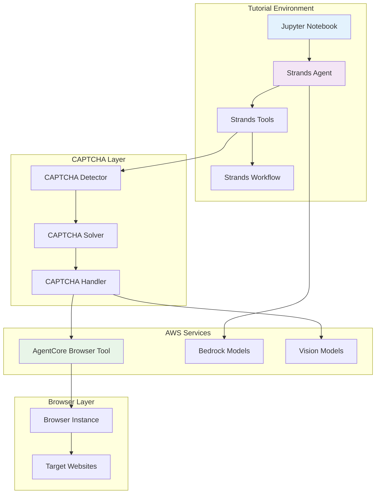

# Design Document

## Overview

This design outlines the creation of a comprehensive Strands Agents CAPTCHA handling tutorial that demonstrates how to integrate CAPTCHA detection and solving capabilities into Strands agents using AWS Bedrock AgentCore Browser Tool. The tutorial will be an educational Jupyter notebook that showcases Strands-native patterns and leverages the existing Strands architecture.

## Architecture

### Tutorial Structure
```
strands/
├── strands-captcha.ipynb
├── README.md
├── requirements.txt
├── strands_captcha_handler.py
├── strands_captcha_tools.py
└── examples/
    ├── basic_captcha_detection.py
    ├── agent_workflow_example.py
    └── production_example.py
```

### Component Architecture


## Components and Interfaces

### 1. Strands CAPTCHA Tools Integration

#### CAPTCHA Detection Tool
```python
from strands import Tool, ToolResult
from typing import Dict, Any, Optional

class CaptchaDetectionTool(Tool):
    """Strands tool for detecting CAPTCHAs on web pages"""
    
    name = "captcha_detector"
    description = "Detects various types of CAPTCHAs on web pages including reCAPTCHA, hCaptcha, and image-based CAPTCHAs"
    
    def __init__(self, browser_client):
        super().__init__()
        self.browser = browser_client
    
    async def execute(self, page_url: str, **kwargs) -> ToolResult:
        """Execute CAPTCHA detection on the specified page"""
        try:
            detection_result = await self._detect_captcha_elements(page_url)
            
            return ToolResult(
                success=True,
                data=detection_result,
                message=f"CAPTCHA detection completed for {page_url}"
            )
        except Exception as e:
            return ToolResult(
                success=False,
                error=str(e),
                message=f"CAPTCHA detection failed: {e}"
            )
    
    async def _detect_captcha_elements(self, page_url: str) -> Dict[str, Any]:
        """Internal method to detect CAPTCHA elements"""
        # Implementation details
        pass
```

#### CAPTCHA Solving Tool
```python
class CaptchaSolvingTool(Tool):
    """Strands tool for solving detected CAPTCHAs using AI models"""
    
    name = "captcha_solver"
    description = "Solves various types of CAPTCHAs using Bedrock vision and language models"
    
    def __init__(self, bedrock_client):
        super().__init__()
        self.bedrock = bedrock_client
    
    async def execute(self, captcha_data: Dict[str, Any], **kwargs) -> ToolResult:
        """Execute CAPTCHA solving for the provided CAPTCHA data"""
        try:
            solution = await self._solve_captcha(captcha_data)
            
            return ToolResult(
                success=True,
                data=solution,
                message="CAPTCHA solved successfully"
            )
        except Exception as e:
            return ToolResult(
                success=False,
                error=str(e),
                message=f"CAPTCHA solving failed: {e}"
            )
    
    async def _solve_captcha(self, captcha_data: Dict[str, Any]) -> Dict[str, Any]:
        """Internal method to solve CAPTCHA using AI models"""
        # Implementation details
        pass
```

### 2. Strands Agent Integration

#### CAPTCHA-Aware Strands Agent
```python
from strands import Agent, AgentConfig
from strands.tools import ToolRegistry

class CaptchaHandlingAgent(Agent):
    """Strands agent with integrated CAPTCHA handling capabilities"""
    
    def __init__(self, config: AgentConfig):
        super().__init__(config)
        
        # Register CAPTCHA tools
        self.tool_registry = ToolRegistry()
        self.tool_registry.register(CaptchaDetectionTool())
        self.tool_registry.register(CaptchaSolvingTool())
        
        # Configure agent with CAPTCHA handling instructions
        self.system_prompt = self._build_captcha_aware_prompt()
    
    def _build_captcha_aware_prompt(self) -> str:
        """Build system prompt that includes CAPTCHA handling instructions"""
        return """
        You are a web automation agent with CAPTCHA handling capabilities.
        
        When navigating websites, if you encounter CAPTCHAs:
        1. Use the captcha_detector tool to identify the CAPTCHA type and location
        2. Use the captcha_solver tool to solve the CAPTCHA
        3. Submit the solution and continue with your original task
        
        Always handle CAPTCHAs gracefully and provide clear feedback about the process.
        If a CAPTCHA cannot be solved, explain the situation and suggest alternatives.
        """
    
    async def navigate_with_captcha_handling(self, url: str, task: str) -> Dict[str, Any]:
        """Navigate to URL and complete task with automatic CAPTCHA handling"""
        
        prompt = f"""
        Navigate to {url} and complete the following task: {task}
        
        Handle any CAPTCHAs you encounter automatically using your available tools.
        Provide detailed feedback about each step of the process.
        """
        
        response = await self.process(prompt)
        return response
```

### 3. Strands Workflow Integration

#### CAPTCHA Handling Workflow
```python
from strands.workflows import Workflow, WorkflowStep, WorkflowContext

class CaptchaHandlingWorkflow(Workflow):
    """Strands workflow for automated CAPTCHA handling"""
    
    def __init__(self):
        super().__init__()
        self.steps = [
            WorkflowStep("detect_captcha", self.detect_captcha_step),
            WorkflowStep("solve_captcha", self.solve_captcha_step),
            WorkflowStep("submit_solution", self.submit_solution_step),
            WorkflowStep("verify_success", self.verify_success_step)
        ]
    
    async def detect_captcha_step(self, context: WorkflowContext) -> WorkflowContext:
        """Step 1: Detect CAPTCHA on the current page"""
        page_url = context.get("page_url")
        
        detection_tool = self.get_tool("captcha_detector")
        result = await detection_tool.execute(page_url)
        
        if result.success:
            context.set("captcha_data", result.data)
            context.set("captcha_found", True)
        else:
            context.set("captcha_found", False)
            context.set("error", result.error)
        
        return context
    
    async def solve_captcha_step(self, context: WorkflowContext) -> WorkflowContext:
        """Step 2: Solve the detected CAPTCHA"""
        if not context.get("captcha_found"):
            return context
        
        captcha_data = context.get("captcha_data")
        solving_tool = self.get_tool("captcha_solver")
        result = await solving_tool.execute(captcha_data)
        
        if result.success:
            context.set("solution", result.data)
            context.set("solution_ready", True)
        else:
            context.set("solution_ready", False)
            context.set("error", result.error)
        
        return context
    
    async def submit_solution_step(self, context: WorkflowContext) -> WorkflowContext:
        """Step 3: Submit the CAPTCHA solution"""
        if not context.get("solution_ready"):
            return context
        
        solution = context.get("solution")
        captcha_data = context.get("captcha_data")
        
        # Submit solution through browser automation
        success = await self._submit_captcha_solution(solution, captcha_data)
        context.set("submission_success", success)
        
        return context
    
    async def verify_success_step(self, context: WorkflowContext) -> WorkflowContext:
        """Step 4: Verify CAPTCHA was successfully solved"""
        if context.get("submission_success"):
            # Verify page has progressed past CAPTCHA
            verification_result = await self._verify_captcha_completion()
            context.set("captcha_completed", verification_result)
        
        return context
```

### 4. Multi-Modal CAPTCHA Analysis

#### Strands Vision Integration
```python
from strands.models import VisionModel
from strands.utils import ImageProcessor

class StrandsCaptchaAnalyzer:
    """CAPTCHA analysis using Strands vision capabilities"""
    
    def __init__(self):
        self.vision_model = VisionModel(
            model_name="anthropic.claude-3-sonnet-20240229-v1:0",
            provider="bedrock"
        )
        self.image_processor = ImageProcessor()
    
    async def analyze_image_captcha(self, image_data: bytes, captcha_type: str) -> Dict[str, Any]:
        """Analyze image CAPTCHA using Strands vision model"""
        
        # Preprocess image
        processed_image = self.image_processor.preprocess(image_data)
        
        # Create analysis prompt based on CAPTCHA type
        prompt = self._create_analysis_prompt(captcha_type)
        
        # Analyze with vision model
        analysis_result = await self.vision_model.analyze(
            image=processed_image,
            prompt=prompt
        )
        
        return self._parse_analysis_result(analysis_result)
    
    def _create_analysis_prompt(self, captcha_type: str) -> str:
        """Create appropriate analysis prompt based on CAPTCHA type"""
        prompts = {
            "text": "Extract and read the text shown in this CAPTCHA image.",
            "image_selection": "Identify which images match the given criteria in this CAPTCHA.",
            "recaptcha": "Analyze this reCAPTCHA and determine the appropriate response.",
            "math": "Solve the mathematical equation shown in this CAPTCHA."
        }
        
        return prompts.get(captcha_type, "Analyze this CAPTCHA and provide the solution.")
    
    def _parse_analysis_result(self, result: str) -> Dict[str, Any]:
        """Parse the vision model analysis result"""
        # Implementation to extract solution from model response
        pass
```

## Data Models

### Strands Schema Integration
```python
from strands.schemas import BaseSchema
from pydantic import BaseModel, Field
from typing import Optional, Dict, Any, List
from datetime import datetime

class CaptchaDetectionSchema(BaseSchema):
    """Schema for CAPTCHA detection results in Strands"""
    
    captcha_found: bool = Field(description="Whether a CAPTCHA was detected")
    captcha_type: Optional[str] = Field(description="Type of CAPTCHA detected")
    element_selector: Optional[str] = Field(description="CSS selector for CAPTCHA element")
    screenshot_data: Optional[bytes] = Field(description="Screenshot of CAPTCHA area")
    confidence_score: float = Field(description="Detection confidence score")
    page_url: str = Field(description="URL where CAPTCHA was detected")
    detection_timestamp: datetime = Field(description="When CAPTCHA was detected")

class CaptchaSolutionSchema(BaseSchema):
    """Schema for CAPTCHA solution results in Strands"""
    
    solution: str = Field(description="CAPTCHA solution")
    solution_type: str = Field(description="Type of solution (text, coordinates, selection)")
    confidence_score: float = Field(description="Solution confidence score")
    processing_time: float = Field(description="Time taken to solve CAPTCHA")
    model_used: str = Field(description="AI model used for solving")
    success: bool = Field(description="Whether solution was successful")

class CaptchaWorkflowState(BaseSchema):
    """Schema for CAPTCHA workflow state in Strands"""
    
    current_step: str = Field(description="Current workflow step")
    page_url: str = Field(description="Target page URL")
    captcha_data: Optional[CaptchaDetectionSchema] = Field(description="Detected CAPTCHA data")
    solution_data: Optional[CaptchaSolutionSchema] = Field(description="CAPTCHA solution data")
    error_message: Optional[str] = Field(description="Error message if any")
    retry_count: int = Field(default=0, description="Number of retry attempts")
    max_retries: int = Field(default=3, description="Maximum retry attempts")
```

## Error Handling

### Strands Error Integration
```python
from strands.exceptions import StrandsError, ToolError, WorkflowError

class CaptchaHandlingError(StrandsError):
    """Base exception for CAPTCHA handling in Strands"""
    pass

class CaptchaDetectionError(CaptchaHandlingError):
    """Error during CAPTCHA detection"""
    pass

class CaptchaSolvingError(CaptchaHandlingError):
    """Error during CAPTCHA solving"""
    pass

class CaptchaSubmissionError(CaptchaHandlingError):
    """Error during CAPTCHA solution submission"""
    pass

# Error handling in Strands tools
class RobustCaptchaTool(Tool):
    """Base class for robust CAPTCHA tools with error handling"""
    
    async def execute(self, *args, **kwargs) -> ToolResult:
        """Execute tool with comprehensive error handling"""
        try:
            result = await self._execute_core_logic(*args, **kwargs)
            return ToolResult(success=True, data=result)
        
        except CaptchaDetectionError as e:
            self.logger.error(f"CAPTCHA detection failed: {e}")
            return ToolResult(
                success=False,
                error=str(e),
                error_type="detection_error",
                retry_suggested=True
            )
        
        except CaptchaSolvingError as e:
            self.logger.error(f"CAPTCHA solving failed: {e}")
            return ToolResult(
                success=False,
                error=str(e),
                error_type="solving_error",
                retry_suggested=True
            )
        
        except Exception as e:
            self.logger.error(f"Unexpected error in CAPTCHA tool: {e}")
            return ToolResult(
                success=False,
                error=str(e),
                error_type="unexpected_error",
                retry_suggested=False
            )

# Retry mechanism for Strands workflows
class RetryableCaptchaWorkflow(CaptchaHandlingWorkflow):
    """CAPTCHA workflow with built-in retry logic"""
    
    async def execute_with_retry(self, context: WorkflowContext) -> WorkflowContext:
        """Execute workflow with retry logic"""
        max_retries = context.get("max_retries", 3)
        
        for attempt in range(max_retries + 1):
            try:
                result = await self.execute(context)
                if result.get("captcha_completed"):
                    return result
                
            except CaptchaHandlingError as e:
                if attempt == max_retries:
                    context.set("final_error", str(e))
                    break
                
                # Exponential backoff
                await asyncio.sleep(2 ** attempt)
                context.set("retry_count", attempt + 1)
        
        return context
```

## Testing Strategy

### Strands Testing Patterns
```python
import pytest
from strands.testing import StrandsTestCase, MockAgent, MockTool

class TestCaptchaIntegration(StrandsTestCase):
    """Test suite for Strands CAPTCHA integration"""
    
    def setUp(self):
        """Set up test environment"""
        self.mock_browser = self.create_mock_browser()
        self.captcha_detector = CaptchaDetectionTool(self.mock_browser)
        self.captcha_solver = CaptchaSolvingTool(self.create_mock_bedrock())
    
    async def test_captcha_detection_tool(self):
        """Test CAPTCHA detection tool functionality"""
        # Mock CAPTCHA detection scenario
        self.mock_browser.set_page_content(self.load_test_page("recaptcha_page.html"))
        
        result = await self.captcha_detector.execute("https://test-site.com")
        
        self.assertTrue(result.success)
        self.assertIn("captcha_type", result.data)
        self.assertEqual(result.data["captcha_type"], "recaptcha")
    
    async def test_captcha_solving_tool(self):
        """Test CAPTCHA solving tool functionality"""
        captcha_data = {
            "captcha_type": "text",
            "image_data": self.load_test_image("text_captcha.png")
        }
        
        result = await self.captcha_solver.execute(captcha_data)
        
        self.assertTrue(result.success)
        self.assertIn("solution", result.data)
    
    async def test_agent_integration(self):
        """Test agent integration with CAPTCHA tools"""
        agent = CaptchaHandlingAgent(self.create_test_config())
        
        response = await agent.navigate_with_captcha_handling(
            "https://test-site.com",
            "Fill out the contact form"
        )
        
        self.assertIn("captcha_handled", response)
    
    async def test_workflow_execution(self):
        """Test CAPTCHA workflow execution"""
        workflow = CaptchaHandlingWorkflow()
        context = WorkflowContext({"page_url": "https://test-site.com"})
        
        result = await workflow.execute(context)
        
        self.assertTrue(result.get("captcha_completed"))
```

### Tutorial Validation
1. **Tool Integration**: Verify tools work with Strands framework
2. **Agent Functionality**: Test agent can handle CAPTCHAs in workflows
3. **Error Scenarios**: Validate error handling and recovery
4. **Performance**: Test response times and resource usage

## Implementation Phases

### Phase 1: Core Tool Development
- Implement CAPTCHA detection tool for Strands
- Create CAPTCHA solving tool with Bedrock integration
- Test basic tool functionality

### Phase 2: Agent Integration
- Develop CAPTCHA-aware Strands agent
- Implement workflow integration
- Add multi-modal analysis capabilities

### Phase 3: Advanced Features
- Add comprehensive error handling
- Implement retry and recovery mechanisms
- Create performance optimization patterns

### Phase 4: Tutorial Creation
- Create comprehensive Jupyter notebook
- Add detailed explanations and examples
- Include Strands-specific best practices

## Dependencies

### Strands Framework
```
strands-agents>=1.0.0
strands-tools>=1.0.0
strands-workflows>=1.0.0
```

### AWS Integration
```
boto3>=1.34.0
bedrock-agentcore>=1.0.0
```

### Additional Dependencies
```
pillow>=10.0.0
jupyter>=1.0.0
asyncio>=3.9.0
```

## Integration Patterns

### Tool Composition in Strands
```python
from strands.tools import ToolComposer

class CaptchaToolSuite:
    """Composed suite of CAPTCHA handling tools for Strands"""
    
    def __init__(self):
        self.composer = ToolComposer()
        self.tools = self._create_tool_suite()
    
    def _create_tool_suite(self) -> List[Tool]:
        """Create comprehensive CAPTCHA tool suite"""
        return [
            CaptchaDetectionTool(),
            CaptchaSolvingTool(),
            CaptchaSubmissionTool(),
            CaptchaVerificationTool()
        ]
    
    def register_with_agent(self, agent: Agent):
        """Register all CAPTCHA tools with a Strands agent"""
        for tool in self.tools:
            agent.register_tool(tool)
```

### Workflow Orchestration
```python
class CaptchaOrchestrator:
    """Orchestrate CAPTCHA handling across Strands workflows"""
    
    def __init__(self):
        self.workflows = {
            "simple_captcha": SimpleCaptchaWorkflow(),
            "complex_captcha": ComplexCaptchaWorkflow(),
            "multi_step_captcha": MultiStepCaptchaWorkflow()
        }
    
    async def handle_captcha(self, captcha_type: str, context: WorkflowContext):
        """Route CAPTCHA handling to appropriate workflow"""
        workflow_name = self._select_workflow(captcha_type)
        workflow = self.workflows[workflow_name]
        
        return await workflow.execute(context)
```