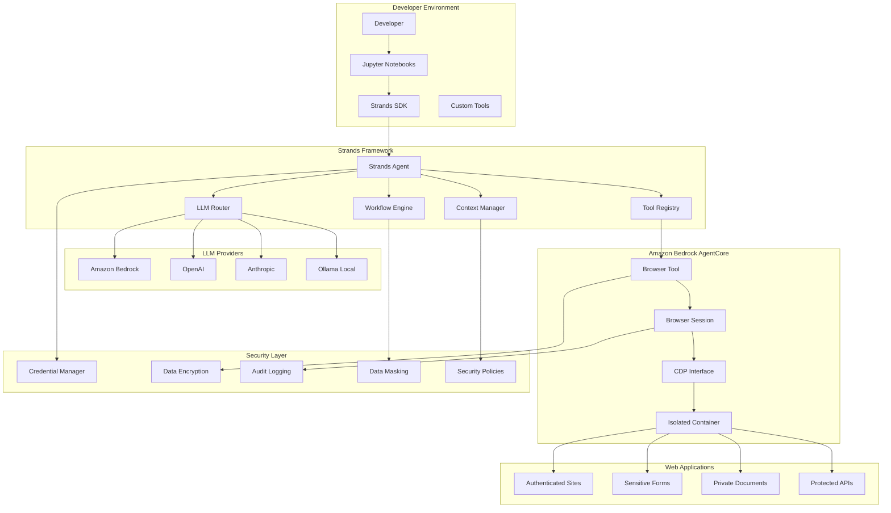
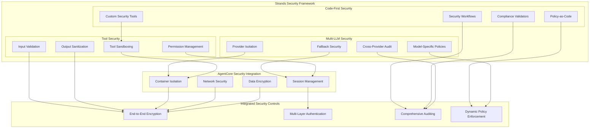

# Design Document

## Overview

This design document outlines the architecture and implementation approach for a comprehensive tutorial demonstrating how Strands agents handle sensitive information when integrated with Amazon Bedrock AgentCore Browser Tool. The tutorial will showcase Strands' code-first framework advantages, production-ready security patterns, and enterprise-grade browser automation workflows within AgentCore's managed infrastructure.

## Architecture

### High-Level Integration Architecture



### Strands-Specific Security Architecture



## Components and Interfaces

### 1. Strands Agent Core Component

**Purpose**: Manages Strands agents with AgentCore Browser Tool integration and multi-LLM support

**Key Interfaces**:
- `StrandsAgentCoreClient`: Main integration client with multi-LLM routing
- `SecureBrowserTool`: Custom Strands tool for AgentCore browser operations
- `MultiLLMSecurityManager`: Manages security across different LLM providers
- `WorkflowSecurityOrchestrator`: Orchestrates secure multi-step workflows

**Core Methods**:
```python
class StrandsAgentCoreClient:
    def __init__(self, region: str, llm_configs: Dict[str, dict], security_config: dict)
    def create_secure_agent(self, agent_config: dict) -> StrandsAgent
    def register_browser_tool(self, tool_config: dict) -> SecureBrowserTool
    def execute_secure_workflow(self, workflow: Workflow) -> WorkflowResult
    def switch_llm_provider(self, provider: str, context: dict) -> None
    def audit_agent_operations(self, agent_id: str) -> AuditReport
```

### 2. Custom Security Tools Component

**Purpose**: Implements Strands-specific security tools for sensitive data handling

**Key Interfaces**:
- `PIIDetectionTool`: Custom tool for PII detection and masking
- `CredentialInjectionTool`: Secure credential management tool
- `ComplianceValidationTool`: Industry-specific compliance validation
- `AuditTrailTool`: Comprehensive audit logging tool

**Core Methods**:
```python
class PIIDetectionTool(StrandsTool):
    def detect_pii(self, content: str, detection_config: dict) -> PIIResult
    def mask_sensitive_data(self, data: dict, masking_rules: dict) -> dict
    def classify_sensitivity(self, content: str) -> SensitivityClassification
    def generate_redaction_report(self, original: str, redacted: str) -> RedactionReport

class CredentialInjectionTool(StrandsTool):
    def inject_credentials(self, session: BrowserSession, creds: dict) -> None
    def rotate_credentials(self, credential_id: str) -> CredentialRotationResult
    def validate_credential_security(self, creds: dict) -> ValidationResult
    def audit_credential_usage(self, session_id: str) -> CredentialAudit
```

### 3. Multi-LLM Security Manager Component

**Purpose**: Manages security across different LLM providers within Strands framework

**Key Interfaces**:
- `LLMSecurityRouter`: Routes requests based on security requirements
- `ProviderSecurityPolicy`: Manages provider-specific security policies
- `CrossProviderAuditor`: Audits operations across multiple providers
- `FallbackSecurityHandler`: Handles security failures with fallback providers

**Core Methods**:
```python
class LLMSecurityRouter:
    def route_secure_request(self, request: LLMRequest, security_level: str) -> LLMProvider
    def validate_provider_security(self, provider: str, requirements: dict) -> bool
    def enforce_data_residency(self, request: LLMRequest) -> LLMProvider
    def audit_provider_selection(self, request: LLMRequest, provider: str) -> None

class ProviderSecurityPolicy:
    def get_security_policy(self, provider: str, data_type: str) -> SecurityPolicy
    def validate_request_compliance(self, request: LLMRequest, policy: SecurityPolicy) -> bool
    def apply_data_protection(self, request: LLMRequest, policy: SecurityPolicy) -> LLMRequest
    def generate_compliance_report(self, provider: str, timeframe: str) -> ComplianceReport
```

### 4. Workflow Security Orchestrator Component

**Purpose**: Orchestrates secure multi-step workflows with AgentCore browser sessions

**Key Interfaces**:
- `SecureWorkflowEngine`: Executes workflows with security controls
- `WorkflowStateManager`: Manages sensitive state across workflow steps
- `SessionPoolManager`: Manages AgentCore session pools for workflows
- `WorkflowAuditor`: Audits workflow execution and security events

**Core Methods**:
```python
class SecureWorkflowEngine:
    def execute_workflow(self, workflow: SecureWorkflow) -> WorkflowResult
    def validate_workflow_security(self, workflow: SecureWorkflow) -> ValidationResult
    def handle_workflow_errors(self, error: Exception, context: dict) -> ErrorHandlingResult
    def checkpoint_workflow_state(self, workflow_id: str, state: dict) -> None

class WorkflowStateManager:
    def store_sensitive_state(self, workflow_id: str, state: dict) -> None
    def retrieve_secure_state(self, workflow_id: str) -> dict
    def encrypt_workflow_data(self, data: dict) -> EncryptedData
    def cleanup_workflow_state(self, workflow_id: str) -> None
```

## Data Models

### 1. Strands Agent Configuration

```python
@dataclass
class StrandsAgentConfig:
    """Configuration for Strands agents with security controls."""
    agent_id: str
    llm_providers: Dict[str, LLMConfig]
    security_level: SecurityLevel
    tools: List[ToolConfig]
    workflow_config: WorkflowConfig
    audit_config: AuditConfig
    compliance_requirements: List[ComplianceRequirement]
    
    def validate_security_config(self) -> bool
    def generate_agent_instance(self) -> StrandsAgent
    def apply_security_policies(self) -> None
```

### 2. Multi-LLM Security Configuration

```python
@dataclass
class MultiLLMSecurityConfig:
    """Security configuration for multiple LLM providers."""
    provider_policies: Dict[str, ProviderSecurityPolicy]
    data_residency_rules: Dict[str, str]
    fallback_chain: List[str]
    cross_provider_audit: bool
    encryption_requirements: Dict[str, EncryptionConfig]
    compliance_mappings: Dict[str, List[ComplianceRequirement]]
    
    def validate_provider_compliance(self, provider: str) -> bool
    def get_security_policy(self, provider: str, data_type: str) -> SecurityPolicy
    def enforce_data_residency(self, request: LLMRequest) -> str
```

### 3. Secure Workflow Definition

```python
@dataclass
class SecureWorkflow:
    """Workflow definition with security controls."""
    workflow_id: str
    steps: List[WorkflowStep]
    security_checkpoints: List[SecurityCheckpoint]
    error_handling: ErrorHandlingConfig
    audit_requirements: AuditConfig
    session_requirements: SessionConfig
    data_protection_rules: List[DataProtectionRule]
    
    def validate_workflow_security(self) -> ValidationResult
    def generate_execution_plan(self) -> ExecutionPlan
    def apply_security_controls(self) -> None
```

### 4. Custom Tool Security Model

```python
@dataclass
class SecureToolConfig:
    """Configuration for secure Strands tools."""
    tool_id: str
    tool_class: Type[StrandsTool]
    permissions: List[Permission]
    input_validators: List[InputValidator]
    output_sanitizers: List[OutputSanitizer]
    audit_level: AuditLevel
    sandbox_config: SandboxConfig
    
    def validate_tool_security(self) -> bool
    def create_tool_instance(self) -> StrandsTool
    def apply_sandboxing(self) -> None
```

## Error Handling

### 1. Multi-LLM Error Handling

**Principle**: Graceful degradation across LLM providers while maintaining security

**Error Categories**:
- Provider-specific failures
- Security policy violations
- Data residency violations
- Compliance requirement failures
- Cross-provider synchronization errors

**Error Handling Pattern**:
```python
class MultiLLMErrorHandler:
    """Error handler for multi-LLM environments with security focus."""
    
    def handle_provider_failure(self, provider: str, error: Exception) -> FallbackResult:
        """Handle provider failure with secure fallback."""
        # Sanitize error details
        sanitized_error = self.sanitize_error(error)
        
        # Find compliant fallback provider
        fallback_provider = self.find_compliant_fallback(provider, self.current_security_context)
        
        # Audit the failure and fallback
        self.audit_provider_failure(provider, sanitized_error, fallback_provider)
        
        return FallbackResult(
            fallback_provider=fallback_provider,
            error_details=sanitized_error,
            security_maintained=True
        )
    
    def handle_security_violation(self, violation: SecurityViolation) -> SecurityResponse:
        """Handle security policy violations."""
        # Log security violation without exposing sensitive data
        self.audit_security_violation(violation)
        
        # Apply security remediation
        remediation = self.apply_security_remediation(violation)
        
        # Notify security team if required
        if violation.severity >= SecuritySeverity.HIGH:
            self.notify_security_team(violation)
        
        return SecurityResponse(
            violation_handled=True,
            remediation_applied=remediation,
            continued_execution=violation.allow_continuation
        )
```

### 2. Workflow Error Recovery

**Recovery Strategies**:
- Checkpoint-based recovery for long-running workflows
- Session recreation with state preservation
- Partial workflow rollback with data protection
- Cross-provider failover with security validation

**Recovery Patterns**:
```python
class WorkflowErrorRecovery:
    """Workflow error recovery with security preservation."""
    
    async def recover_from_checkpoint(self, workflow_id: str, checkpoint_id: str) -> RecoveryResult:
        """Recover workflow from secure checkpoint."""
        # Retrieve encrypted checkpoint data
        checkpoint_data = await self.state_manager.retrieve_secure_checkpoint(checkpoint_id)
        
        # Validate checkpoint integrity
        if not self.validate_checkpoint_integrity(checkpoint_data):
            raise CheckpointCorruptionError("Checkpoint data integrity check failed")
        
        # Recreate secure session if needed
        if checkpoint_data.requires_session_recreation:
            session = await self.session_manager.create_secure_session(
                checkpoint_data.session_config
            )
        
        # Resume workflow with security controls
        return await self.resume_workflow_securely(workflow_id, checkpoint_data, session)
```

## Testing Strategy

### 1. Multi-LLM Security Testing

**Test Categories**:
- Provider-specific security validation
- Cross-provider data leakage prevention
- Fallback security maintenance
- Compliance requirement enforcement
- Performance across providers

**Security Test Framework**:
```python
class MultiLLMSecurityTestSuite:
    """Comprehensive security testing for multi-LLM Strands integration."""
    
    def test_provider_isolation(self):
        """Verify data isolation between LLM providers."""
        # Test that sensitive data from one provider doesn't leak to another
        pass
    
    def test_fallback_security(self):
        """Verify security is maintained during provider fallbacks."""
        # Test that fallback providers maintain same security level
        pass
    
    def test_cross_provider_audit(self):
        """Verify audit trail across multiple providers."""
        # Test that all provider interactions are properly audited
        pass
    
    def test_compliance_enforcement(self):
        """Verify compliance requirements are enforced per provider."""
        # Test that each provider meets specific compliance requirements
        pass
```

### 2. Custom Tool Security Testing

**Test Scenarios**:
- Tool sandboxing effectiveness
- Input validation and output sanitization
- Permission enforcement
- Audit trail completeness
- Error handling security

**Tool Testing Framework**:
```python
class CustomToolSecurityTestSuite:
    """Security testing for custom Strands tools."""
    
    def test_tool_sandboxing(self):
        """Verify tools are properly sandboxed."""
        # Test that tools cannot access unauthorized resources
        pass
    
    def test_input_validation(self):
        """Verify tool input validation."""
        # Test that malicious inputs are properly validated and rejected
        pass
    
    def test_output_sanitization(self):
        """Verify tool output sanitization."""
        # Test that sensitive data in outputs is properly sanitized
        pass
    
    def test_permission_enforcement(self):
        """Verify tool permission enforcement."""
        # Test that tools respect assigned permissions
        pass
```

### 3. Workflow Security Testing

**Test Scenarios**:
- End-to-end workflow security
- State management security
- Session lifecycle management
- Error recovery security
- Multi-agent coordination security

**Workflow Testing Framework**:
```python
class WorkflowSecurityTestSuite:
    """Security testing for Strands workflows."""
    
    def test_workflow_state_security(self):
        """Verify workflow state is securely managed."""
        # Test that sensitive state is encrypted and properly isolated
        pass
    
    def test_session_lifecycle_security(self):
        """Verify session lifecycle security."""
        # Test that sessions are properly created, managed, and cleaned up
        pass
    
    def test_multi_agent_isolation(self):
        """Verify isolation between multiple agents."""
        # Test that agents don't interfere with each other's sensitive data
        pass
```

## Tutorial Structure Design

### 1. Progressive Learning Path

**Notebook 1: Strands-AgentCore Secure Integration**
- Strands framework setup with AgentCore
- Multi-LLM configuration and security
- Custom tool registration
- Basic secure browser automation

**Notebook 2: Advanced Security Patterns**
- Custom PII detection tools
- Multi-provider security policies
- Credential management workflows
- Compliance validation patterns

**Notebook 3: Multi-Agent Secure Workflows**
- Workflow orchestration with security
- Session pool management
- State management across agents
- Error recovery with security preservation

**Notebook 4: Production Deployment Patterns**
- Enterprise security architecture
- Monitoring and observability
- Compliance reporting
- Performance optimization

### 2. Supporting Examples

**Code-First Security Examples**:
- Custom security tool implementations
- Policy-as-code examples
- Security workflow definitions
- Compliance validator implementations

**Multi-LLM Integration Examples**:
- Provider-specific security configurations
- Fallback chain implementations
- Cross-provider audit systems
- Data residency enforcement

**Real-World Scenarios**:
- Healthcare data processing with HIPAA compliance
- Financial services with PCI DSS requirements
- Legal document processing with confidentiality controls
- Government applications with security clearance requirements

### 3. Architecture Documentation

**Strands-Specific Diagrams**:
- Multi-LLM security architecture
- Custom tool security framework
- Workflow orchestration patterns
- Code-first security implementation

**Integration Specifications**:
- AgentCore browser tool integration
- Multi-provider security policies
- Custom tool development guidelines
- Workflow security best practices

## Implementation Considerations

### 1. Strands Framework Advantages

**Code-First Approach**:
- Custom security tool development
- Policy-as-code implementation
- Flexible workflow definitions
- Granular control over agent behavior

**Multi-LLM Support**:
- Provider-specific security policies
- Intelligent fallback mechanisms
- Cost optimization across providers
- Performance optimization per use case

**Extensibility**:
- Custom tool ecosystem
- Plugin architecture for security
- Integration with existing systems
- Domain-specific customizations

### 2. Security Requirements

**Enhanced Security Controls**:
- Multi-layer security validation
- Custom security tool development
- Policy-driven security enforcement
- Real-time security monitoring

**Compliance Flexibility**:
- Industry-specific compliance tools
- Custom validation frameworks
- Automated compliance reporting
- Audit trail customization

### 3. Performance Requirements

**Multi-LLM Optimization**:
- Intelligent provider routing
- Load balancing across providers
- Cost optimization strategies
- Performance monitoring per provider

**Workflow Efficiency**:
- Parallel execution capabilities
- State management optimization
- Session reuse strategies
- Resource pooling mechanisms

## Deployment Architecture

### 1. Development Environment

**Strands Development Setup**:
- Multi-LLM provider configuration
- Custom tool development environment
- Workflow testing framework
- Security validation tools

**Integration Testing**:
- AgentCore browser tool testing
- Multi-provider security testing
- Workflow orchestration testing
- Performance benchmarking

### 2. Production Environment

**Enterprise Deployment**:
- Multi-region LLM provider access
- Scalable workflow orchestration
- Enterprise security integration
- Compliance monitoring and reporting

**Monitoring and Observability**:
- Multi-provider performance monitoring
- Security event tracking
- Compliance dashboard
- Cost optimization analytics

### 3. Security Infrastructure

**Advanced Security Features**:
- Zero-trust architecture implementation
- Multi-layer encryption
- Advanced threat detection
- Automated incident response

**Compliance Infrastructure**:
- Industry-specific compliance frameworks
- Automated audit trail generation
- Real-time compliance monitoring
- Regulatory reporting automation