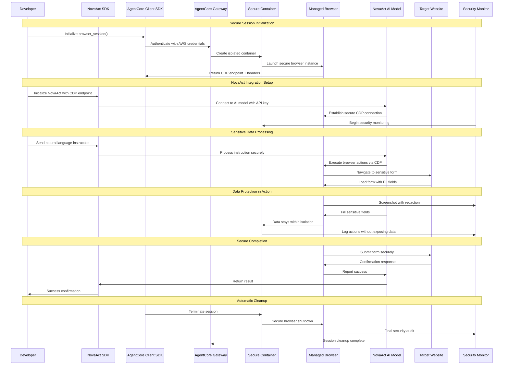
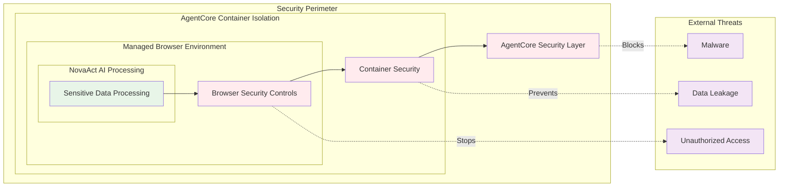

# NovaAct-AgentCore Security Flow Diagram

## Data Protection Flow

## Security Layers Visualization

## Security Control Points

### 1. Authentication Layer
- **NovaAct API Key**: Secure storage and transmission
- **AgentCore Credentials**: AWS IAM-based authentication
- **Session Tokens**: Temporary, scoped access tokens

### 2. Network Security
- **Encrypted Connections**: TLS encryption for all communications
- **VPC Isolation**: AgentCore runs in isolated VPC
- **CDP Security**: Secure Chrome DevTools Protocol connections

### 3. Container Isolation
- **Process Isolation**: Each session runs in separate container
- **Resource Limits**: Controlled CPU, memory, and network access
- **Filesystem Isolation**: Temporary, encrypted storage

### 4. Data Protection
- **Screenshot Redaction**: Automatic sensitive data masking
- **Memory Protection**: Secure memory handling and cleanup
- **Audit Logging**: Comprehensive logging without data exposure

### 5. AI Processing Security
- **Prompt Isolation**: NovaAct AI processing within secure boundaries
- **Model Security**: AI model runs with limited system access
- **Response Filtering**: Secure handling of AI-generated actions

## Threat Mitigation

| Threat | Mitigation | Implementation |
|--------|------------|----------------|
| Data Exfiltration | Container isolation + Network controls | AgentCore managed infrastructure |
| Credential Exposure | Secure storage + Temporary tokens | AWS Secrets Manager integration |
| Session Hijacking | Encrypted connections + Session validation | TLS + JWT tokens |
| Malware Injection | Isolated browser environment | Containerized browser instances |
| Unauthorized Access | Multi-layer authentication | NovaAct API + AgentCore IAM |
| Data Persistence | Automatic cleanup + Encrypted storage | Ephemeral containers |