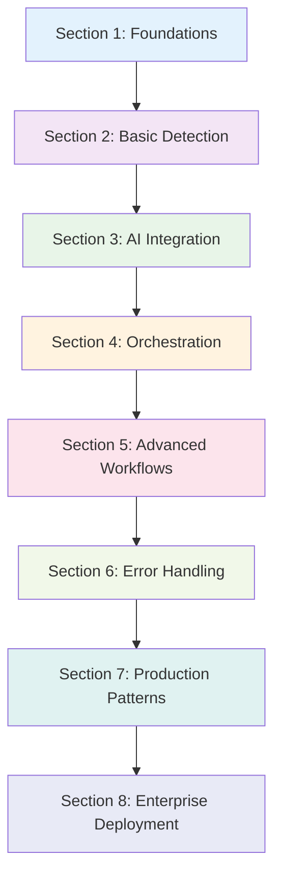

# Strands CAPTCHA Handling - Comprehensive Guide

This comprehensive guide consolidates all documentation for the Strands CAPTCHA handling tutorial, providing a single resource for learning, implementation, and integration.

## Table of Contents

1. [Tutorial Structure and Learning Path](#tutorial-structure-and-learning-path)
2. [Learning Objectives by Section](#learning-objectives-by-section)
3. [Strands Integration Patterns](#strands-integration-patterns)
4. [Ecosystem Integration](#ecosystem-integration)
5. [Best Practices and Guidelines](#best-practices-and-guidelines)
6. [Security Considerations](#security-considerations)
7. [Troubleshooting Guide](#troubleshooting-guide)
8. [Performance Optimization](#performance-optimization)
9. [Cross-References and Related Tutorials](#cross-references-and-related-tutorials)
10. [Summary and Next Steps](#summary-and-next-steps)

---

## 1. Tutorial Structure and Learning Path

### 📚 **8-Section Progressive Learning Structure**

The tutorial is organized into 8 progressive sections, each building upon previous concepts while introducing new Strands-specific patterns and capabilities.



### **Section Overview**

#### **📚 Section 1: Foundations and Architecture** (30-45 min)
**Learning Focus**: Understanding Strands three-layer architecture and service coordination
- Strands Agent orchestration layer (decision making and workflow coordination)
- AgentCore Browser Tool executor layer (secure browser automation)
- Bedrock AI analyzer layer (intelligent CAPTCHA analysis)
- Environment setup and service integration

#### **🔍 Section 2: Basic CAPTCHA Detection** (45-60 min)
**Learning Focus**: Building Strands tools for robust CAPTCHA detection
- Create `CaptchaDetectionTool` following Strands patterns
- Implement multi-strategy detection (reCAPTCHA, hCaptcha, generic)
- Master AgentCore browser session management
- Build screenshot capture for AI analysis

#### **🧠 Section 3: AI-Powered CAPTCHA Analysis** (60-75 min)
**Learning Focus**: Integrating Bedrock vision models for intelligent solving
- Configure Bedrock client and model selection
- Develop CAPTCHA solving algorithms for different types
- Implement confidence scoring and validation
- Create adaptive model selection patterns

#### **🎯 Section 4: Strands Workflow Orchestration** (75-90 min)
**Learning Focus**: Building complete agents with intelligent coordination
- Create agents that orchestrate detection and solving
- Implement service coordination patterns
- Build state management across service boundaries
- Develop intelligent decision-making behaviors

#### **⚡ Section 5: Advanced Multi-Step Workflows** (90-120 min)
**Learning Focus**: Handling complex scenarios and parallel processing
- Implement multi-step reCAPTCHA challenge workflows
- Build parallel processing for multiple CAPTCHAs
- Create advanced recovery and retry strategies
- Develop performance optimization patterns

#### **🛡️ Section 6: Comprehensive Error Handling** (60-75 min)
**Learning Focus**: Production-ready reliability and monitoring
- Implement multi-layer error handling and recovery
- Build intelligent retry strategies with exponential backoff
- Create comprehensive monitoring and alerting
- Develop graceful degradation patterns

#### **🚀 Section 7: Production Deployment Patterns** (90-120 min)
**Learning Focus**: Enterprise security, scalability, and operations
- Implement enterprise security and compliance patterns
- Build scalable architecture with auto-scaling
- Create production monitoring and observability
- Develop operational procedures and maintenance

#### **🔗 Section 8: Integration and Next Steps** (45-60 min)
**Learning Focus**: Ecosystem integration and future enhancements
- Integrate with broader Strands workflows and tools
- Build custom extensions and specialized handlers
- Plan for future enhancements and emerging technologies
- Create roadmap for continued development

---

## 2. Learning Objectives by Section

### 🎯 **Detailed Learning Objectives**

#### **Section 1: Foundations and Architecture**
**Primary Learning Objectives:**
1. **Understand Strands Three-Layer Architecture**
   - Explain the role of each layer: Strands (orchestrator), AgentCore (executor), Bedrock (analyzer)
   - Describe how layers communicate and coordinate
   - Identify benefits of separation of concerns in CAPTCHA handling

2. **Grasp Service Coordination Concepts**
   - Understand how Strands agents coordinate multiple AWS services
   - Explain state management across service boundaries
   - Describe error propagation and recovery patterns

3. **Set Up Development Environment**
   - Configure Strands development environment
   - Establish AgentCore Browser Tool access
   - Set up Bedrock AI model permissions
   - Validate environment with basic connectivity tests

**Success Criteria:**
- [ ] Environment configured and tested
- [ ] Architecture diagram understood and explained
- [ ] Service connectivity validated
- [ ] Ready to implement CAPTCHA detection tools

#### **Section 2: Basic CAPTCHA Detection**
**Primary Learning Objectives:**
1. **Create Strands CAPTCHA Detection Tools**
   - Implement `CaptchaDetectionTool` following Strands patterns
   - Use proper parameter validation and error handling
   - Integrate with AgentCore Browser Tool for DOM analysis
   - Format results according to Strands `ToolResult` standards

2. **Implement Multi-Strategy Detection**
   - Build configurable detection strategies for different CAPTCHA types
   - Handle reCAPTCHA v2/v3, hCaptcha, and generic image CAPTCHAs
   - Implement element validation and filtering
   - Create robust selector-based detection patterns

3. **Master AgentCore Browser Integration**
   - Create and manage secure browser sessions
   - Navigate pages with proper error handling
   - Capture element screenshots for AI analysis
   - Handle browser session lifecycle and cleanup

**Success Criteria:**
- [ ] Working CAPTCHA detection tool implemented
- [ ] Multiple CAPTCHA types detected successfully
- [ ] Screenshot capture functional
- [ ] AgentCore integration validated

#### **Section 3: AI-Powered CAPTCHA Analysis**
**Primary Learning Objectives:**
1. **Integrate Bedrock Vision Models**
   - Configure Bedrock client for vision model access
   - Implement image preprocessing for CAPTCHA analysis
   - Create model-specific prompt engineering
   - Handle model responses and extract solutions

2. **Develop CAPTCHA Solving Algorithms**
   - Build text-based CAPTCHA solving using OCR
   - Implement image selection CAPTCHA analysis
   - Create mathematical CAPTCHA solving
   - Handle different CAPTCHA complexity levels

3. **Implement Confidence Scoring**
   - Develop solution confidence assessment
   - Create validation criteria for different CAPTCHA types
   - Implement threshold-based solution acceptance
   - Build retry logic for low-confidence solutions

**Success Criteria:**
- [ ] Bedrock integration working
- [ ] CAPTCHA solving functional for multiple types
- [ ] Confidence scoring implemented
- [ ] Model selection optimization demonstrated

#### **Section 4: Strands Workflow Orchestration**
**Primary Learning Objectives:**
1. **Build Complete Strands CAPTCHA Agents**
   - Create agents that orchestrate detection and solving
   - Implement intelligent decision-making patterns
   - Coordinate multiple services with proper state management
   - Handle end-to-end CAPTCHA workflows

2. **Master Service Coordination Patterns**
   - Implement sequential workflow coordination
   - Handle parallel service operations
   - Manage state consistency across service boundaries
   - Create service health monitoring and recovery

3. **Develop Intelligent Agent Behaviors**
   - Implement adaptive strategy selection
   - Create context-aware decision making
   - Build learning from previous attempts
   - Handle dynamic workflow adjustments

**Success Criteria:**
- [ ] Complete CAPTCHA handling agent implemented
- [ ] End-to-end workflow functional
- [ ] State management working across services
- [ ] Intelligent decision-making demonstrated

---

## 3. Strands Integration Patterns

### 🏗️ **Three-Layer Architecture Implementation**

#### **Layer 1: Strands Agent (Orchestrator)**
```python
from strands import Agent, AgentConfig, ToolResult
from strands.workflows import WorkflowContext
from typing import Dict, Any

class CaptchaOrchestrationAgent(Agent):
    """Strands agent that orchestrates CAPTCHA handling across multiple services"""
    
    def __init__(self, config: AgentConfig):
        super().__init__(config)
        self.agentcore_client = None
        self.bedrock_client = None
        
    async def handle_captcha_workflow(self, page_url: str, task_description: str) -> Dict[str, Any]:
        """Orchestrate complete CAPTCHA handling workflow"""
        
        workflow_context = WorkflowContext({
            'page_url': page_url,
            'task': task_description,
            'start_time': time.time(),
            'attempts': 0,
            'max_attempts': 3
        })
        
        try:
            # Phase 1: Detection and Analysis
            detection_result = await self._orchestrate_detection_phase(workflow_context)
            
            if not detection_result['captcha_found']:
                return await self._execute_original_task(workflow_context)
            
            # Phase 2: AI-Powered Solution
            solution_result = await self._orchestrate_solution_phase(workflow_context, detection_result)
            
            # Phase 3: Submission and Verification
            submission_result = await self._orchestrate_submission_phase(workflow_context, solution_result)
            
            # Phase 4: Task Completion
            if submission_result['success']:
                final_result = await self._execute_original_task(workflow_context)
                final_result['captcha_handled'] = True
                return final_result
            else:
                return self._handle_captcha_failure(workflow_context, submission_result)
                
        except Exception as e:
            return {
                'success': False,
                'error': str(e),
                'workflow_phase': workflow_context.get('current_phase', 'unknown')
            }
```

#### **Layer 2: AgentCore Browser (Executor)**
```python
from strands import Tool, ToolResult, ToolParameter
from typing import Dict, Any, Optional, List

class CaptchaDetectionTool(Tool):
    """Strands tool for detecting CAPTCHAs using AgentCore Browser Tool"""
    
    name = "captcha_detector"
    description = "Detects various types of CAPTCHAs on web pages using AgentCore Browser Tool"
    version = "1.0.0"
    
    parameters = [
        ToolParameter(
            name="page_url",
            type="string",
            description="URL of the page to scan for CAPTCHAs",
            required=True
        ),
        ToolParameter(
            name="detection_strategy",
            type="string", 
            description="Detection strategy: 'comprehensive', 'recaptcha_focused', 'hcaptcha_focused'",
            required=False,
            default="comprehensive"
        )
    ]
    
    async def execute(self, **kwargs) -> ToolResult:
        """Execute CAPTCHA detection with comprehensive error handling"""
        
        try:
            page_url = kwargs.get('page_url')
            detection_strategy = kwargs.get('detection_strategy', 'comprehensive')
            
            if not page_url:
                return ToolResult(
                    success=False,
                    error="page_url parameter is required",
                    error_code="MISSING_PARAMETER"
                )
            
            detection_result = await self._execute_detection_workflow(page_url, detection_strategy)
            
            return ToolResult(
                success=True,
                data=detection_result,
                message=f"CAPTCHA detection completed for {page_url}",
                metadata={
                    'strategy_used': detection_strategy,
                    'captchas_found': len(detection_result.get('detected_captchas', []))
                }
            )
            
        except Exception as e:
            return ToolResult(
                success=False,
                error=f"Detection operation failed: {str(e)}",
                error_code="DETECTION_ERROR"
            )
```

#### **Layer 3: Bedrock AI (Analyzer)**
```python
class CaptchaSolvingTool(Tool):
    """Strands tool for solving CAPTCHAs using Bedrock AI models"""
    
    name = "captcha_solver"
    description = "Solves various types of CAPTCHAs using Bedrock AI models"
    version = "1.0.0"
    
    async def execute(self, **kwargs) -> ToolResult:
        """Execute CAPTCHA solving with intelligent model selection"""
        
        try:
            captcha_data = kwargs.get('captcha_data')
            model_preference = kwargs.get('model_preference', 'auto')
            confidence_threshold = kwargs.get('confidence_threshold', 0.7)
            
            detected_captchas = captcha_data.get('detected_captchas', [])
            solving_results = []
            
            for captcha in detected_captchas:
                solution_result = await self._solve_single_captcha(
                    captcha, model_preference, confidence_threshold
                )
                solving_results.append(solution_result)
            
            successful_solutions = [r for r in solving_results if r.get('success', False)]
            
            return ToolResult(
                success=len(successful_solutions) > 0,
                data={
                    'solutions': solving_results,
                    'successful_count': len(successful_solutions),
                    'success_rate': len(successful_solutions) / len(detected_captchas) if detected_captchas else 0
                }
            )
            
        except Exception as e:
            return ToolResult(
                success=False,
                error=f"CAPTCHA solving operation failed: {str(e)}",
                error_code="SOLVING_ERROR"
            )
```

---

## 4. Ecosystem Integration

### 🔗 **AgentCore Service Integration**

#### **Runtime Integration Pattern**
```python
from agentcore_runtime import RuntimeClient, DeploymentConfig
from strands_captcha_handler import CaptchaHandlingAgent

class ProductionCaptchaDeployment:
    """Production deployment pattern for CAPTCHA handling agents"""
    
    def __init__(self):
        self.runtime = RuntimeClient()
        self.deployment_config = DeploymentConfig(
            min_instances=2,
            max_instances=20,
            target_cpu_utilization=70,
            memory_limit="4Gi",
            cpu_limit="2000m"
        )
    
    async def deploy_captcha_agent(self):
        """Deploy CAPTCHA handling agent with production configuration"""
        
        captcha_agent = CaptchaHandlingAgent(
            config={
                "production_mode": True,
                "enable_caching": True,
                "performance_monitoring": True
            }
        )
        
        deployment = await self.runtime.deploy_agent(
            agent=captcha_agent,
            config=self.deployment_config,
            health_check_endpoint="/health/captcha"
        )
        
        return deployment
```

#### **Memory Integration Pattern**
```python
from agentcore_memory import MemoryClient, MemoryType

class LearningCaptchaAgent(CaptchaHandlingAgent):
    """CAPTCHA agent with memory-based learning capabilities"""
    
    def __init__(self):
        super().__init__()
        self.memory = MemoryClient()
        
        self.pattern_memory = self.memory.create_store(
            name="captcha_patterns",
            type=MemoryType.LONG_TERM,
            retention_policy="30_days"
        )
    
    async def solve_captcha_with_learning(self, captcha_data: dict):
        """Solve CAPTCHA while learning from patterns and performance"""
        
        # Retrieve similar patterns from memory
        similar_patterns = await self.pattern_memory.search(
            query=captcha_data["captcha_type"],
            similarity_threshold=0.8
        )
        
        # Use learned patterns to optimize solving strategy
        if similar_patterns:
            optimized_strategy = await self._optimize_strategy_from_memory(
                captcha_data, similar_patterns
            )
        else:
            optimized_strategy = await self._default_strategy(captcha_data)
        
        result = await self._execute_solving_strategy(optimized_strategy)
        
        # Store learning data for future optimization
        await self._store_learning_data(captcha_data, result, optimized_strategy)
        
        return result
```

#### **Identity Integration Pattern**
```python
from agentcore_identity import IdentityClient, AuthenticationMethod

class SecureCaptchaAgent(CaptchaHandlingAgent):
    """CAPTCHA agent with integrated identity and security features"""
    
    def __init__(self):
        super().__init__()
        self.identity = IdentityClient()
    
    async def handle_authenticated_captcha_workflow(self, target_site: str, auth_config: dict):
        """Handle CAPTCHA workflows requiring authentication"""
        
        # Authenticate with target site
        auth_session = await self.identity.authenticate(
            site=target_site,
            method=auth_config["method"],
            credentials=auth_config["credentials"]
        )
        
        try:
            # Execute CAPTCHA workflow with authenticated session
            workflow_result = await self.execute_captcha_workflow(
                target_url=target_site,
                auth_session=auth_session,
                task=auth_config["task"]
            )
            
            return workflow_result
            
        finally:
            # Always clean up authentication session
            await self.identity.cleanup_session(auth_session)
```

---

## 5. Best Practices and Guidelines

### 🎯 **Strands-Specific Best Practices**

#### **1. Tool Design Patterns**
```python
# ✅ Good: Proper Strands tool implementation
class CaptchaDetectionTool(Tool):
    name = "captcha_detector"
    description = "Clear, specific description of tool functionality"
    
    parameters = [
        ToolParameter(
            name="page_url",
            type="string",
            description="Detailed parameter description",
            required=True,
            validation_pattern=r"^https?://.+"
        )
    ]
    
    async def execute(self, **kwargs) -> ToolResult:
        try:
            # Validate inputs
            page_url = self._validate_url(kwargs.get('page_url'))
            
            # Execute with proper error handling
            result = await self._safe_execute(page_url)
            
            # Return structured result
            return ToolResult(
                success=True,
                data=result,
                metadata={'execution_time': time.time() - start_time}
            )
        except ValidationError as e:
            return ToolResult(success=False, error=str(e), error_code="VALIDATION_ERROR")
        except Exception as e:
            return ToolResult(success=False, error=str(e), error_code="EXECUTION_ERROR")

# ❌ Bad: Poor tool implementation
class BadCaptchaTool(Tool):
    async def execute(self, **kwargs):
        # No validation, poor error handling
        return some_result
```

#### **2. Agent Orchestration Patterns**
```python
# ✅ Good: Proper agent orchestration
class CaptchaOrchestrationAgent(Agent):
    async def handle_workflow(self, context: WorkflowContext):
        # Clear phase management
        context.set_phase('detection')
        detection_result = await self._execute_detection_phase(context)
        
        context.set_phase('analysis')
        analysis_result = await self._execute_analysis_phase(context, detection_result)
        
        context.set_phase('submission')
        return await self._execute_submission_phase(context, analysis_result)
    
    async def _execute_detection_phase(self, context: WorkflowContext):
        # Proper tool coordination
        detection_tool = self.get_tool('captcha_detector')
        result = await detection_tool.execute(
            page_url=context.get('page_url'),
            strategy=context.get('detection_strategy', 'comprehensive')
        )
        
        if not result.success:
            raise WorkflowError(f"Detection failed: {result.error}")
        
        return result.data

# ❌ Bad: Poor orchestration
class BadAgent(Agent):
    async def handle_workflow(self, url):
        # No context management, poor error handling
        result1 = await tool1.execute(url)
        result2 = await tool2.execute(result1)
        return result2
```

#### **3. Error Handling Patterns**
```python
# ✅ Good: Comprehensive error handling
class RobustCaptchaAgent(Agent):
    async def solve_captcha_with_recovery(self, captcha_data: dict):
        max_attempts = 3
        
        for attempt in range(max_attempts):
            try:
                result = await self._attempt_captcha_solving(captcha_data)
                
                if result['success'] and result['confidence'] >= 0.7:
                    return result
                elif result['success'] and result['confidence'] >= 0.5:
                    # Low confidence - try with enhanced model
                    enhanced_result = await self._retry_with_enhanced_model(captcha_data)
                    if enhanced_result['confidence'] >= 0.6:
                        return enhanced_result
                
                # If we get here, retry with exponential backoff
                await asyncio.sleep(2 ** attempt)
                
            except TemporaryError as e:
                self.logger.warning(f"Temporary error on attempt {attempt + 1}: {e}")
                if attempt == max_attempts - 1:
                    raise
                await asyncio.sleep(2 ** attempt)
                
            except PermanentError as e:
                self.logger.error(f"Permanent error: {e}")
                raise
        
        raise MaxAttemptsExceededError(f"Failed after {max_attempts} attempts")

# ❌ Bad: Poor error handling
class BadAgent(Agent):
    async def solve_captcha(self, data):
        # No retry logic, poor error classification
        try:
            return await self.solve(data)
        except:
            return None
```

#### **4. Performance Optimization Patterns**
```python
# ✅ Good: Performance-optimized implementation
class OptimizedCaptchaAgent(Agent):
    def __init__(self):
        super().__init__()
        # Connection pooling for better performance
        self.agentcore_pool = AgentCoreConnectionPool(max_connections=10)
        self.bedrock_pool = BedrockConnectionPool(max_connections=5)
        
        # Caching for repeated patterns
        self.detection_cache = TTLCache(maxsize=1000, ttl=3600)
        self.model_cache = TTLCache(maxsize=100, ttl=1800)
    
    async def detect_captcha_optimized(self, page_url: str):
        # Check cache first
        cache_key = f"detection:{hash(page_url)}"
        if cache_key in self.detection_cache:
            return self.detection_cache[cache_key]
        
        # Use connection pool for better resource management
        async with self.agentcore_pool.get_connection() as connection:
            result = await connection.detect_captcha(page_url)
            
        # Cache successful results
        if result['success']:
            self.detection_cache[cache_key] = result
            
        return result
    
    async def solve_captcha_parallel(self, captchas: List[dict]):
        # Process multiple CAPTCHAs in parallel with proper resource limits
        semaphore = asyncio.Semaphore(3)  # Limit concurrent operations
        
        async def solve_single(captcha):
            async with semaphore:
                return await self.solve_captcha(captcha)
        
        tasks = [solve_single(captcha) for captcha in captchas]
        results = await asyncio.gather(*tasks, return_exceptions=True)
        
        return [r for r in results if not isinstance(r, Exception)]

# ❌ Bad: Poor performance patterns
class BadAgent(Agent):
    async def solve_multiple_captchas(self, captchas):
        # Sequential processing, no caching, no resource management
        results = []
        for captcha in captchas:
            result = await self.solve_captcha(captcha)
            results.append(result)
        return results
```

---

## 6. Security Considerations

### 🔒 **Enterprise Security Implementation**

#### **1. Secure Credential Management**
```python
import boto3
from botocore.exceptions import ClientError

class SecureCredentialManager:
    """Secure credential management for CAPTCHA automation"""
    
    def __init__(self):
        self.secrets_client = boto3.client('secretsmanager')
        self.parameter_store = boto3.client('ssm')
    
    async def get_secure_credentials(self, service_name: str) -> dict:
        """Retrieve credentials from AWS Secrets Manager"""
        try:
            response = self.secrets_client.get_secret_value(
                SecretId=f"captcha-automation/{service_name}"
            )
            return json.loads(response['SecretString'])
        except ClientError as e:
            self.logger.error(f"Failed to retrieve credentials for {service_name}: {e}")
            raise SecurityError(f"Credential retrieval failed: {e}")
    
    async def rotate_credentials(self, service_name: str):
        """Implement credential rotation for enhanced security"""
        try:
            # Trigger credential rotation
            self.secrets_client.rotate_secret(
                SecretId=f"captcha-automation/{service_name}",
                ForceRotateSecrets=True
            )
        except ClientError as e:
            self.logger.error(f"Credential rotation failed for {service_name}: {e}")
            raise SecurityError(f"Credential rotation failed: {e}")
```

#### **2. Data Protection and Privacy**
```python
import hashlib
from cryptography.fernet import Fernet

class DataProtectionManager:
    """Data protection for CAPTCHA handling workflows"""
    
    def __init__(self):
        # Use AWS KMS for key management
        self.kms_client = boto3.client('kms')
        self.encryption_key = self._get_encryption_key()
        self.cipher_suite = Fernet(self.encryption_key)
    
    def encrypt_sensitive_data(self, data: dict) -> str:
        """Encrypt sensitive CAPTCHA data"""
        # Remove or hash PII before encryption
        sanitized_data = self._sanitize_data(data)
        
        # Encrypt the sanitized data
        encrypted_data = self.cipher_suite.encrypt(
            json.dumps(sanitized_data).encode()
        )
        
        return encrypted_data.decode()
    
    def _sanitize_data(self, data: dict) -> dict:
        """Remove or hash personally identifiable information"""
        sanitized = data.copy()
        
        # Hash URLs to remove potential PII
        if 'page_url' in sanitized:
            url_hash = hashlib.sha256(sanitized['page_url'].encode()).hexdigest()
            sanitized['page_url_hash'] = url_hash
            del sanitized['page_url']
        
        # Remove screenshot data after processing
        if 'screenshot' in sanitized:
            del sanitized['screenshot']
        
        # Hash user session identifiers
        if 'session_id' in sanitized:
            session_hash = hashlib.sha256(sanitized['session_id'].encode()).hexdigest()
            sanitized['session_hash'] = session_hash
            del sanitized['session_id']
        
        return sanitized
```

#### **3. Audit Trail and Compliance**
```python
import json
from datetime import datetime

class ComplianceAuditManager:
    """Comprehensive audit trail for CAPTCHA automation compliance"""
    
    def __init__(self):
        self.cloudtrail_client = boto3.client('cloudtrail')
        self.audit_logger = self._setup_audit_logger()
    
    async def log_captcha_operation(self, operation_type: str, context: dict, result: dict):
        """Log CAPTCHA operations for compliance audit"""
        
        audit_entry = {
            'timestamp': datetime.utcnow().isoformat(),
            'operation_type': operation_type,
            'user_id': context.get('user_id', 'system'),
            'session_id': hashlib.sha256(context.get('session_id', '').encode()).hexdigest(),
            'target_domain': self._extract_domain(context.get('page_url', '')),
            'success': result.get('success', False),
            'error_code': result.get('error_code'),
            'compliance_flags': {
                'data_minimization': True,
                'purpose_limitation': True,
                'retention_compliance': True
            }
        }
        
        # Log to CloudTrail for compliance
        await self._log_to_cloudtrail(audit_entry)
        
        # Log to application audit log
        self.audit_logger.info(json.dumps(audit_entry))
    
    def _extract_domain(self, url: str) -> str:
        """Extract domain for audit purposes without exposing full URL"""
        try:
            from urllib.parse import urlparse
            parsed = urlparse(url)
            return parsed.netloc
        except:
            return "unknown_domain"
```

#### **4. Rate Limiting and Abuse Prevention**
```python
import asyncio
from collections import defaultdict
from datetime import datetime, timedelta

class RateLimitManager:
    """Rate limiting to prevent abuse and ensure compliance"""
    
    def __init__(self):
        self.request_counts = defaultdict(list)
        self.rate_limits = {
            'per_domain': {'requests': 10, 'window': 60},  # 10 requests per minute per domain
            'per_user': {'requests': 100, 'window': 3600},  # 100 requests per hour per user
            'global': {'requests': 1000, 'window': 3600}   # 1000 requests per hour globally
        }
    
    async def check_rate_limit(self, domain: str, user_id: str) -> bool:
        """Check if request is within rate limits"""
        
        current_time = datetime.utcnow()
        
        # Check domain-specific rate limit
        if not await self._check_limit('per_domain', domain, current_time):
            raise RateLimitExceededError(f"Domain rate limit exceeded for {domain}")
        
        # Check user-specific rate limit
        if not await self._check_limit('per_user', user_id, current_time):
            raise RateLimitExceededError(f"User rate limit exceeded for {user_id}")
        
        # Check global rate limit
        if not await self._check_limit('global', 'global', current_time):
            raise RateLimitExceededError("Global rate limit exceeded")
        
        return True
    
    async def _check_limit(self, limit_type: str, identifier: str, current_time: datetime) -> bool:
        """Check specific rate limit"""
        
        limit_config = self.rate_limits[limit_type]
        window_start = current_time - timedelta(seconds=limit_config['window'])
        
        # Clean old requests
        self.request_counts[f"{limit_type}:{identifier}"] = [
            req_time for req_time in self.request_counts[f"{limit_type}:{identifier}"]
            if req_time > window_start
        ]
        
        # Check if under limit
        current_count = len(self.request_counts[f"{limit_type}:{identifier}"])
        if current_count >= limit_config['requests']:
            return False
        
        # Record this request
        self.request_counts[f"{limit_type}:{identifier}"].append(current_time)
        return True
```

---

## 7. Troubleshooting Guide

### 🔧 **Common Issues and Solutions**

#### **1. AgentCore Browser Tool Issues**

**Issue: Browser session creation fails**
```python
# Symptoms
AgentCoreError: Failed to create browser session - timeout after 30s

# Diagnosis
async def diagnose_browser_session_issue():
    """Diagnose browser session creation problems"""
    
    # Check service availability
    health_check = await agentcore_client.health_check()
    if not health_check.healthy:
        return "AgentCore service is not available"
    
    # Check resource limits
    resource_usage = await agentcore_client.get_resource_usage()
    if resource_usage.cpu_usage > 90:
        return "High CPU usage preventing session creation"
    
    # Check network connectivity
    network_test = await agentcore_client.test_connectivity()
    if not network_test.success:
        return f"Network connectivity issue: {network_test.error}"
    
    return "Unknown issue - check AgentCore logs"

# Solution
async def fix_browser_session_issue():
    """Fix browser session creation issues"""
    
    # Implement retry with exponential backoff
    for attempt in range(3):
        try:
            session = await agentcore_client.create_session(
                config={
                    'timeout': 60,  # Increase timeout
                    'retry_count': 3,
                    'resource_limits': {
                        'memory': '2Gi',
                        'cpu': '1000m'
                    }
                }
            )
            return session
        except TimeoutError:
            if attempt < 2:
                await asyncio.sleep(2 ** attempt)
            else:
                raise
```

**Issue: CAPTCHA detection returns false positives**
```python
# Symptoms
Detection tool reports CAPTCHAs that don't exist

# Diagnosis
async def diagnose_false_positive_detection():
    """Diagnose false positive CAPTCHA detection"""
    
    detection_results = []
    
    # Test with known non-CAPTCHA pages
    test_pages = [
        'https://example.com',
        'https://google.com',
        'https://wikipedia.org'
    ]
    
    for page in test_pages:
        result = await captcha_detector.execute(page_url=page)
        detection_results.append({
            'page': page,
            'captchas_detected': len(result.data.get('detected_captchas', [])),
            'false_positive': len(result.data.get('detected_captchas', [])) > 0
        })
    
    false_positive_rate = sum(1 for r in detection_results if r['false_positive']) / len(detection_results)
    
    if false_positive_rate > 0.1:  # More than 10% false positives
        return "Detection strategy too aggressive - tune selectors"
    
    return "False positive rate acceptable"

# Solution
def fix_false_positive_detection():
    """Improve detection accuracy"""
    
    # Enhanced validation checks
    enhanced_validation = {
        'visibility_check': True,
        'size_validation': {'min_width': 100, 'min_height': 50},
        'interaction_test': True,
        'content_analysis': True,
        'context_validation': True
    }
    
    # More specific selectors
    refined_selectors = {
        'recaptcha_v2': [
            "iframe[src*='recaptcha/api2/anchor'][title*='reCAPTCHA']",
            ".g-recaptcha[data-sitekey]",
            "#recaptcha-anchor.recaptcha-checkbox"
        ],
        'hcaptcha': [
            "iframe[src*='hcaptcha.com'][data-hcaptcha]",
            ".h-captcha[data-sitekey]"
        ]
    }
    
    return {
        'validation_config': enhanced_validation,
        'selector_config': refined_selectors
    }
```

#### **2. Bedrock AI Integration Issues**

**Issue: AI model returns low confidence scores**
```python
# Symptoms
CAPTCHA solutions have confidence scores below 0.5

# Diagnosis
async def diagnose_low_confidence_issue(captcha_samples: List[dict]):
    """Diagnose low confidence in AI model responses"""
    
    confidence_analysis = {
        'text_captchas': [],
        'image_captchas': [],
        'complex_captchas': []
    }
    
    for sample in captcha_samples:
        result = await captcha_solver.solve_captcha(sample)
        
        captcha_type = sample.get('type', 'unknown')
        confidence = result.get('confidence', 0.0)
        
        if 'text' in captcha_type:
            confidence_analysis['text_captchas'].append(confidence)
        elif 'image' in captcha_type:
            confidence_analysis['image_captchas'].append(confidence)
        else:
            confidence_analysis['complex_captchas'].append(confidence)
    
    # Analyze patterns
    for category, scores in confidence_analysis.items():
        if scores:
            avg_confidence = sum(scores) / len(scores)
            if avg_confidence < 0.6:
                return f"Low confidence in {category}: {avg_confidence:.2f}"
    
    return "Confidence levels acceptable"

# Solution
async def improve_ai_confidence():
    """Improve AI model confidence through better prompts and preprocessing"""
    
    # Enhanced prompt engineering
    enhanced_prompts = {
        'text_captcha': """
        Analyze this CAPTCHA image carefully. Look for:
        1. Text characters (letters, numbers, symbols)
        2. Distortions, noise, or overlapping elements
        3. Background patterns that might obscure text
        
        Extract the exact text shown. If uncertain about any character, 
        indicate your confidence level. Return only the text content.
        """,
        
        'image_selection': """
        This is an image selection CAPTCHA. Analyze each grid cell and:
        1. Identify the target object type from the instruction
        2. Look for partial objects at cell edges
        3. Consider lighting, angles, and image quality
        
        Select all cells containing the target object, including partial views.
        Provide confidence score for each selection.
        """
    }
    
    # Image preprocessing improvements
    preprocessing_config = {
        'contrast_enhancement': True,
        'noise_reduction': True,
        'edge_sharpening': True,
        'resolution_upscaling': True
    }
    
    return {
        'prompt_config': enhanced_prompts,
        'preprocessing_config': preprocessing_config
    }
```

#### **3. Workflow Orchestration Issues**

**Issue: State management inconsistencies**
```python
# Symptoms
Workflow state becomes inconsistent across service calls

# Diagnosis
class WorkflowStateDiagnostics:
    """Diagnose workflow state management issues"""
    
    def __init__(self):
        self.state_history = []
        self.consistency_checks = []
    
    async def diagnose_state_consistency(self, workflow_id: str):
        """Check for state consistency issues"""
        
        # Retrieve state history
        state_snapshots = await self.get_state_history(workflow_id)
        
        inconsistencies = []
        
        for i in range(1, len(state_snapshots)):
            prev_state = state_snapshots[i-1]
            curr_state = state_snapshots[i]
            
            # Check for invalid transitions
            if not self._is_valid_transition(prev_state.phase, curr_state.phase):
                inconsistencies.append({
                    'type': 'invalid_transition',
                    'from': prev_state.phase,
                    'to': curr_state.phase,
                    'timestamp': curr_state.timestamp
                })
            
            # Check for data loss
            if self._has_data_loss(prev_state, curr_state):
                inconsistencies.append({
                    'type': 'data_loss',
                    'lost_keys': self._get_lost_keys(prev_state, curr_state),
                    'timestamp': curr_state.timestamp
                })
        
        return inconsistencies
    
    def _is_valid_transition(self, from_phase: str, to_phase: str) -> bool:
        """Check if phase transition is valid"""
        valid_transitions = {
            'initialization': ['detection'],
            'detection': ['analysis', 'failed'],
            'analysis': ['submission', 'failed'],
            'submission': ['verification', 'failed'],
            'verification': ['completed', 'failed'],
            'failed': ['retry', 'abandoned']
        }
        
        return to_phase in valid_transitions.get(from_phase, [])

# Solution
class ImprovedStateManager:
    """Improved state management with consistency guarantees"""
    
    def __init__(self):
        self.state_store = {}
        self.state_locks = {}
        self.state_validators = {}
    
    async def update_state_atomic(self, workflow_id: str, updates: dict):
        """Atomically update workflow state with validation"""
        
        async with self._get_state_lock(workflow_id):
            # Get current state
            current_state = await self.get_state(workflow_id)
            
            # Validate updates
            validation_result = await self._validate_state_update(current_state, updates)
            if not validation_result.valid:
                raise StateValidationError(f"Invalid state update: {validation_result.errors}")
            
            # Apply updates atomically
            new_state = self._merge_state(current_state, updates)
            
            # Store with version control
            await self._store_state_with_version(workflow_id, new_state)
            
            # Create audit trail
            await self._audit_state_change(workflow_id, current_state, new_state)
            
            return new_state
```

---

## 8. Performance Optimization

### ⚡ **Performance Optimization Strategies**

#### **1. Connection Pooling and Resource Management**
```python
import asyncio
from asyncio import Semaphore
from typing import Dict, Any

class OptimizedResourceManager:
    """Optimized resource management for CAPTCHA handling"""
    
    def __init__(self):
        # Connection pools for better resource utilization
        self.agentcore_pool = ConnectionPool(
            max_connections=10,
            min_connections=2,
            connection_timeout=30,
            idle_timeout=300
        )
        
        self.bedrock_pool = ConnectionPool(
            max_connections=5,
            min_connections=1,
            connection_timeout=15,
            idle_timeout=180
        )
        
        # Semaphores for rate limiting
        self.browser_semaphore = Semaphore(3)  # Max 3 concurrent browser operations
        self.ai_semaphore = Semaphore(5)       # Max 5 concurrent AI operations
        
        # Performance metrics
        self.metrics = PerformanceMetrics()
    
    async def execute_optimized_captcha_workflow(self, captcha_requests: List[dict]):
        """Execute CAPTCHA workflow with optimal resource utilization"""
        
        # Batch requests for better efficiency
        batches = self._create_optimal_batches(captcha_requests)
        
        results = []
        for batch in batches:
            batch_results = await self._process_batch_optimized(batch)
            results.extend(batch_results)
        
        return results
    
    async def _process_batch_optimized(self, batch: List[dict]):
        """Process batch with optimal resource allocation"""
        
        # Create tasks with proper resource limits
        tasks = []
        for request in batch:
            task = asyncio.create_task(
                self._process_single_request_optimized(request)
            )
            tasks.append(task)
        
        # Execute with timeout and error handling
        results = await asyncio.gather(*tasks, return_exceptions=True)
        
        # Process results and handle exceptions
        processed_results = []
        for i, result in enumerate(results):
            if isinstance(result, Exception):
                processed_results.append({
                    'success': False,
                    'error': str(result),
                    'request_id': batch[i].get('id')
                })
            else:
                processed_results.append(result)
        
        return processed_results
    
    async def _process_single_request_optimized(self, request: dict):
        """Process single CAPTCHA request with optimization"""
        
        start_time = time.time()
        
        # Use connection pools for better performance
        async with self.agentcore_pool.get_connection() as agentcore_conn:
            async with self.bedrock_pool.get_connection() as bedrock_conn:
                
                # Apply rate limiting
                async with self.browser_semaphore:
                    detection_result = await agentcore_conn.detect_captcha(
                        request['page_url']
                    )
                
                if detection_result['captcha_found']:
                    async with self.ai_semaphore:
                        solution_result = await bedrock_conn.solve_captcha(
                            detection_result['captcha_data']
                        )
                    
                    # Submit solution back through browser
                    async with self.browser_semaphore:
                        submission_result = await agentcore_conn.submit_solution(
                            solution_result['solution']
                        )
                    
                    final_result = submission_result
                else:
                    final_result = {'success': True, 'captcha_handled': False}
        
        # Record performance metrics
        execution_time = time.time() - start_time
        await self.metrics.record_execution(request['id'], execution_time, final_result)
        
        return final_result
```

#### **2. Intelligent Caching Strategies**
```python
from functools import lru_cache
import hashlib
import json

class IntelligentCacheManager:
    """Intelligent caching for CAPTCHA handling optimization"""
    
    def __init__(self):
        # Multi-level caching strategy
        self.detection_cache = TTLCache(maxsize=1000, ttl=3600)  # 1 hour
        self.model_response_cache = TTLCache(maxsize=500, ttl=1800)  # 30 minutes
        self.pattern_cache = TTLCache(maxsize=2000, ttl=7200)  # 2 hours
        
        # Cache hit/miss metrics
        self.cache_metrics = {
            'detection_hits': 0,
            'detection_misses': 0,
            'model_hits': 0,
            'model_misses': 0
        }
    
    async def get_cached_detection(self, page_url: str, strategy: str) -> Optional[dict]:
        """Get cached CAPTCHA detection result"""
        
        cache_key = self._generate_detection_cache_key(page_url, strategy)
        
        if cache_key in self.detection_cache:
            self.cache_metrics['detection_hits'] += 1
            return self.detection_cache[cache_key]
        
        self.cache_metrics['detection_misses'] += 1
        return None
    
    async def cache_detection_result(self, page_url: str, strategy: str, result: dict):
        """Cache CAPTCHA detection result with intelligent TTL"""
        
        cache_key = self._generate_detection_cache_key(page_url, strategy)
        
        # Adjust TTL based on result confidence
        if result.get('confidence', 0) > 0.9:
            ttl = 3600  # High confidence - cache for 1 hour
        elif result.get('confidence', 0) > 0.7:
            ttl = 1800  # Medium confidence - cache for 30 minutes
        else:
            ttl = 600   # Low confidence - cache for 10 minutes
        
        self.detection_cache.setdefault(cache_key, result, ttl=ttl)
    
    async def get_cached_model_response(self, captcha_data: dict, model_config: dict) -> Optional[dict]:
        """Get cached AI model response"""
        
        cache_key = self._generate_model_cache_key(captcha_data, model_config)
        
        if cache_key in self.model_response_cache:
            self.cache_metrics['model_hits'] += 1
            return self.model_response_cache[cache_key]
        
        self.cache_metrics['model_misses'] += 1
        return None
    
    def _generate_detection_cache_key(self, page_url: str, strategy: str) -> str:
        """Generate cache key for detection results"""
        
        # Extract domain and path for caching (remove query params and fragments)
        from urllib.parse import urlparse
        parsed = urlparse(page_url)
        normalized_url = f"{parsed.netloc}{parsed.path}"
        
        key_data = {
            'url': normalized_url,
            'strategy': strategy,
            'version': '1.0'  # Include version for cache invalidation
        }
        
        return hashlib.sha256(json.dumps(key_data, sort_keys=True).encode()).hexdigest()
    
    def _generate_model_cache_key(self, captcha_data: dict, model_config: dict) -> str:
        """Generate cache key for model responses"""
        
        # Create hash of CAPTCHA image for caching
        image_hash = hashlib.sha256(captcha_data.get('screenshot', '').encode()).hexdigest()
        
        key_data = {
            'image_hash': image_hash,
            'captcha_type': captcha_data.get('type'),
            'model_id': model_config.get('model_id'),
            'version': '1.0'
        }
        
        return hashlib.sha256(json.dumps(key_data, sort_keys=True).encode()).hexdigest()
```

#### **3. Adaptive Load Balancing**
```python
import random
from typing import List, Dict
from dataclasses import dataclass

@dataclass
class ServiceEndpoint:
    url: str
    region: str
    current_load: float
    response_time: float
    error_rate: float
    capacity: int

class AdaptiveLoadBalancer:
    """Adaptive load balancing for CAPTCHA handling services"""
    
    def __init__(self):
        self.agentcore_endpoints = []
        self.bedrock_endpoints = []
        self.health_check_interval = 30
        self.performance_history = {}
    
    async def select_optimal_agentcore_endpoint(self, request_context: dict) -> ServiceEndpoint:
        """Select optimal AgentCore endpoint based on current conditions"""
        
        # Filter healthy endpoints
        healthy_endpoints = [
            ep for ep in self.agentcore_endpoints 
            if ep.error_rate < 0.05 and ep.current_load < 0.8
        ]
        
        if not healthy_endpoints:
            # Fallback to least loaded endpoint
            return min(self.agentcore_endpoints, key=lambda x: x.current_load)
        
        # Score endpoints based on multiple factors
        scored_endpoints = []
        for endpoint in healthy_endpoints:
            score = self._calculate_endpoint_score(endpoint, request_context)
            scored_endpoints.append((endpoint, score))
        
        # Select best endpoint (highest score)
        best_endpoint = max(scored_endpoints, key=lambda x: x[1])[0]
        
        # Update load tracking
        await self._update_endpoint_load(best_endpoint, +1)
        
        return best_endpoint
    
    def _calculate_endpoint_score(self, endpoint: ServiceEndpoint, context: dict) -> float:
        """Calculate endpoint score based on multiple factors"""
        
        # Base score factors
        load_score = 1.0 - endpoint.current_load  # Lower load = higher score
        latency_score = 1.0 / (1.0 + endpoint.response_time)  # Lower latency = higher score
        reliability_score = 1.0 - endpoint.error_rate  # Lower error rate = higher score
        
        # Geographic proximity bonus
        proximity_score = 1.0
        if context.get('user_region') == endpoint.region:
            proximity_score = 1.2
        
        # Capacity utilization factor
        capacity_score = min(1.0, endpoint.capacity / 100.0)
        
        # Weighted combination
        total_score = (
            load_score * 0.3 +
            latency_score * 0.25 +
            reliability_score * 0.25 +
            proximity_score * 0.1 +
            capacity_score * 0.1
        )
        
        return total_score
    
    async def monitor_endpoint_health(self):
        """Continuously monitor endpoint health and performance"""
        
        while True:
            for endpoint in self.agentcore_endpoints + self.bedrock_endpoints:
                try:
                    # Perform health check
                    start_time = time.time()
                    health_result = await self._health_check_endpoint(endpoint)
                    response_time = time.time() - start_time
                    
                    # Update endpoint metrics
                    endpoint.response_time = response_time
                    endpoint.error_rate = health_result.get('error_rate', 0.0)
                    endpoint.current_load = health_result.get('current_load', 0.0)
                    
                    # Store performance history
                    self._record_performance_history(endpoint, health_result)
                    
                except Exception as e:
                    # Mark endpoint as unhealthy
                    endpoint.error_rate = 1.0
                    self.logger.error(f"Health check failed for {endpoint.url}: {e}")
            
            await asyncio.sleep(self.health_check_interval)
```

---

## 9. Cross-References and Related Tutorials

### 📚 **Learning Path Integration**

#### **Prerequisites and Dependencies**
- **[Strands with Bedrock Models](01-AgentCore-runtime/01-hosting-agent/01-strands-with-bedrock-model)** - Foundation for all Strands patterns
- **[AgentCore Browser Tool Basics](01-browser-with-NovaAct)** - Essential browser automation skills
- **[AgentCore Runtime](01-AgentCore-runtime)** - Deployment and scaling patterns

#### **Parallel Framework Tutorials**
- **[Browser-use CAPTCHA Handling](03-browser-with-Strands/browser-use)** - Alternative framework comparison
- **[LlamaIndex CAPTCHA Handling](03-browser-with-Strands/llamaindex)** - Document-centric approach comparison

#### **Advanced Integration Tutorials**
- **[AgentCore Memory](04-AgentCore-memory)** - State management and learning patterns
- **[AgentCore Identity](03-AgentCore-identity)** - Security and authentication integration
- **[AgentCore Observability](06-AgentCore-observability)** - Monitoring and performance optimization
- **[End-to-End Labs](07-AgentCore-E2E)** - Complete enterprise integration

### 🎯 **Recommended Learning Paths**

#### **For Strands Specialists** (12-16 hours total)
1. **Foundation** (2-3 hours): Strands + Bedrock prerequisites
2. **Core Tutorial** (6-8 hours): Complete all 8 sections
3. **Integration** (2-3 hours): Runtime and Memory integration
4. **Advanced** (2-3 hours): Observability and E2E integration

#### **For Enterprise Architects** (16-20 hours total)
1. **Complete Foundation** (4-6 hours): All prerequisite tutorials
2. **Full Tutorial** (6-8 hours): All sections with production focus
3. **Enterprise Integration** (4-6 hours): Identity, Observability, Gateway
4. **Deployment** (2-4 hours): E2E labs for production deployment

---

## 10. Summary and Next Steps

### 🎉 **What You've Accomplished**

By completing this comprehensive tutorial, you have built an enterprise-grade CAPTCHA handling system that demonstrates:

#### **🏗️ Architecture Mastery**
- **Three-Layer Architecture**: Sophisticated separation between Strands (orchestrator), AgentCore (executor), and Bedrock (analyzer)
- **Service Coordination**: Patterns for coordinating multiple AWS services with state consistency
- **Enterprise Security**: VM-level isolation and built-in compliance features

#### **🔧 Technical Implementation**
- **CAPTCHA Detection**: Robust detection tools for multiple CAPTCHA types
- **AI-Powered Solving**: Bedrock vision model integration for intelligent analysis
- **Workflow Orchestration**: Intelligent agents with adaptive decision-making
- **Error Handling**: Production-ready error recovery with intelligent retry strategies

#### **🚀 Production Readiness**
- **Scalable Design**: Systems that handle varying loads with automatic scaling
- **Monitoring & Observability**: Comprehensive logging, metrics, and alerting
- **Security & Compliance**: Enterprise-grade security patterns and audit trails
- **Performance Optimization**: Speed, reliability, and resource efficiency

### 🚀 **Immediate Next Steps** (Week 1-2)

#### **1. Extend CAPTCHA Type Support**
- Add support for Cloudflare Turnstile and FunCaptcha
- Implement custom CAPTCHA type handlers
- Optimize detection for domain-specific CAPTCHAs

#### **2. Performance Optimization**
- Implement caching strategies for repeated patterns
- Add connection pooling for better resource utilization
- Create performance monitoring dashboards

#### **3. Integration Enhancement**
- Connect to existing Strands workflows
- Integrate with enterprise monitoring systems
- Add custom business logic integration points

### 🔧 **Short-Term Enhancements** (Month 1-2)

#### **1. Advanced AI Integration**
- Implement ensemble models for improved accuracy
- Add learning from failure patterns
- Create adaptive model selection based on performance

#### **2. Enterprise Features**
- Add comprehensive audit trails
- Implement advanced rate limiting
- Create compliance reporting features

#### **3. Ecosystem Integration**
- Deep integration with AgentCore Memory for pattern learning
- Advanced Identity integration for secure automation
- Gateway integration for CAPTCHA-as-a-Service

### 🏢 **Long-Term Vision** (Month 2-6)

#### **1. Multi-Region Deployment**
- Global CAPTCHA handling with regional optimization
- Cross-region failover and load balancing
- Compliance with regional data protection laws

#### **2. Advanced Analytics**
- Machine learning for CAPTCHA difficulty prediction
- Success rate optimization through data analysis
- Predictive scaling based on CAPTCHA patterns

#### **3. Innovation and Research**
- Behavioral analysis integration
- Privacy-preserving CAPTCHA solutions
- Next-generation CAPTCHA handling techniques

### 📚 **Continued Learning Resources**

#### **Community and Support**
- **AgentCore Community Forums**: Share experiences and learn from others
- **Strands Developer Community**: Connect with Strands experts
- **AWS AI/ML Communities**: Engage with broader AWS ecosystem

#### **Advanced Certifications**
- **AgentCore Practitioner**: Master core AgentCore capabilities
- **Strands Expert**: Specialize in advanced Strands patterns
- **AWS Solutions Architect**: Understand broader AWS integration patterns

### 🎯 **Success Metrics**

Track your implementation success with these key metrics:
- **CAPTCHA Success Rate**: Target >95% for supported types
- **Response Time**: Maintain <10 second average solving time
- **System Availability**: Achieve >99.9% uptime
- **Error Recovery**: <5% unrecoverable errors

### 🌟 **Final Thoughts**

You've successfully built a comprehensive, enterprise-grade CAPTCHA handling system that showcases the power of Strands Agents with Amazon Bedrock AgentCore Browser Tool. This implementation provides:

- **Technical Excellence**: Production-ready code with proper architecture
- **Enterprise Readiness**: Security, compliance, and scalability features
- **Strands Mastery**: Deep understanding of Strands patterns and best practices
- **Innovation Foundation**: Solid base for future enhancements

The patterns and techniques you've learned will serve you well as you continue building sophisticated, intelligent automation solutions with Strands Agents and the broader AWS ecosystem.

**🎉 Congratulations on mastering Strands CAPTCHA handling!**

---

*This comprehensive guide consolidates all aspects of the Strands CAPTCHA handling tutorial into a single, navigable resource. For hands-on implementation, proceed to the main tutorial notebook: [strands-captcha.ipynb](strands-captcha.ipynb)*