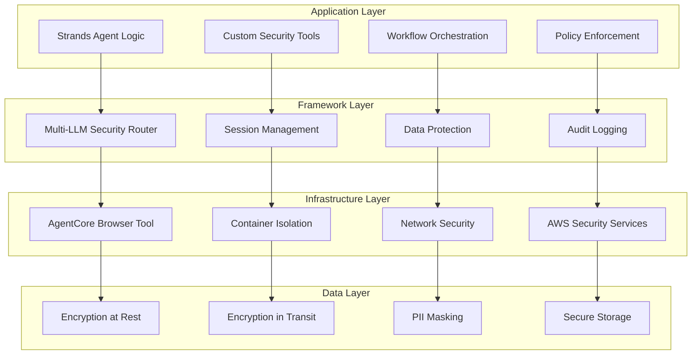
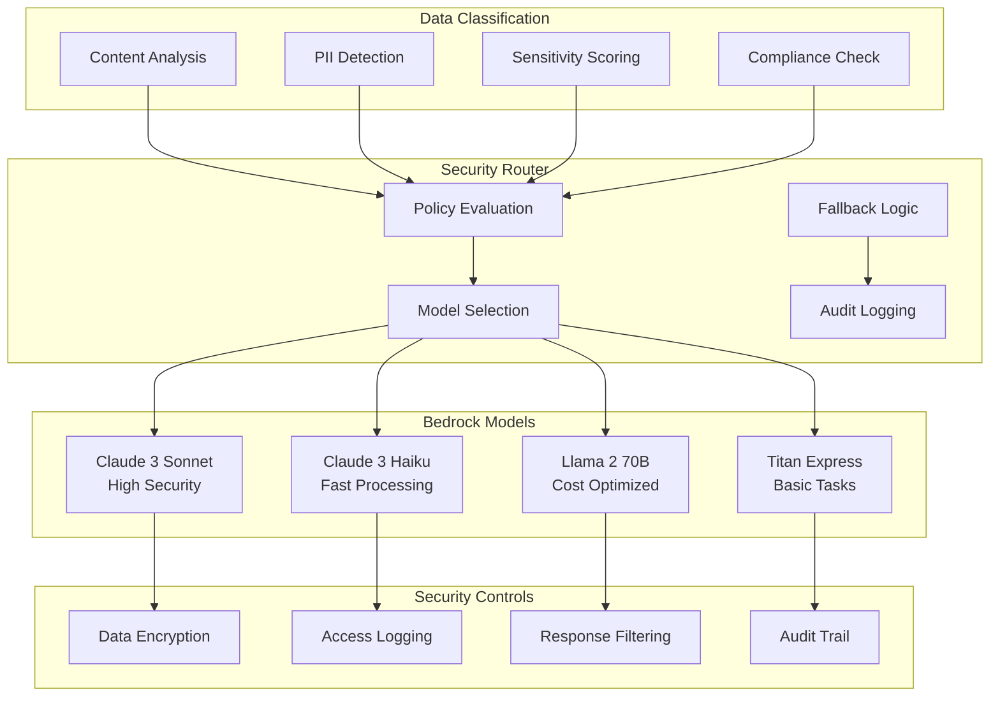
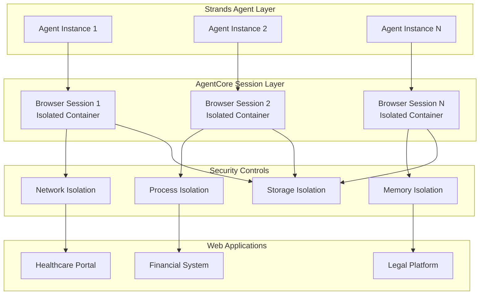

# Strands Security Framework with AgentCore Browser Tool

## Overview

This document provides a comprehensive overview of the security architecture implemented in the Strands-AgentCore Browser Tool integration. The framework demonstrates how Strands' code-first approach enables sophisticated security controls while leveraging AgentCore's managed browser infrastructure.

## Security Architecture Components

### 1. Multi-Layer Security Model

The Strands-AgentCore integration implements a multi-layer security model that provides defense in depth:



### 2. Strands Code-First Security Framework

#### Custom Security Tool Architecture

Strands enables the development of custom security tools that integrate seamlessly with AgentCore Browser Tool:

```python
# Example: Custom PII Detection Tool
class StrandsPIIDetectionTool(StrandsTool):
    """Custom PII detection tool with industry-specific patterns."""
    
    def __init__(self, industry_config: dict, compliance_requirements: list):
        super().__init__(name="pii_detector")
        self.industry_config = industry_config
        self.compliance_requirements = compliance_requirements
        self.detection_patterns = self._load_industry_patterns()
        
    def execute(self, content: str, context: dict) -> PIIDetectionResult:
        """Execute PII detection with custom logic."""
        # Industry-specific PII detection
        pii_entities = self._detect_pii_entities(content)
        
        # Apply compliance-specific masking
        masked_content = self._apply_compliance_masking(
            content, pii_entities, context.get('compliance_mode')
        )
        
        # Generate audit trail
        audit_entry = self._create_audit_entry(pii_entities, context)
        
        return PIIDetectionResult(
            original_content=content,
            masked_content=masked_content,
            detected_entities=pii_entities,
            audit_entry=audit_entry
        )
```

#### Policy-as-Code Implementation

Security policies are defined as code, enabling version control and automated deployment:

```python
# Example: Healthcare Security Policy
class HealthcareSecurityPolicy(SecurityPolicy):
    """HIPAA-compliant security policy for healthcare data."""
    
    def __init__(self):
        super().__init__(name="healthcare_hipaa")
        self.phi_patterns = self._load_phi_patterns()
        self.encryption_requirements = {
            'data_at_rest': 'AES-256',
            'data_in_transit': 'TLS-1.3',
            'key_management': 'AWS-KMS'
        }
        
    def evaluate_data_sensitivity(self, content: str) -> SensitivityLevel:
        """Evaluate data sensitivity based on PHI detection."""
        phi_detected = self._detect_phi(content)
        
        if phi_detected['high_risk_phi']:
            return SensitivityLevel.MAXIMUM
        elif phi_detected['medium_risk_phi']:
            return SensitivityLevel.HIGH
        elif phi_detected['low_risk_phi']:
            return SensitivityLevel.MEDIUM
        else:
            return SensitivityLevel.LOW
            
    def get_llm_routing_policy(self, sensitivity: SensitivityLevel) -> LLMRoutingPolicy:
        """Get LLM routing policy based on data sensitivity."""
        if sensitivity >= SensitivityLevel.HIGH:
            return LLMRoutingPolicy(
                preferred_models=['anthropic.claude-3-sonnet-20240229-v1:0'],
                data_residency='us-only',
                audit_level='comprehensive'
            )
        else:
            return LLMRoutingPolicy(
                preferred_models=['amazon.titan-text-express-v1'],
                data_residency='flexible',
                audit_level='standard'
            )
```

### 3. Multi-LLM Security Architecture

#### Intelligent Model Routing

The framework implements intelligent routing between different Bedrock models based on security requirements:



#### Model-Specific Security Policies

Each Bedrock model has specific security policies and use cases:

```python
# Model Security Configuration
MODEL_SECURITY_POLICIES = {
    'anthropic.claude-3-sonnet-20240229-v1:0': {
        'security_level': 'maximum',
        'data_types': ['phi', 'pii', 'financial', 'legal'],
        'compliance': ['hipaa', 'pci_dss', 'gdpr'],
        'audit_level': 'comprehensive',
        'cost_tier': 'premium'
    },
    'anthropic.claude-3-haiku-20240307-v1:0': {
        'security_level': 'high',
        'data_types': ['pii', 'business_confidential'],
        'compliance': ['gdpr', 'ccpa'],
        'audit_level': 'standard',
        'cost_tier': 'standard'
    },
    'meta.llama2-70b-chat-v1': {
        'security_level': 'medium',
        'data_types': ['general', 'low_sensitivity'],
        'compliance': ['basic'],
        'audit_level': 'minimal',
        'cost_tier': 'economical'
    },
    'amazon.titan-text-express-v1': {
        'security_level': 'basic',
        'data_types': ['public', 'non_sensitive'],
        'compliance': ['none'],
        'audit_level': 'basic',
        'cost_tier': 'budget'
    }
}
```

### 4. AgentCore Browser Tool Security Integration

#### Container Isolation Architecture

AgentCore Browser Tool provides VM-level isolation with 1:1 mapping between user sessions and browser sessions:



#### Session Security Features

Each browser session implements comprehensive security controls:

```python
class SecureBrowserSession:
    """Secure browser session with comprehensive security controls."""
    
    def __init__(self, session_config: SessionConfig):
        self.session_id = self._generate_secure_session_id()
        self.security_context = SecurityContext(session_config)
        self.audit_logger = AuditLogger(self.session_id)
        self.credential_manager = CredentialManager()
        
    def create_session(self) -> BrowserSession:
        """Create secure browser session with isolation."""
        session = self.agentcore_client.create_browser_session({
            'isolation_level': 'maximum',
            'network_policy': 'restricted',
            'storage_policy': 'ephemeral',
            'audit_logging': True
        })
        
        # Apply security policies
        self._apply_security_policies(session)
        
        # Initialize monitoring
        self._start_security_monitoring(session)
        
        return session
        
    def inject_credentials(self, session: BrowserSession, credentials: dict):
        """Securely inject credentials without local storage."""
        # Encrypt credentials
        encrypted_creds = self.credential_manager.encrypt_credentials(credentials)
        
        # Inject via secure channel
        session.execute_secure_script(
            script=self._generate_credential_injection_script(encrypted_creds),
            audit_action='credential_injection'
        )
        
        # Clear from memory
        self.credential_manager.clear_credentials()
        
    def cleanup_session(self, session: BrowserSession):
        """Comprehensive session cleanup."""
        # Clear browser data
        session.clear_all_data()
        
        # Terminate container
        session.terminate_container()
        
        # Generate audit report
        audit_report = self.audit_logger.generate_session_report()
        
        # Secure cleanup verification
        self._verify_cleanup_completion(session.session_id)
```

### 5. Data Protection Architecture

#### PII Detection and Masking

The framework implements sophisticated PII detection and masking capabilities:

```python
class AdvancedPIIDetector:
    """Advanced PII detection with industry-specific patterns."""
    
    def __init__(self, industry_config: str, compliance_mode: str):
        self.industry_config = industry_config
        self.compliance_mode = compliance_mode
        self.detection_models = self._load_detection_models()
        self.masking_strategies = self._load_masking_strategies()
        
    def detect_pii(self, content: str, context: dict) -> PIIDetectionResult:
        """Comprehensive PII detection."""
        results = []
        
        # Named Entity Recognition
        ner_results = self._ner_detection(content)
        results.extend(ner_results)
        
        # Pattern-based detection
        pattern_results = self._pattern_detection(content)
        results.extend(pattern_results)
        
        # Industry-specific detection
        industry_results = self._industry_specific_detection(content)
        results.extend(industry_results)
        
        # ML-based detection
        ml_results = self._ml_detection(content)
        results.extend(ml_results)
        
        # Consolidate and score results
        consolidated_results = self._consolidate_results(results)
        
        return PIIDetectionResult(
            entities=consolidated_results,
            confidence_scores=self._calculate_confidence_scores(consolidated_results),
            industry_specific_flags=self._get_industry_flags(consolidated_results)
        )
        
    def apply_masking(self, content: str, pii_results: PIIDetectionResult) -> MaskingResult:
        """Apply compliance-specific masking."""
        masking_strategy = self.masking_strategies[self.compliance_mode]
        
        masked_content = content
        masking_log = []
        
        for entity in pii_results.entities:
            if entity.confidence >= masking_strategy.confidence_threshold:
                mask_type = masking_strategy.get_mask_type(entity.type)
                masked_value = self._apply_mask(entity.value, mask_type)
                
                masked_content = masked_content.replace(entity.value, masked_value)
                masking_log.append({
                    'original_type': entity.type,
                    'mask_type': mask_type,
                    'position': entity.position,
                    'confidence': entity.confidence
                })
                
        return MaskingResult(
            masked_content=masked_content,
            masking_log=masking_log,
            original_entity_count=len(pii_results.entities),
            masked_entity_count=len(masking_log)
        )
```

#### Encryption and Key Management

All sensitive data is encrypted using industry-standard encryption:

```python
class DataEncryptionManager:
    """Comprehensive data encryption management."""
    
    def __init__(self, kms_key_id: str, region: str):
        self.kms_client = boto3.client('kms', region_name=region)
        self.kms_key_id = kms_key_id
        self.encryption_context = self._create_encryption_context()
        
    def encrypt_sensitive_data(self, data: dict, data_classification: str) -> EncryptedData:
        """Encrypt sensitive data with appropriate key management."""
        # Generate data encryption key
        dek_response = self.kms_client.generate_data_key(
            KeyId=self.kms_key_id,
            KeySpec='AES_256',
            EncryptionContext=self.encryption_context
        )
        
        # Encrypt data with DEK
        cipher = AES.new(dek_response['Plaintext'], AES.MODE_GCM)
        ciphertext, tag = cipher.encrypt_and_digest(json.dumps(data).encode())
        
        # Clear plaintext DEK from memory
        del dek_response['Plaintext']
        
        return EncryptedData(
            ciphertext=base64.b64encode(ciphertext).decode(),
            encrypted_dek=base64.b64encode(dek_response['CiphertextBlob']).decode(),
            nonce=base64.b64encode(cipher.nonce).decode(),
            tag=base64.b64encode(tag).decode(),
            encryption_context=self.encryption_context,
            data_classification=data_classification
        )
        
    def decrypt_sensitive_data(self, encrypted_data: EncryptedData) -> dict:
        """Decrypt sensitive data with audit logging."""
        # Decrypt DEK
        dek_response = self.kms_client.decrypt(
            CiphertextBlob=base64.b64decode(encrypted_data.encrypted_dek),
            EncryptionContext=encrypted_data.encryption_context
        )
        
        # Decrypt data
        cipher = AES.new(
            dek_response['Plaintext'],
            AES.MODE_GCM,
            nonce=base64.b64decode(encrypted_data.nonce)
        )
        
        plaintext = cipher.decrypt_and_verify(
            base64.b64decode(encrypted_data.ciphertext),
            base64.b64decode(encrypted_data.tag)
        )
        
        # Clear DEK from memory
        del dek_response['Plaintext']
        
        # Log decryption event
        self._log_decryption_event(encrypted_data.data_classification)
        
        return json.loads(plaintext.decode())
```

### 6. Compliance and Audit Architecture

#### Comprehensive Audit Logging

The framework implements comprehensive audit logging for all security-relevant events:

```python
class SecurityAuditLogger:
    """Comprehensive security audit logging system."""
    
    def __init__(self, compliance_mode: str, log_retention_days: int = 2555):  # 7 years
        self.compliance_mode = compliance_mode
        self.log_retention_days = log_retention_days
        self.cloudwatch_client = boto3.client('logs')
        self.log_group_name = f'/strands-agentcore/security-audit/{compliance_mode}'
        
    def log_pii_detection_event(self, event: PIIDetectionEvent):
        """Log PII detection event with compliance requirements."""
        audit_entry = {
            'timestamp': datetime.utcnow().isoformat(),
            'event_type': 'pii_detection',
            'session_id': event.session_id,
            'agent_id': event.agent_id,
            'pii_types_detected': event.pii_types,
            'confidence_scores': event.confidence_scores,
            'masking_applied': event.masking_applied,
            'compliance_mode': self.compliance_mode,
            'data_classification': event.data_classification
        }
        
        # Remove sensitive data from audit log
        sanitized_entry = self._sanitize_audit_entry(audit_entry)
        
        self._write_audit_log(sanitized_entry)
        
    def log_credential_injection_event(self, event: CredentialInjectionEvent):
        """Log credential injection event."""
        audit_entry = {
            'timestamp': datetime.utcnow().isoformat(),
            'event_type': 'credential_injection',
            'session_id': event.session_id,
            'agent_id': event.agent_id,
            'credential_type': event.credential_type,
            'injection_method': event.injection_method,
            'success': event.success,
            'compliance_mode': self.compliance_mode
        }
        
        # Never log actual credentials
        sanitized_entry = self._sanitize_credential_audit(audit_entry)
        
        self._write_audit_log(sanitized_entry)
        
    def log_llm_routing_event(self, event: LLMRoutingEvent):
        """Log LLM model routing decisions."""
        audit_entry = {
            'timestamp': datetime.utcnow().isoformat(),
            'event_type': 'llm_routing',
            'session_id': event.session_id,
            'agent_id': event.agent_id,
            'data_sensitivity': event.data_sensitivity,
            'selected_model': event.selected_model,
            'routing_reason': event.routing_reason,
            'fallback_used': event.fallback_used,
            'compliance_requirements': event.compliance_requirements
        }
        
        self._write_audit_log(audit_entry)
        
    def generate_compliance_report(self, start_date: datetime, end_date: datetime) -> ComplianceReport:
        """Generate comprehensive compliance report."""
        # Query audit logs
        audit_events = self._query_audit_logs(start_date, end_date)
        
        # Analyze compliance metrics
        compliance_metrics = self._analyze_compliance_metrics(audit_events)
        
        # Generate report
        report = ComplianceReport(
            compliance_mode=self.compliance_mode,
            report_period={'start': start_date, 'end': end_date},
            total_events=len(audit_events),
            pii_detection_events=compliance_metrics['pii_detection'],
            credential_events=compliance_metrics['credential_events'],
            llm_routing_events=compliance_metrics['llm_routing'],
            security_violations=compliance_metrics['violations'],
            compliance_score=compliance_metrics['compliance_score']
        )
        
        return report
```

#### Industry-Specific Compliance

The framework supports multiple compliance frameworks:

```python
# HIPAA Compliance Configuration
HIPAA_COMPLIANCE_CONFIG = {
    'phi_detection_required': True,
    'encryption_at_rest': 'AES-256',
    'encryption_in_transit': 'TLS-1.3',
    'audit_log_retention': 2555,  # 7 years in days
    'access_controls': 'role_based',
    'data_minimization': True,
    'breach_notification': True,
    'business_associate_agreement': True
}

# PCI DSS Compliance Configuration
PCI_DSS_COMPLIANCE_CONFIG = {
    'cardholder_data_protection': True,
    'encryption_requirements': 'AES-256',
    'key_management': 'hardware_security_module',
    'access_controls': 'multi_factor',
    'network_segmentation': True,
    'vulnerability_management': True,
    'audit_log_retention': 365,  # 1 year
    'penetration_testing': 'quarterly'
}

# GDPR Compliance Configuration
GDPR_COMPLIANCE_CONFIG = {
    'personal_data_protection': True,
    'data_subject_rights': True,
    'consent_management': True,
    'data_portability': True,
    'right_to_erasure': True,
    'privacy_by_design': True,
    'data_protection_impact_assessment': True,
    'breach_notification_72h': True
}
```

### 7. Monitoring and Observability

#### Real-Time Security Monitoring

The framework provides real-time monitoring of security events:

```python
class SecurityMonitor:
    """Real-time security monitoring and alerting."""
    
    def __init__(self, alert_thresholds: dict, notification_config: dict):
        self.alert_thresholds = alert_thresholds
        self.notification_config = notification_config
        self.cloudwatch_client = boto3.client('cloudwatch')
        self.sns_client = boto3.client('sns')
        
    def monitor_pii_exposure_risk(self, detection_events: list):
        """Monitor for potential PII exposure risks."""
        high_risk_events = [
            event for event in detection_events
            if event.confidence >= self.alert_thresholds['pii_confidence']
            and not event.masking_applied
        ]
        
        if len(high_risk_events) >= self.alert_thresholds['pii_exposure_count']:
            self._trigger_security_alert(
                alert_type='pii_exposure_risk',
                severity='high',
                events=high_risk_events
            )
            
    def monitor_credential_security(self, credential_events: list):
        """Monitor credential security events."""
        failed_injections = [
            event for event in credential_events
            if not event.success
        ]
        
        if len(failed_injections) >= self.alert_thresholds['credential_failure_count']:
            self._trigger_security_alert(
                alert_type='credential_security_issue',
                severity='medium',
                events=failed_injections
            )
            
    def monitor_session_anomalies(self, session_events: list):
        """Monitor for session-based security anomalies."""
        anomalies = []
        
        for event in session_events:
            # Check for unusual session duration
            if event.duration > self.alert_thresholds['max_session_duration']:
                anomalies.append(event)
                
            # Check for unusual data access patterns
            if event.data_access_count > self.alert_thresholds['max_data_access']:
                anomalies.append(event)
                
        if anomalies:
            self._trigger_security_alert(
                alert_type='session_anomaly',
                severity='medium',
                events=anomalies
            )
```

## Security Best Practices

### 1. Development Best Practices

- **Principle of Least Privilege**: Grant minimal necessary permissions
- **Defense in Depth**: Implement multiple layers of security controls
- **Secure by Default**: Default configurations should be secure
- **Regular Security Reviews**: Conduct regular code and architecture reviews

### 2. Deployment Best Practices

- **Environment Separation**: Separate development, staging, and production environments
- **Secrets Management**: Use AWS Secrets Manager for all sensitive data
- **Network Security**: Implement proper network segmentation and access controls
- **Monitoring and Alerting**: Comprehensive monitoring with real-time alerting

### 3. Operational Best Practices

- **Regular Updates**: Keep all dependencies and frameworks updated
- **Security Testing**: Regular penetration testing and vulnerability assessments
- **Incident Response**: Well-defined incident response procedures
- **Compliance Audits**: Regular compliance audits and assessments

## Conclusion

The Strands-AgentCore Browser Tool security framework demonstrates how code-first agent development can provide sophisticated security controls while maintaining flexibility and scalability. The architecture supports multiple compliance frameworks, provides comprehensive audit capabilities, and enables custom security tool development tailored to specific industry requirements.

This framework serves as a foundation for building production-ready, secure agent applications that handle sensitive information while meeting enterprise security and compliance requirements.