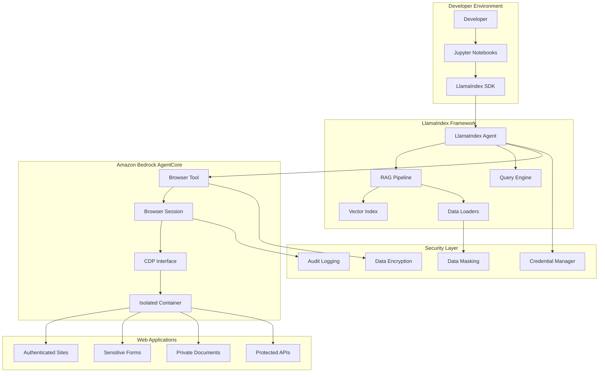

# LlamaIndex with AgentCore Browser Tool - Sensitive Information Handling Tutorial

This comprehensive tutorial demonstrates how LlamaIndex agents securely handle sensitive information when integrated with Amazon Bedrock AgentCore Browser Tool. Learn production-ready patterns for secure data handling, including PII protection, credential management, and secure browser automation workflows that meet enterprise security requirements.

## Overview

This tutorial provides real-world integration examples that developers can implement in production environments. Unlike mock demonstrations, these examples showcase actual implementations with:

### Core Security Features
- **Secure Credential Management**: Industry-standard patterns for handling authentication credentials without exposure
- **PII Detection and Masking**: Automatic identification and protection of personally identifiable information
- **Containerized Browser Isolation**: Secure, isolated browser sessions that prevent data leakage
- **RAG Applications with Authenticated Services**: Intelligent document processing from protected web resources
- **Production Monitoring and Compliance**: Enterprise-grade observability and audit capabilities

### AgentCore Browser Tool Benefits for LlamaIndex Workflows

#### Containerized Isolation
- **Process Isolation**: Each browser session runs in a dedicated, isolated container
- **Network Security**: Controlled network access with security boundaries
- **Resource Management**: Automatic cleanup and resource management
- **Session Lifecycle**: Proper session creation, management, and termination

#### Security Controls
- **Credential Protection**: Secure credential injection without local storage
- **Data Encryption**: All data in transit and at rest is encrypted
- **Audit Logging**: Complete activity tracking for compliance requirements
- **Access Controls**: Role-based access to sensitive operations

#### Enterprise Integration
- **AWS Native**: Seamless integration with AWS security and monitoring services
- **Scalable Architecture**: Support for concurrent sessions and high-throughput operations
- **Compliance Ready**: Built-in support for HIPAA, PCI DSS, and other regulatory requirements
- **Observability**: Comprehensive monitoring and alerting capabilities

## Tutorial Structure

### 1. Basic Integration (Notebook 1)
- **File**: `01_llamaindex_agentcore_secure_integration.ipynb`
- **Focus**: Basic LlamaIndex-AgentCore Browser Tool integration
- **Topics**: Secure session creation, simple web data loading, security verification

### 2. Sensitive Data RAG Pipeline (Notebook 2)
- **File**: `02_llamaindex_sensitive_rag_pipeline.ipynb`
- **Focus**: RAG applications with sensitive form data
- **Topics**: PII detection, secure document ingestion, context-aware querying

### 3. Authenticated Web Services (Notebook 3)
- **File**: `03_llamaindex_authenticated_web_services.ipynb`
- **Focus**: Multi-page workflow automation with session security
- **Topics**: Secure login automation, session management, credential protection

### 4. Production Patterns (Notebook 4)
- **File**: `04_production_llamaindex_agentcore_patterns.ipynb`
- **Focus**: Scalable deployment and monitoring
- **Topics**: Observability, error handling, compliance, audit logging

## Prerequisites

### System Requirements
- **Python**: 3.9 or higher (3.12 recommended)
- **Operating System**: Linux, macOS, or Windows with WSL2
- **Memory**: Minimum 8GB RAM (16GB recommended for production)
- **Network**: Stable internet connection for AWS services

### AWS Account Requirements
- **AWS Account**: Active account with billing configured
- **Bedrock Access**: Enabled in your target region (us-east-1, us-west-2, etc.)
- **AgentCore Browser Tool**: Access to Amazon Bedrock AgentCore services
- **IAM Permissions**: Appropriate roles and policies configured

## Installation

### 1. Clone and Setup Environment

```bash
# Clone the repository (if not already done)
git clone <repository-url>
cd amazon-bedrock-agentcore-samples/01-tutorials/05-AgentCore-tools/02-Agent-Core-browser-tool/04-browser-with-LlamaIndex/handling-sensitive-information

# Create virtual environment
python -m venv venv
source venv/bin/activate  # On Windows: venv\Scripts\activate

# Install dependencies
pip install -r requirements.txt
```

### 2. Configure Environment

```bash
# Copy environment template
cp .env.example .env

# Edit .env file with your AWS credentials and configuration
# Required variables:
# AWS_DEFAULT_REGION=us-east-1
# AWS_ACCESS_KEY_ID=your_access_key
# AWS_SECRET_ACCESS_KEY=your_secret_key
# BEDROCK_MODEL_ID=anthropic.claude-3-sonnet-20240229-v1:0
# AGENTCORE_REGION=us-east-1
```

### 3. Validate Installation

```bash
# Run validation script
python validate_integration.py

# Run security tests
python run_security_tests.py --test-type unit
```

### 4. Start Jupyter Environment

```bash
# Launch Jupyter Lab
jupyter lab

# Or use Jupyter Notebook
jupyter notebook
```

## Setup and Configuration

### System Requirements
- **Python**: 3.9 or higher
- **Operating System**: Linux, macOS, or Windows with WSL2
- **Memory**: Minimum 8GB RAM (16GB recommended for production patterns)
- **Network**: Stable internet connection for AWS services

### Required Dependencies

#### Core Frameworks
```bash
# LlamaIndex framework and extensions
pip install llama-index>=0.9.0
pip install llama-index-embeddings-bedrock
pip install llama-index-llms-bedrock

# AgentCore Browser Client SDK
pip install bedrock-agentcore-browser-client

# AWS SDK and utilities
pip install boto3>=1.34.0
pip install awscli
```

#### Security and Encryption Libraries
```bash
# Cryptography and security
pip install cryptography>=41.0.0
pip install pycryptodome
pip install python-jose[cryptography]

# Data processing and validation
pip install pydantic>=2.0.0
pip install validators
pip install python-dotenv
```

### AWS Setup and Configuration

#### 1. AWS Account Requirements
- **AWS Account**: Active account with billing configured
- **Bedrock Access**: Enabled in your target region (us-east-1, us-west-2, etc.)
- **AgentCore Browser Tool**: Service access enabled
- **IAM Permissions**: Appropriate roles and policies configured

#### 2. Required IAM Permissions
Create an IAM role with the following policies:
```json
{
    "Version": "2012-10-17",
    "Statement": [
        {
            "Effect": "Allow",
            "Action": [
                "bedrock:InvokeModel",
                "bedrock:InvokeModelWithResponseStream",
                "bedrock-agentcore:CreateBrowserSession",
                "bedrock-agentcore:GetBrowserSession",
                "bedrock-agentcore:DeleteBrowserSession",
                "bedrock-agentcore:SendBrowserAction"
            ],
            "Resource": "*"
        },
        {
            "Effect": "Allow",
            "Action": [
                "logs:CreateLogGroup",
                "logs:CreateLogStream",
                "logs:PutLogEvents"
            ],
            "Resource": "arn:aws:logs:*:*:*"
        }
    ]
}
```

#### 3. Service Quotas
Ensure adequate service quotas for:
- **Bedrock Model Invocations**: 1000+ per minute
- **AgentCore Browser Sessions**: 10+ concurrent sessions
- **CloudWatch Logs**: Sufficient log retention and throughput

### Environment Configuration

#### 1. Environment Variables Setup
```bash
# Copy the example environment file
cp .env.example .env

# Edit the .env file with your configuration
nano .env
```

#### 2. Required Environment Variables
```bash
# AWS Configuration
AWS_REGION=us-east-1
AWS_ACCESS_KEY_ID=your_access_key
AWS_SECRET_ACCESS_KEY=your_secret_key

# LlamaIndex Configuration
OPENAI_API_KEY=your_openai_key  # Optional: for OpenAI models
LLAMA_INDEX_CACHE_DIR=./cache

# AgentCore Browser Tool Configuration
AGENTCORE_BROWSER_REGION=us-east-1
AGENTCORE_SESSION_TIMEOUT=300
AGENTCORE_ENABLE_OBSERVABILITY=true

# Security Configuration
ENCRYPTION_KEY=your_32_byte_encryption_key
AUDIT_LOG_LEVEL=INFO
ENABLE_PII_DETECTION=true
```

#### 3. Validation and Testing
```bash
# Install dependencies
pip install -r requirements.txt

# Validate AWS credentials
aws sts get-caller-identity

# Run integration validation
python validate_integration.py

# Test AgentCore Browser Tool connectivity
python -c "from examples.agentcore_session_helpers import test_connection; test_connection()"
```

### Development Environment Setup

#### 1. Jupyter Notebook Configuration
```bash
# Install Jupyter with extensions
pip install jupyter jupyterlab ipywidgets

# Install kernel for the virtual environment
python -m ipykernel install --user --name llamaindex-agentcore

# Start Jupyter Lab
jupyter lab
```

#### 2. IDE Configuration (Optional)
For VS Code users:
- Install Python extension
- Configure Python interpreter to use the virtual environment
- Install Jupyter extension for notebook support
- Configure AWS Toolkit extension for AWS integration

## Security Features Demonstrated

### Data Protection
- **PII Detection**: Automatic identification and masking of personally identifiable information
- **Credential Security**: Secure injection and management of authentication credentials
- **Session Isolation**: Containerized browser sessions with proper cleanup
- **Data Encryption**: Secure handling of sensitive data in transit and at rest

### Compliance and Auditing
- **Audit Logging**: Complete operation tracking for sensitive activities
- **Access Controls**: Role-based access to sensitive operations
- **Data Governance**: Proper data retention and disposal patterns
- **Compliance Reporting**: Automated generation of security and compliance reports

## Real-World Examples

The tutorial includes practical examples for:
- Healthcare document processing with HIPAA compliance
- Financial data extraction with PCI DSS considerations
- Legal document analysis with confidentiality controls
- Customer support automation with PII protection

## Usage Examples

### Quick Start Example

```python
from examples.agentcore_browser_loader import AgentCoreBrowserLoader
from examples.secure_rag_pipeline import SecureRAGPipeline
from llama_index.core import Document

# Initialize secure components
browser_loader = AgentCoreBrowserLoader(region='us-east-1')
rag_pipeline = SecureRAGPipeline()

# Load web content securely
documents = browser_loader.load_web_content(
    url="https://example.com/sensitive-form",
    credentials={"username": "user", "password": "pass"},
    sanitize_pii=True
)

# Process with RAG pipeline
rag_pipeline.ingest_documents(documents)
response = rag_pipeline.query("What sensitive information was found?")
print(response)
```

### Healthcare Data Processing Example

```python
from examples.healthcare_document_processing import HealthcareRAG

# HIPAA-compliant healthcare data processing
healthcare_rag = HealthcareRAG(
    compliance_mode="HIPAA",
    encryption_enabled=True,
    audit_logging=True
)

# Process patient records securely
patient_docs = healthcare_rag.process_patient_portal(
    portal_url="https://patient-portal.hospital.com",
    credentials={"username": "doctor", "password": "secure_pass"},
    patient_id="12345"
)

# Query with PHI protection
response = healthcare_rag.query(
    "What are the patient's current medications?",
    mask_phi=True
)
```

### Financial Data Extraction Example

```python
from examples.financial_data_extraction import FinancialRAG

# PCI DSS compliant financial data processing
financial_rag = FinancialRAG(
    compliance_mode="PCI_DSS",
    tokenize_sensitive_data=True
)

# Extract financial information securely
financial_docs = financial_rag.extract_from_banking_portal(
    portal_url="https://banking.example.com",
    credentials={"username": "user", "password": "pass", "mfa_token": "123456"}
)

# Analyze with data protection
analysis = financial_rag.analyze_transactions(
    query="Summarize spending patterns",
    protect_account_numbers=True
)
```

### Multi-Agent Workflow Example

```python
from examples.agentcore_session_helpers import SessionPool
from llama_index.core.agent import ReActAgent
from llama_index.core.tools import FunctionTool

# Create session pool for concurrent operations
session_pool = SessionPool(max_sessions=5, region='us-east-1')

# Create multiple specialized agents
agents = {
    'data_extractor': ReActAgent.from_tools([
        FunctionTool.from_defaults(
            fn=browser_loader.extract_structured_data,
            name="extract_data"
        )
    ]),
    'pii_analyzer': ReActAgent.from_tools([
        FunctionTool.from_defaults(
            fn=pii_detector.analyze_document,
            name="analyze_pii"
        )
    ]),
    'compliance_checker': ReActAgent.from_tools([
        FunctionTool.from_defaults(
            fn=compliance_validator.validate_document,
            name="check_compliance"
        )
    ])
}

# Coordinate multi-agent workflow
async def process_sensitive_workflow(url, credentials):
    # Extract data
    data = await agents['data_extractor'].achat(f"Extract data from {url}")
    
    # Analyze PII
    pii_analysis = await agents['pii_analyzer'].achat(f"Analyze PII in: {data}")
    
    # Check compliance
    compliance = await agents['compliance_checker'].achat(f"Validate compliance: {pii_analysis}")
    
    return {
        'data': data,
        'pii_analysis': pii_analysis,
        'compliance_status': compliance
    }
```

## Getting Started

1. **Setup Environment**: Follow the installation instructions above
2. **Validate Installation**: Run `python validate_integration.py`
3. **Start with Notebook 1**: Begin with basic integration patterns
4. **Progress Sequentially**: Each notebook builds on the previous one
5. **Explore Examples**: Review the supporting scripts and utilities

## Troubleshooting Guide

### Common Setup Issues

#### 1. AWS Credentials and Permissions
**Problem**: `NoCredentialsError` or `AccessDenied` errors
**Solutions**:
```bash
# Verify AWS credentials
aws sts get-caller-identity

# Check IAM permissions
aws iam get-user
aws iam list-attached-user-policies --user-name YOUR_USERNAME

# Test Bedrock access
aws bedrock list-foundation-models --region us-east-1
```

#### 2. AgentCore Browser Tool Connection Issues
**Problem**: Browser session creation fails
**Solutions**:
```python
# Test basic connectivity
from bedrock_agentcore.tools.browser_client import BrowserClient
client = BrowserClient(region='us-east-1')
session = client.create_session()
print(f"Session created: {session.session_id}")
```

**Common Error Messages**:
- `ServiceQuotaExceededException`: Increase service quotas in AWS console
- `InvalidParameterException`: Check region availability for AgentCore
- `ThrottlingException`: Implement exponential backoff in your code

#### 3. LlamaIndex Integration Issues
**Problem**: LlamaIndex fails to load documents or create embeddings
**Solutions**:
```python
# Verify LlamaIndex installation
import llama_index
print(f"LlamaIndex version: {llama_index.__version__}")

# Test embedding creation
from llama_index.embeddings.bedrock import BedrockEmbedding
embedding = BedrockEmbedding(region_name="us-east-1")
test_embedding = embedding.get_text_embedding("test")
print(f"Embedding dimension: {len(test_embedding)}")
```

#### 4. Environment Configuration Problems
**Problem**: Environment variables not loading correctly
**Solutions**:
```bash
# Verify .env file loading
python -c "from dotenv import load_dotenv; load_dotenv(); import os; print(os.getenv('AWS_REGION'))"

# Check file permissions
ls -la .env
chmod 600 .env  # Secure the environment file
```

### Specific Error Scenarios

#### Session Timeout Issues
```python
# Implement proper session management
from examples.agentcore_session_helpers import SessionManager

session_manager = SessionManager(
    region='us-east-1',
    timeout=300,
    max_retries=3
)

# Use context manager for automatic cleanup
with session_manager.get_session() as session:
    # Your browser automation code here
    pass
```

#### PII Detection False Positives
```python
# Configure PII detection sensitivity
from examples.llamaindex_pii_utils import PIIDetector

detector = PIIDetector(
    confidence_threshold=0.8,  # Adjust based on your needs
    custom_patterns=['your-custom-regex-patterns'],
    whitelist=['known-safe-patterns']
)
```

#### Memory and Performance Issues
```python
# Optimize for large document processing
from llama_index.core import Settings

Settings.chunk_size = 512  # Reduce chunk size for memory efficiency
Settings.chunk_overlap = 50
Settings.num_output = 256  # Limit response length
```

### Performance Optimization

#### 1. Session Pool Management
```python
# Use session pooling for better performance
from examples.agentcore_session_helpers import SessionPool

pool = SessionPool(
    max_sessions=5,
    region='us-east-1',
    cleanup_interval=300
)
```

#### 2. Caching Strategies
```python
# Enable caching for embeddings and responses
import os
os.environ['LLAMA_INDEX_CACHE_DIR'] = 'cache'

from llama_index.core import Settings
Settings.cache = True
```

#### 3. Concurrent Processing
```python
# Process multiple documents concurrently
import asyncio
from examples.secure_web_rag import SecureWebRAG

async def process_multiple_urls(urls):
    rag = SecureWebRAG()
    tasks = [rag.process_url_async(url) for url in urls]
    results = await asyncio.gather(*tasks)
    return results
```

### Debugging and Logging

#### Enable Debug Logging
```python
import logging
logging.basicConfig(level=logging.DEBUG)

# Enable specific loggers
logging.getLogger('llama_index').setLevel(logging.DEBUG)
logging.getLogger('bedrock_agentcore').setLevel(logging.DEBUG)
```

#### Monitor Resource Usage
```python
# Monitor memory and session usage
from examples.llamaindex_monitoring import ResourceMonitor

monitor = ResourceMonitor()
monitor.start_monitoring()

# Your code here

monitor.stop_monitoring()
monitor.generate_report()
```

### Getting Help

#### Documentation Resources
- **LlamaIndex Documentation**: https://docs.llamaindex.ai/
- **AWS Bedrock Documentation**: https://docs.aws.amazon.com/bedrock/
- **AgentCore Browser Tool API Reference**: See `assets/api_reference.md`

#### Community Support
- **GitHub Issues**: Report bugs and feature requests
- **AWS Support**: For service-specific issues
- **LlamaIndex Discord**: Community discussions and help

#### Professional Support
For enterprise deployments and custom integrations:
- AWS Professional Services
- LlamaIndex Enterprise Support
- Custom consulting services available

## Architecture Overview

The tutorial demonstrates a comprehensive secure integration architecture that combines the intelligence of LlamaIndex with the security of AgentCore Browser Tool:

### High-Level Architecture
```
┌─────────────────┐    ┌──────────────────┐    ┌─────────────────────┐
│   Developer     │    │   LlamaIndex     │    │   AgentCore         │
│   Environment   │───▶│   Framework      │───▶│   Browser Tool      │
└─────────────────┘    └──────────────────┘    └─────────────────────┘
                              │                           │
                              ▼                           ▼
                       ┌──────────────┐           ┌──────────────┐
                       │ RAG Pipeline │           │ Secure       │
                       │ & Agents     │           │ Browser      │
                       └──────────────┘           │ Sessions     │
                              │                   └──────────────┘
                              ▼                           │
                       ┌──────────────┐                  ▼
                       │ Vector Store │           ┌──────────────┐
                       │ & Embeddings │           │ Web Content  │
                       └──────────────┘           │ & Forms      │
                                                  └──────────────┘
```

### Security Architecture Components

#### 1. Data Protection Layer
- **Encryption**: All data encrypted in transit (TLS 1.3) and at rest (AES-256)
- **PII Detection**: Automatic identification and masking of sensitive information
- **Access Controls**: Role-based access with principle of least privilege
- **Audit Logging**: Complete activity tracking for compliance requirements

#### 2. Isolation Boundaries
- **Container Isolation**: Each browser session runs in a dedicated container
- **Network Segmentation**: Controlled network access with security boundaries
- **Process Isolation**: Separate processes for different security contexts
- **Session Management**: Proper lifecycle management with automatic cleanup

#### 3. Integration Security
- **Secure Communication**: Authenticated and encrypted communication channels
- **Credential Management**: Secure credential injection without local storage
- **Session Lifecycle**: Proper session creation, management, and termination
- **Error Handling**: Security-first error handling that prevents data leakage

### Data Flow Architecture



### Key Architectural Benefits

#### For LlamaIndex Workflows
- **Enhanced Security**: Secure web data ingestion without compromising local environment
- **Scalability**: Concurrent browser sessions for high-throughput processing
- **Reliability**: Automatic error recovery and session management
- **Compliance**: Built-in audit logging and data protection mechanisms

#### For AgentCore Browser Tool
- **Intelligent Automation**: LlamaIndex provides sophisticated decision-making capabilities
- **Context Awareness**: RAG-powered understanding of web content and user intent
- **Adaptive Workflows**: Dynamic workflow adjustment based on content analysis
- **Natural Language Processing**: Advanced text understanding and generation

### Production Deployment Patterns

#### 1. Single-Agent Pattern
```python
# Simple single-agent deployment
from examples.secure_web_rag import SecureWebRAG

rag = SecureWebRAG(
    region='us-east-1',
    enable_monitoring=True,
    security_level='high'
)
```

#### 2. Multi-Agent Pattern
```python
# Scalable multi-agent deployment
from examples.agentcore_session_helpers import SessionPool

pool = SessionPool(max_sessions=10)
agents = [SecureWebRAG(session=pool.get_session()) for _ in range(5)]
```

#### 3. Enterprise Pattern
```python
# Enterprise deployment with full observability
from examples.llamaindex_monitoring import EnterpriseMonitor

monitor = EnterpriseMonitor(
    cloudwatch_enabled=True,
    audit_logging=True,
    compliance_mode='hipaa'
)
```

For detailed architecture diagrams, security specifications, and deployment guides, see the `assets/` directory.