# LlamaIndex-AgentCore Browser Tool Architecture

This document provides detailed architectural specifications for the integration between LlamaIndex and Amazon Bedrock AgentCore Browser Tool, focusing on secure handling of sensitive information.

## Table of Contents

1. [System Architecture Overview](#system-architecture-overview)
2. [Security Architecture](#security-architecture)
3. [Data Flow Architecture](#data-flow-architecture)
4. [Integration Patterns](#integration-patterns)
5. [Deployment Architectures](#deployment-architectures)
6. [Security Boundaries](#security-boundaries)
7. [Performance Architecture](#performance-architecture)
8. [Monitoring and Observability](#monitoring-and-observability)

## System Architecture Overview

### High-Level System Components

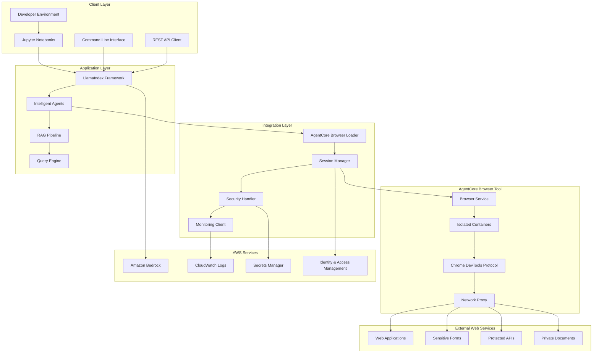

### Component Responsibilities

#### Client Layer
- **Developer Environment**: Local development setup with IDE integration
- **Jupyter Notebooks**: Interactive tutorial and experimentation environment
- **Command Line Interface**: Batch processing and automation scripts
- **REST API Client**: Programmatic access for enterprise integrations

#### Application Layer
- **LlamaIndex Framework**: Core AI framework for document processing and RAG
- **Intelligent Agents**: AI agents that orchestrate complex workflows
- **RAG Pipeline**: Retrieval-Augmented Generation for context-aware responses
- **Query Engine**: Sophisticated query processing with semantic understanding

#### Integration Layer
- **AgentCore Browser Loader**: Custom LlamaIndex loader for web content
- **Session Manager**: Manages browser session lifecycle and pooling
- **Security Handler**: Implements security controls and data protection
- **Monitoring Client**: Observability and performance monitoring

#### AgentCore Browser Tool
- **Browser Service**: Managed browser automation service
- **Isolated Containers**: Secure, isolated execution environments
- **Chrome DevTools Protocol**: Low-level browser control interface
- **Network Proxy**: Controlled network access with security filtering

## Security Architecture

### Security Layers and Controls

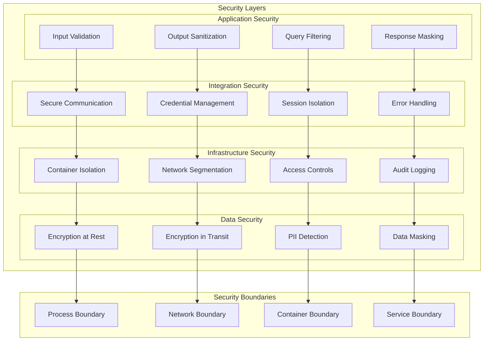

### Security Control Implementation

#### 1. Data Protection Controls
```python
# Example security control implementation
class DataProtectionLayer:
    def __init__(self):
        self.pii_detector = PIIDetector()
        self.encryptor = DataEncryptor()
        self.masker = DataMasker()
    
    def protect_data(self, data: str) -> SecureData:
        # Detect sensitive information
        pii_entities = self.pii_detector.detect(data)
        
        # Apply masking
        masked_data = self.masker.mask_entities(data, pii_entities)
        
        # Encrypt sensitive portions
        encrypted_data = self.encryptor.encrypt(masked_data)
        
        return SecureData(
            content=encrypted_data,
            entities=pii_entities,
            protection_level=ProtectionLevel.HIGH
        )
```

#### 2. Session Security Controls
```python
class SessionSecurityManager:
    def __init__(self):
        self.session_pool = SecureSessionPool()
        self.credential_manager = CredentialManager()
        self.audit_logger = AuditLogger()
    
    def create_secure_session(self, user_context: UserContext) -> SecureSession:
        # Create isolated session
        session = self.session_pool.create_session(
            isolation_level=IsolationLevel.CONTAINER,
            network_policy=NetworkPolicy.RESTRICTED
        )
        
        # Inject credentials securely
        credentials = self.credential_manager.get_credentials(
            user_context.user_id,
            session.session_id
        )
        
        # Log session creation
        self.audit_logger.log_session_creation(
            session_id=session.session_id,
            user_id=user_context.user_id,
            timestamp=datetime.utcnow()
        )
        
        return session
```

## Data Flow Architecture

### Secure Data Processing Pipeline

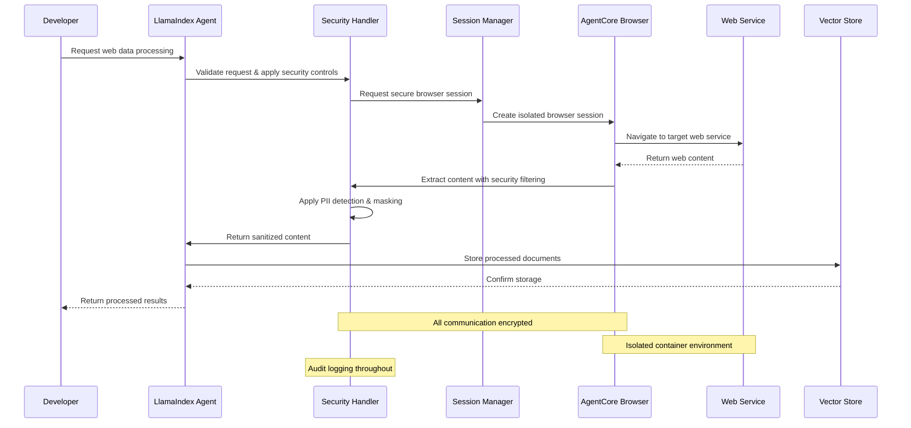

### Data Transformation Flow

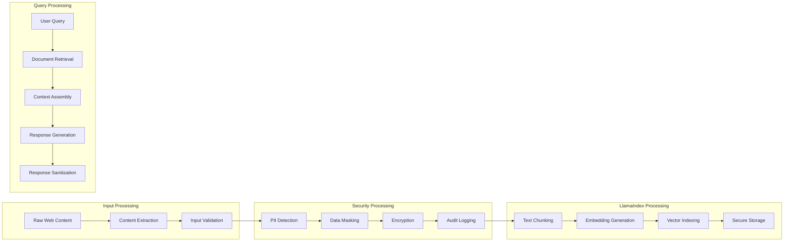

## Integration Patterns

### 1. Secure Web Data Ingestion Pattern

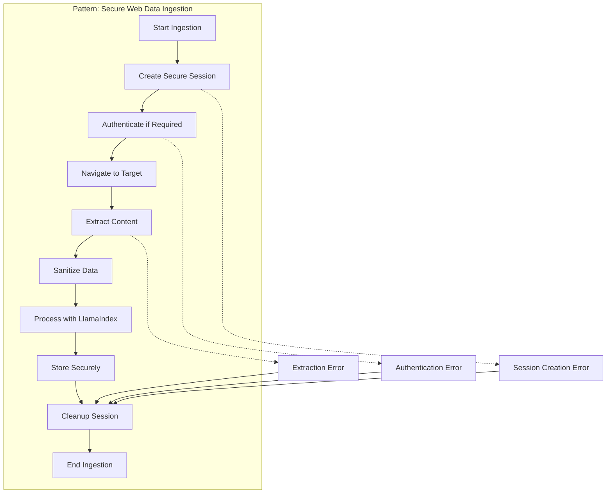

### 2. Multi-Session Concurrent Processing Pattern

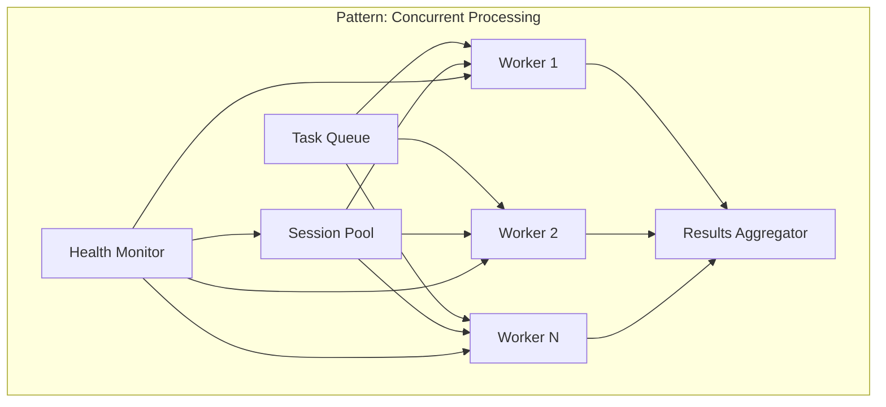

### 3. Error Recovery and Resilience Pattern

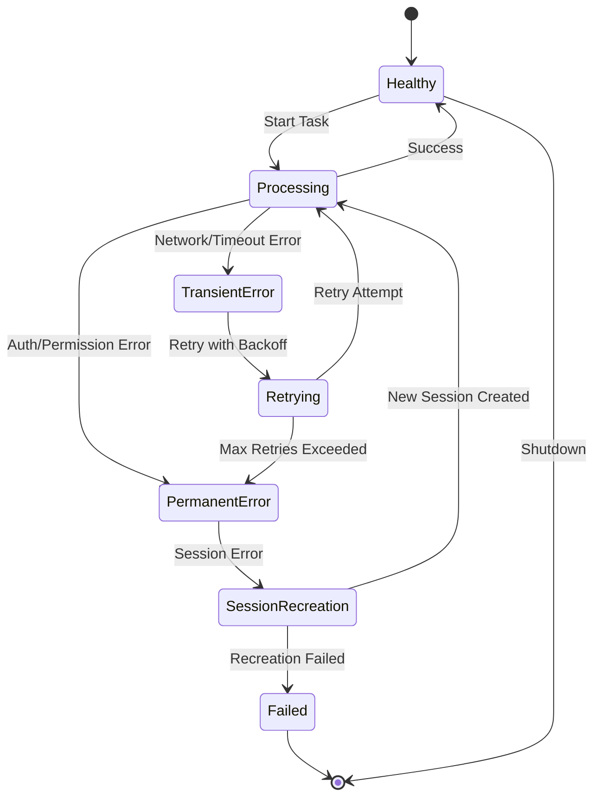

## Deployment Architectures

### 1. Development Environment Architecture

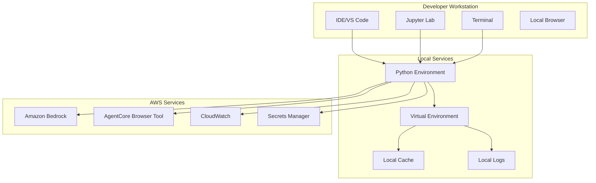

### 2. Production Environment Architecture

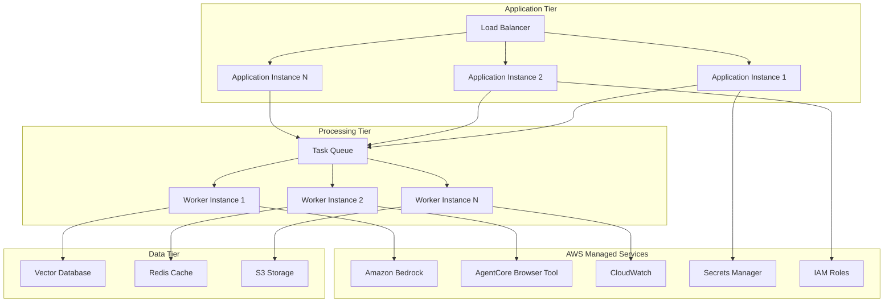

### 3. Enterprise Multi-Region Architecture

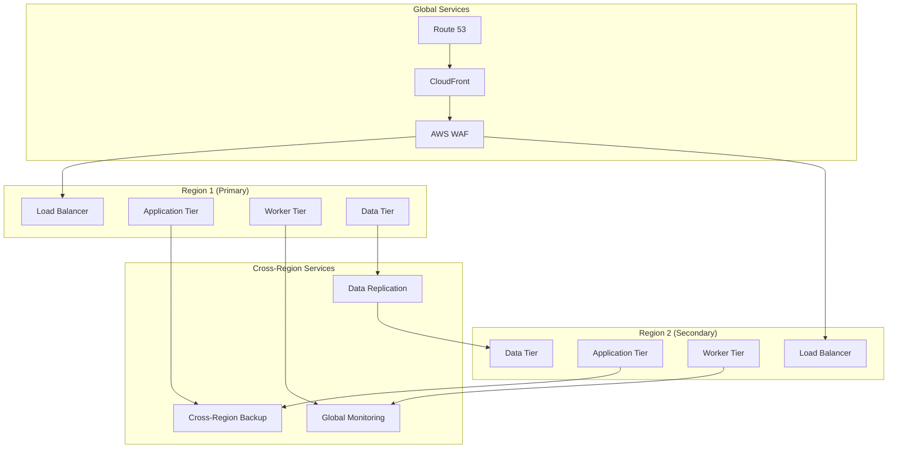

## Security Boundaries

### Container Isolation Architecture

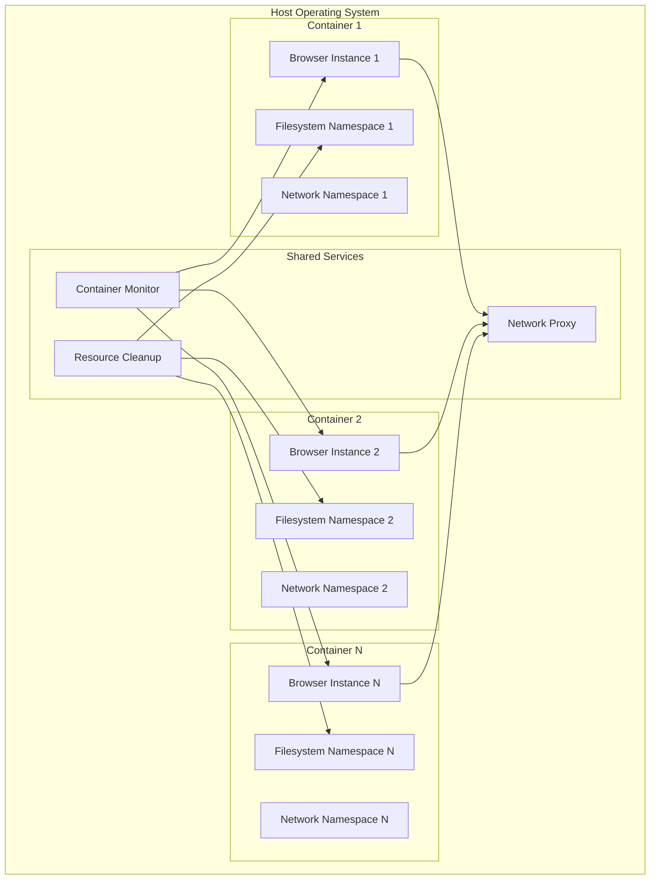

### Network Security Architecture

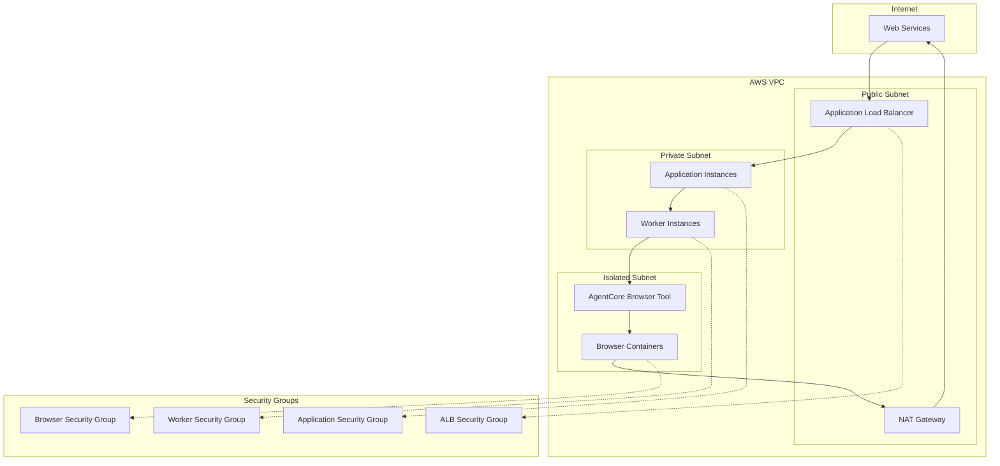

## Performance Architecture

### Session Pool Management

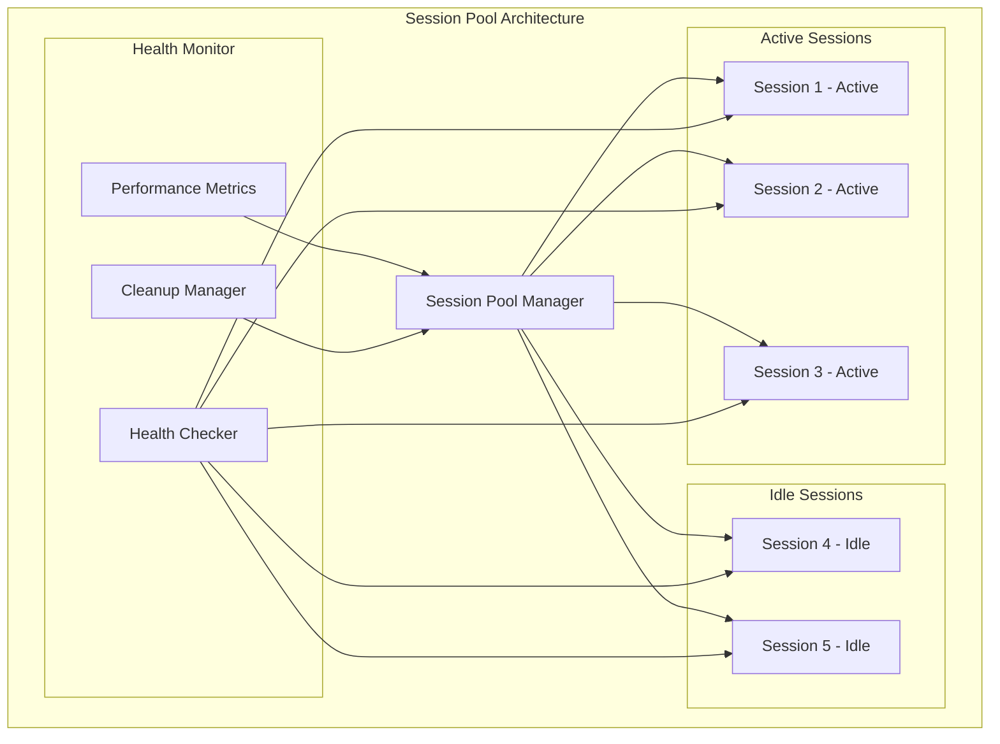

### Caching Strategy Architecture

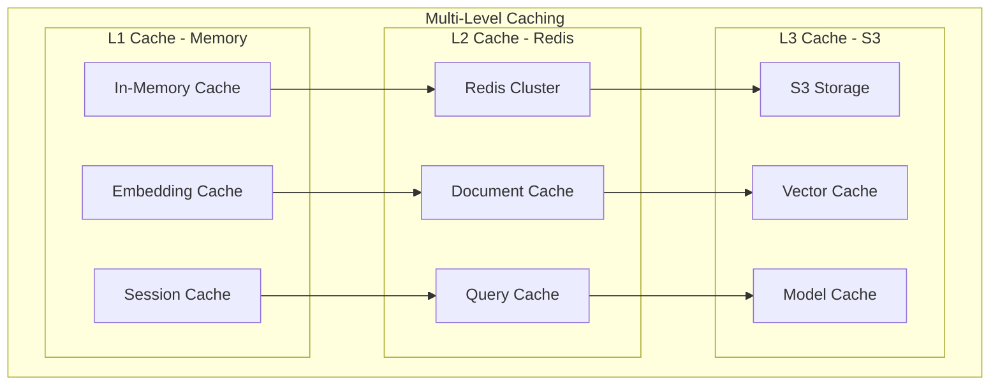

## Monitoring and Observability

### Observability Architecture

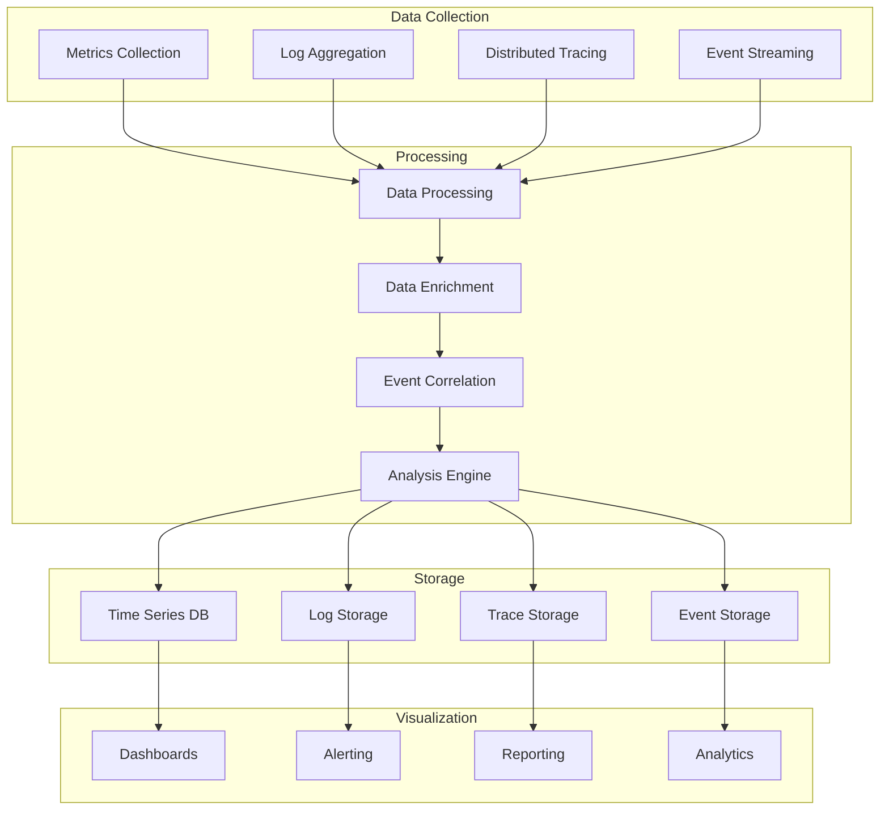

### Key Performance Indicators

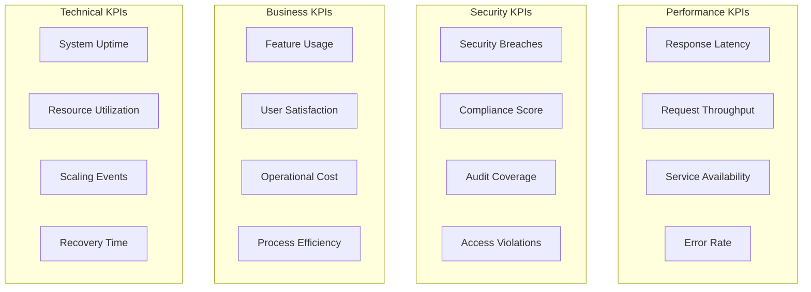

## Best Practices and Recommendations

### 1. Security Best Practices
- Always use encrypted communication channels
- Implement proper credential rotation
- Apply principle of least privilege
- Maintain comprehensive audit logs
- Regular security assessments

### 2. Performance Best Practices
- Implement session pooling for high throughput
- Use multi-level caching strategies
- Monitor and optimize resource usage
- Implement circuit breakers for resilience
- Use asynchronous processing where possible

### 3. Operational Best Practices
- Implement comprehensive monitoring
- Use infrastructure as code
- Automate deployment and scaling
- Implement proper backup and recovery
- Regular disaster recovery testing

### 4. Development Best Practices
- Follow secure coding practices
- Implement comprehensive testing
- Use version control for all components
- Document all architectural decisions
- Regular code reviews and security audits

This architecture documentation provides the foundation for building secure, scalable, and maintainable LlamaIndex-AgentCore Browser Tool integrations.