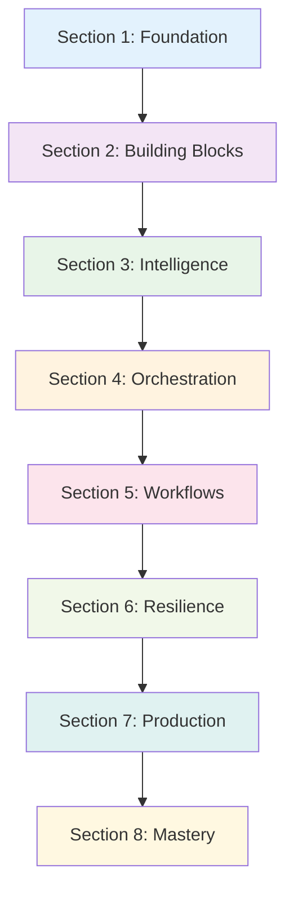

# LlamaIndex + AgentCore Browser Tool: Intelligent CAPTCHA Handling

This tutorial demonstrates how to **integrate LlamaIndex agents with AWS Bedrock AgentCore Browser Tool** for intelligent CAPTCHA handling. You'll learn to build LlamaIndex tools that orchestrate AgentCore's managed browser infrastructure, combining AI-powered reasoning with enterprise-grade browser automation for secure, scalable CAPTCHA detection and solving.

**Key Focus**: This tutorial is specifically about the **integration between LlamaIndex and AgentCore Browser Tool** - not standalone LlamaIndex or browser automation, but how these two powerful frameworks work together.

## Overview

CAPTCHAs (Completely Automated Public Turing tests to tell Computers and Humans Apart) are security measures designed to prevent automated access to websites. This tutorial teaches you how to handle them responsibly and effectively by **integrating LlamaIndex's intelligent agent framework with AgentCore Browser Tool's enterprise-grade browser automation infrastructure**.

### 🎯 What This Tutorial Covers

**This is NOT just a LlamaIndex tutorial** - it's specifically about **integrating LlamaIndex with AgentCore Browser Tool**:

#### **🔧 AgentCore Browser Tool Provides:**
- **Managed Browser Infrastructure**: Secure, isolated browser sessions for CAPTCHA interaction
- **Enterprise Security**: VM-level isolation with 1:1 user-to-session mapping
- **Web Automation Capabilities**: Navigate, click, screenshot, and interact with web pages
- **Scalable Infrastructure**: Auto-scaling browser sessions managed by AWS

#### **🤖 LlamaIndex Provides:**
- **Intelligent Orchestration**: ReActAgent coordinates complex CAPTCHA workflows
- **Tool Framework**: BaseTool implementations that wrap AgentCore Browser Tool calls
- **Multi-Modal AI**: Integration with Bedrock vision models for CAPTCHA analysis
- **Workflow Engine**: Complex decision-making and error handling patterns

#### **🔗 The Integration:**
- **LlamaIndex tools call AgentCore Browser Tool** for all web interactions
- **AgentCore captures screenshots and DOM data** that LlamaIndex agents analyze
- **LlamaIndex agents make intelligent decisions** about CAPTCHA handling strategies
- **AgentCore provides secure execution** while LlamaIndex provides the intelligence

### 🧠 LlamaIndex + AgentCore Browser Tool: Intelligent CAPTCHA Handling

**This tutorial focuses on the integration between LlamaIndex and AgentCore Browser Tool:**

#### **🔧 AgentCore Browser Tool as the Foundation**
- **Managed Browser Sessions**: AgentCore provides secure, isolated browser environments
- **Enterprise Security**: VM-level isolation with 1:1 user-to-session mapping
- **Web Automation**: Direct browser interaction capabilities (navigate, click, screenshot)
- **CAPTCHA Detection**: Browser-based DOM analysis and visual inspection
- **Scalable Infrastructure**: Auto-scaling managed browser infrastructure

#### **🤖 LlamaIndex as the Intelligence Layer**
- **Agent Orchestration**: ReActAgent coordinates CAPTCHA handling workflows
- **Tool Integration**: LlamaIndex tools wrap AgentCore Browser Tool functionality
- **Multi-Modal AI**: Bedrock vision models analyze CAPTCHA images captured by browser tool
- **Workflow Engine**: Complex decision-making for different CAPTCHA scenarios
- **Error Handling**: Intelligent retry and fallback strategies

#### **🔗 The Integration Architecture**
```
LlamaIndex Agent → LlamaIndex CAPTCHA Tools → AgentCore Browser Tool → Web Pages
     ↓                      ↓                        ↓
  Reasoning            Tool Calls              Browser Actions
  Workflows         Error Handling           Screenshot Capture
  Multi-Modal AI    Response Parsing         DOM Interaction
```

**Key Integration Points:**
1. **LlamaIndex tools call AgentCore Browser Tool** for all web interactions
2. **AgentCore captures screenshots** that LlamaIndex vision models analyze
3. **LlamaIndex agents orchestrate** the complete CAPTCHA solving workflow
4. **AgentCore provides the secure infrastructure** while LlamaIndex provides the intelligence

**Result**: Intelligent agents that can reason about CAPTCHAs while leveraging enterprise-grade browser automation.

## What You'll Learn

This comprehensive tutorial provides **progressive skill development** from basic LlamaIndex concepts to advanced enterprise CAPTCHA handling. Each section builds upon previous knowledge while introducing new concepts and techniques.

### 🎯 Core Learning Objectives

By completing this tutorial, you will master:

#### **Foundation Skills** (Sections 1-2)
- **AgentCore Browser Tool Integration**: Connecting LlamaIndex tools with managed browser sessions
- **Browser-Based CAPTCHA Detection**: Using AgentCore's DOM analysis and screenshot capabilities
- **LlamaIndex Tool Wrappers**: Creating BaseTool implementations that call AgentCore Browser Tool
- **Secure Browser Automation**: Leveraging AgentCore's enterprise security for CAPTCHA handling
- **Development Workflow**: Testing LlamaIndex + AgentCore integration patterns

#### **Intelligence & Analysis** (Sections 3-4)
- **Browser Screenshot Analysis**: Using AgentCore screenshots with LlamaIndex vision models
- **CAPTCHA Image Processing**: Preprocessing images captured by AgentCore Browser Tool
- **Agent-Browser Coordination**: LlamaIndex agents directing AgentCore browser actions
- **Multi-Modal Workflows**: Combining AgentCore visual data with LlamaIndex AI analysis
- **Browser-AI Feedback Loop**: Agents analyzing browser state and making intelligent decisions

#### **Advanced Orchestration** (Sections 5-6)
- **Workflow Design**: Creating sophisticated, multi-step CAPTCHA handling workflows
- **Error Resilience**: Implementing comprehensive error handling and recovery strategies
- **Performance Optimization**: Leveraging caching, parallel processing, and resource management
- **State Management**: Handling persistent state and memory across complex operations
- **Conditional Logic**: Building decision trees for different CAPTCHA scenarios

#### **Enterprise Deployment** (Sections 7-8)
- **Production Architecture**: Designing scalable, maintainable CAPTCHA handling systems
- **Security & Compliance**: Implementing enterprise-grade security and regulatory compliance
- **Observability**: Comprehensive monitoring, logging, and debugging capabilities
- **Ethical Automation**: Responsible CAPTCHA handling practices and guidelines
- **Future-Proofing**: Adapting to evolving CAPTCHA technologies and requirements

### 🛠 Technical Skills Development

#### **LlamaIndex Expertise**
- **BaseTool Implementation**: Master custom tool creation with proper metadata and error handling
- **ReActAgent Configuration**: Advanced agent setup with reasoning capabilities and tool orchestration
- **Workflow Engine**: Sophisticated workflow design using LlamaIndex's orchestration capabilities
- **Multi-Modal Integration**: Seamless integration of text and vision models for comprehensive analysis
- **Memory Systems**: Implementing persistent learning and pattern recognition capabilities

#### **CAPTCHA Technology Mastery**
- **Detection Strategies**: DOM-based, JavaScript, visual, and network analysis techniques
- **Solving Algorithms**: AI-powered solving for text, image, audio, and interactive CAPTCHAs
- **Type Classification**: Accurate identification of reCAPTCHA, hCaptcha, FunCaptcha, and custom implementations
- **Preprocessing Techniques**: Image enhancement, noise reduction, and feature extraction
- **Validation Methods**: Confidence scoring, solution verification, and quality assessment

#### **Enterprise Integration**
- **AWS Bedrock Integration**: Native integration with Bedrock models through LlamaIndex
- **AgentCore Browser Tool**: Leveraging managed browser infrastructure for scalable automation
- **Security Implementation**: Credential management, data encryption, and secure communication
- **Compliance Frameworks**: GDPR, HIPAA, PCI DSS, and industry-specific compliance patterns
- **Performance Monitoring**: Real-time monitoring, alerting, and performance optimization

### 📋 Best Practices & Guidelines

#### **Ethical Automation**
- **Responsible Usage**: Guidelines for legitimate automation within legal and ethical boundaries
- **Rate Limiting**: Conservative request patterns that respect service infrastructure
- **Transparency**: Clear disclosure of automation capabilities and limitations
- **Privacy Protection**: Data minimization, encryption, and secure handling practices
- **Compliance**: Adherence to terms of service, regulations, and industry standards

#### **Technical Excellence**
- **Code Quality**: Clean, maintainable, and well-documented code following LlamaIndex patterns
- **Error Handling**: Comprehensive error management with graceful degradation
- **Testing Strategies**: Unit testing, integration testing, and validation frameworks
- **Performance Optimization**: Efficient resource usage and scalable architecture design
- **Security**: Defense-in-depth security practices and vulnerability management

#### **Production Readiness**
- **Deployment Patterns**: Scalable, reliable deployment strategies for enterprise environments
- **Monitoring & Observability**: Comprehensive logging, metrics, and alerting systems
- **Maintenance**: Update strategies, dependency management, and lifecycle planning
- **Documentation**: Clear, comprehensive documentation for users and maintainers
- **Support**: Troubleshooting guides, FAQ, and support escalation procedures

### 🎓 Learning Outcomes

Upon completion, you will be able to:

✅ **Design and implement** sophisticated CAPTCHA handling systems using LlamaIndex
✅ **Integrate multi-modal AI** for comprehensive CAPTCHA analysis and solving
✅ **Build production-ready** agents with robust error handling and monitoring
✅ **Deploy enterprise solutions** with security, compliance, and scalability
✅ **Follow ethical practices** for responsible automation and CAPTCHA handling
✅ **Troubleshoot and optimize** CAPTCHA workflows for performance and reliability
✅ **Adapt to new technologies** as CAPTCHA systems evolve and change
✅ **Mentor others** in LlamaIndex CAPTCHA handling best practices

## 🏗️ Architecture & Integration

### **System Architecture**
For comprehensive architecture details, see:
- **[Main Architecture Documentation](../../../../03-integrations/bedrock-agentcore-browser-tool/agentic-frameworks/strands-agents/ARCHITECTURE.md)** - Complete system architecture, security, and performance details
- **[LlamaIndex Integration Patterns](#-llamaindex--agentcore-browser-tool-intelligent-captcha-handling)** - Tutorial-specific integration architecture (above)

### **Integration Summary**
This tutorial demonstrates **production-ready integration** between:
- **🤖 LlamaIndex Framework**: Intelligent agent orchestration and tool management
- **🏢 AgentCore Browser Tool**: Enterprise-grade managed browser infrastructure  
- **🧠 AWS Bedrock**: AI-powered multi-modal CAPTCHA analysis

**Key Integration Benefits:**
- ✅ **Intelligent Orchestration**: LlamaIndex agents coordinate complex CAPTCHA workflows
- ✅ **Enterprise Infrastructure**: AgentCore provides secure, scalable browser automation
- ✅ **AI-Powered Analysis**: Bedrock vision models analyze CAPTCHA images
- ✅ **Production Ready**: Comprehensive error handling, monitoring, and security

## Prerequisites

This tutorial builds upon foundational LlamaIndex knowledge and AgentCore Browser Tool concepts. **Complete these prerequisites in order**:

### 📚 Required Background Knowledge

**Complete these tutorials first** (in order):

1. **[LlamaIndex Integration Basics](../../../../03-integrations/agentic-frameworks/llamaindex/)** ⭐ **Essential**
   - Basic LlamaIndex agent creation with AgentCore Runtime
   - Tool development and agent configuration patterns
   - Understanding of LlamaIndex's model interfaces and response handling
   - **Estimated Time**: 30 minutes

2. **[AgentCore Browser Tool Fundamentals](../../README.md)** 🔧 **Important**
   - Complete the "Getting Started" tutorials for browser automation basics
   - Understand managed browser sessions and enterprise security features
   - Familiarity with browser tool commands and interaction patterns
   - **Recommended**: [Getting Started with Browser Tool and NovaAct](../../01-browser-with-NovaAct/01_getting_started-agentcore-browser-tool-with-nova-act.ipynb)
   - **Estimated Time**: 45 minutes

3. **[Multi-Modal AI with Bedrock](../../../../01-AgentCore-runtime/README.md)** 🤖 **Recommended**
   - Understanding of vision-language models through AgentCore Runtime
   - Experience with Bedrock model integration patterns
   - Knowledge of prompt engineering for multi-modal tasks
   - **Estimated Time**: 20 minutes

**Quick Prerequisites Check**:
- ✅ Can create and configure LlamaIndex agents
- ✅ Understand AgentCore Browser Tool basic commands
- ✅ Have experience with AWS Bedrock model integration
- ✅ Comfortable with async Python programming patterns

### ✅ Required Knowledge
- **Python Programming**: Advanced level (async/await, classes, decorators, type hints)
- **LlamaIndex Framework**: Agent patterns, tool development, workflow orchestration
- **AWS Bedrock**: Model access, vision models, and API integration
- **Web Technologies**: HTML, CSS selectors, DOM manipulation
- **CAPTCHA Types**: Understanding of different CAPTCHA mechanisms

### 🔧 Technical Setup
- **Python 3.9+** with pip package manager
- **AWS Account** with Bedrock access and proper IAM permissions
- **AWS CLI** configured with credentials (`aws configure`)
- **LlamaIndex** installed with Bedrock integration (`llama-index>=0.10.0`)
- **AgentCore Browser Tool SDK** access and configuration
- **Development Environment**: Jupyter Notebook/Lab or VS Code with Python extension

### 🧠 LlamaIndex-Specific Prerequisites
- **LlamaIndex Agent Experience**: Comfortable with ReActAgent and tool registration
- **Tool Development**: Experience creating custom LlamaIndex tools
- **Workflow Understanding**: Familiarity with LlamaIndex's workflow engine
- **Multi-Modal Integration**: Knowledge of LlamaIndex's vision-language capabilities

### 🎯 Skills Assessment
Before starting, you should be comfortable with:
- ✅ Creating and configuring LlamaIndex agents
- ✅ Implementing custom LlamaIndex tools (BaseTool)
- ✅ Working with LlamaIndex workflows and orchestration
- ✅ Integrating Bedrock models through LlamaIndex interfaces
- ✅ Handling multi-modal data (text + images) in LlamaIndex
- ✅ Understanding async/await patterns in Python
- ✅ Managing LlamaIndex agent state and memory

**Not sure if you're ready?** Review the LlamaIndex documentation and complete basic agent tutorials first.

### 🔑 AWS Permissions
Your AWS credentials need access to:
- **Amazon Bedrock** (Claude Vision models for AI-powered CAPTCHA solving)
- **AgentCore Browser Tool** (Managed browser sessions and VM isolation)
- **CloudWatch Logs** (For debugging and audit trails)

## Installation & Setup

### 🎯 Setup Overview

This tutorial requires **two levels of validation**:
1. **📁 Tutorial Structure** - Verify files are correctly organized (quick check)
2. **🔧 Environment Setup** - Install dependencies and configure AWS (full setup)

### 📁 Step 1: Quick Tutorial Validation

**Before starting setup**, verify the tutorial files are properly structured:

```bash
cd 01-tutorials/05-AgentCore-tools/02-Agent-Core-browser-tool/04-captcha-handling-tutorials/llamaindex/

# Quick structure validation (30 seconds)
python quick_validate.py
```

**Expected Output**:
```
🎉 Tutorial structure is perfect! Ready for environment setup.
💡 Next step: Run './setup.sh' (Linux/macOS) or 'setup.bat' (Windows)
```

If you see errors, check file integrity before proceeding.

### 🔧 Step 2: Environment Setup

Choose your preferred setup method:

#### **Option A: Automated Setup (Recommended)**

**Linux/macOS**:
```bash
./setup.sh
```

**Windows**:
```cmd
setup.bat
```

The script will:
- ✅ Create Python virtual environment
- ✅ Install all dependencies from requirements.txt
- ✅ Install Playwright browsers
- ✅ Create .env file from template
- ✅ Validate basic setup

#### **Option B: Manual Setup**

1. **Create virtual environment** (recommended):
   ```bash
   python -m venv venv
   source venv/bin/activate  # Linux/macOS
   # or
   venv\Scripts\activate     # Windows
   ```

2. **Install Python dependencies**:
   ```bash
   pip install -r requirements.txt
   ```

3. **Install Playwright browsers**:
   ```bash
   playwright install chromium
   ```

4. **Configure environment**:
   ```bash
   # Copy environment template
   cp .env.template .env
   
   # Edit with your AWS credentials
   nano .env  # or use your preferred editor
   ```

### 🔍 Step 3: Validation & Verification

#### **Quick Validation** (Structure Only)
```bash
python quick_validate.py
```
- ✅ Validates tutorial files and structure
- ✅ Checks Python syntax
- ✅ Tests core module imports
- ⚡ **Fast**: ~30 seconds

#### **Full Validation** (Complete Environment)
```bash
python validate_setup.py
```
- ✅ Validates complete environment setup
- ✅ Tests all dependencies and AWS access
- ✅ Checks Playwright browser installation
- 🔧 **Comprehensive**: ~60 seconds

#### **Understanding Validation Results**

**Full validation checks 21 items in 3 categories**:

1. **Essential Checks** (Required):
   - ✅ Python 3.9+
   - ✅ boto3 (AWS SDK)
   - ✅ Directory structure

2. **Setup-Dependent Checks** (Expected after setup):
   - 📦 LlamaIndex packages
   - 📦 AgentCore SDK
   - 📦 Playwright
   - 🔑 AWS credentials
   - 🌐 Bedrock access

3. **Optional Checks** (Nice to have):
   - 📄 .env file
   - 🎭 Playwright browsers

**Typical Results**:
- **Fresh download**: ~3/21 checks pass (normal - needs setup)
- **After automated setup**: ~18/21 checks pass (good - ready to use)
- **Full configuration**: 21/21 checks pass (perfect)

### 🚀 Step 4: Start the Tutorial

Once validation shows good results:

```bash
# Start Jupyter notebook
jupyter notebook llamaindex-captcha.ipynb

# Or run example scripts
python examples/basic_captcha_detection.py
```

### 🔧 Troubleshooting Setup Issues

#### **Common Issues & Solutions**

**❌ "No module named 'llama_index'"**
```bash
# Solution: Install dependencies
pip install -r requirements.txt
```

**❌ "AWS credentials not configured"**
```bash
# Solution 1: Configure AWS CLI
aws configure

# Solution 2: Set environment variables
export AWS_ACCESS_KEY_ID="your-key"
export AWS_SECRET_ACCESS_KEY="your-secret"
export AWS_DEFAULT_REGION="us-east-1"

# Solution 3: Edit .env file
nano .env
```

**❌ "Playwright browser not found"**
```bash
# Solution: Install browsers
playwright install chromium
```

**❌ "Permission denied: ./setup.sh"**
```bash
# Solution: Make script executable
chmod +x setup.sh
./setup.sh
```

#### **Getting Help**

1. **Run diagnostics**:
   ```bash
   python validate_setup.py  # Shows detailed error messages
   ```

2. **Check logs**:
   ```bash
   # Setup logs are saved to logs/ directory
   ls logs/
   ```

3. **Reset environment**:
   ```bash
   # Clean and restart
   rm -rf venv/
   python -m venv venv
   source venv/bin/activate
   pip install -r requirements.txt
   ```

### 📋 Setup Checklist

Use this checklist to verify your setup:

- [ ] **Tutorial Structure**: `python quick_validate.py` shows ✅
- [ ] **Dependencies Installed**: `pip list | grep llama-index` shows packages
- [ ] **AWS Configured**: `aws sts get-caller-identity` works
- [ ] **Playwright Ready**: `playwright --version` shows version
- [ ] **Environment File**: `.env` file exists with your credentials
- [ ] **Full Validation**: `python validate_setup.py` shows 18+ checks passed
- [ ] **Notebook Opens**: `jupyter notebook llamaindex-captcha.ipynb` works

### 🎯 Next Steps

Once setup is complete:

1. **📚 Start with the Jupyter notebook**: `llamaindex-captcha.ipynb`
2. **🔍 Explore examples**: Check the `examples/` directory
3. **🧪 Run tests**: `python run_tests.py` (optional)
4. **📖 Read architecture docs**: See `ARCHITECTURE.md` for deep dive
   ```bash
   jupyter notebook llamaindex-captcha.ipynb
   ```

#### **Key Dependencies Installed**:
- `llama-index>=0.10.0` - Core LlamaIndex framework
- `llama-index-llms-bedrock>=0.1.0` - Bedrock LLM integration
- `llama-index-multi-modal-llms-bedrock>=0.1.0` - Vision model integration
- `bedrock-agentcore>=1.0.0` - AgentCore Browser Tool SDK
- `playwright>=1.40.0` - Browser automation
- `pillow>=10.0.0` - Image processing for CAPTCHA analysis

### 🔧 Environment Configuration

The tutorial uses a `.env` file for configuration. After running setup, edit `.env` with your settings:

#### **Required AWS Configuration**:
```bash
# AWS Credentials
AWS_ACCESS_KEY_ID=your_access_key_here
AWS_SECRET_ACCESS_KEY=your_secret_key_here
AWS_DEFAULT_REGION=us-east-1

# Bedrock Configuration
BEDROCK_MODEL_ID=anthropic.claude-3-sonnet-20240229-v1:0
```

#### **Optional Configuration**:
```bash
# Performance Settings
LLAMAINDEX_CACHE_DIR=./cache
CAPTCHA_SCREENSHOT_DIR=./captcha_screenshots
CAPTCHA_MAX_RETRIES=3

# Development Settings
DEBUG_MODE=true
ENVIRONMENT=development
```

#### **Alternative: AWS CLI Configuration**
Instead of `.env` file, you can use AWS CLI:
```bash
aws configure
```

**Verify Installation**:
```python
# Test LlamaIndex + AgentCore integration
from llama_index.core.agent import ReActAgent
from llama_index.llms.bedrock import Bedrock
from bedrock_agentcore.tools import BrowserClient

# All should import successfully
print("✅ LlamaIndex framework ready")
print("✅ Bedrock integration ready")
print("✅ AgentCore Browser Tool ready")
```

## Tutorial Structure

This tutorial follows a **progressive learning approach**, building from fundamental LlamaIndex concepts to advanced enterprise CAPTCHA handling patterns. Each section includes clear learning objectives, hands-on examples, and practical exercises.

### 📚 Section 1: Foundation - LlamaIndex Environment Setup
**Learning Objectives**: Establish a solid foundation with LlamaIndex and AgentCore integration
- **1.1 LlamaIndex Installation & Configuration**: Core framework setup with Bedrock integration
- **1.2 AgentCore Browser Tool Integration**: Connecting LlamaIndex with managed browser infrastructure
- **1.3 Basic Agent Configuration**: Setting up your first ReActAgent with CAPTCHA awareness
- **1.4 Environment Validation**: Testing the integrated setup and troubleshooting common issues
- **1.5 Development Workflow**: Best practices for LlamaIndex CAPTCHA development

**Key Skills Gained**: LlamaIndex setup, AgentCore integration, basic agent configuration

### 🔧 Section 2: Building Blocks - LlamaIndex CAPTCHA Tools
**Learning Objectives**: Master LlamaIndex tool development for CAPTCHA operations
- **2.1 BaseTool Fundamentals**: Understanding LlamaIndex tool architecture and patterns
- **2.2 CAPTCHA Detection Tool**: Creating tools for identifying different CAPTCHA types
- **2.3 Screenshot Capture Tool**: Building image capture capabilities for analysis
- **2.4 Tool Metadata & Registration**: Configuring tools for agent discovery and usage
- **2.5 Tool Testing & Validation**: Ensuring reliable tool behavior and error handling

**Key Skills Gained**: LlamaIndex tool development, CAPTCHA detection, tool registration patterns

### 🤖 Section 3: Intelligence - Multi-Modal CAPTCHA Analysis
**Learning Objectives**: Integrate AI-powered CAPTCHA analysis using LlamaIndex's multi-modal capabilities
- **3.1 Vision Model Integration**: Connecting Bedrock vision models through LlamaIndex interfaces
- **3.2 Image Processing Pipeline**: CAPTCHA image preprocessing and enhancement techniques
- **3.3 Prompt Engineering**: Crafting effective prompts for different CAPTCHA types
- **3.4 Solution Validation**: Implementing confidence scoring and solution verification
- **3.5 Multi-Modal Workflows**: Combining text and image analysis for complex CAPTCHAs

**Key Skills Gained**: Multi-modal AI integration, image processing, prompt engineering, solution validation

### 🔄 Section 4: Orchestration - LlamaIndex Agent Integration
**Learning Objectives**: Build intelligent agents that can handle CAPTCHAs autonomously
- **4.1 ReActAgent Configuration**: Setting up reasoning agents with CAPTCHA capabilities
- **4.2 Tool Composition**: Combining multiple tools for comprehensive CAPTCHA handling
- **4.3 Agent Reasoning Patterns**: Teaching agents when and how to use CAPTCHA tools
- **4.4 State Management**: Handling agent memory and context across CAPTCHA operations
- **4.5 Agent Testing**: Validating agent behavior in various CAPTCHA scenarios

**Key Skills Gained**: Agent configuration, tool orchestration, reasoning patterns, state management

### ⚙️ Section 5: Workflows - Advanced LlamaIndex Patterns
**Learning Objectives**: Implement sophisticated workflows for complex CAPTCHA scenarios
- **5.1 Workflow Engine Basics**: Understanding LlamaIndex's workflow orchestration
- **5.2 CAPTCHA Workflow Design**: Building step-by-step CAPTCHA handling processes
- **5.3 Conditional Logic**: Implementing decision trees for different CAPTCHA types
- **5.4 Parallel Processing**: Handling multiple CAPTCHAs concurrently
- **5.5 Workflow Optimization**: Performance tuning and resource management

**Key Skills Gained**: Workflow design, conditional logic, parallel processing, performance optimization

### ⚠️ Section 6: Resilience - Error Handling & Recovery
**Learning Objectives**: Build robust systems that handle failures gracefully
- **6.1 Error Classification**: Understanding different types of CAPTCHA failures
- **6.2 LlamaIndex Error Patterns**: Using Response objects and error handling patterns
- **6.3 Retry Strategies**: Implementing intelligent retry logic with backoff
- **6.4 Fallback Mechanisms**: Graceful degradation for unsolvable CAPTCHAs
- **6.5 Circuit Breakers**: Preventing cascade failures in CAPTCHA workflows

**Key Skills Gained**: Error handling, retry strategies, fallback mechanisms, system resilience

### 🎯 Section 7: Production - Enterprise Deployment Patterns
**Learning Objectives**: Deploy LlamaIndex CAPTCHA solutions in production environments
- **7.1 Production Architecture**: Designing scalable LlamaIndex CAPTCHA systems
- **7.2 Memory & Persistence**: Implementing persistent state and learning capabilities
- **7.3 Observability**: Monitoring, logging, and debugging LlamaIndex workflows
- **7.4 Security & Compliance**: Implementing security best practices and compliance patterns
- **7.5 Performance Monitoring**: Tracking and optimizing CAPTCHA handling performance

**Key Skills Gained**: Production deployment, observability, security, performance monitoring

### 🏆 Section 8: Mastery - Advanced Topics & Best Practices
**Learning Objectives**: Master advanced techniques and ethical considerations
- **8.1 Custom CAPTCHA Types**: Handling proprietary and unusual CAPTCHA implementations
- **8.2 Machine Learning Integration**: Using custom models for CAPTCHA analysis
- **8.3 Ethical Automation**: Implementing responsible CAPTCHA handling practices
- **8.4 Compliance Frameworks**: GDPR, HIPAA, and industry-specific compliance
- **8.5 Future-Proofing**: Adapting to evolving CAPTCHA technologies

**Key Skills Gained**: Advanced techniques, ethical considerations, compliance, future-proofing

## Learning Path Recommendations

### 🎯 For Beginners (New to LlamaIndex)
**Recommended Path**: Sections 1 → 2 → 3 → 4 (Focus on fundamentals)
- Spend extra time on Section 1 (Environment Setup)
- Complete all exercises in Section 2 (Tool Development)
- Practice extensively with Section 3 (Multi-Modal Analysis)
- Build confidence with Section 4 (Agent Integration)

### 🚀 For Intermediate Users (Some LlamaIndex Experience)
**Recommended Path**: Quick review of 1-2 → Focus on 3-6 → Advanced topics in 7-8
- Quick validation of setup (Section 1)
- Review tool patterns (Section 2)
- Deep dive into multi-modal capabilities (Section 3)
- Master agent orchestration (Section 4)
- Implement production patterns (Sections 5-7)

### 🏆 For Advanced Users (LlamaIndex Experts)
**Recommended Path**: Sections 5-8 → Custom implementations
- Focus on advanced workflow patterns (Section 5)
- Implement enterprise error handling (Section 6)
- Design production architectures (Section 7)
- Explore cutting-edge techniques (Section 8)
- Contribute custom solutions and improvements

## Section Dependencies



## 🚀 Quick Start

Run the basic LlamaIndex CAPTCHA example:

```bash
python examples/basic_captcha_detection.py
```

## 🔧 Troubleshooting

### Common Issues

**LlamaIndex import errors**: Ensure all LlamaIndex packages are installed:
```bash
pip install llama-index llama-index-llms-bedrock llama-index-multi-modal-llms-bedrock
```

**AgentCore SDK not found**: Contact AWS support for access to the AgentCore SDK

**Bedrock model access**: Verify your AWS credentials have Bedrock access:
```bash
aws bedrock list-foundation-models --region us-east-1
```

**Agent tool registration issues**: Check tool metadata and ensure proper BaseTool implementation

### Validation

Run the environment validation script:
```bash
python examples/validate_environment.py
```

### Diagnostic Checklist

If CAPTCHA detection isn't working:

- ✅ LlamaIndex framework properly installed
- ✅ AgentCore Browser Tool SDK access configured
- ✅ AWS credentials have Bedrock and AgentCore permissions
- ✅ Tools properly registered with LlamaIndex agent
- ✅ Agent configuration includes CAPTCHA handling instructions
- ✅ Multi-modal models accessible through LlamaIndex interface

## 🧪 Testing

### Run Tests

```bash
# Validate LlamaIndex environment
python examples/validate_environment.py

# Run basic CAPTCHA detection example
python examples/basic_captcha_detection.py

# Test agent workflow
python examples/agent_workflow_example.py

# Production validation
python examples/production_example.py
```

### Test Coverage

The tutorial includes tests for:
- LlamaIndex tool implementation and registration
- Agent configuration and CAPTCHA handling
- Multi-modal CAPTCHA analysis
- Workflow orchestration and error handling
- Performance optimization and caching
- Production deployment patterns

## Key Features

### 🚀 Comprehensive LlamaIndex Integration
- Complete tool development lifecycle
- Agent configuration and orchestration
- Workflow engine utilization
- Multi-modal AI capabilities

### 🔒 Enterprise-Grade Security
- AgentCore managed browser infrastructure
- Secure credential handling through LlamaIndex
- Enterprise security policies and compliance
- Audit trails and monitoring

### 📖 Educational Focus
- Step-by-step LlamaIndex concepts
- Progressive complexity from basic to advanced
- Real-world examples and use cases
- Production deployment guidance

### 🏢 LlamaIndex Integration Benefits

#### 🧠 Advanced AI Capabilities
- **Multi-Modal Analysis**: Seamless integration of text and vision models
- **Intelligent Reasoning**: ReActAgent patterns for complex CAPTCHA scenarios
- **Tool Orchestration**: Sophisticated tool composition and workflow management
- **Memory Integration**: Persistent learning and pattern recognition
- **Adaptive Workflows**: Dynamic workflow adjustment based on CAPTCHA complexity

#### ⚡ Performance & Scalability
- **Caching Strategies**: LlamaIndex's built-in caching for improved performance
- **Async Operations**: Full async support for concurrent CAPTCHA handling
- **Resource Optimization**: Intelligent resource management and model selection
- **Scalable Architecture**: Enterprise-grade scaling with AgentCore infrastructure
- **Workflow Optimization**: Efficient workflow execution and state management

#### 🔗 Ecosystem Integration
- **Tool Ecosystem**: Rich ecosystem of LlamaIndex tools and integrations
- **Model Flexibility**: Support for multiple AI models and providers
- **Data Integration**: Seamless integration with various data sources
- **Observability**: Built-in monitoring and debugging capabilities
- **Extensibility**: Easy extension and customization of CAPTCHA handling

## Usage Examples

### LlamaIndex Tool Calling AgentCore Browser Tool
```python
from llama_index.core.tools import BaseTool
from llama_index.core.tools.tool_spec.base import ToolMetadata
from bedrock_agentcore.tools import BrowserClient  # AgentCore Browser Tool

class CaptchaDetectionTool(BaseTool):
    metadata = ToolMetadata(
        name="captcha_detector",
        description="Detects CAPTCHAs using AgentCore Browser Tool automation"
    )
    
    def __init__(self, browser_client: BrowserClient):
        self.browser = browser_client  # AgentCore Browser Tool client
        super().__init__()
    
    def call(self, page_url: str) -> dict:
        # Use AgentCore Browser Tool to navigate and analyze
        self.browser.navigate(page_url)
        
        # AgentCore Browser Tool captures screenshot
        screenshot = self.browser.take_screenshot()
        
        # AgentCore Browser Tool finds elements
        captcha_elements = self.browser.find_elements('iframe[src*="recaptcha"]')
        
        return {
            "captcha_found": len(captcha_elements) > 0,
            "screenshot_captured": screenshot is not None,
            "browser_session": self.browser.session_id
        }
```

### LlamaIndex Agent Orchestrating AgentCore Browser Tool
```python
from llama_index.core.agent import ReActAgent
from llama_index.llms.bedrock import Bedrock
from bedrock_agentcore.tools import BrowserClient

# Initialize AgentCore Browser Tool
browser_client = BrowserClient()

# Create LlamaIndex tools that use AgentCore Browser Tool
captcha_detector = CaptchaDetectionTool(browser_client)
captcha_solver = CaptchaSolvingTool(browser_client)

# Create LlamaIndex agent with browser-integrated tools
llm = Bedrock(model="anthropic.claude-3-sonnet-20240229-v1:0")
agent = ReActAgent.from_tools([captcha_detector, captcha_solver], llm=llm)

# Agent orchestrates AgentCore Browser Tool for CAPTCHA handling
response = await agent.achat(
    "Navigate to https://example.com/login using the browser tool, "
    "detect any CAPTCHAs, and solve them if found"
)
```

### Multi-Modal CAPTCHA Analysis
```python
from llama_index.multi_modal_llms.bedrock import BedrockMultiModal
from llama_index.core.schema import ImageDocument

mm_llm = BedrockMultiModal(model="anthropic.claude-3-sonnet-20240229-v1:0")
image_doc = ImageDocument(image=captcha_image_data)

response = await mm_llm.acomplete(
    prompt="Analyze this CAPTCHA and provide the solution",
    image_documents=[image_doc]
)
```

## Troubleshooting

### LlamaIndex-Specific Issues

**Tool Registration Failures**
- Verify BaseTool implementation follows LlamaIndex patterns
- Check tool metadata is properly configured
- Ensure tool methods return expected data types

**Agent Configuration Issues**
- Verify LLM model access and configuration
- Check tool registration with agent
- Validate agent system prompts and instructions

**Multi-Modal Integration Problems**
- Ensure BedrockMultiModal is properly configured
- Verify image document format and processing
- Check model access permissions for vision models

### Getting Help

For LlamaIndex-specific issues:
1. **Check LlamaIndex documentation** for tool development and agent configuration
2. **Review tutorial examples** for proper implementation patterns
3. **Test components independently** - tools, agents, and workflows separately
4. **Use LlamaIndex debugging tools** for detailed error analysis

## Tutorial Series Integration

### 📚 Prerequisites (Complete These First)

This tutorial builds upon foundational AgentCore and LlamaIndex concepts. **Follow this learning path**:

**Required Prerequisites** (Complete in order):
1. **[LlamaIndex + AgentCore Integration](../../../../03-integrations/agentic-frameworks/llamaindex/)** ⭐ **Essential foundation**
   - Basic LlamaIndex agent creation with AgentCore Runtime
   - Tool development and deployment patterns
   - **Time**: 30 minutes

2. **[AgentCore Browser Tool Basics](../../01-browser-with-NovaAct/01_getting_started-agentcore-browser-tool-with-nova-act.ipynb)** 🔧 **Tool creation skills**
   - Browser automation fundamentals
   - Managed browser sessions and security
   - **Time**: 45 minutes

3. **[AgentCore Runtime Concepts](../../../../01-AgentCore-runtime/README.md)** 🤖 **Agent configuration**
   - Runtime deployment patterns
   - Multi-modal model integration
   - **Time**: 20 minutes

### 🔗 Related Tutorials

**Continue your learning journey** with these complementary tutorials:

#### **Advanced Browser Automation**
- **[Browser Tool with Live View](../../01-browser-with-NovaAct/02_agentcore-browser-tool-live-view-with-nova-act.ipynb)**: Real-time browser interaction monitoring
- **[Browser-Use CAPTCHA Integration](../browser-use/README.md)**: Alternative CAPTCHA handling approaches
- **[Strands Browser Integration](../../03-browser-tool-with-strands/README.md)**: Strands-specific browser automation patterns

#### **Enterprise AgentCore Features**
- **[AgentCore Gateway Integration](../../../../02-AgentCore-gateway/README.md)**: API transformation and tool creation
- **[AgentCore Identity Management](../../../../03-AgentCore-identity/README.md)**: Authentication and authorization
- **[AgentCore Memory Systems](../../../../04-AgentCore-memory/README.md)**: Persistent state management
- **[AgentCore Observability](../../../../06-AgentCore-observability/README.md)**: Monitoring and debugging

#### **Multi-Framework Integration**
- **[LangGraph Integration](../../../../03-integrations/agentic-frameworks/langgraph/README.md)**: Alternative agent framework patterns
- **[Strands Integration](../../../../03-integrations/agentic-frameworks/strands-agents/README.md)**: Strands-specific agent patterns
- **[OpenAI Agents Integration](../../../../03-integrations/agentic-frameworks/openai-agents/README.md)**: OpenAI agent patterns

### 🎯 Learning Path Recommendations

#### **🎓 For Beginners (New to LlamaIndex + AgentCore)**
**Recommended Path**: Prerequisites → Sections 1-4 → Practice projects
- **Week 1**: Complete all prerequisites thoroughly
- **Week 2**: Master Sections 1-2 (Foundation + Tools)
- **Week 3**: Learn Sections 3-4 (Intelligence + Orchestration)
- **Week 4**: Build practice projects and explore related tutorials

#### **🚀 For Intermediate Users (Some LlamaIndex Experience)**
**Recommended Path**: Quick prerequisite review → Focus on Sections 3-6 → Advanced topics
- **Day 1**: Validate prerequisites and setup
- **Day 2-3**: Deep dive into Sections 3-4 (Multi-modal + Agents)
- **Day 4-5**: Master Sections 5-6 (Workflows + Error Handling)
- **Week 2**: Explore production deployment and related tutorials

#### **🏆 For Advanced Users (LlamaIndex + AgentCore Experts)**
**Recommended Path**: Sections 5-8 → Custom implementations → Contribute back
- **Focus Areas**: Advanced workflow patterns, enterprise deployment, custom CAPTCHA types
- **Contribution**: Improve tutorials, add new examples, share best practices
- **Mentoring**: Help others in the community learn these patterns

## Contributing

Found an issue or want to improve the tutorial?

1. Check existing issues and discussions
2. Follow the contribution guidelines
3. Submit pull requests with clear descriptions
4. Include tests for new examples

## Ethical Considerations

### ⚖️ Responsible Usage
This tutorial is for educational purposes and legitimate automation needs. Always:

- Respect website terms of service
- Implement appropriate rate limiting in LlamaIndex workflows
- Use CAPTCHA solving only when legally permitted
- Consider the impact on website resources
- Maintain user privacy and data security

### 🚫 Prohibited Uses
Do not use these techniques for:
- Bypassing security measures maliciously
- Automated account creation for spam
- Circumventing rate limits inappropriately
- Any illegal or unethical activities

## License

This tutorial is part of the AWS AgentCore documentation and follows the same licensing terms. Use responsibly and in accordance with AWS terms of service and LlamaIndex licensing.

## Support

For questions and support:
- Review the troubleshooting section
- Check LlamaIndex documentation
- Consult AWS Bedrock documentation
- Follow ethical automation guidelines

---

**Ready to get started?** Open the `llamaindex-captcha.ipynb` notebook and begin your journey into intelligent CAPTCHA handling with LlamaIndex! 🚀
## K
ey Features

- **LlamaIndex Integration**: Native integration with LlamaIndex agents and tools
- **Multi-Modal AI**: Advanced CAPTCHA analysis using Bedrock vision models
- **Workflow Orchestration**: Complete workflow patterns for enterprise use
- **Production Ready**: Comprehensive error handling and monitoring
- **Ethical Guidelines**: Built-in ethical guidelines and compliance validation
- **Security Best Practices**: Comprehensive security and privacy protection
- **Responsible Rate Limiting**: Conservative rate limiting to respect services
- **Error Handling**: Robust error handling with LlamaIndex Response objects
- **Graceful Degradation**: Fallback strategies for unsolvable CAPTCHAs
- **Compliance Support**: GDPR, HIPAA, PCI DSS compliance patterns

## Error Handling and Best Practices

### Comprehensive Error Handling
- **Timeout Management**: Configurable timeouts with LlamaIndex Response objects
- **Fallback Strategies**: Multiple fallback options for different error types
- **Graceful Degradation**: Continue operation with reduced functionality when CAPTCHAs fail
- **Retry Logic**: Exponential backoff and circuit breaker patterns
- **Error Response Integration**: Native LlamaIndex Response objects for error handling

### Ethical Guidelines
- **Respect CAPTCHA Purpose**: Only automate with proper authorization
- **Obtain Permission**: Explicit permission from service owners required
- **Rate Limiting**: Conservative limits to respect service infrastructure
- **Privacy Protection**: Encrypt images and minimize data collection
- **Transparency**: Clear disclosure of automation capabilities
- **Legal Compliance**: Adherence to terms of service and regulations

### Security Best Practices
- **Input Validation**: Comprehensive validation against security threats
- **Secure Credentials**: Encrypted credential storage and handling
- **Audit Logging**: Complete audit trails for compliance and monitoring
- **Data Encryption**: End-to-end encryption for sensitive data
- **Access Controls**: Proper authentication and authorization

### Compliance Support
- **GDPR Compliance**: Data protection and user rights for EU users
- **HIPAA Compliance**: Healthcare data protection standards
- **PCI DSS Compliance**: Payment card industry security standards
- **Industry Standards**: Flexible compliance framework for various industries

## Tutorial Structure

The tutorial is organized into comprehensive sections:

1. **Environment Setup**: LlamaIndex and AgentCore configuration
2. **CAPTCHA Tools**: Building LlamaIndex tools for detection and solving
3. **Multi-Modal Analysis**: Vision-language model integration
4. **Agent Integration**: ReActAgent with CAPTCHA capabilities
5. **Workflow Integration**: LlamaIndex workflow patterns
6. **Advanced Workflows**: Complex enterprise scenarios
7. **Error Handling**: Comprehensive error handling patterns
8. **Best Practices**: Ethical guidelines and compliance

## Quick Start

```python
# Install dependencies
pip install -r requirements.txt

# Import components
from llamaindex_captcha_handler import LlamaIndexCaptchaHandler
from llamaindex_error_handling import CaptchaErrorHandler
from llamaindex_best_practices import EthicalCaptchaAgent

# Initialize ethical CAPTCHA agent
agent = EthicalCaptchaAgent(compliance_level=ComplianceLevel.STRICT)

# Handle CAPTCHA with full error handling and compliance
context = create_ethical_captcha_context(
    page_url="https://myapp.com/login",
    authorization="Written testing agreement"
)

response = await agent.ethical_captcha_operation("detection", context)
```

## Files Overview

### Core Components
- `llamaindex_captcha_handler.py` - Main CAPTCHA handler with LlamaIndex integration
- `llamaindex_captcha_tools.py` - LlamaIndex tools for CAPTCHA operations
- `llamaindex_captcha_workflow.py` - Workflow patterns for complex scenarios
- `llamaindex_error_handling.py` - Comprehensive error handling framework
- `llamaindex_best_practices.py` - Ethical guidelines and security practices

### Examples
- `examples/basic_captcha_detection.py` - Basic detection examples
- `examples/advanced_captcha_solving.py` - Advanced solving techniques
- `examples/agent_workflow_example.py` - Agent integration patterns
- `examples/complete_workflow_examples.py` - End-to-end workflows
- `examples/production_example.py` - Production deployment patterns
- `examples/error_handling_examples.py` - Error handling demonstrations
- `examples/ethical_guidelines_examples.py` - Best practices examples
- `examples/performance_optimization_examples.py` - Performance optimization

### Tutorial
- `llamaindex-captcha.ipynb` - Complete interactive tutorial
- `README.md` - This documentation
- `requirements.txt` - Python dependencies

## Prerequisites

- Python 3.9+
- AWS account with Bedrock access
- LlamaIndex framework knowledge
- AgentCore Browser Tool SDK access
- Understanding of ethical automation principles

## Installation

```bash
# Clone the repository
git clone <repository-url>
cd llamaindex-captcha-tutorial

# Install dependencies
pip install -r requirements.txt

# Configure AWS credentials
aws configure

# Set environment variables
export AWS_REGION=us-east-1
export CAPTCHA_ENCRYPTION_KEY=your-secure-key
```

## Ethical Considerations

This tutorial emphasizes responsible CAPTCHA handling:

- **Authorization Required**: Always obtain explicit permission
- **Respect Rate Limits**: Use conservative request rates
- **Privacy Protection**: Encrypt and secure all data
- **Compliance**: Follow applicable laws and regulations
- **Transparency**: Disclose automation capabilities
- **Graceful Degradation**: Handle failures responsibly

## Tutorial Summary & Next Steps

### 🎯 What You've Accomplished

After completing this tutorial, you will have built a **comprehensive LlamaIndex CAPTCHA handling system** that demonstrates:

#### **Technical Mastery**
- ✅ **Complete LlamaIndex Integration**: From basic tools to advanced workflows
- ✅ **Multi-Modal AI Capabilities**: Vision-language models for CAPTCHA analysis
- ✅ **Enterprise-Grade Architecture**: Scalable, secure, and maintainable solutions
- ✅ **Production Deployment**: Real-world deployment patterns and best practices
- ✅ **Ethical Implementation**: Responsible automation with compliance frameworks

#### **Practical Skills**
- ✅ **Tool Development**: Custom LlamaIndex tools for CAPTCHA operations
- ✅ **Agent Orchestration**: Intelligent agents with reasoning capabilities
- ✅ **Workflow Design**: Complex, multi-step automation workflows
- ✅ **Error Resilience**: Comprehensive error handling and recovery strategies
- ✅ **Performance Optimization**: Efficient, scalable CAPTCHA handling systems

### 🚀 Next Steps & Advanced Learning

#### **Immediate Applications**
1. **Integrate with Your Projects**: Apply CAPTCHA handling to your existing LlamaIndex applications
2. **Customize for Your Needs**: Adapt the patterns for specific CAPTCHA types or websites
3. **Enhance Security**: Implement additional security measures for your use cases
4. **Scale Your Solution**: Deploy to production environments with monitoring and observability

#### **Advanced Learning Paths**

##### **🔬 Research & Development**
- **Custom CAPTCHA Types**: Develop handlers for proprietary or unusual CAPTCHA implementations
- **Machine Learning Enhancement**: Train custom models for improved CAPTCHA recognition
- **Performance Optimization**: Advanced caching, parallel processing, and resource management
- **Cross-Platform Integration**: Extend to mobile, desktop, or embedded applications

##### **🏢 Enterprise Integration**
- **Microservices Architecture**: Design CAPTCHA handling as scalable microservices
- **API Development**: Create REST/GraphQL APIs for CAPTCHA handling services
- **Multi-Tenant Solutions**: Build SaaS platforms with CAPTCHA handling capabilities
- **Compliance Automation**: Implement automated compliance checking and reporting

##### **🌐 Ecosystem Expansion**
- **Framework Integration**: Integrate with other AI frameworks (LangChain, CrewAI, etc.)
- **Cloud Platforms**: Deploy on multiple cloud providers (AWS, Azure, GCP)
- **Edge Computing**: Implement edge-based CAPTCHA handling for low-latency scenarios
- **IoT Integration**: Extend to IoT devices and embedded systems

### 📚 Related Tutorials & Resources

#### **Continue Your LlamaIndex Journey**
- **[LlamaIndex Advanced Workflows](../../../workflows/)**: Master complex workflow orchestration
- **[LlamaIndex Multi-Modal AI](../../../multi-modal/)**: Deep dive into vision-language integration
- **[LlamaIndex Production Deployment](../../../production/)**: Enterprise deployment patterns
- **[LlamaIndex Memory Systems](../../../memory/)**: Advanced memory and persistence patterns

#### **Explore AgentCore Capabilities**
- **[AgentCore Gateway Integration](../../../../02-AgentCore-gateway/)**: API transformation and tool creation
- **[AgentCore Identity Management](../../../../03-AgentCore-identity/)**: Authentication and authorization
- **[AgentCore Memory Systems](../../../../04-AgentCore-memory/)**: Persistent state management
- **[AgentCore Observability](../../../../06-AgentCore-observability/)**: Monitoring and debugging

#### **Specialized CAPTCHA Tutorials**
- **[Browser-Use CAPTCHA Integration](../browser-use/)**: Alternative browser automation approaches
- **[Strands CAPTCHA Framework](../strands/)**: Strands-specific CAPTCHA handling patterns
- **[Custom CAPTCHA Solutions](../custom/)**: Building handlers for proprietary CAPTCHAs

### 🤝 Community & Contribution

#### **Join the Community**
- **Share Your Implementations**: Contribute examples and improvements to the tutorial
- **Report Issues**: Help improve the tutorial by reporting bugs and suggesting enhancements
- **Discuss Best Practices**: Engage with other developers on ethical automation practices
- **Mentor Others**: Help newcomers learn LlamaIndex CAPTCHA handling techniques

#### **Contribution Opportunities**
- **New CAPTCHA Types**: Add support for emerging CAPTCHA technologies
- **Performance Improvements**: Optimize existing implementations for better performance
- **Security Enhancements**: Strengthen security and compliance features
- **Documentation**: Improve explanations, add examples, and create additional guides

### 🔮 Future Developments

#### **Emerging Technologies**
- **Advanced AI Models**: Integration with next-generation vision and language models
- **Behavioral Analysis**: CAPTCHA solving based on human behavior patterns
- **Quantum-Resistant Security**: Preparing for post-quantum CAPTCHA technologies
- **Accessibility Integration**: CAPTCHA solutions that work with assistive technologies

#### **Industry Trends**
- **Privacy-First CAPTCHAs**: Handling privacy-preserving CAPTCHA implementations
- **Biometric Integration**: CAPTCHA systems that incorporate biometric verification
- **Blockchain Verification**: Decentralized CAPTCHA verification systems
- **AI-Generated CAPTCHAs**: Handling dynamically generated, AI-created challenges

### 📞 Support and Resources

#### **Technical Support**
- **[LlamaIndex Documentation](https://docs.llamaindex.ai/)**: Comprehensive framework documentation
- **[AWS Bedrock Documentation](https://docs.aws.amazon.com/bedrock/)**: AI model integration guides
- **[AgentCore Documentation](https://docs.aws.amazon.com/agentcore/)**: Browser tool and infrastructure guides
- **[Tutorial GitHub Repository](https://github.com/aws-samples/agentcore-tutorials)**: Source code and issue tracking

#### **Community Resources**
- **[LlamaIndex Discord](https://discord.gg/llamaindex)**: Real-time community support
- **[AWS Developer Forums](https://forums.aws.amazon.com/)**: AWS-specific questions and discussions
- **[Stack Overflow](https://stackoverflow.com/questions/tagged/llamaindex)**: Technical Q&A with the community
- **[Reddit r/LlamaIndex](https://reddit.com/r/llamaindex)**: Community discussions and sharing

#### **Professional Services**
- **AWS Professional Services**: Enterprise consulting for large-scale implementations
- **LlamaIndex Consulting**: Expert guidance for complex LlamaIndex projects
- **Security Auditing**: Professional security assessment for production deployments
- **Compliance Consulting**: Regulatory compliance guidance for specific industries

### ⚖️ Ethical Considerations & Compliance

#### **Ongoing Responsibilities**
- **Regular Compliance Reviews**: Periodically review and update compliance measures
- **Ethical Impact Assessment**: Continuously evaluate the ethical implications of your implementations
- **Security Updates**: Keep security measures current with evolving threat landscapes
- **Legal Compliance**: Stay informed about changing laws and regulations

#### **Best Practice Maintenance**
- **Rate Limit Monitoring**: Regularly review and adjust rate limiting policies
- **Privacy Protection**: Continuously improve data protection and privacy measures
- **Transparency Reporting**: Maintain clear documentation of automation capabilities
- **Stakeholder Communication**: Keep stakeholders informed about automation practices

---

## 🎉 Congratulations!

You've completed a comprehensive journey through **LlamaIndex CAPTCHA handling with AgentCore Browser Tool**. You now have the knowledge and skills to build sophisticated, ethical, and production-ready CAPTCHA handling systems.

### 🚀 Ready to Build Amazing Things?

**Start your next project** by applying these patterns to your specific use cases. Remember to:
- ✅ Follow ethical automation guidelines
- ✅ Implement comprehensive error handling
- ✅ Design for scalability and maintainability
- ✅ Prioritize security and compliance
- ✅ Contribute back to the community

**Happy coding, and welcome to the future of intelligent automation!** 🤖✨

---

## License

This tutorial is provided for educational purposes and is part of the AWS AgentCore documentation series. Please ensure compliance with all applicable laws, regulations, and terms of service when implementing CAPTCHA automation.

For the latest updates and additional resources, visit the [official AgentCore documentation](https://docs.aws.amazon.com/agentcore/).