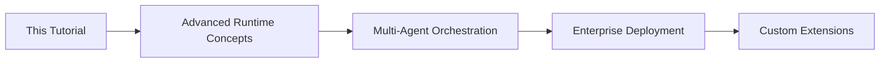
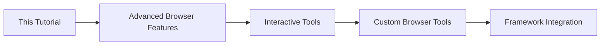
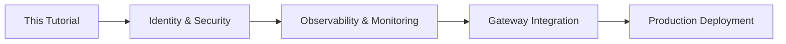

# Strands Agents + Amazon Bedrock AgentCore Browser Tool CAPTCHA Handling

This tutorial demonstrates how Strands agents handle CAPTCHAs through Amazon Bedrock's AgentCore Browser Tool - a secure, serverless browser runtime specifically designed for AI agents.

## Amazon Bedrock AgentCore Browser Tool Overview

AgentCore Browser Tool is AWS's enterprise-grade solution for AI agent browser automation:

- **Fully Managed Infrastructure**: AWS automatically provisions, patches, and scales browser fleets
- **Enterprise Security**: Isolated virtual machines prevent data leakage between sessions  
- **Automatic Scaling**: Seamlessly scales from single session to thousands based on demand
- **Built-in Observability**: Live session viewing, CloudTrail logging, and session replay
- **Agentic Framework Integration**: Native support for frameworks like Strands
- **Consumption-Based Pricing**: Pay only for actual browser session usage

## Why AgentCore Browser Tool for CAPTCHA Handling?

Traditional browser automation faces security and scalability challenges. AgentCore Browser Tool solves these with:

- **Isolated Sessions**: Each CAPTCHA solving session runs in its own secure VM
- **No Infrastructure Management**: Focus on agent logic, not browser infrastructure
- **Enterprise Compliance**: Built-in logging and audit trails for regulatory requirements
- **Automatic Scaling**: Handle CAPTCHA spikes without manual intervention
- **Session Replay**: Debug CAPTCHA failures with complete session recordings

## What You'll Learn

- **AgentCore Integration**: Configure Strands agents to use AgentCore Browser Tool sessions
- **Secure CAPTCHA Detection**: Identify CAPTCHAs within isolated, enterprise-grade browser sessions
- **Serverless Scaling**: Handle CAPTCHA workloads that automatically scale with demand
- **Observability Features**: Use AgentCore's built-in monitoring for CAPTCHA workflow debugging
- **Enterprise Security**: Implement CAPTCHA handling with VM-level isolation and audit trails
- **Cost Optimization**: Leverage consumption-based pricing for efficient CAPTCHA automation

## Prerequisites

Before starting this tutorial, ensure you have completed the following prerequisite tutorials:

### 🎯 **Required Prerequisites**

1. **[Strands Agents with Bedrock Models](../../../01-AgentCore-runtime/01-hosting-agent/01-strands-with-bedrock-model/README.md)**
   - Understanding of Strands agent creation and tool usage
   - Experience with Bedrock model integration
   - Knowledge of AgentCore Runtime deployment patterns

2. **[AgentCore Browser Tool Basics](../../README.md)**
   - Complete either [Browser Tool with NovaAct](../../01-browser-with-NovaAct/01_getting_started-agentcore-browser-tool-with-nova-act.ipynb) or [Browser Tool with Browser-use](../../02-browser-with-browserUse/getting_started-agentcore-browser-tool-with-browser-use.ipynb)
   - Familiarity with browser automation using AgentCore
   - Understanding of secure browser session management

3. **[AWS Bedrock Setup](../../../01-AgentCore-runtime/README.md)**
   - Access to AWS Bedrock with vision model permissions (Claude 3 Sonnet/Opus)
   - Proper IAM roles and policies configured
   - Understanding of Bedrock model selection and optimization

### 📚 **Recommended Background**

4. **[AgentCore Memory Integration](../../../04-AgentCore-memory/README.md)** (Optional but recommended)
   - Understanding of state management across agent sessions
   - Knowledge of short-term and long-term memory patterns
   - Experience with workflow context preservation

5. **[AgentCore Observability](../../../06-AgentCore-observability/README.md)** (Optional but recommended)
   - Familiarity with monitoring and logging patterns
   - Understanding of performance metrics and alerting
   - Knowledge of debugging and troubleshooting techniques

### 🔧 **Technical Requirements**

- **Python Environment**: Python 3.9+ with virtual environment capabilities
- **AWS CLI**: Configured with appropriate permissions
- **Development Tools**: Jupyter Notebook, VS Code (recommended)
- **Network Access**: Ability to access target websites for CAPTCHA testing

## Tutorial Structure

This tutorial is organized into 8 progressive sections, each building upon previous concepts while introducing new Strands-specific patterns and capabilities.

### 📚 **Section 1: Foundations and Architecture** (30-45 min)
**Learning Focus**: Understanding Strands three-layer architecture and service coordination
- Strands Agent orchestration layer (decision making and workflow coordination)
- AgentCore Browser Tool executor layer (secure browser automation)
- Bedrock AI analyzer layer (intelligent CAPTCHA analysis)
- Environment setup and service integration

### 🔍 **Section 2: Basic CAPTCHA Detection** (45-60 min)
**Learning Focus**: Building Strands tools for robust CAPTCHA detection
- Create `CaptchaDetectionTool` following Strands patterns
- Implement multi-strategy detection (reCAPTCHA, hCaptcha, generic)
- Master AgentCore browser session management
- Build screenshot capture for AI analysis

### 🧠 **Section 3: AI-Powered CAPTCHA Analysis** (60-75 min)
**Learning Focus**: Integrating Bedrock vision models for intelligent solving
- Configure Bedrock client and model selection
- Develop CAPTCHA solving algorithms for different types
- Implement confidence scoring and validation
- Create adaptive model selection patterns

### 🎯 **Section 4: Strands Workflow Orchestration** (75-90 min)
**Learning Focus**: Building complete agents with intelligent coordination
- Create agents that orchestrate detection and solving
- Implement service coordination patterns
- Build state management across service boundaries
- Develop intelligent decision-making behaviors

### ⚡ **Section 5: Advanced Multi-Step Workflows** (90-120 min)
**Learning Focus**: Handling complex scenarios and parallel processing
- Implement multi-step reCAPTCHA challenge workflows
- Build parallel processing for multiple CAPTCHAs
- Create advanced recovery and retry strategies
- Develop performance optimization patterns

### 🛡️ **Section 6: Comprehensive Error Handling** (60-75 min)
**Learning Focus**: Production-ready reliability and monitoring
- Implement multi-layer error handling and recovery
- Build intelligent retry strategies with exponential backoff
- Create comprehensive monitoring and alerting
- Develop graceful degradation patterns

### 🚀 **Section 7: Production Deployment Patterns** (90-120 min)
**Learning Focus**: Enterprise security, scalability, and operations
- Implement enterprise security and compliance patterns
- Build scalable architecture with auto-scaling
- Create production monitoring and observability
- Develop operational procedures and maintenance

### 🔗 **Section 8: Integration and Next Steps** (45-60 min)
**Learning Focus**: Ecosystem integration and future enhancements
- Integrate with broader Strands workflows and tools
- Build custom extensions and specialized handlers
- Plan for future enhancements and emerging technologies
- Create roadmap for continued development

### 📋 **Learning Path Validation**
Each section includes:
- **Clear Learning Objectives**: Specific skills and knowledge to be gained
- **Practical Exercises**: Hands-on implementation and testing
- **Knowledge Checks**: Questions to validate understanding
- **Success Criteria**: Measurable outcomes for section completion

For detailed learning objectives, implementation guides, and comprehensive documentation, see the **[Comprehensive Guide](./COMPREHENSIVE_GUIDE.md)**.

## Key Features Demonstrated

### Strands-Native Patterns
- **Tool Composition**: Building CAPTCHA tools that integrate seamlessly with Strands
- **Agent Orchestration**: Creating agents that handle CAPTCHAs as part of larger workflows
- **Workflow Engine**: Using Strands workflows for complex CAPTCHA scenarios
- **Error Handling**: Leveraging Strands' built-in error recovery mechanisms

### CAPTCHA Types Covered
- **Text-based CAPTCHAs**: OCR and text recognition
- **Image Selection**: Object detection and classification
- **reCAPTCHA v2/v3**: Google's CAPTCHA system integration
- **hCaptcha**: Alternative CAPTCHA service handling
- **Mathematical CAPTCHAs**: Equation solving and computation

### AI Model Integration
- **Bedrock Vision Models**: Claude 3 Sonnet for image analysis
- **Multi-modal Processing**: Text and image understanding
- **Prompt Engineering**: Optimized prompts for CAPTCHA solving
- **Confidence Scoring**: Solution reliability assessment

## Tutorial Files

This tutorial uses a streamlined file structure for optimal learning experience:

### 📚 **Core Tutorial Files**
- **[README.md](./README.md)** - This overview and getting started guide
- **[strands-captcha.ipynb](./strands-captcha.ipynb)** - Main interactive tutorial notebook
- **[COMPREHENSIVE_GUIDE.md](./COMPREHENSIVE_GUIDE.md)** - Complete documentation and implementation guide

### 🔧 **Supporting Files**
- **[examples/](./examples/)** - Progressive code examples for each section
- **[tests/](./tests/)** - Validation and testing utilities
- **[requirements.txt](./requirements.txt)** - Python dependencies

## Getting Started

1. **Install Dependencies**:
   ```bash
   pip install -r requirements.txt
   ```

2. **Configure AWS Credentials**:
   ```bash
   aws configure
   # or set environment variables
   export AWS_ACCESS_KEY_ID=your_key
   export AWS_SECRET_ACCESS_KEY=your_secret
   export AWS_DEFAULT_REGION=us-east-1
   ```

3. **Start with the Comprehensive Guide**:
   - Read the **[Comprehensive Guide](./COMPREHENSIVE_GUIDE.md)** for complete documentation
   - Review the tutorial structure and learning objectives
   - Understand the integration patterns and best practices

4. **Open the Tutorial Notebook**:
   ```bash
   jupyter notebook strands-captcha.ipynb
   ```

5. **Follow the Interactive Examples**: Work through each section progressively using both the notebook and comprehensive guide

## Ethical Considerations

This tutorial is designed for educational purposes and legitimate automation use cases. Please ensure:

- **Respect Terms of Service**: Only use CAPTCHA solving on sites where you have permission
- **Rate Limiting**: Implement appropriate delays and respect server resources
- **Compliance**: Follow applicable laws and regulations in your jurisdiction
- **Responsible Use**: Use these techniques for legitimate business automation only

## Support and Resources

- **Strands Documentation**: [Link to Strands docs]
- **AgentCore Browser Tool**: [Link to AgentCore docs]
- **AWS Bedrock**: [Link to Bedrock documentation]
- **Community Support**: [Link to community forums]

## Integration with AgentCore Ecosystem

This tutorial builds upon and integrates with the broader AgentCore tutorial ecosystem:

### 🔗 **Direct Integration Points**

#### **Runtime Integration**
- **[AgentCore Runtime](../../../01-AgentCore-runtime/README.md)**: Deploy your CAPTCHA-handling agents to production
- **[Strands with Bedrock Models](../../../01-AgentCore-runtime/01-hosting-agent/01-strands-with-bedrock-model/README.md)**: Foundation patterns used throughout this tutorial
- **[Advanced Runtime Concepts](../../../01-AgentCore-runtime/03-advanced-concepts/README.md)**: Scaling and optimization for CAPTCHA workloads

#### **Tool Ecosystem Integration**
- **[AgentCore Code Interpreter](../../01-Agent-Core-code-interpreter/README.md)**: Combine CAPTCHA handling with data analysis and processing
- **[Browser Tool Advanced Features](../../01-browser-with-NovaAct/02_agentcore-browser-tool-live-view-with-nova-act.ipynb)**: Use live view for debugging CAPTCHA workflows
- **[Interactive Browser Tools](../../interactive_tools/)**: Build interactive CAPTCHA handling interfaces

#### **Enterprise Features**
- **[AgentCore Identity](../../../03-AgentCore-identity/README.md)**: Secure authentication for CAPTCHA automation
- **[AgentCore Memory](../../../04-AgentCore-memory/README.md)**: Persistent learning from CAPTCHA solving patterns
- **[AgentCore Observability](../../../06-AgentCore-observability/README.md)**: Monitor and optimize CAPTCHA handling performance

### 🚀 **Next Steps and Advanced Learning**

#### **Immediate Next Steps** (After completing this tutorial)
1. **[End-to-End Lab Integration](../../../07-AgentCore-E2E/README.md)**
   - Integrate CAPTCHA handling into complete automation workflows
   - Build full-stack applications with CAPTCHA support
   - Deploy to production with proper monitoring and scaling

2. **[Advanced Browser Automation](../../README.md#advanced-features-intermediate-level)**
   - Master complex browser interaction patterns
   - Implement advanced debugging and monitoring
   - Build custom browser automation tools

#### **Framework Comparisons** (Explore alternative approaches)
- **[CAPTCHA Handling with Browser-use](../browser-use/README.md)**: Compare Strands patterns with Browser-use framework
- **[CAPTCHA Handling with LlamaIndex](../llamaindex/README.md)**: Understand LlamaIndex integration patterns
- **[Multi-Framework Comparison](../README.md)**: Choose optimal framework for your use case

#### **Enterprise Deployment Paths**
1. **[Production Deployment Patterns](../../../07-AgentCore-E2E/README.md)**
   - Scale CAPTCHA handling for enterprise workloads
   - Implement proper security and compliance measures
   - Build monitoring and alerting systems

2. **[Custom Integration Development](../../../02-AgentCore-gateway/README.md)**
   - Create custom APIs for CAPTCHA handling services
   - Integrate with existing enterprise systems
   - Build reusable CAPTCHA handling components

### 📚 **Learning Path Recommendations**

#### **For Strands Specialists**


#### **For Browser Automation Experts**


#### **For Enterprise Architects**


### 🔧 **Integration Code Examples**

#### **Runtime Integration**
```python
# Deploy CAPTCHA agent to AgentCore Runtime
from agentcore_runtime import RuntimeClient
from strands_captcha_handler import CaptchaHandlingAgent

runtime = RuntimeClient()
captcha_agent = CaptchaHandlingAgent()

# Deploy with proper scaling configuration
deployment = await runtime.deploy_agent(
    agent=captcha_agent,
    scaling_config={
        'min_instances': 1,
        'max_instances': 10,
        'target_utilization': 0.7
    }
)
```

#### **Memory Integration**
```python
# Integrate with AgentCore Memory for learning
from agentcore_memory import MemoryClient
from strands_captcha_handler import CaptchaHandlingAgent

memory = MemoryClient()
agent = CaptchaHandlingAgent(memory_client=memory)

# Learn from CAPTCHA solving patterns
await agent.learn_from_captcha_patterns()
```

#### **Observability Integration**
```python
# Add comprehensive monitoring
from agentcore_observability import ObservabilityClient
from strands_captcha_handler import CaptchaHandlingAgent

observability = ObservabilityClient()
agent = CaptchaHandlingAgent(observability_client=observability)

# Monitor CAPTCHA solving performance
await agent.start_performance_monitoring()
```

---

**Note**: This tutorial focuses on Strands-specific implementation patterns. For comprehensive framework comparisons and alternative approaches, explore the parallel tutorials in the `04-captcha-handling-tutorials` directory.