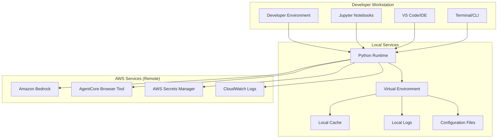
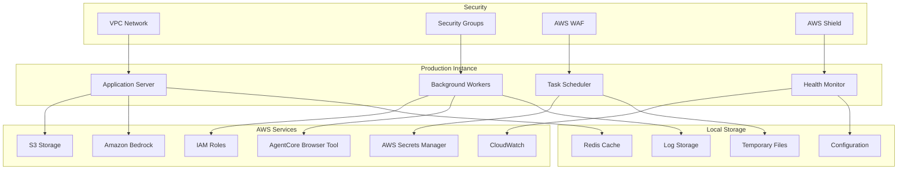
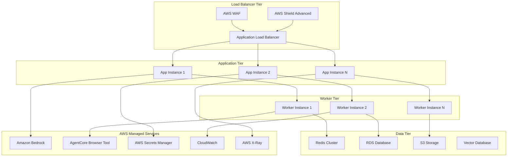

# Deployment Guide for LlamaIndex-AgentCore Browser Tool Integration

This guide provides comprehensive deployment instructions and best practices for production deployments of LlamaIndex-AgentCore Browser Tool integrations handling sensitive information.

## Deployment Architecture Options

### 1. Development Environment Deployment



#### Development Setup Steps

```bash
# 1. Create isolated Python environment
python -m venv llamaindex-agentcore-env
source llamaindex-agentcore-env/bin/activate  # Linux/Mac
# llamaindex-agentcore-env\Scripts\activate  # Windows

# 2. Install dependencies
pip install -r requirements.txt

# 3. Configure AWS credentials
aws configure
# or use environment variables
export AWS_ACCESS_KEY_ID=your_access_key
export AWS_SECRET_ACCESS_KEY=your_secret_key
export AWS_DEFAULT_REGION=us-east-1

# 4. Set up environment configuration
cp .env.example .env
# Edit .env with your specific configuration

# 5. Validate setup
python validate_integration.py

# 6. Start Jupyter for interactive development
jupyter lab
```

### 2. Production Single-Instance Deployment



#### Production Setup Script

```bash
#!/bin/bash
# production_setup.sh

set -e

echo "Setting up LlamaIndex-AgentCore production environment..."

# 1. System dependencies
sudo apt-get update
sudo apt-get install -y python3.9 python3.9-venv python3-pip redis-server nginx

# 2. Create application user
sudo useradd -m -s /bin/bash llamaindex-app
sudo mkdir -p /opt/llamaindex-agentcore
sudo chown llamaindex-app:llamaindex-app /opt/llamaindex-agentcore

# 3. Set up Python environment
sudo -u llamaindex-app python3.9 -m venv /opt/llamaindex-agentcore/venv
sudo -u llamaindex-app /opt/llamaindex-agentcore/venv/bin/pip install -r requirements.txt

# 4. Configure systemd services
sudo cp deployment/llamaindex-app.service /etc/systemd/system/
sudo cp deployment/llamaindex-worker.service /etc/systemd/system/
sudo systemctl daemon-reload
sudo systemctl enable llamaindex-app llamaindex-worker

# 5. Configure nginx
sudo cp deployment/nginx.conf /etc/nginx/sites-available/llamaindex-agentcore
sudo ln -s /etc/nginx/sites-available/llamaindex-agentcore /etc/nginx/sites-enabled/
sudo nginx -t
sudo systemctl restart nginx

# 6. Set up log rotation
sudo cp deployment/logrotate.conf /etc/logrotate.d/llamaindex-agentcore

# 7. Configure security
sudo ufw allow 22/tcp
sudo ufw allow 80/tcp
sudo ufw allow 443/tcp
sudo ufw --force enable

# 8. Start services
sudo systemctl start llamaindex-app llamaindex-worker
sudo systemctl status llamaindex-app llamaindex-worker

echo "Production setup complete!"
```

### 3. High-Availability Multi-Instance Deployment



#### High-Availability Deployment with Terraform

```hcl
# terraform/main.tf

terraform {
  required_providers {
    aws = {
      source  = "hashicorp/aws"
      version = "~> 5.0"
    }
  }
}

provider "aws" {
  region = var.aws_region
}

# VPC Configuration
resource "aws_vpc" "llamaindex_vpc" {
  cidr_block           = "10.0.0.0/16"
  enable_dns_hostnames = true
  enable_dns_support   = true
  
  tags = {
    Name = "llamaindex-agentcore-vpc"
    Environment = var.environment
  }
}

# Public Subnets for Load Balancer
resource "aws_subnet" "public_subnets" {
  count             = length(var.availability_zones)
  vpc_id            = aws_vpc.llamaindex_vpc.id
  cidr_block        = "10.0.${count.index + 1}.0/24"
  availability_zone = var.availability_zones[count.index]
  
  map_public_ip_on_launch = true
  
  tags = {
    Name = "llamaindex-public-subnet-${count.index + 1}"
    Type = "Public"
  }
}

# Private Subnets for Application Instances
resource "aws_subnet" "private_subnets" {
  count             = length(var.availability_zones)
  vpc_id            = aws_vpc.llamaindex_vpc.id
  cidr_block        = "10.0.${count.index + 10}.0/24"
  availability_zone = var.availability_zones[count.index]
  
  tags = {
    Name = "llamaindex-private-subnet-${count.index + 1}"
    Type = "Private"
  }
}

# Application Load Balancer
resource "aws_lb" "llamaindex_alb" {
  name               = "llamaindex-agentcore-alb"
  internal           = false
  load_balancer_type = "application"
  security_groups    = [aws_security_group.alb_sg.id]
  subnets            = aws_subnet.public_subnets[*].id
  
  enable_deletion_protection = var.environment == "production"
  
  tags = {
    Name = "llamaindex-agentcore-alb"
    Environment = var.environment
  }
}

# Auto Scaling Group for Application Instances
resource "aws_autoscaling_group" "app_asg" {
  name                = "llamaindex-app-asg"
  vpc_zone_identifier = aws_subnet.private_subnets[*].id
  target_group_arns   = [aws_lb_target_group.app_tg.arn]
  health_check_type   = "ELB"
  
  min_size         = var.min_instances
  max_size         = var.max_instances
  desired_capacity = var.desired_instances
  
  launch_template {
    id      = aws_launch_template.app_template.id
    version = "$Latest"
  }
  
  tag {
    key                 = "Name"
    value               = "llamaindex-app-instance"
    propagate_at_launch = true
  }
}

# Launch Template for Application Instances
resource "aws_launch_template" "app_template" {
  name_prefix   = "llamaindex-app-"
  image_id      = var.ami_id
  instance_type = var.instance_type
  
  vpc_security_group_ids = [aws_security_group.app_sg.id]
  
  iam_instance_profile {
    name = aws_iam_instance_profile.app_profile.name
  }
  
  user_data = base64encode(templatefile("${path.module}/user_data.sh", {
    environment = var.environment
    region      = var.aws_region
  }))
  
  tag_specifications {
    resource_type = "instance"
    tags = {
      Name = "llamaindex-app-instance"
      Environment = var.environment
    }
  }
}
```

## Security Configuration

### 1. IAM Roles and Policies

```json
{
  "Version": "2012-10-17",
  "Statement": [
    {
      "Effect": "Allow",
      "Action": [
        "bedrock:InvokeModel",
        "bedrock:InvokeModelWithResponseStream"
      ],
      "Resource": [
        "arn:aws:bedrock:*:*:foundation-model/*"
      ]
    },
    {
      "Effect": "Allow",
      "Action": [
        "bedrock-agentcore:CreateBrowserSession",
        "bedrock-agentcore:GetBrowserSession",
        "bedrock-agentcore:DeleteBrowserSession",
        "bedrock-agentcore:SendBrowserAction",
        "bedrock-agentcore:GetBrowserSessionStatus"
      ],
      "Resource": "*"
    },
    {
      "Effect": "Allow",
      "Action": [
        "secretsmanager:GetSecretValue",
        "secretsmanager:DescribeSecret"
      ],
      "Resource": [
        "arn:aws:secretsmanager:*:*:secret:llamaindex-agentcore/*"
      ]
    },
    {
      "Effect": "Allow",
      "Action": [
        "logs:CreateLogGroup",
        "logs:CreateLogStream",
        "logs:PutLogEvents",
        "logs:DescribeLogStreams"
      ],
      "Resource": [
        "arn:aws:logs:*:*:log-group:/aws/llamaindex-agentcore/*"
      ]
    },
    {
      "Effect": "Allow",
      "Action": [
        "s3:GetObject",
        "s3:PutObject",
        "s3:DeleteObject"
      ],
      "Resource": [
        "arn:aws:s3:::llamaindex-agentcore-*/*"
      ]
    }
  ]
}
```

### 2. Network Security Configuration

```yaml
# security-groups.yaml
SecurityGroups:
  ALBSecurityGroup:
    Type: AWS::EC2::SecurityGroup
    Properties:
      GroupDescription: Security group for Application Load Balancer
      VpcId: !Ref VPC
      SecurityGroupIngress:
        - IpProtocol: tcp
          FromPort: 80
          ToPort: 80
          CidrIp: 0.0.0.0/0
        - IpProtocol: tcp
          FromPort: 443
          ToPort: 443
          CidrIp: 0.0.0.0/0
      SecurityGroupEgress:
        - IpProtocol: tcp
          FromPort: 8000
          ToPort: 8000
          DestinationSecurityGroupId: !Ref AppSecurityGroup

  AppSecurityGroup:
    Type: AWS::EC2::SecurityGroup
    Properties:
      GroupDescription: Security group for application instances
      VpcId: !Ref VPC
      SecurityGroupIngress:
        - IpProtocol: tcp
          FromPort: 8000
          ToPort: 8000
          SourceSecurityGroupId: !Ref ALBSecurityGroup
        - IpProtocol: tcp
          FromPort: 22
          ToPort: 22
          SourceSecurityGroupId: !Ref BastionSecurityGroup
      SecurityGroupEgress:
        - IpProtocol: tcp
          FromPort: 443
          ToPort: 443
          CidrIp: 0.0.0.0/0  # HTTPS to AWS services
        - IpProtocol: tcp
          FromPort: 6379
          ToPort: 6379
          DestinationSecurityGroupId: !Ref RedisSecurityGroup

  RedisSecurityGroup:
    Type: AWS::EC2::SecurityGroup
    Properties:
      GroupDescription: Security group for Redis cluster
      VpcId: !Ref VPC
      SecurityGroupIngress:
        - IpProtocol: tcp
          FromPort: 6379
          ToPort: 6379
          SourceSecurityGroupId: !Ref AppSecurityGroup
```

### 3. Secrets Management

```python
# secrets_manager.py

import boto3
import json
from typing import Dict, Any
from cryptography.fernet import Fernet

class ProductionSecretsManager:
    """
    Production-grade secrets management for LlamaIndex-AgentCore integration.
    """
    
    def __init__(self, region: str, kms_key_id: str):
        self.secrets_client = boto3.client('secretsmanager', region_name=region)
        self.kms_client = boto3.client('kms', region_name=region)
        self.kms_key_id = kms_key_id
    
    def store_credentials(self, 
                         secret_name: str, 
                         credentials: Dict[str, Any],
                         description: str = "") -> str:
        """
        Store credentials in AWS Secrets Manager with KMS encryption.
        """
        try:
            response = self.secrets_client.create_secret(
                Name=secret_name,
                Description=description,
                SecretString=json.dumps(credentials),
                KmsKeyId=self.kms_key_id,
                ReplicaRegions=[
                    {
                        'Region': 'us-west-2',  # Backup region
                        'KmsKeyId': self.kms_key_id
                    }
                ]
            )
            return response['ARN']
        except self.secrets_client.exceptions.ResourceExistsException:
            # Update existing secret
            self.secrets_client.update_secret(
                SecretId=secret_name,
                SecretString=json.dumps(credentials),
                KmsKeyId=self.kms_key_id
            )
            return f"arn:aws:secretsmanager:{region}:*:secret:{secret_name}"
    
    def retrieve_credentials(self, secret_name: str) -> Dict[str, Any]:
        """
        Retrieve and decrypt credentials from AWS Secrets Manager.
        """
        try:
            response = self.secrets_client.get_secret_value(SecretId=secret_name)
            return json.loads(response['SecretString'])
        except Exception as e:
            raise CredentialRetrievalError(f"Failed to retrieve credentials: {str(e)}")
    
    def rotate_credentials(self, secret_name: str, rotation_lambda_arn: str):
        """
        Set up automatic credential rotation.
        """
        self.secrets_client.rotate_secret(
            SecretId=secret_name,
            RotationLambdaArn=rotation_lambda_arn,
            RotationRules={
                'AutomaticallyAfterDays': 30
            }
        )
```

## Monitoring and Observability

### 1. CloudWatch Configuration

```yaml
# cloudwatch-config.yaml
Resources:
  LlamaIndexLogGroup:
    Type: AWS::Logs::LogGroup
    Properties:
      LogGroupName: /aws/llamaindex-agentcore/application
      RetentionInDays: 30
      KmsKeyId: !Ref LogsKMSKey

  SecurityLogGroup:
    Type: AWS::Logs::LogGroup
    Properties:
      LogGroupName: /aws/llamaindex-agentcore/security
      RetentionInDays: 90
      KmsKeyId: !Ref LogsKMSKey

  AuditLogGroup:
    Type: AWS::Logs::LogGroup
    Properties:
      LogGroupName: /aws/llamaindex-agentcore/audit
      RetentionInDays: 365
      KmsKeyId: !Ref LogsKMSKey

  # Custom Metrics
  PIIDetectionMetric:
    Type: AWS::Logs::MetricFilter
    Properties:
      LogGroupName: !Ref SecurityLogGroup
      FilterPattern: '[timestamp, level="INFO", component="PIIDetector", ...]'
      MetricTransformations:
        - MetricNamespace: LlamaIndex/Security
          MetricName: PIIDetectionCount
          MetricValue: "1"

  SessionCreationMetric:
    Type: AWS::Logs::MetricFilter
    Properties:
      LogGroupName: !Ref LlamaIndexLogGroup
      FilterPattern: '[timestamp, level="INFO", component="SessionManager", action="CREATE", ...]'
      MetricTransformations:
        - MetricNamespace: LlamaIndex/Sessions
          MetricName: SessionCreationCount
          MetricValue: "1"

  # Alarms
  HighPIIDetectionAlarm:
    Type: AWS::CloudWatch::Alarm
    Properties:
      AlarmName: LlamaIndex-HighPIIDetection
      AlarmDescription: High rate of PII detection
      MetricName: PIIDetectionCount
      Namespace: LlamaIndex/Security
      Statistic: Sum
      Period: 300
      EvaluationPeriods: 2
      Threshold: 100
      ComparisonOperator: GreaterThanThreshold
      AlarmActions:
        - !Ref SecurityAlertsTopic

  SessionFailureAlarm:
    Type: AWS::CloudWatch::Alarm
    Properties:
      AlarmName: LlamaIndex-SessionFailures
      AlarmDescription: High rate of session creation failures
      MetricName: SessionCreationErrors
      Namespace: LlamaIndex/Sessions
      Statistic: Sum
      Period: 300
      EvaluationPeriods: 1
      Threshold: 10
      ComparisonOperator: GreaterThanThreshold
      AlarmActions:
        - !Ref OperationalAlertsTopic
```

### 2. Application Performance Monitoring

```python
# monitoring.py

import time
import psutil
import boto3
from typing import Dict, Any
from dataclasses import dataclass
from datetime import datetime

@dataclass
class PerformanceMetrics:
    """Performance metrics for monitoring."""
    cpu_usage: float
    memory_usage: float
    disk_usage: float
    active_sessions: int
    request_latency: float
    error_rate: float
    timestamp: datetime

class ProductionMonitor:
    """
    Production monitoring for LlamaIndex-AgentCore integration.
    """
    
    def __init__(self, region: str, namespace: str = "LlamaIndex/Production"):
        self.cloudwatch = boto3.client('cloudwatch', region_name=region)
        self.namespace = namespace
        self.start_time = time.time()
    
    def collect_system_metrics(self) -> PerformanceMetrics:
        """Collect system performance metrics."""
        return PerformanceMetrics(
            cpu_usage=psutil.cpu_percent(interval=1),
            memory_usage=psutil.virtual_memory().percent,
            disk_usage=psutil.disk_usage('/').percent,
            active_sessions=self._count_active_sessions(),
            request_latency=self._calculate_avg_latency(),
            error_rate=self._calculate_error_rate(),
            timestamp=datetime.utcnow()
        )
    
    def publish_metrics(self, metrics: PerformanceMetrics):
        """Publish metrics to CloudWatch."""
        metric_data = [
            {
                'MetricName': 'CPUUsage',
                'Value': metrics.cpu_usage,
                'Unit': 'Percent',
                'Timestamp': metrics.timestamp
            },
            {
                'MetricName': 'MemoryUsage',
                'Value': metrics.memory_usage,
                'Unit': 'Percent',
                'Timestamp': metrics.timestamp
            },
            {
                'MetricName': 'ActiveSessions',
                'Value': metrics.active_sessions,
                'Unit': 'Count',
                'Timestamp': metrics.timestamp
            },
            {
                'MetricName': 'RequestLatency',
                'Value': metrics.request_latency,
                'Unit': 'Milliseconds',
                'Timestamp': metrics.timestamp
            },
            {
                'MetricName': 'ErrorRate',
                'Value': metrics.error_rate,
                'Unit': 'Percent',
                'Timestamp': metrics.timestamp
            }
        ]
        
        self.cloudwatch.put_metric_data(
            Namespace=self.namespace,
            MetricData=metric_data
        )
    
    def create_dashboard(self):
        """Create CloudWatch dashboard for monitoring."""
        dashboard_body = {
            "widgets": [
                {
                    "type": "metric",
                    "properties": {
                        "metrics": [
                            [self.namespace, "CPUUsage"],
                            [self.namespace, "MemoryUsage"]
                        ],
                        "period": 300,
                        "stat": "Average",
                        "region": "us-east-1",
                        "title": "System Resources"
                    }
                },
                {
                    "type": "metric",
                    "properties": {
                        "metrics": [
                            [self.namespace, "ActiveSessions"],
                            [self.namespace, "RequestLatency"]
                        ],
                        "period": 300,
                        "stat": "Average",
                        "region": "us-east-1",
                        "title": "Application Performance"
                    }
                },
                {
                    "type": "log",
                    "properties": {
                        "query": "SOURCE '/aws/llamaindex-agentcore/security'\n| fields @timestamp, level, message\n| filter level = \"ERROR\"\n| sort @timestamp desc\n| limit 100",
                        "region": "us-east-1",
                        "title": "Security Errors"
                    }
                }
            ]
        }
        
        self.cloudwatch.put_dashboard(
            DashboardName='LlamaIndex-AgentCore-Production',
            DashboardBody=json.dumps(dashboard_body)
        )
```

## Backup and Disaster Recovery

### 1. Data Backup Strategy

```python
# backup_manager.py

import boto3
import json
from datetime import datetime, timedelta
from typing import List, Dict, Any

class BackupManager:
    """
    Manages backup and disaster recovery for LlamaIndex-AgentCore deployment.
    """
    
    def __init__(self, region: str, backup_bucket: str):
        self.s3 = boto3.client('s3', region_name=region)
        self.backup_bucket = backup_bucket
        self.region = region
    
    def backup_vector_store(self, vector_store_path: str) -> str:
        """Backup vector store data to S3."""
        timestamp = datetime.utcnow().strftime('%Y%m%d_%H%M%S')
        backup_key = f"vector_store_backups/{timestamp}/vector_store.tar.gz"
        
        # Create compressed backup
        import tarfile
        import tempfile
        
        with tempfile.NamedTemporaryFile(suffix='.tar.gz') as temp_file:
            with tarfile.open(temp_file.name, 'w:gz') as tar:
                tar.add(vector_store_path, arcname='vector_store')
            
            # Upload to S3
            self.s3.upload_file(
                temp_file.name,
                self.backup_bucket,
                backup_key,
                ExtraArgs={
                    'ServerSideEncryption': 'aws:kms',
                    'StorageClass': 'STANDARD_IA'
                }
            )
        
        return f"s3://{self.backup_bucket}/{backup_key}"
    
    def backup_configuration(self, config_data: Dict[str, Any]) -> str:
        """Backup configuration data."""
        timestamp = datetime.utcnow().strftime('%Y%m%d_%H%M%S')
        backup_key = f"config_backups/{timestamp}/config.json"
        
        self.s3.put_object(
            Bucket=self.backup_bucket,
            Key=backup_key,
            Body=json.dumps(config_data, indent=2),
            ServerSideEncryption='aws:kms',
            StorageClass='STANDARD_IA'
        )
        
        return f"s3://{self.backup_bucket}/{backup_key}"
    
    def restore_from_backup(self, backup_s3_uri: str, restore_path: str):
        """Restore data from S3 backup."""
        # Parse S3 URI
        bucket, key = backup_s3_uri.replace('s3://', '').split('/', 1)
        
        # Download and extract
        import tempfile
        import tarfile
        
        with tempfile.NamedTemporaryFile() as temp_file:
            self.s3.download_file(bucket, key, temp_file.name)
            
            with tarfile.open(temp_file.name, 'r:gz') as tar:
                tar.extractall(restore_path)
    
    def cleanup_old_backups(self, retention_days: int = 30):
        """Clean up old backups based on retention policy."""
        cutoff_date = datetime.utcnow() - timedelta(days=retention_days)
        
        paginator = self.s3.get_paginator('list_objects_v2')
        
        for page in paginator.paginate(Bucket=self.backup_bucket):
            if 'Contents' in page:
                for obj in page['Contents']:
                    if obj['LastModified'].replace(tzinfo=None) < cutoff_date:
                        self.s3.delete_object(
                            Bucket=self.backup_bucket,
                            Key=obj['Key']
                        )
```

### 2. Disaster Recovery Plan

```yaml
# disaster-recovery.yaml
DisasterRecoveryPlan:
  RPO: 4 hours  # Recovery Point Objective
  RTO: 2 hours  # Recovery Time Objective
  
  BackupStrategy:
    VectorStore:
      Frequency: Every 4 hours
      Retention: 30 days
      CrossRegionReplication: true
    
    Configuration:
      Frequency: On change
      Retention: 90 days
      VersionControl: true
    
    Logs:
      Frequency: Real-time
      Retention: 365 days
      CrossRegionReplication: true
  
  RecoveryProcedures:
    - Step: "Assess damage and determine recovery scope"
    - Step: "Provision new infrastructure in backup region"
    - Step: "Restore vector store from latest backup"
    - Step: "Restore configuration from backup"
    - Step: "Update DNS to point to new infrastructure"
    - Step: "Validate system functionality"
    - Step: "Resume normal operations"
  
  Testing:
    Frequency: Quarterly
    Scope: Full disaster recovery simulation
    Documentation: Required for each test
```

## Performance Optimization

### 1. Caching Strategy

```python
# cache_manager.py

import redis
import json
import hashlib
from typing import Any, Optional
from datetime import timedelta

class ProductionCacheManager:
    """
    Production-grade caching for LlamaIndex-AgentCore integration.
    """
    
    def __init__(self, redis_cluster_endpoint: str, region: str):
        self.redis_client = redis.Redis.from_url(
            redis_cluster_endpoint,
            decode_responses=True,
            socket_connect_timeout=5,
            socket_timeout=5,
            retry_on_timeout=True
        )
        self.region = region
    
    def cache_embedding(self, 
                       text: str, 
                       embedding: List[float], 
                       ttl: timedelta = timedelta(hours=24)):
        """Cache text embedding with TTL."""
        cache_key = f"embedding:{self._hash_text(text)}"
        
        self.redis_client.setex(
            cache_key,
            ttl,
            json.dumps(embedding)
        )
    
    def get_cached_embedding(self, text: str) -> Optional[List[float]]:
        """Retrieve cached embedding."""
        cache_key = f"embedding:{self._hash_text(text)}"
        cached_data = self.redis_client.get(cache_key)
        
        if cached_data:
            return json.loads(cached_data)
        return None
    
    def cache_session_data(self, 
                          session_id: str, 
                          data: Dict[str, Any],
                          ttl: timedelta = timedelta(minutes=30)):
        """Cache session data."""
        cache_key = f"session:{session_id}"
        
        self.redis_client.setex(
            cache_key,
            ttl,
            json.dumps(data)
        )
    
    def get_cached_session_data(self, session_id: str) -> Optional[Dict[str, Any]]:
        """Retrieve cached session data."""
        cache_key = f"session:{session_id}"
        cached_data = self.redis_client.get(cache_key)
        
        if cached_data:
            return json.loads(cached_data)
        return None
    
    def invalidate_cache(self, pattern: str):
        """Invalidate cache entries matching pattern."""
        keys = self.redis_client.keys(pattern)
        if keys:
            self.redis_client.delete(*keys)
    
    def _hash_text(self, text: str) -> str:
        """Generate hash for text caching."""
        return hashlib.sha256(text.encode()).hexdigest()[:16]
```

### 2. Auto-Scaling Configuration

```yaml
# autoscaling.yaml
Resources:
  AppAutoScalingTarget:
    Type: AWS::ApplicationAutoScaling::ScalableTarget
    Properties:
      MaxCapacity: 20
      MinCapacity: 2
      ResourceId: !Sub "service/${ClusterName}/${ServiceName}"
      RoleARN: !GetAtt AutoScalingRole.Arn
      ScalableDimension: ecs:service:DesiredCount
      ServiceNamespace: ecs

  AppScalingPolicy:
    Type: AWS::ApplicationAutoScaling::ScalingPolicy
    Properties:
      PolicyName: LlamaIndexAppScalingPolicy
      PolicyType: TargetTrackingScaling
      ScalingTargetId: !Ref AppAutoScalingTarget
      TargetTrackingScalingPolicyConfiguration:
        PredefinedMetricSpecification:
          PredefinedMetricType: ECSServiceAverageCPUUtilization
        TargetValue: 70.0
        ScaleOutCooldown: 300
        ScaleInCooldown: 300

  SessionBasedScalingPolicy:
    Type: AWS::ApplicationAutoScaling::ScalingPolicy
    Properties:
      PolicyName: SessionBasedScaling
      PolicyType: TargetTrackingScaling
      ScalingTargetId: !Ref AppAutoScalingTarget
      TargetTrackingScalingPolicyConfiguration:
        CustomizedMetricSpecification:
          MetricName: ActiveSessions
          Namespace: LlamaIndex/Sessions
          Statistic: Average
        TargetValue: 50.0
        ScaleOutCooldown: 180
        ScaleInCooldown: 300
```

This comprehensive deployment guide provides everything needed to deploy LlamaIndex-AgentCore Browser Tool integrations in production environments with proper security, monitoring, and scalability considerations.