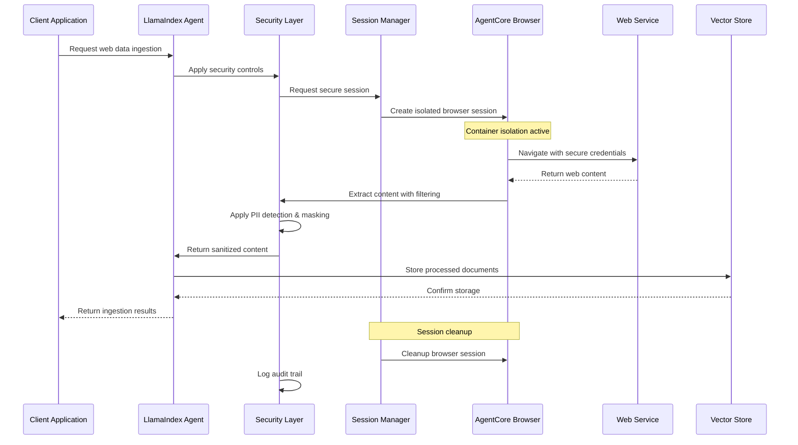
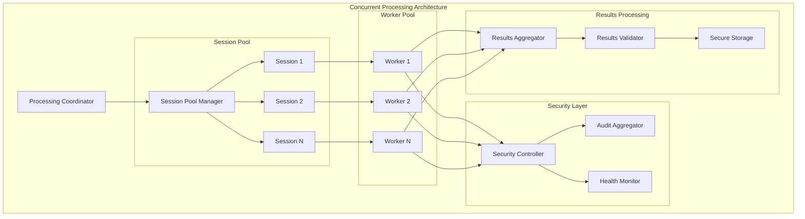
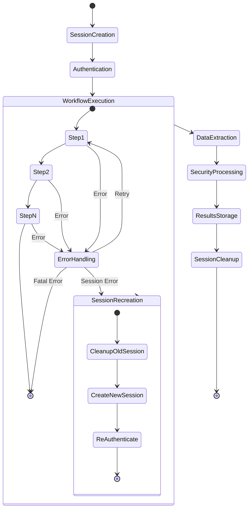
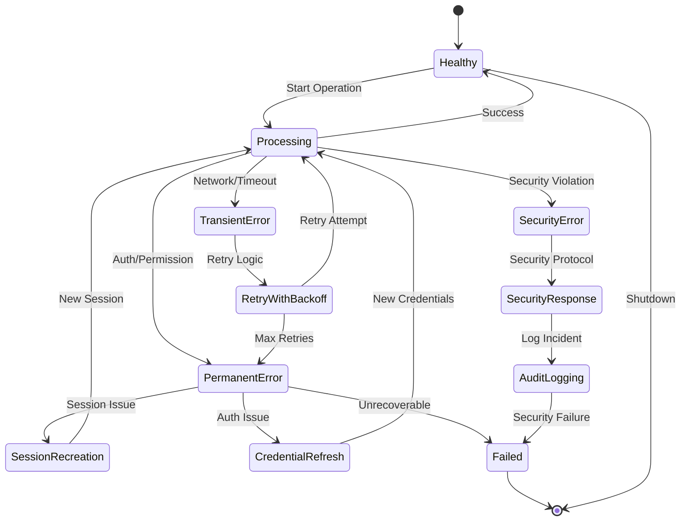
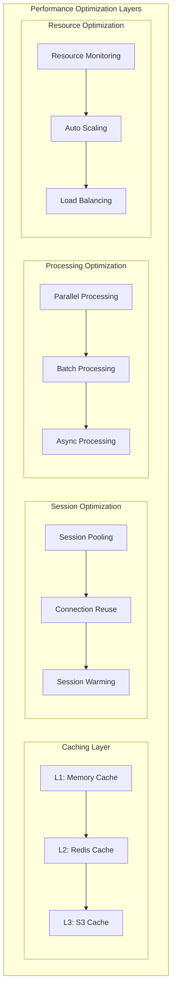

# Integration Patterns for LlamaIndex-AgentCore Browser Tool

This document outlines proven integration patterns and best practices for combining LlamaIndex with AgentCore Browser Tool for secure sensitive information handling.

## Core Integration Patterns

### 1. Secure Web Data Ingestion Pattern

This pattern demonstrates how to securely ingest web data using LlamaIndex with AgentCore Browser Tool while maintaining data protection throughout the process.



#### Implementation Example

```python
class SecureWebDataIngestionPattern:
    """
    Implements secure web data ingestion with comprehensive protection.
    """
    
    def __init__(self, config: SecurityConfig):
        self.security_layer = SecurityLayer(config)
        self.session_manager = SessionManager(config)
        self.llama_agent = LlamaIndexAgent(config)
        self.audit_logger = AuditLogger(config)
    
    async def ingest_web_data(self, 
                             url: str, 
                             credentials: Optional[Dict] = None,
                             extraction_config: ExtractionConfig = None) -> IngestionResult:
        """
        Securely ingest web data with full protection pipeline.
        """
        
        # Step 1: Create secure session
        session = await self.session_manager.create_secure_session(
            isolation_level=IsolationLevel.HIGH,
            network_policy=NetworkPolicy.RESTRICTED
        )
        
        try:
            # Step 2: Navigate and authenticate
            if credentials:
                await session.authenticate(credentials)
            
            await session.navigate(url)
            
            # Step 3: Extract content with security filtering
            raw_content = await session.extract_content(extraction_config)
            
            # Step 4: Apply security controls
            sanitized_content = await self.security_layer.sanitize_content(
                content=raw_content,
                sensitivity_level=SensitivityLevel.HIGH
            )
            
            # Step 5: Process with LlamaIndex
            documents = await self.llama_agent.process_content(
                content=sanitized_content,
                metadata={
                    'source_url': url,
                    'extraction_timestamp': datetime.utcnow(),
                    'security_level': 'high',
                    'session_id': session.session_id
                }
            )
            
            # Step 6: Store securely
            storage_result = await self.llama_agent.store_documents(documents)
            
            # Step 7: Log audit trail
            await self.audit_logger.log_ingestion_event(
                session_id=session.session_id,
                url=url,
                documents_processed=len(documents),
                security_events=sanitized_content.security_events
            )
            
            return IngestionResult(
                success=True,
                documents_processed=len(documents),
                storage_result=storage_result,
                security_summary=sanitized_content.security_summary
            )
            
        finally:
            # Step 8: Cleanup session
            await self.session_manager.cleanup_session(session.session_id)
```

### 2. Multi-Session Concurrent Processing Pattern

This pattern enables high-throughput processing of multiple web sources concurrently while maintaining security isolation.



#### Implementation Example

```python
class ConcurrentProcessingPattern:
    """
    Implements concurrent processing with session pooling and security controls.
    """
    
    def __init__(self, config: ConcurrentConfig):
        self.session_pool = SessionPool(
            max_sessions=config.max_concurrent_sessions,
            region=config.aws_region
        )
        self.security_controller = SecurityController(config)
        self.results_aggregator = ResultsAggregator(config)
        self.health_monitor = HealthMonitor(config)
    
    async def process_multiple_sources(self, 
                                     sources: List[WebSource],
                                     processing_config: ProcessingConfig) -> ConcurrentResults:
        """
        Process multiple web sources concurrently with security controls.
        """
        
        # Step 1: Initialize concurrent processing
        semaphore = asyncio.Semaphore(processing_config.max_concurrent)
        tasks = []
        
        # Step 2: Create processing tasks
        for source in sources:
            task = self._create_processing_task(
                source=source,
                semaphore=semaphore,
                config=processing_config
            )
            tasks.append(task)
        
        # Step 3: Execute concurrent processing
        results = await asyncio.gather(*tasks, return_exceptions=True)
        
        # Step 4: Aggregate and validate results
        aggregated_results = await self.results_aggregator.aggregate(results)
        
        # Step 5: Generate security summary
        security_summary = await self.security_controller.generate_summary(
            results=aggregated_results
        )
        
        return ConcurrentResults(
            total_sources=len(sources),
            successful_processing=aggregated_results.successful_count,
            failed_processing=aggregated_results.failed_count,
            security_summary=security_summary,
            processing_time=aggregated_results.total_processing_time
        )
    
    async def _create_processing_task(self, 
                                    source: WebSource,
                                    semaphore: asyncio.Semaphore,
                                    config: ProcessingConfig) -> ProcessingResult:
        """
        Create individual processing task with session management.
        """
        async with semaphore:
            session = None
            try:
                # Get session from pool
                session = await self.session_pool.acquire_session()
                
                # Process source with security controls
                result = await self._process_single_source(
                    source=source,
                    session=session,
                    config=config
                )
                
                return result
                
            except Exception as e:
                # Handle errors securely
                return await self.security_controller.handle_processing_error(
                    error=e,
                    source=source,
                    session_id=session.session_id if session else None
                )
                
            finally:
                # Return session to pool
                if session:
                    await self.session_pool.release_session(session)
```

### 3. Authenticated Workflow Automation Pattern

This pattern handles complex multi-step workflows that require authentication and session persistence across multiple pages.



#### Implementation Example

```python
class AuthenticatedWorkflowPattern:
    """
    Implements authenticated workflow automation with session persistence.
    """
    
    def __init__(self, config: WorkflowConfig):
        self.session_manager = PersistentSessionManager(config)
        self.auth_manager = AuthenticationManager(config)
        self.workflow_engine = WorkflowEngine(config)
        self.security_processor = SecurityProcessor(config)
    
    async def execute_authenticated_workflow(self, 
                                           workflow_definition: WorkflowDefinition,
                                           credentials: AuthCredentials) -> WorkflowResult:
        """
        Execute multi-step authenticated workflow with security controls.
        """
        
        session = None
        try:
            # Step 1: Create persistent session
            session = await self.session_manager.create_persistent_session(
                workflow_id=workflow_definition.workflow_id,
                timeout=workflow_definition.session_timeout
            )
            
            # Step 2: Authenticate
            auth_result = await self.auth_manager.authenticate(
                session=session,
                credentials=credentials,
                auth_config=workflow_definition.auth_config
            )
            
            if not auth_result.success:
                raise AuthenticationError("Authentication failed")
            
            # Step 3: Execute workflow steps
            workflow_results = []
            for step in workflow_definition.steps:
                step_result = await self._execute_workflow_step(
                    step=step,
                    session=session,
                    context=WorkflowContext(
                        previous_results=workflow_results,
                        auth_context=auth_result.auth_context
                    )
                )
                workflow_results.append(step_result)
            
            # Step 4: Process extracted data
            processed_data = await self.security_processor.process_workflow_data(
                workflow_results=workflow_results,
                security_config=workflow_definition.security_config
            )
            
            return WorkflowResult(
                success=True,
                workflow_id=workflow_definition.workflow_id,
                steps_completed=len(workflow_results),
                processed_data=processed_data,
                session_id=session.session_id
            )
            
        except Exception as e:
            # Handle workflow errors securely
            return await self._handle_workflow_error(
                error=e,
                workflow_definition=workflow_definition,
                session=session
            )
            
        finally:
            # Cleanup session
            if session:
                await self.session_manager.cleanup_session(session.session_id)
    
    async def _execute_workflow_step(self, 
                                   step: WorkflowStep,
                                   session: PersistentSession,
                                   context: WorkflowContext) -> StepResult:
        """
        Execute individual workflow step with error handling and security.
        """
        
        try:
            # Execute step action
            if step.action_type == ActionType.NAVIGATE:
                result = await session.navigate(step.target_url)
            elif step.action_type == ActionType.FILL_FORM:
                result = await session.fill_form(step.form_data)
            elif step.action_type == ActionType.EXTRACT_DATA:
                result = await session.extract_data(step.extraction_config)
            elif step.action_type == ActionType.CLICK_ELEMENT:
                result = await session.click_element(step.element_selector)
            else:
                raise ValueError(f"Unknown action type: {step.action_type}")
            
            # Apply security processing to step result
            secure_result = await self.security_processor.process_step_result(
                result=result,
                step=step,
                context=context
            )
            
            return StepResult(
                step_id=step.step_id,
                success=True,
                result=secure_result,
                execution_time=result.execution_time
            )
            
        except Exception as e:
            # Handle step error with retry logic
            return await self._handle_step_error(
                error=e,
                step=step,
                session=session,
                context=context
            )
```

### 4. RAG Pipeline Integration Pattern

This pattern integrates web-extracted sensitive data into LlamaIndex RAG pipelines with comprehensive security controls.

```mermaid
graph TB
    subgraph "RAG Pipeline with Security"
        subgraph "Data Ingestion"
            WEB_EXTRACT[Web Data Extraction]
            SECURITY_FILTER[Security Filtering]
            PII_DETECTION[PII Detection]
            DATA_SANITIZATION[Data Sanitization]
        end
        
        subgraph "Document Processing"
            CHUNKING[Secure Chunking]
            EMBEDDING[Embedding Generation]
            METADATA[Security Metadata]
            INDEXING[Secure Indexing]
        end
        
        subgraph "Query Processing"
            QUERY_INPUT[User Query]
            QUERY_SANITIZATION[Query Sanitization]
            RETRIEVAL[Secure Retrieval]
            CONTEXT_FILTERING[Context Filtering]
        end
        
        subgraph "Response Generation"
            LLM_PROCESSING[LLM Processing]
            RESPONSE_FILTERING[Response Filtering]
            PII_MASKING[Response PII Masking]
            AUDIT_LOGGING[Audit Logging]
        end
    end
    
    WEB_EXTRACT --> SECURITY_FILTER
    SECURITY_FILTER --> PII_DETECTION
    PII_DETECTION --> DATA_SANITIZATION
    
    DATA_SANITIZATION --> CHUNKING
    CHUNKING --> EMBEDDING
    EMBEDDING --> METADATA
    METADATA --> INDEXING
    
    QUERY_INPUT --> QUERY_SANITIZATION
    QUERY_SANITIZATION --> RETRIEVAL
    RETRIEVAL --> CONTEXT_FILTERING
    
    CONTEXT_FILTERING --> LLM_PROCESSING
    LLM_PROCESSING --> RESPONSE_FILTERING
    RESPONSE_FILTERING --> PII_MASKING
    PII_MASKING --> AUDIT_LOGGING
```



#### Implementation Example

```python
class SecureRAGPipelinePattern:
    """
    Implements secure RAG pipeline with web data integration.
    """
    
    def __init__(self, config: RAGConfig):
        self.web_extractor = SecureWebExtractor(config)
        self.security_processor = SecurityProcessor(config)
        self.document_processor = SecureDocumentProcessor(config)
        self.query_engine = SecureQueryEngine(config)
        self.response_processor = ResponseProcessor(config)
    
    async def build_secure_rag_pipeline(self, 
                                      web_sources: List[WebSource],
                                      security_config: SecurityConfig) -> SecureRAGPipeline:
        """
        Build RAG pipeline with secure web data integration.
        """
        
        # Step 1: Extract and process web data
        extracted_documents = []
        for source in web_sources:
            documents = await self.web_extractor.extract_documents(
                source=source,
                security_config=security_config
            )
            extracted_documents.extend(documents)
        
        # Step 2: Apply comprehensive security processing
        secure_documents = await self.security_processor.process_documents(
            documents=extracted_documents,
            security_config=security_config
        )
        
        # Step 3: Process documents for RAG
        processed_documents = await self.document_processor.process_for_rag(
            documents=secure_documents,
            processing_config=security_config.document_processing
        )
        
        # Step 4: Build secure vector index
        vector_index = await self._build_secure_vector_index(
            documents=processed_documents,
            security_config=security_config
        )
        
        # Step 5: Create secure query engine
        query_engine = await self.query_engine.create_secure_engine(
            vector_index=vector_index,
            security_config=security_config
        )
        
        return SecureRAGPipeline(
            vector_index=vector_index,
            query_engine=query_engine,
            security_config=security_config,
            document_count=len(processed_documents)
        )
    
    async def query_secure_rag(self, 
                             pipeline: SecureRAGPipeline,
                             query: str,
                             user_context: UserContext) -> SecureResponse:
        """
        Query RAG pipeline with security controls.
        """
        
        # Step 1: Sanitize and validate query
        sanitized_query = await self.security_processor.sanitize_query(
            query=query,
            user_context=user_context
        )
        
        # Step 2: Execute secure retrieval
        retrieval_result = await pipeline.query_engine.retrieve(
            query=sanitized_query,
            security_context=user_context.security_context
        )
        
        # Step 3: Filter context based on user permissions
        filtered_context = await self.security_processor.filter_context(
            context=retrieval_result.context,
            user_context=user_context
        )
        
        # Step 4: Generate response with security controls
        response = await pipeline.query_engine.generate_response(
            query=sanitized_query,
            context=filtered_context
        )
        
        # Step 5: Apply response security processing
        secure_response = await self.response_processor.process_response(
            response=response,
            user_context=user_context,
            security_config=pipeline.security_config
        )
        
        # Step 6: Log audit trail
        await self._log_query_audit(
            query=sanitized_query,
            response=secure_response,
            user_context=user_context,
            pipeline_id=pipeline.pipeline_id
        )
        
        return secure_response
```

## Advanced Integration Patterns

### 5. Error Recovery and Resilience Pattern



### 6. Performance Optimization Pattern



## Best Practices for Integration Patterns

### 1. Security-First Design Principles

- **Defense in Depth**: Implement multiple layers of security controls
- **Principle of Least Privilege**: Grant minimal necessary permissions
- **Fail Secure**: Ensure failures don't compromise security
- **Audit Everything**: Maintain comprehensive audit trails

### 2. Performance and Scalability

- **Session Pooling**: Reuse browser sessions for better performance
- **Caching Strategies**: Implement multi-level caching
- **Async Processing**: Use asynchronous operations where possible
- **Resource Monitoring**: Monitor and optimize resource usage

### 3. Error Handling and Resilience

- **Graceful Degradation**: Handle errors without exposing sensitive data
- **Retry Logic**: Implement intelligent retry mechanisms
- **Circuit Breakers**: Prevent cascade failures
- **Health Monitoring**: Continuous health checks and monitoring

### 4. Monitoring and Observability

- **Comprehensive Logging**: Log all security-relevant events
- **Performance Metrics**: Track performance and resource usage
- **Security Monitoring**: Real-time security event monitoring
- **Compliance Reporting**: Automated compliance report generation

These integration patterns provide a solid foundation for building secure, scalable, and maintainable LlamaIndex-AgentCore Browser Tool integrations that handle sensitive information appropriately.