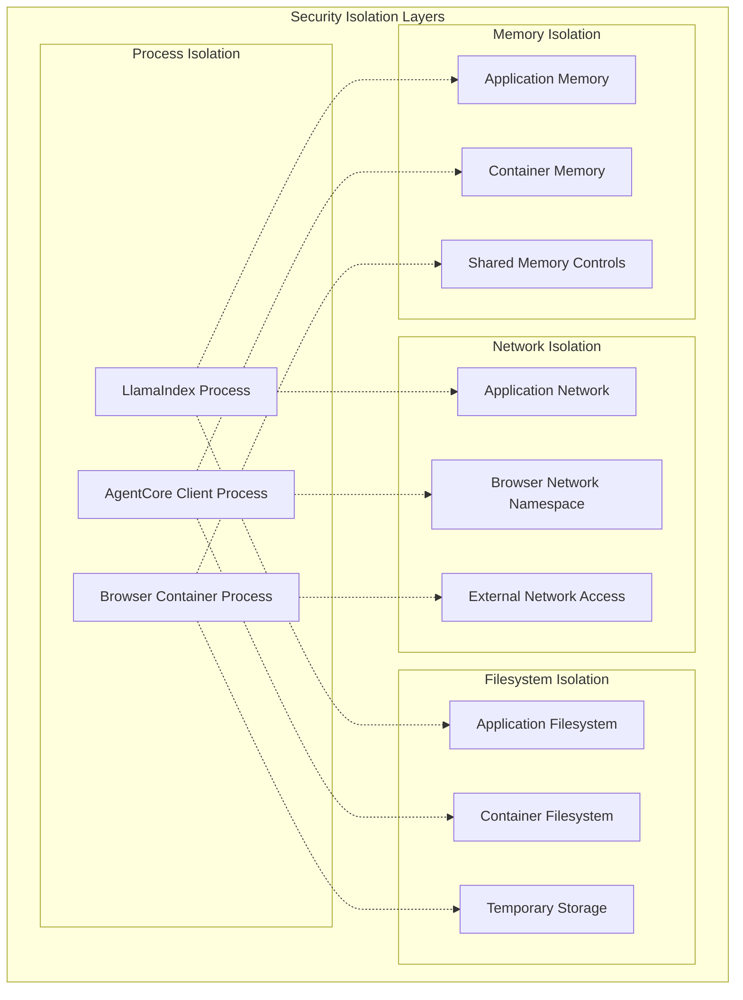
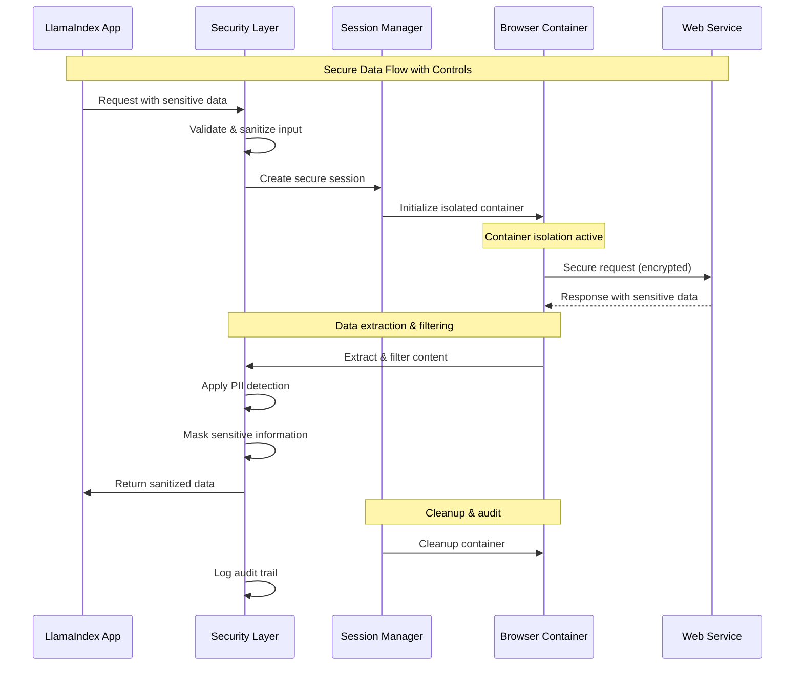
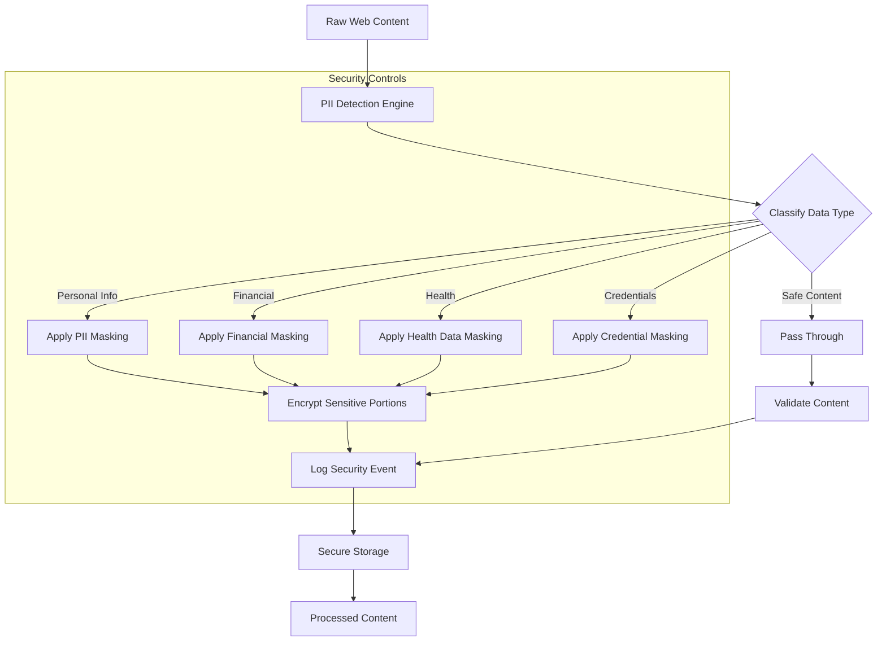
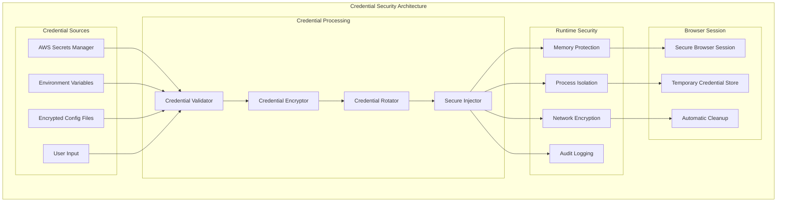
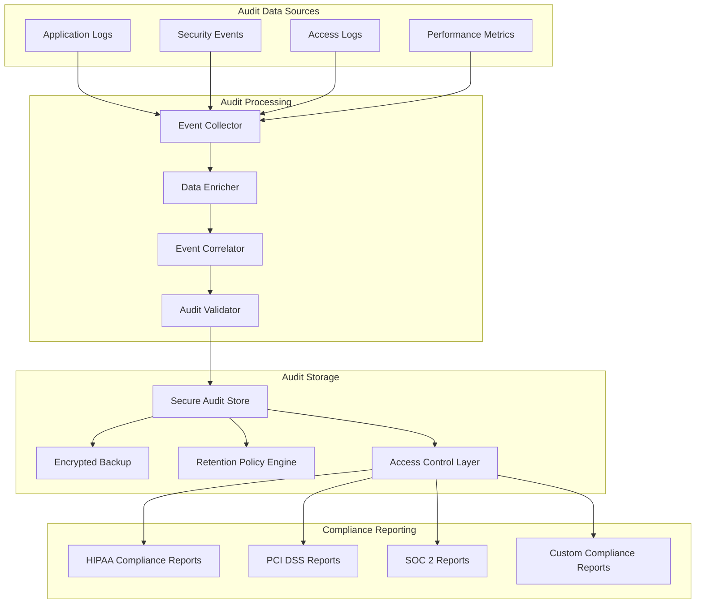
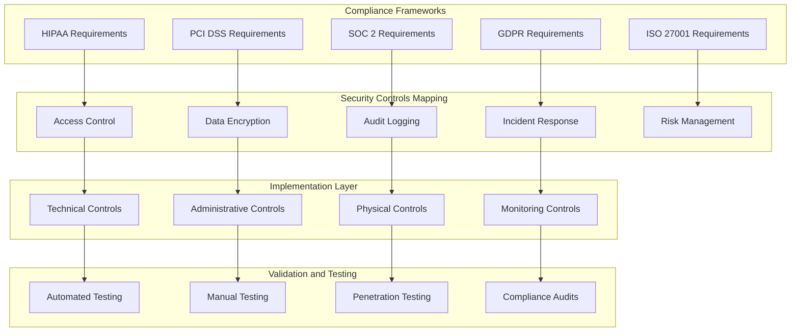
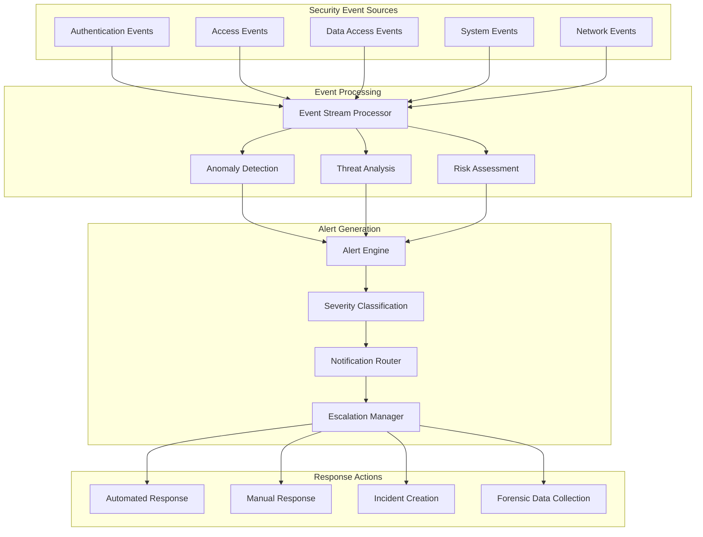
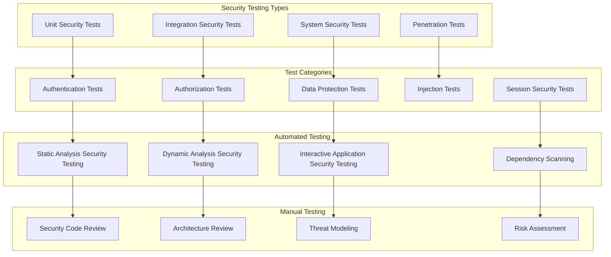
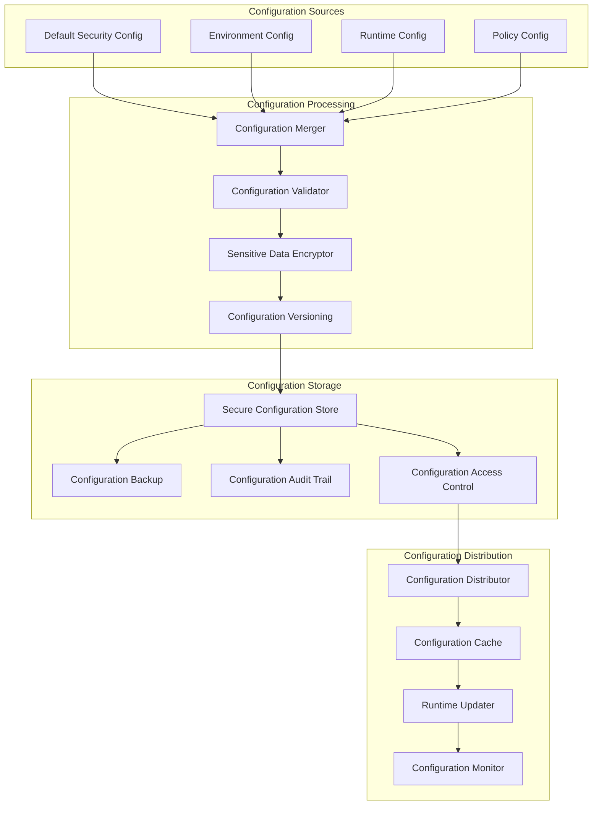

# Security Architecture for LlamaIndex-AgentCore Integration

This document details the comprehensive security architecture for handling sensitive information in LlamaIndex-AgentCore Browser Tool integrations.

## Security Boundaries and Isolation

### Container Isolation Model



### Data Flow Security Controls



## Sensitive Data Handling Workflows

### PII Detection and Masking Workflow



### Credential Management Security Model



## Security Implementation Patterns

### 1. Secure Session Creation Pattern

```python
class SecureSessionPattern:
    """
    Implements secure session creation with comprehensive security controls.
    """
    
    def create_secure_session(self, security_config: SecurityConfig) -> SecureSession:
        """
        Creates a secure browser session with isolation and monitoring.
        
        Security Controls Applied:
        - Container isolation
        - Network restrictions
        - Credential protection
        - Audit logging
        """
        
        # Step 1: Validate security configuration
        self._validate_security_config(security_config)
        
        # Step 2: Create isolated container
        container = self._create_isolated_container(
            isolation_level=security_config.isolation_level,
            network_policy=security_config.network_policy,
            resource_limits=security_config.resource_limits
        )
        
        # Step 3: Initialize security monitoring
        monitor = self._initialize_security_monitor(
            container_id=container.id,
            audit_level=security_config.audit_level
        )
        
        # Step 4: Create secure session
        session = SecureSession(
            container=container,
            monitor=monitor,
            security_config=security_config
        )
        
        # Step 5: Log session creation
        self._audit_session_creation(session)
        
        return session
```

### 2. Data Sanitization Pattern

```python
class DataSanitizationPattern:
    """
    Implements comprehensive data sanitization for sensitive information.
    """
    
    def sanitize_web_content(self, content: str, context: SecurityContext) -> SanitizedContent:
        """
        Sanitizes web content based on security context and policies.
        
        Sanitization Steps:
        1. PII detection and classification
        2. Sensitive data masking
        3. Content validation
        4. Security metadata generation
        """
        
        # Step 1: Detect sensitive information
        pii_entities = self.pii_detector.detect_all(content)
        
        # Step 2: Classify sensitivity levels
        classified_entities = self._classify_sensitivity(pii_entities)
        
        # Step 3: Apply appropriate masking
        masked_content = self._apply_masking_rules(
            content, 
            classified_entities, 
            context.masking_policy
        )
        
        # Step 4: Validate sanitized content
        validation_result = self._validate_sanitization(
            original=content,
            sanitized=masked_content,
            entities=classified_entities
        )
        
        # Step 5: Generate security metadata
        security_metadata = self._generate_security_metadata(
            entities=classified_entities,
            validation=validation_result,
            context=context
        )
        
        return SanitizedContent(
            content=masked_content,
            metadata=security_metadata,
            validation=validation_result
        )
```

### 3. Secure Error Handling Pattern

```python
class SecureErrorHandlingPattern:
    """
    Implements security-first error handling that prevents information leakage.
    """
    
    def handle_secure_error(self, error: Exception, context: SecurityContext) -> SecureError:
        """
        Handles errors securely without exposing sensitive information.
        
        Security Principles:
        - Never expose credentials in error messages
        - Sanitize stack traces
        - Log security events
        - Provide safe error responses
        """
        
        # Step 1: Classify error type and sensitivity
        error_classification = self._classify_error(error, context)
        
        # Step 2: Sanitize error information
        sanitized_error = self._sanitize_error_details(
            error, 
            error_classification
        )
        
        # Step 3: Log security event
        self._log_security_event(
            error_type=error_classification.type,
            context=context,
            sanitized_details=sanitized_error
        )
        
        # Step 4: Generate safe error response
        safe_response = self._generate_safe_error_response(
            error_classification,
            context.user_context
        )
        
        return SecureError(
            error_code=error_classification.code,
            message=safe_response.message,
            details=safe_response.safe_details,
            timestamp=datetime.utcnow(),
            context_id=context.context_id
        )
```

## Compliance and Audit Architecture

### Audit Trail Architecture



### Compliance Framework Integration



## Security Monitoring and Alerting

### Real-time Security Monitoring



## Security Testing and Validation

### Security Testing Framework



## Security Configuration Management

### Security Configuration Architecture



This comprehensive security architecture ensures that all aspects of sensitive information handling are properly secured, monitored, and compliant with industry standards and regulations.