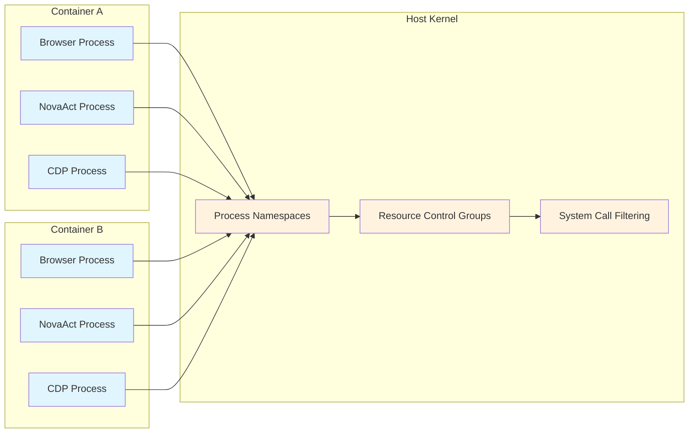
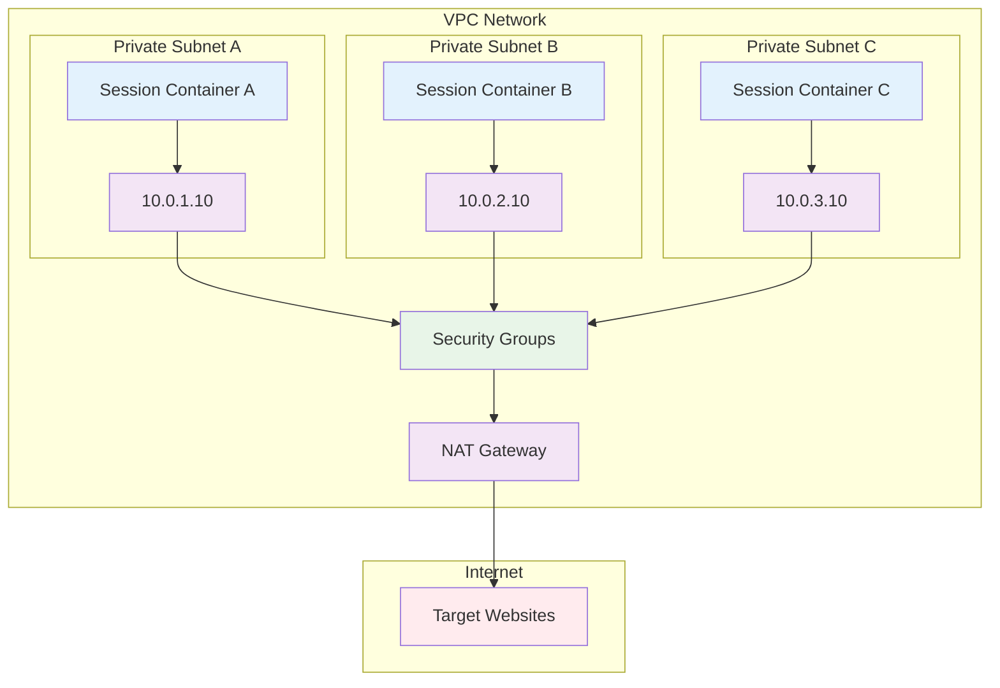

# AgentCore Browser Tool Containerized Isolation

## Container Isolation Architecture

```mermaid
graph TB
    subgraph "AWS Infrastructure"
        subgraph "AgentCore Managed Service"
            subgraph "Container Orchestration Layer"
                ORCHESTRATOR[Container Orchestrator]
                SCHEDULER[Resource Scheduler]
                MONITOR[Health Monitor]
            end
            
            subgraph "Isolation Boundary 1"
                subgraph "Session Container A"
                    BROWSER_A[Chrome Browser A]
                    NOVA_A[NovaAct Process A]
                    CDP_A[CDP Server A]
                    STORAGE_A[Temp Storage A]
                end
            end
            
            subgraph "Isolation Boundary 2"
                subgraph "Session Container B"
                    BROWSER_B[Chrome Browser B]
                    NOVA_B[NovaAct Process B]
                    CDP_B[CDP Server B]
                    STORAGE_B[Temp Storage B]
                end
            end
            
            subgraph "Isolation Boundary 3"
                subgraph "Session Container C"
                    BROWSER_C[Chrome Browser C]
                    NOVA_C[NovaAct Process C]
                    CDP_C[CDP Server C]
                    STORAGE_C[Temp Storage C]
                end
            end
        end
        
        subgraph "Shared Security Services"
            SECRETS[AWS Secrets Manager]
            LOGS[CloudWatch Logs]
            METRICS[CloudWatch Metrics]
            VPC[VPC Network]
        end
    end
    
    subgraph "Developer Environments"
        DEV1[Developer 1]
        DEV2[Developer 2]
        DEV3[Developer 3]
    end
    
    %% Container orchestration
    ORCHESTRATOR --> BROWSER_A
    ORCHESTRATOR --> BROWSER_B
    ORCHESTRATOR --> BROWSER_C
    
    SCHEDULER --> STORAGE_A
    SCHEDULER --> STORAGE_B
    SCHEDULER --> STORAGE_C
    
    MONITOR --> CDP_A
    MONITOR --> CDP_B
    MONITOR --> CDP_C
    
    %% Developer connections
    DEV1 -.->|Secure Connection| CDP_A
    DEV2 -.->|Secure Connection| CDP_B
    DEV3 -.->|Secure Connection| CDP_C
    
    %% Shared services
    BROWSER_A --> SECRETS
    BROWSER_B --> SECRETS
    BROWSER_C --> SECRETS
    
    CDP_A --> LOGS
    CDP_B --> LOGS
    CDP_C --> LOGS
    
    NOVA_A --> METRICS
    NOVA_B --> METRICS
    NOVA_C --> METRICS
    
    %% Network isolation
    VPC --> BROWSER_A
    VPC --> BROWSER_B
    VPC --> BROWSER_C
    
    classDef container fill:#e3f2fd
    classDef isolation fill:#fff3e0
    classDef orchestration fill:#f3e5f5
    classDef security fill:#e8f5e8
    classDef developer fill:#fce4ec
    
    class BROWSER_A,BROWSER_B,BROWSER_C,NOVA_A,NOVA_B,NOVA_C,CDP_A,CDP_B,CDP_C,STORAGE_A,STORAGE_B,STORAGE_C container
    class ORCHESTRATOR,SCHEDULER,MONITOR orchestration
    class SECRETS,LOGS,METRICS,VPC security
    class DEV1,DEV2,DEV3 developer
```

## Isolation Mechanisms

### Process Isolation

### Network Isolation

## Security Benefits of Containerization

### 1. **Complete Session Isolation**
- Each NovaAct session runs in a separate container
- No cross-session data contamination
- Independent resource allocation and limits

### 2. **Automatic Resource Management**
- CPU and memory limits per container
- Automatic scaling based on demand
- Resource cleanup after session termination

### 3. **Network Security**
- Each container has isolated network namespace
- Controlled outbound internet access
- No direct container-to-container communication

### 4. **Storage Isolation**
- Ephemeral storage per container
- Automatic cleanup on session end
- No persistent data storage

### 5. **Process Security**
- Restricted system call access
- Limited filesystem permissions
- Sandboxed browser execution

## NovaAct Integration Benefits

### Secure AI Processing
- NovaAct AI model runs within container boundaries
- Natural language processing isolated per session
- AI responses processed within secure environment

### Protected Browser Automation
- Browser actions contained within isolated environment
- Screenshot and DOM data never leaves container
- Secure CDP communication within container

### Credential Protection
- API keys and credentials isolated per session
- No credential sharing between containers
- Automatic credential cleanup on session end

## Monitoring and Observability

### Container Health Monitoring
- Real-time container resource usage
- Browser process health checks
- NovaAct AI processing status

### Security Monitoring
- Network traffic analysis
- System call monitoring
- Anomaly detection per container

### Performance Metrics
- Session duration and success rates
- Resource utilization per container
- AI processing performance metrics