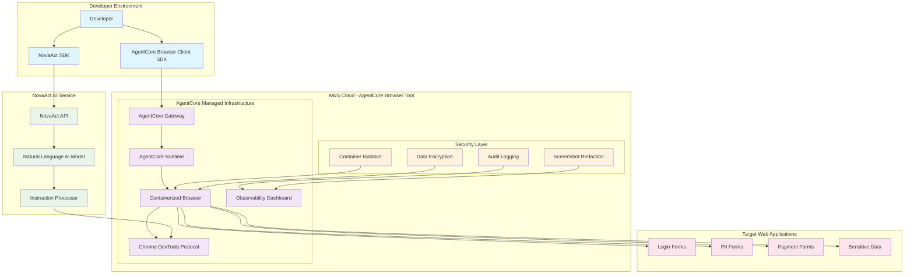

# NovaAct-AgentCore Integration Architecture

## Architecture Diagram

## Integration Flow Description

1. **Developer Setup**: Developer uses both NovaAct SDK and AgentCore Browser Client SDK
2. **Secure Connection**: AgentCore Browser Client SDK establishes secure connection to managed browser infrastructure
3. **AI Integration**: NovaAct SDK connects to AgentCore's CDP endpoint for browser control
4. **Natural Language Processing**: NovaAct AI processes instructions within AgentCore's secure environment
5. **Containerized Execution**: All browser operations happen within AgentCore's isolated containers
6. **Security Monitoring**: AgentCore's built-in observability tracks all operations securely
7. **Target Interaction**: Secure browser interacts with web applications containing sensitive data

## Key Security Benefits

- **Container Isolation**: AgentCore's containerized browser prevents data leakage
- **Managed Infrastructure**: Fully managed browser environment with built-in security
- **AI Processing Security**: NovaAct's natural language processing within secure boundaries
- **Observability**: Real-time monitoring without exposing sensitive data
- **Automatic Cleanup**: Secure session termination and resource management