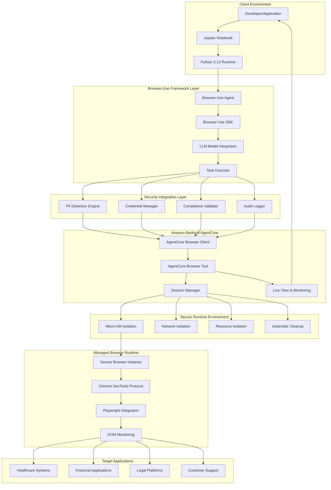
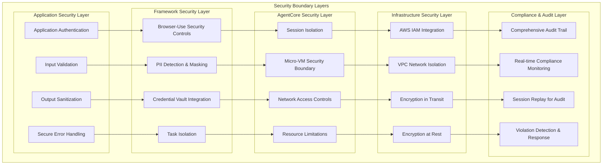
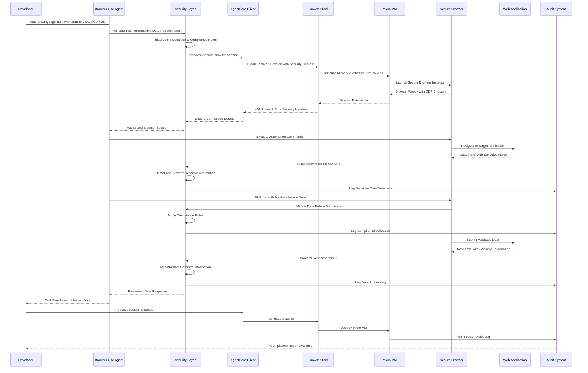
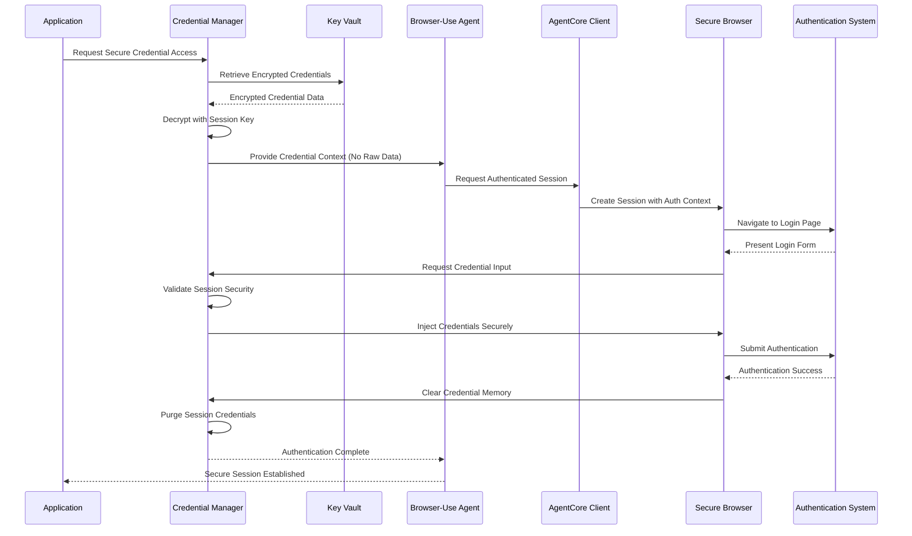
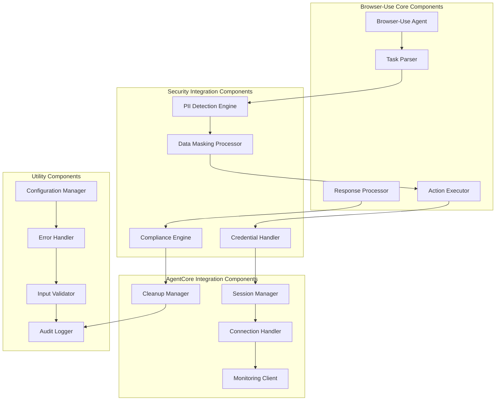
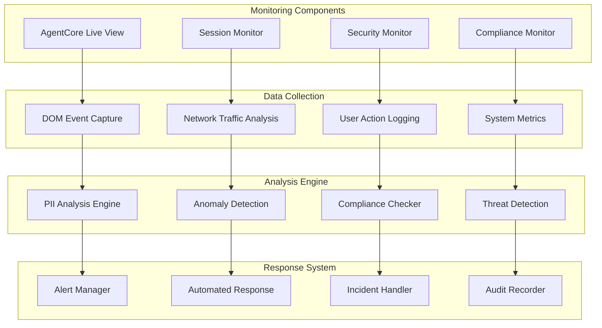

# Browser-Use + AgentCore Sensitive Information Architecture

## Overview

This document provides comprehensive architecture documentation for integrating browser-use with Amazon Bedrock AgentCore Browser Tool for secure handling of sensitive information. The architecture leverages AgentCore's enterprise-grade security features including micro-VM isolation, session management, and observability to ensure compliant and secure web automation.

## Security Architecture

### High-Level Security Architecture



### Security Layers and Boundaries



## Data Flow Architecture

### Sensitive Information Processing Flow



### Credential Management Flow



## Component Architecture

### Browser-Use Integration Components



## Security Patterns and Best Practices

### 1. Secure Session Management Pattern

```python
class SecureBrowserUseSession:
    """Secure session management pattern for browser-use + AgentCore integration."""
    
    def __init__(self, security_context: SecurityContext):
        self.security_context = security_context
        self.session_id = None
        self.agentcore_client = None
        self.audit_logger = AuditLogger()
    
    async def __aenter__(self):
        """Secure session initialization."""
        try:
            # Initialize AgentCore session with security context
            self.agentcore_client = BrowserClient(region=self.security_context.region)
            session = await self.agentcore_client.create_session(
                security_policies=self.security_context.policies
            )
            self.session_id = session.session_id
            
            # Log session creation
            await self.audit_logger.log_session_start(
                session_id=self.session_id,
                security_context=self.security_context
            )
            
            return self
            
        except Exception as e:
            await self.audit_logger.log_security_violation(
                event="session_creation_failed",
                error=str(e)
            )
            raise SecurityException(f"Failed to create secure session: {e}")
    
    async def __aexit__(self, exc_type, exc_val, exc_tb):
        """Secure session cleanup."""
        try:
            if self.session_id and self.agentcore_client:
                # Emergency cleanup if exception occurred
                if exc_type:
                    await self.audit_logger.log_security_violation(
                        session_id=self.session_id,
                        event="session_exception",
                        error=str(exc_val)
                    )
                
                # Clean up session
                await self.agentcore_client.cleanup_session(self.session_id)
                
                # Log session end
                await self.audit_logger.log_session_end(
                    session_id=self.session_id,
                    status="success" if not exc_type else "error"
                )
                
        except Exception as cleanup_error:
            await self.audit_logger.log_security_violation(
                event="cleanup_failed",
                error=str(cleanup_error)
            )
```

### 2. PII Detection and Masking Pattern

```python
class PIISecurityPattern:
    """PII detection and masking security pattern."""
    
    def __init__(self):
        self.pii_patterns = {
            'ssn': r'\b\d{3}-\d{2}-\d{4}\b',
            'email': r'\b[A-Za-z0-9._%+-]+@[A-Za-z0-9.-]+\.[A-Z|a-z]{2,}\b',
            'phone': r'\b\d{3}-\d{3}-\d{4}\b',
            'credit_card': r'\b\d{4}[-\s]?\d{4}[-\s]?\d{4}[-\s]?\d{4}\b'
        }
        self.audit_logger = AuditLogger()
    
    async def detect_and_mask_pii(self, content: str, context: str) -> tuple[str, list]:
        """Detect and mask PII in content."""
        detected_pii = []
        masked_content = content
        
        for pii_type, pattern in self.pii_patterns.items():
            matches = re.finditer(pattern, content)
            for match in matches:
                # Log PII detection
                await self.audit_logger.log_pii_detection(
                    pii_type=pii_type,
                    context=context,
                    position=match.span()
                )
                
                # Mask the PII
                mask = '*' * len(match.group())
                masked_content = masked_content.replace(match.group(), mask)
                detected_pii.append({
                    'type': pii_type,
                    'position': match.span(),
                    'masked': True
                })
        
        return masked_content, detected_pii
    
    async def validate_no_pii_leakage(self, output_data: str) -> bool:
        """Validate that no PII is present in output data."""
        for pii_type, pattern in self.pii_patterns.items():
            if re.search(pattern, output_data):
                await self.audit_logger.log_security_violation(
                    event="pii_leakage_detected",
                    pii_type=pii_type,
                    data_sample=output_data[:100]  # Log sample for investigation
                )
                return False
        return True
```

### 3. Credential Security Pattern

```python
class CredentialSecurityPattern:
    """Secure credential handling pattern."""
    
    def __init__(self, key_vault_client):
        self.key_vault = key_vault_client
        self.active_credentials = {}
        self.audit_logger = AuditLogger()
    
    async def get_secure_credential(self, credential_id: str, session_id: str) -> SecureCredential:
        """Retrieve credential securely for session."""
        try:
            # Retrieve encrypted credential
            encrypted_cred = await self.key_vault.get_credential(credential_id)
            
            # Create session-specific credential
            session_key = self._generate_session_key(session_id)
            secure_cred = SecureCredential(
                credential_id=credential_id,
                session_id=session_id,
                encrypted_data=encrypted_cred,
                session_key=session_key
            )
            
            # Track active credential
            self.active_credentials[session_id] = secure_cred
            
            # Log credential access
            await self.audit_logger.log_credential_access(
                credential_id=credential_id,
                session_id=session_id,
                access_time=datetime.utcnow()
            )
            
            return secure_cred
            
        except Exception as e:
            await self.audit_logger.log_security_violation(
                event="credential_access_failed",
                credential_id=credential_id,
                session_id=session_id,
                error=str(e)
            )
            raise SecurityException(f"Failed to retrieve credential: {e}")
    
    async def cleanup_session_credentials(self, session_id: str):
        """Clean up all credentials for a session."""
        if session_id in self.active_credentials:
            credential = self.active_credentials[session_id]
            
            # Securely wipe credential data
            credential.secure_wipe()
            
            # Remove from active tracking
            del self.active_credentials[session_id]
            
            # Log credential cleanup
            await self.audit_logger.log_credential_cleanup(
                session_id=session_id,
                cleanup_time=datetime.utcnow()
            )
```

### 4. Compliance Validation Pattern

```python
class ComplianceValidationPattern:
    """Compliance validation pattern for different regulatory requirements."""
    
    def __init__(self):
        self.compliance_rules = {
            'HIPAA': HIPAAComplianceRules(),
            'PCI_DSS': PCIDSSComplianceRules(),
            'GDPR': GDPRComplianceRules(),
            'SOX': SOXComplianceRules()
        }
        self.audit_logger = AuditLogger()
    
    async def validate_operation_compliance(
        self, 
        operation: str, 
        data_context: DataContext, 
        compliance_requirements: list
    ) -> ComplianceResult:
        """Validate operation against compliance requirements."""
        
        compliance_result = ComplianceResult()
        
        for requirement in compliance_requirements:
            if requirement in self.compliance_rules:
                rule_engine = self.compliance_rules[requirement]
                
                # Validate operation
                validation_result = await rule_engine.validate_operation(
                    operation=operation,
                    data_context=data_context
                )
                
                compliance_result.add_validation(requirement, validation_result)
                
                # Log compliance check
                await self.audit_logger.log_compliance_check(
                    requirement=requirement,
                    operation=operation,
                    result=validation_result.status,
                    violations=validation_result.violations
                )
                
                # Handle violations
                if validation_result.has_violations():
                    await self._handle_compliance_violations(
                        requirement, 
                        validation_result.violations
                    )
        
        return compliance_result
    
    async def _handle_compliance_violations(self, requirement: str, violations: list):
        """Handle compliance violations."""
        for violation in violations:
            await self.audit_logger.log_security_violation(
                event="compliance_violation",
                requirement=requirement,
                violation_type=violation.type,
                severity=violation.severity,
                description=violation.description
            )
            
            # Trigger immediate response for critical violations
            if violation.severity == "CRITICAL":
                await self._trigger_emergency_response(violation)
```

## Integration Patterns

### 1. Browser-Use Agent Integration

```python
class BrowserUseAgentCoreIntegration:
    """Main integration class for browser-use with AgentCore."""
    
    def __init__(self, config: IntegrationConfig):
        self.config = config
        self.security_manager = SecurityManager(config.security_context)
        self.session_manager = AgentCoreSessionManager(config.region)
        self.audit_logger = AuditLogger()
    
    async def execute_secure_task(self, task_instruction: str, security_context: SecurityContext):
        """Execute browser-use task with AgentCore security."""
        
        async with SecureBrowserUseSession(security_context) as session:
            try:
                # Initialize browser-use agent with secure session
                agent = Agent(
                    task=task_instruction,
                    llm=self.config.llm_model,
                    browser_session=session.get_browser_session()
                )
                
                # Execute task with security monitoring
                result = await self._execute_with_monitoring(agent, security_context)
                
                # Validate result for compliance
                compliance_result = await self.security_manager.validate_compliance(
                    result, security_context.compliance_requirements
                )
                
                if not compliance_result.is_compliant():
                    raise ComplianceViolationException(compliance_result.violations)
                
                return result
                
            except Exception as e:
                await self.audit_logger.log_task_failure(
                    task=task_instruction,
                    error=str(e),
                    security_context=security_context
                )
                raise
    
    async def _execute_with_monitoring(self, agent: Agent, security_context: SecurityContext):
        """Execute agent task with real-time monitoring."""
        
        # Start monitoring
        monitor = SecurityMonitor(security_context)
        await monitor.start_monitoring()
        
        try:
            # Execute task
            result = await agent.run()
            
            # Process result for sensitive data
            processed_result = await self.security_manager.process_sensitive_data(
                result, security_context
            )
            
            return processed_result
            
        finally:
            # Stop monitoring and get report
            monitoring_report = await monitor.stop_monitoring()
            await self.audit_logger.log_monitoring_report(monitoring_report)
```

### 2. Error Handling and Recovery Pattern

```python
class SecurityErrorHandler:
    """Security-focused error handling and recovery."""
    
    def __init__(self):
        self.audit_logger = AuditLogger()
        self.emergency_protocols = EmergencyProtocols()
    
    async def handle_security_error(self, error: Exception, context: SecurityContext):
        """Handle security-related errors with appropriate response."""
        
        if isinstance(error, PIILeakageError):
            await self._handle_pii_leakage(error, context)
        elif isinstance(error, ComplianceViolationError):
            await self._handle_compliance_violation(error, context)
        elif isinstance(error, SessionIsolationError):
            await self._handle_isolation_breach(error, context)
        elif isinstance(error, CredentialSecurityError):
            await self._handle_credential_breach(error, context)
        else:
            await self._handle_generic_security_error(error, context)
    
    async def _handle_pii_leakage(self, error: PIILeakageError, context: SecurityContext):
        """Handle PII leakage incidents."""
        
        # Log critical security incident
        await self.audit_logger.log_critical_incident(
            incident_type="pii_leakage",
            error=error,
            context=context
        )
        
        # Trigger emergency session cleanup
        await self.emergency_protocols.emergency_session_cleanup(context.session_id)
        
        # Notify security team
        await self.emergency_protocols.notify_security_team(
            incident_type="pii_leakage",
            severity="CRITICAL",
            context=context
        )
        
        # Quarantine affected data
        await self.emergency_protocols.quarantine_data(error.affected_data)
    
    async def _handle_compliance_violation(self, error: ComplianceViolationError, context: SecurityContext):
        """Handle compliance violations."""
        
        # Log compliance incident
        await self.audit_logger.log_compliance_incident(
            violation_type=error.violation_type,
            requirement=error.requirement,
            context=context
        )
        
        # Determine response based on severity
        if error.severity == "CRITICAL":
            await self.emergency_protocols.halt_operations(context.session_id)
        elif error.severity == "HIGH":
            await self.emergency_protocols.restrict_operations(context.session_id)
        
        # Generate compliance report
        await self.emergency_protocols.generate_compliance_report(error, context)
```

## Monitoring and Observability

### Real-time Security Monitoring



This architecture documentation provides a comprehensive foundation for understanding how browser-use integrates with AgentCore Browser Tool for secure sensitive information handling, covering all security layers, data flows, and implementation patterns required for enterprise-grade deployments.