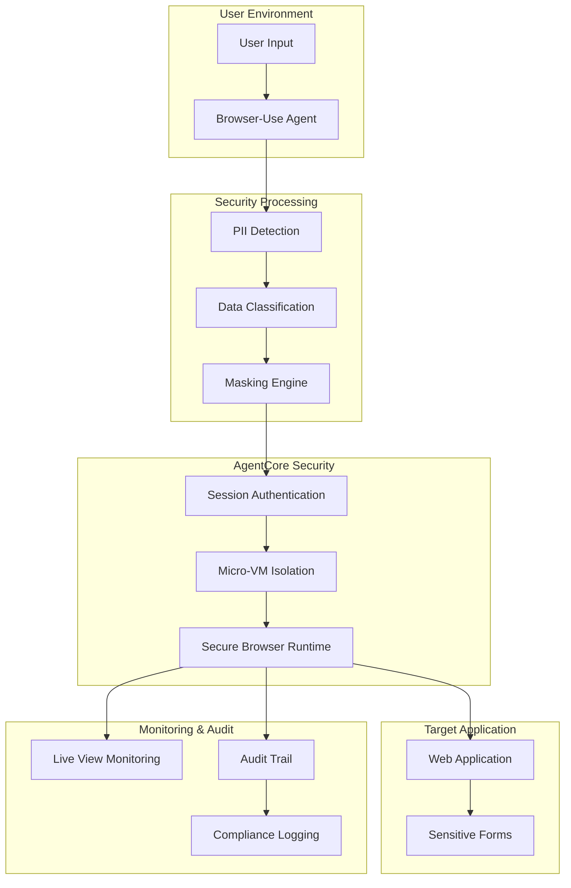
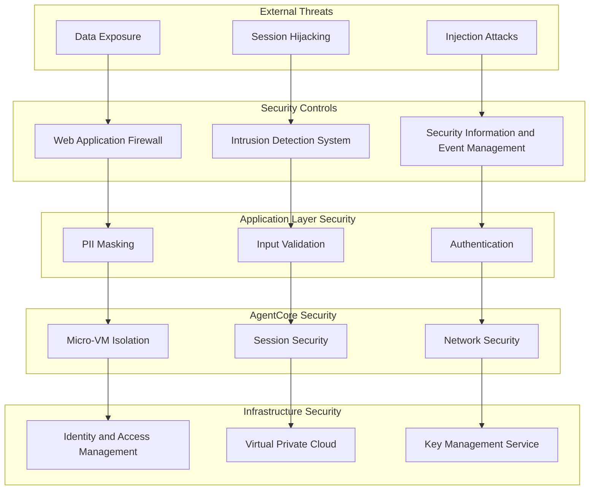

# Browser-Use with AgentCore Browser Tool - Security Architecture

## Overview

This document outlines the security architecture for integrating browser-use with Amazon Bedrock AgentCore Browser Tool to handle sensitive information securely. The architecture leverages AgentCore's enterprise-grade security features including micro-VM isolation, session management, and comprehensive observability.

## Security Layers

### 1. Application Security Layer

#### Browser-Use Security Features
- **Natural Language Processing Security**: Secure handling of user instructions containing sensitive information
- **Command Validation**: Validation of browser automation commands to prevent malicious operations
- **Screenshot Protection**: Automatic masking of sensitive information in screenshots and visual feedback

#### PII Detection and Masking
- **Real-time PII Detection**: Automatic identification of personally identifiable information in web forms
- **Dynamic Masking**: Context-aware masking of sensitive data based on data classification
- **Compliance-based Processing**: Different handling rules for HIPAA, PCI-DSS, and GDPR data types

### 2. AgentCore Security Layer

#### Micro-VM Isolation
- **Session Isolation**: Each browser-use session runs in an isolated micro-VM environment
- **Network Isolation**: Controlled network access with security group restrictions
- **Resource Isolation**: CPU, memory, and storage isolation between sessions

#### Session Management
- **Secure Session Creation**: Authenticated session creation with proper access controls
- **Session Lifecycle Management**: Automatic cleanup and resource deallocation
- **Session Monitoring**: Real-time monitoring of session activities and resource usage

### 3. Infrastructure Security Layer

#### AWS Security Integration
- **IAM Integration**: Role-based access control for AgentCore Browser Tool access
- **VPC Isolation**: Network-level isolation using Amazon VPC
- **Encryption**: Encryption in transit and at rest for all data

#### Compliance Framework
- **HIPAA Compliance**: Healthcare data protection with audit trails
- **PCI-DSS Compliance**: Payment card data security standards
- **GDPR Compliance**: European data protection regulation compliance

## Data Flow Security

### Secure Data Processing Pipeline

### Data Classification and Handling

#### Sensitive Data Types
1. **Personally Identifiable Information (PII)**
   - Social Security Numbers
   - Email addresses
   - Phone numbers
   - Physical addresses
   - Names and personal identifiers

2. **Financial Information**
   - Credit card numbers
   - Bank account numbers
   - Routing numbers
   - Payment information

3. **Healthcare Information (PHI)**
   - Medical record numbers
   - Patient identifiers
   - Health insurance information
   - Medical history data

4. **Legal and Confidential Information**
   - Attorney-client privileged information
   - Confidential business data
   - Trade secrets
   - Proprietary information

## Security Controls

### Access Controls

#### Authentication and Authorization
- **Multi-factor Authentication**: Required for accessing sensitive data operations
- **Role-based Access Control**: Granular permissions based on user roles
- **Session-based Authentication**: Secure session tokens with expiration

#### API Security
- **API Key Management**: Secure storage and rotation of API keys
- **Request Signing**: Cryptographic signing of API requests
- **Rate Limiting**: Protection against abuse and DoS attacks

### Data Protection

#### Encryption
- **Encryption in Transit**: TLS 1.3 for all network communications
- **Encryption at Rest**: AES-256 encryption for stored data
- **Key Management**: AWS KMS integration for encryption key management

#### Data Masking and Anonymization
- **Dynamic Masking**: Real-time masking of sensitive data in browser interactions
- **Tokenization**: Replacement of sensitive data with non-sensitive tokens
- **Pseudonymization**: Reversible anonymization for testing and development

### Monitoring and Auditing

#### Real-time Monitoring
- **Live View**: Real-time monitoring of browser-use operations
- **Session Replay**: Complete session recording for audit purposes
- **Performance Monitoring**: Resource usage and performance metrics

#### Audit Trail
- **Comprehensive Logging**: Detailed logs of all sensitive data operations
- **Immutable Audit Trail**: Tamper-proof audit records
- **Compliance Reporting**: Automated compliance report generation

## Threat Model

### Identified Threats

1. **Data Exposure Threats**
   - Sensitive data leakage through screenshots
   - Unmasked PII in logs or monitoring data
   - Data persistence in browser cache or storage

2. **Session Hijacking Threats**
   - Unauthorized access to browser sessions
   - Session token theft or replay attacks
   - Cross-session data contamination

3. **Injection Attacks**
   - Malicious script injection through user input
   - Command injection in browser automation
   - Cross-site scripting (XSS) attacks

4. **Privilege Escalation**
   - Unauthorized access to sensitive operations
   - Bypass of security controls
   - Elevation of user privileges

### Mitigation Strategies

#### Data Protection Mitigations
- **Automatic PII Detection**: Real-time identification and masking
- **Secure Data Handling**: Encrypted storage and transmission
- **Data Minimization**: Collection and processing of only necessary data

#### Session Security Mitigations
- **Session Isolation**: Micro-VM isolation between sessions
- **Session Timeout**: Automatic session termination
- **Secure Session Management**: Cryptographically secure session tokens

#### Input Validation Mitigations
- **Command Sanitization**: Validation and sanitization of browser commands
- **Input Filtering**: Filtering of potentially malicious input
- **Content Security Policy**: Browser-level protection against XSS

## Compliance Framework

### HIPAA Compliance

#### Required Controls
- **Administrative Safeguards**: Access controls and workforce training
- **Physical Safeguards**: Facility access controls and workstation security
- **Technical Safeguards**: Access controls, audit controls, and data integrity

#### Implementation
- **Audit Trail**: Comprehensive logging of PHI access and modifications
- **Access Controls**: Role-based access to healthcare data
- **Data Encryption**: Encryption of PHI in transit and at rest

### PCI-DSS Compliance

#### Required Controls
- **Build and Maintain Secure Networks**: Firewall configuration and security policies
- **Protect Cardholder Data**: Data encryption and access restrictions
- **Maintain Vulnerability Management**: Regular security testing and updates

#### Implementation
- **Card Data Masking**: Automatic masking of payment card information
- **Secure Transmission**: Encrypted transmission of cardholder data
- **Access Logging**: Detailed logs of cardholder data access

### GDPR Compliance

#### Required Controls
- **Lawful Basis**: Legal basis for data processing
- **Data Minimization**: Processing only necessary personal data
- **Data Subject Rights**: Rights to access, rectification, and erasure

#### Implementation
- **Consent Management**: Tracking and management of user consent
- **Data Portability**: Export of personal data in machine-readable format
- **Right to Erasure**: Secure deletion of personal data upon request

## Security Testing

### Security Test Categories

1. **Penetration Testing**
   - External penetration testing of AgentCore integration
   - Internal security assessment of browser-use components
   - Social engineering and phishing resistance testing

2. **Vulnerability Assessment**
   - Automated vulnerability scanning
   - Dependency vulnerability analysis
   - Configuration security assessment

3. **Compliance Testing**
   - HIPAA compliance validation
   - PCI-DSS compliance testing
   - GDPR compliance verification

### Security Metrics

#### Key Performance Indicators
- **Mean Time to Detection (MTTD)**: Average time to detect security incidents
- **Mean Time to Response (MTTR)**: Average time to respond to security incidents
- **Security Control Effectiveness**: Percentage of successful security control validations

#### Compliance Metrics
- **Audit Success Rate**: Percentage of successful compliance audits
- **Data Breach Prevention**: Number of prevented data exposure incidents
- **Access Control Violations**: Number of unauthorized access attempts

## Incident Response

### Incident Classification

1. **Critical Incidents**
   - Data breach or exposure of sensitive information
   - Unauthorized access to production systems
   - Compromise of encryption keys or certificates

2. **High Priority Incidents**
   - Security control bypass or failure
   - Suspicious activity in sensitive data operations
   - Compliance violation detection

3. **Medium Priority Incidents**
   - Performance degradation affecting security
   - Configuration drift from security baseline
   - Failed security control validation

### Response Procedures

#### Immediate Response
1. **Incident Detection**: Automated detection through monitoring systems
2. **Incident Containment**: Immediate isolation of affected systems
3. **Impact Assessment**: Evaluation of potential data exposure or compromise

#### Investigation and Recovery
1. **Forensic Analysis**: Detailed investigation of incident root cause
2. **System Recovery**: Restoration of systems to secure operational state
3. **Lessons Learned**: Documentation of incident and improvement recommendations

## Security Architecture Diagrams

### High-Level Security Architecture

This security architecture ensures comprehensive protection of sensitive information while maintaining the flexibility and functionality of browser-use automation with AgentCore Browser Tool.